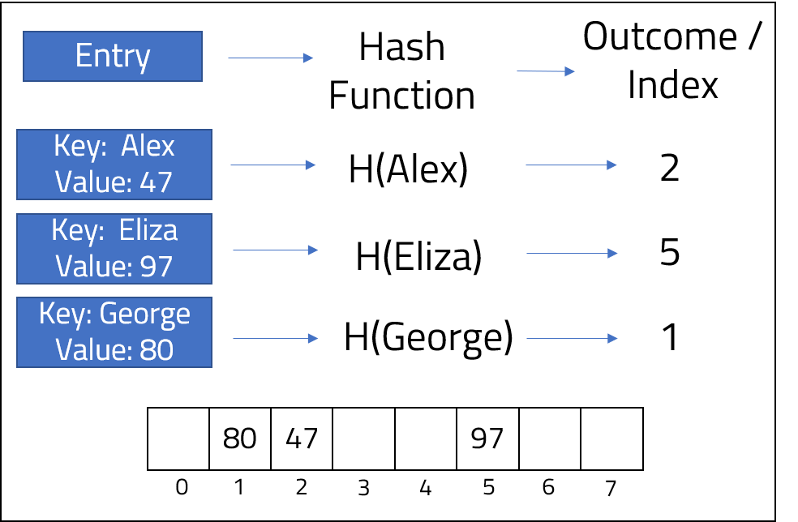

 
<strong>Key Takeaways</strong> 
&#8226; Collisions occur when a hash function computes to the same value for different inputs. 
&#8226; Collisions can be resolved witsh open addressing and closed addressing techniques. 
&#8226; tbc 

 
<h4>What are hash functions and why do we use them?</h4>

Hash functions are used to map data or any arbitrary size into a fixed size. Java uses hash functions in the following key-value data structures: 
&#8226; HashMap 
&#8226; HashTable 

There are just a few differences between HashMap and HashTable. HashMap data is not synchronized, and can therefore perform faster than a HashTable which is synchronized. HashMap allows one null key and any null values, whereas HashTable does not allow any null keys or values. The remainder of this post will reflect upon HashTables for simplicity. 
HashTables store data in a key-value pair in an array. When an entry is made to a HashTable, the index position that the data is stored within the array is calculcated through the key. The key is used as an input to a hash function which will produce the integer index position 
The hash function that is used is defined by the <code class="language-java">public int hashCode()</code> method of the Object. The example below summarises how a key-value pair of a Person object can be placed within a HashTable. 

The example above stores the value (an integer) at the appropriate index, however the value could instead be any kind of Object such as a class. You would then be able to find instances of a class within the HashTable just through the key. 

<strong>The benefit of HashTable</strong>
 

The HashTable resolves the problem of searching for a value within an array. If we have an array of 100 integers and we would like to find the index of a certain value, we would have to loop through each value until we find it. As a result, the time-complexity of the search would be O(n) (see my post on the Big O notation <a href = "https://aneesh.co.uk/calculating-the-time-complexity-of-algorithms">here</a> for more). HashTable allows us to find the index of a value based upon it's key. As a result, we are able to find the value within the HashTable instantly, regardless of the HashTable size O(1). 

 
<h4>Hashfunction collisions</h4>

The example visited does not mention the hash function that was used to convert the key (name) into an integer (index position). The below image demonstrates how a index was computed:

Each index position within the array is known as a 'bucket'. When we use our simple hashfunction to store data, we are assign the data to a free bucket in the array. A collision will occur when the hashfunction computes the same integer (index) for different keys. 
If we had a fourth object with a key-value pair of: {"George",81}, the index position would be calculated as so: 
"George" ASCII value = 441; 441/8 = 55; 55%8 = 7 
The addition of a new entry, "George", will result in a collision with Eliza, who is also stored at index 7.

 
<h4>Resolving collisions</h4>

When ou r   

 
<h5>Open addressing</h5>
<strong>Linear probing</strong> 

<strong>Cluster effects</strong> 

<strong>Quadratic probing</strong> 

<strong>Double-hash probing</strong> 

 
<h5>Closed addressing</h5>

Although we now have to make an additional move, the time complexity remains at O(1) as it would be O(1 + x) where x is the length of the linked-list.
 
<h4>Conclusion</h4>

 
<small style="float: right;" >Picture: Riobamba, Ecuador by <a target="_blank" href="https://unsplash.com/@ezekiel">Fernando Tapia</small></a> 