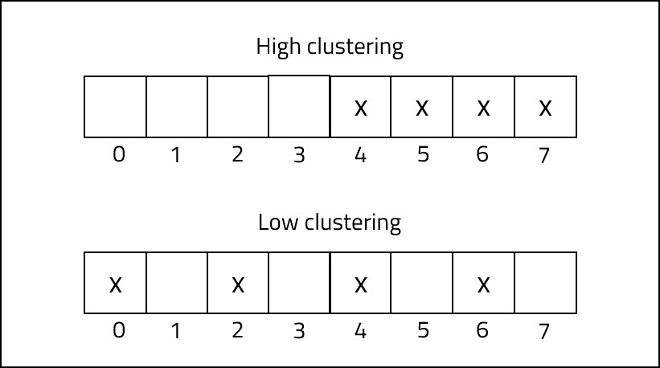

 
<strong>Key Takeaways</strong> 
&#8226; HashTable and HashMap are efficient data structures to be used for dictionary operations. 
&#8226; Collisions occur when a hash function computes to the same value for different inputs. 
&#8226; Collisions can be resolved witsh open addressing and closed addressing techniques. 

 
<h4>What are hash functions and why do we use them?</h4>

Hash functions are used to map data of any arbitrary size into a fixed length. Java uses hash functions in the following key-value data structures: 
&#8226; HashMap 
&#8226; HashTable 
HashMap and HashTable are both efficient data structures to use for dictionary operations: insert, search, and delete. There are just a few differences between HashMap and HashTable:
&#8226; HashMap data is not synchronized, HashTable data is synchronized. 
&#8226; Due to synchronization, HashMap operations can be performed faster than HashTable. 
&#8226; HashMap allows one null key and any null values, HashTable does not allow any null keys or values. 
As the two data structures use similar structures, the remainder of this post will reflect upon HashTables for simplicity. 
HashTables store data in a key-value pair that use a fast-access location known as a bucket for storage. Buckets are stored similarly to arrays; when an entry is made to a HashTable, the position that the data is stored within the array is calculcated through the key of the data. HashTables can be designed for 'direct-addressing' where each key is directly used as the index reference for where the corresponding value is stored. Direct-addressing can create the problem where the size of the array used for storing keys can become excessively large. The number of keys stored within the array may be relatively small, thus meaning the majority of the array space (and computer memory) remains unutilised. 
Hash functions provide a solution to direct-addressing by reducing the number of potential array locations, but keeping a reasonable number of open spaces. The key is used as an input to a hash function which will produce the integer index position to determine the bucket it is stored in. 

We use hash functions to reduce the overall size of the HashTable.{look in book} Hash functions resolve the problem of direct-addressing. When each key is used to define a unique slot,  

The hash function that is used is defined by the <code class="language-java">public int hashCode()</code> method of the Object. The example below summarises how a key-value pair of a Person object can be placed within a HashTable. 

The example above stores the value of the key-value pair at the appropriate index as computed from the key. Rather than the value of the pair just being an integer, it could instead be any kind of Object such as an instance of a class. You would then be able to find instances of a class within the HashTable just through the key. 

<strong>The benefit of HashTable</strong>
 

The HashTable resolves the problem of searching for a value within an array. If we have an array of 100 integers and we would like to find the index of a certain value, we would have to loop through each value until we find it. As a result, the time-complexity of the search would be O(n) (see my post on the Big O notation <a href = "https://aneesh.co.uk/calculating-the-time-complexity-of-algorithms">here</a> for more). HashTables allow us to find the index of a value based upon it's key. As a result, we are able to pinpoint the index of the value instantly, regardless of the HashTable size O(1). 

 
<h4>Hash function collisions</h4>

The example above does not mention the hash function that was used to convert the key (name) into an integer (index position). The below image demonstrates how each index was computed:

We use our simple hash function to find the bucket position to store the value in the array. A collision will occur when the hash function computes two different keys into the same index position of the array. 
If we had a fourth object with a key-value pair of: {"George",81}, the index position would be calculated: 
1. "George" ASCII value = 441; 
2. 441/8 = 55; 
3. 55%8 = 7 
The addition of a new key, "George", will result in a collision with "Eliza", who is also stored at index 7. Without a collision resolution, {"Eliza",97} will be lost from the HashTable and replaced by the key-value pair {"George", 81}.

 
<h4>Resolving collisions</h4>

When resolving collisions, there are two strategies that are used: 
&#8226; Open addressing: using probing to find alternative locations for storing the collided value, ensuring only one key is stored per bucket. 
&#8226; Closed addressing (aka chaining): storing an arbitrary number of keys per bucket by using a seperate data structure within the bucket. 

 
<h5>Open addressing</h5>

<strong>Linear probing</strong> 

Linear probing will direct the collision into the next availble bucket that is available in the HashTable. For the case of "George", which otherwise would fall into bucket 7, the next avaible bucket would be bucket 0. As a result, George will be stored in bucket 0. If another key is added to the HashTable with an Hashfunction of 7, it will instead be stored in bucket 1. 

<strong>Cluster effects</strong> 

Clustering in HashTables refers to the degree that items are "bunched" when stored. A high degree of clustering is likely to increase the chances of collisions, and as a result, can result in less efficient storage of data.  

Linear probing can be replaced by either quadratic or double-hash probing to reduce the potential for clustering. 

<strong>Quadratic probing</strong> 

Quadratic probing resolves collisions by assigning the new index in a quadratic manner away from the originallly computed index. The following indexes would be checked for the example of "George" (assuming a much larger size array): 
&#8226; 7 + (1*1) = index 8.  
&#8226; 7 + (2*2) = index 11.  
&#8226; 7 + (3*3) = index 16.  
&#8226; 7 + (4*4) = index 23.  
&#8226; 7 + (5*5) = index 32.  
&#8226; 7 + (6*6) = index 43.  
The quadratic probing collision resolution will result in a less dense cluster than Linear programming.

<strong>Double-hash probing</strong> 

Double-hash probing resolves collisions by applying a secondary hash to the computed index to create a completely random index. A second hash function can be defined and the subsequent index will be computed upon by alternating between hash functions until a empty bucket is found. 

 
Open addressing can enable collisions to be resolved with loose clustering to reduce the chance of repeated collisions. The use of quadratic and double-hashing algorithms, however, increase the compute time of the hash function as a whole. When we try to search for the value in the HashTable the computational cost will effected by the cost of the additional probing algorithms and the degree of clustering within the HashTable. Closed addressing resolves collision hashing by placing multiple keys in the same bucket, but without the need to compute further index positions.

 
<h5>Closed addressing</h5>

Closed addressing offers a more simple approach to collision resolution; rather than finding a new bucket to store the value, each bucket consists of a linked list. 
When a hash function computes a new collision, the value of the key will be placed in the next available position within the linked-list of the bucket. 
When a search is conducted upon the HashTable, the key will identify the bucket, then the hash function will simply loop in the linked list for the appropriate value. 

With closed addressing, the HashTable is able to efficiently store each 

 
<h4>Conclusion</h4>

The HashTable is used to store data which we perform dictionary (insert, search, delete) operations upon. To reduce the 

 
<small style="float: right;" >Picture: Riobamba, Ecuador by <a target="_blank" href="https://unsplash.com/@ezekiel">Fernando Tapia</small></a> 