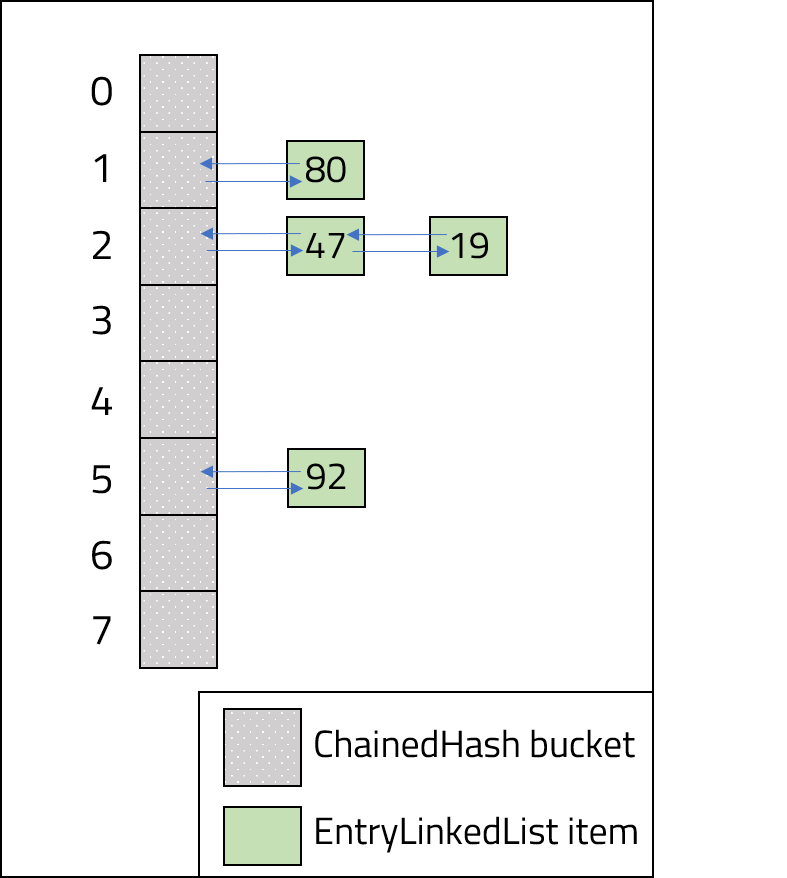
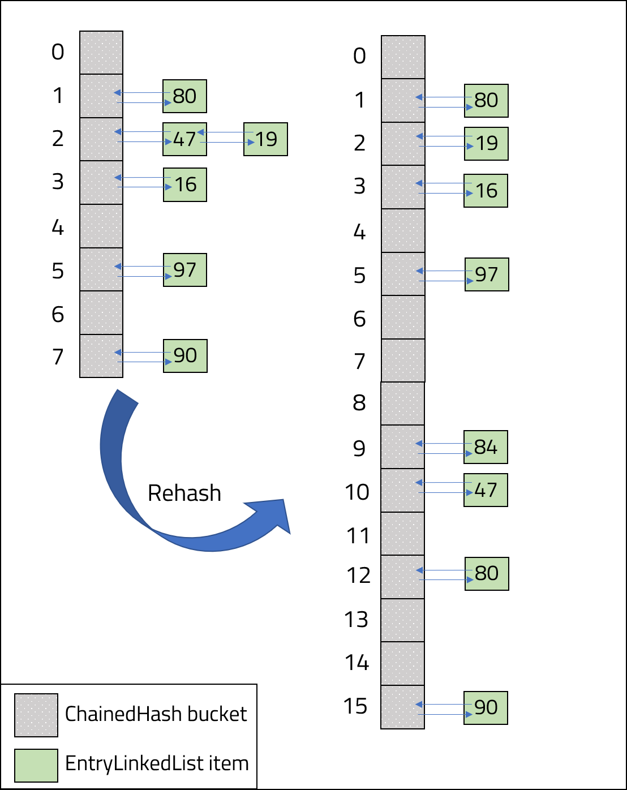

<br>
<strong>Key Takeaways</strong><br>
&#8226; Write functions to enable a hash table to resolve collisions with chaining.<br>
&#8226; Write a rehash function to recreate a hash table with a larger size.<br>
&#8226; Use load factor to ensure the hash table has a sufficient number of buckets for its items.<br>

<br>
<h4>Chaining in a HashTable</h4>
<p>
Hash collisions occur within a hash table or hash map when multiple keys have the same output when run through the hash function. 
Chaining, also known as closed addressing, is a technique used store the value of a key when a hash collision occurs.
If you are unfamiliar with chaining, please visit my <a target="_blank" href="https://aneesh.co.uk/resolving-hash-collisions"><u>blog</u></a> where I explore hash collisions and solutions.<br>
In this post, I will implement chaining with a hash table. The hash table will resolve collisions by storing the collided values into a LinkedList within the bucket.
</p>

<h4>Implementing chaining</h4>
<p>
The data structure that implements chaining will consist of two classes:<br>
<code class="language-java">ChainedHash</code> is the hash table class.<br>
<code class="language-java">EntryLinkedList</code> is the LinkedList Object appended to each bucket of the ChainedHash instance.<br>
The diagram below illustrates how the two classes will be used together:<br>



<br>
The ChainedHash class will use the following methods:<br>
&#8226; <code class="language-java">put(key, value)</code> to place key-value pairs in the hash table.<br>
&#8226; <code class="language-java">hashFunction(key)</code> to calculate the hash value of the key.<br>
&#8226; <code class="language-java">validateLoadFactor()</code> to ensure the load factor of the hash table is monitored and adjusted as new entries are made.
<br>
The bucket at each hash table index will include an <code class="language-java">EntryLinkedList</code> instance which contains the variables:<br>
<code class="language-java">String key</code> to store the key.<br>
<code class="language-java">int value</code> to store the value.<br>
<code class="language-java">EntryLinkedList nextListEntry</code> to link additional key-value pairs to the bucket.<br>
</p>
<strong>Class: EntryLinkedList</strong>
<p>
The EntryLinkedList constructor will instantiate the key, value and nextListEntry.
There are getters and setters for the value and nextListEntry, and a getter for the key.<br>

```java{numberLines: true}
    private String key;
    private int value;
    private EntryLinkedList nextListEntry;
        
    EntryLinkedList(String key, int value) {
        this.key = key;
        this.value = value;
        this.nextListEntry = null;
    }
```

</p>
<br>
<strong>Class: ChainedHash</strong>
<p>
The ChainedHash class instantiates its buckets from the constructor. <code class="language-java">MAX_LOAD_FACTOR</code> is a constant value the load factor will  remain under for the hash table. When the MAX_LOAD_FACTOR is breached by the hash table load factor, the hash table will rehash into a larger hash table. The constructor will instantiate all buckets to null.
<br>

```java{numberLines: true}
    private double loadFactor;
    EntryLinkedList[] hashTableBuckets;
    private static int numberOfBuckets;
    private double numberOfEntries = 0;
    public static final double MAX_LOAD_FACTOR = 0.75;

    public ChainedHash(int bucketsToCreate){
        numberOfBuckets = bucketsToCreate;
        hashTableBuckets = new EntryLinkedList[numberOfBuckets];
        for (int i = 0; i < numberOfBuckets; i++) {
            hashTableBuckets[i] = null;
        }
    }
    ...

```

<br>
A <code class="language-java">hashFunction(String key)</code> method is used to calculate the hash value of the key passed in. The method will sum the ascii values of the String and return the modulo of the sum against the number of buckets:<br>

```java{numberLines: true}
    public static int hashFunction(String key) {

        int asciiValue = 0;
        for (int i = 0; i < key.length(); i++) {
            char c = key.charAt(i);
            asciiValue = asciiValue + (int) c;
        }

        int hashValue = Math.round(asciiValue % numberOfBuckets);

        return hashValue;
    }
```
<br>
The validateLoadFactor method is called within the put method to ensure the load factor of the hash table is not greater than the MAX_LOAD_FACTOR constant. If the load factor is greater than MAX_LOAD_FACTOR, the numberOfBuckets static value is doubled and the hash table is replaced with double the number of buckets by calling the <code class="language-java">rehash()</code> method.

```java{numberLines: true}
    private void validateLoadFactor() {
        if(calculateLoadFactor() > MAX_LOAD_FACTOR){
            System.out.println("Current load factor: " + calculateLoadFactor() );
            numberOfBuckets = numberOfBuckets * 2;
            System.out.println("Buckets raised to: " + numberOfBuckets + " buckets.");
            this.rehash();
        }
    }
```
<br>
The rehash method will create a temporary EntryLinkedList array that copies the existing buckets (<code class="language-java">temp</code>). On line 5, the existing EntryLinkedList is replaced by a new array with double the number of buckets. On line 6, the <code class="language-java">numberOfEntries</code> static value is reset to ensure the new load factor is correctly recalculated. The method will loop through the previous entries in the <code class="language-java">temp</code> array and will add them into the new EntryLinkedList. Note, the hash function is also adjusted to the new <code class="language-java">numberOfEntries</code> value and will therefore compute new index positions for each key into the new EntryLinkedList array. 

```java{numberLines:true}
  private void rehash(){

        EntryLinkedList[] temp = hashTableBuckets;

        hashTableBuckets = new EntryLinkedList[numberOfBuckets];
        numberOfEntries = 0;
        for(int i = 0; i< temp.length; i++){
            if(temp[i] != null){
                this.put(temp[i].getKey(), temp[i].getValue());

                while(temp[i].getNextListEntry()!= null){
                    this.put(temp[i].getNextListEntry().getKey(), temp[i].getNextListEntry().getValue());
                    temp[i] = temp[i].getNextListEntry();
                }
            }
        }
    }


```
<br>
The diagram below illustrates the change made to the hash table following a rehash as it doubles in size and realigns each key-value pair.<br>



<br>

The <code class="language-java">put(key, value)</code> method is used to add a new key-value pair into the hash table.<br>
In the code snippet below, the <code class="language-java">hashFunction(key)</code> method is used on line 2. On line 5, the load factor is verified against the MAX_LOAD_FACTOR. On line 7, the function checks it the existing hashFunction value has its own EntryLinkedList.
If EntryLinkedList is null, the put method will create a new EntryLinkedList and populate the first position with the value (line 9).<br> If there already exists an EntryLinkedList in the bucket, the method will loop over (line 14) the existing EntryLinkedList array to either replace the value of the existing key (line 20) or append the value into the next position on the EntryLinkedList (line 23).

```java{numberLines: true}
    public void put(String key, int value) {
        int hashValue = hashFunction(key);
        numberOfEntries++;

        validateLoadFactor();

        if (hashTableBuckets[hashValue] == null) {

            hashTableBuckets[hashValue] = new EntryLinkedList(key, value);

        } else {
            EntryLinkedList hashValueLinkedList = hashTableBuckets[hashValue];

            while (hashValueLinkedList.getNextLinkedValue() != null && !hashValueLinkedList.getKey().equals(key)) {
                hashValueLinkedList = hashValueLinkedList.getNextLinkedValue();
            }

            if (hashValueLinkedList.getKey().equals(key)) {
                hashValueLinkedList.setValue(value);
            } else {
                Application.numberOfCollisions++;
                hashValueLinkedList.setNextListEntry(new EntryLinkedList(key, value));
            }
        }
    }
```


<br>
<strong>Using the hash table from the main method</strong>
<br>
The main method will begin by instantiating a ChainedHash instance with 8 buckets. The table will then call the put method followed by the <code class="language-java">printEntryLinkedList()</code> method which will will print each entry of the hash table as it exists.<br>

```java{numberLines: true}
    ChainedHash hashTable = new ChainedHash(8);

        System.out.println("First entry (Alex, 47)..");
        hashTable.put("Alex", 47);
        hashTable.printEntryLinkedList();

        System.out.println("\nOne more entry (George, 80)..");
        hashTable.put("George", 80);
        hashTable.printEntryLinkedList();

        System.out.println("\nOne more entry (Phillip, 19)..");
        hashTable.put("Phillip", 19);
        hashTable.printEntryLinkedList();

        System.out.println("\nOne more entry (Eliza, 97)..");
        hashTable.put("Eliza", 97);
        hashTable.printEntryLinkedList();

        System.out.println("\nOne more entry (John, 90)..");
        hashTable.put("John", 90);
        hashTable.printEntryLinkedList();

        System.out.println("\nOne more entry (Lin, 16)..");
        hashTable.put("Lin", 16);
        hashTable.printEntryLinkedList();

        System.out.println("\nOne more entry (Miranda, 84)..");
        hashTable.put("Miranda", 84);
        hashTable.printEntryLinkedList();

        System.out.println("\nTotal collisions: " + numberOfCollisions);

```
<strong>Output from the main class</strong>
<br>
The output will show the prompt before the entry is made followed by the hash table as it exists. On the third put call (line 8), the key-value pair of (Phillip, 19) maps into index position 2. As a result of the collision, the value of Phillip is appended to the EntryLinkedList instance with (Alex, 47). When the 7th entry is made on line 22 (Miranda, 84), the load factor of the hash table is evaluated to 0.875. As the load factor exceeds the 0.75 MAX_LOAD_FACTOR constant, the hash table is doubled in size to 16 buckets and each entry of the existing hash table is recalculated.<br>
At line 25, the final output of the hash table shows the different index position for almost all the key-value pairs as a result of the new hash function. There are also no collisions due to the increased number of buckets.
<br>
The efficiency of the hash table can be evaluated against the number of collisions that are created (as a result of the hash function) and the number of times a rehash is performed. Collisions with the chaining design retain constant time access, however rehashing will create a performance cost as each entry must be recalculated and entered to the hash table.  

```{numberLines: true}
First entry (Alex, 47).. 
[hash value='2', key='Alex', value=47], null

One more entry (George, 80)..
[hash value='1', key='George', value=80], null
[hash value='2', key='Alex', value=47], null

One more entry (Phillip, 19)..
[hash value='1', key='George', value=80], null
[hash value='2', key='Alex', value=47], [hash value='2', key='Phillip', value=19], null

One more entry (Eliza, 97)..
[hash value='1', key='George', value=80], null
[hash value='2', key='Alex', value=47], [hash value='2', key='Phillip', value=19], null
[hash value='5', key='Eliza', value=97], null

One more entry (John, 90)..
[hash value='1', key='George', value=80], null
[hash value='2', key='Alex', value=47], [hash value='2', key='Phillip', value=19], null
[hash value='5', key='Eliza', value=97], null
[hash value='7', key='John', value=90], null

One more entry (Lin, 16)..
[hash value='1', key='George', value=80], null
[hash value='2', key='Alex', value=47], [hash value='2', key='Phillip', value=19], null
[hash value='3', key='Lin', value=16], null
[hash value='5', key='Eliza', value=97], null
[hash value='7', key='John', value=90], null

One more entry (Miranda, 84)..
Load factor is too high: 0.875
Buckets raised to: 16 buckets.
[hash value='2', key='Phillip', value=19], null
[hash value='3', key='Lin', value=16], null
[hash value='12', key='Miranda', value=84], null
[hash value='5', key='Eliza', value=97], null
[hash value='9', key='George', value=80], null
[hash value='10', key='Alex', value=47], null
[hash value='15', key='John', value=90], null

Total collisions: 1
```
</p>
<br>
<h4>Conclusion</h4>
<p>
The implementation of chaining in a hash table can be achieved with just a few methods that cover the load factor evaluation, rehash, and put. By experimenting with the hash function, MAX_LOAD_FACTOR and the number of buckets from instantiation, the performance of the hash table can be altered to reduce the number of rehashing required, the bunching of values and collisions.<br>
The source code from this blog can be in my repository on <a target="_blank" href="https://github.com/4neesh/HashTableChainingDemo"><u>GitHub</u></a>.
</p>

<br>
<small style="float: right;" >Picture: Bariloche, Argentina by <a target="_blank" href="https://unsplash.com/@ggiqueaux">Geronimo Giqueaux</small></a><br>