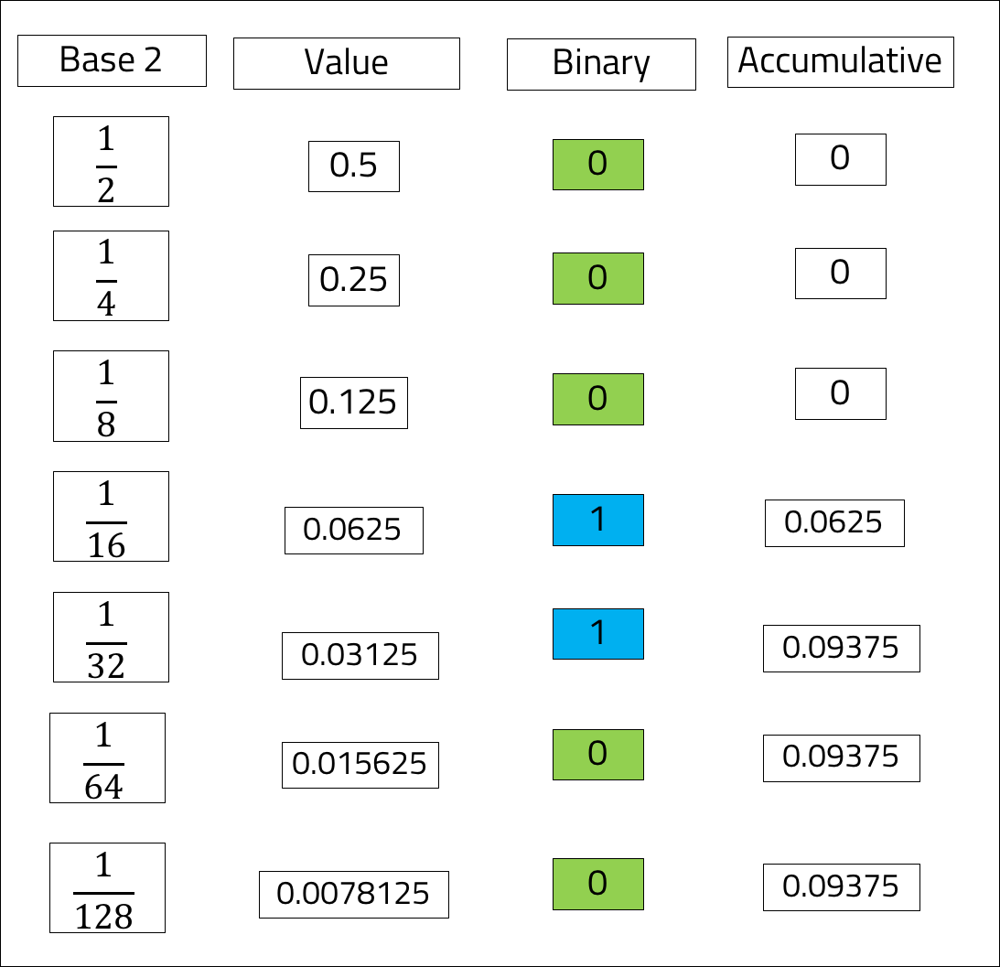

<br>
<strong>Key Takeaways</strong><br>
&#8226; Understand why floating point precision may not always produce predictable results.<br>
&#8226; Understand how the float and decimal primitives deduce values in the JVM.<br>
&#8226; Use the math.BigDecimal class to resolve floating point precision inaccuracies.<br>

<br>
<h4>Floating point primitives</h4>
<p>
Amongst the primitive data types the JVM offers, the <code>float</code> and <code>double</code> primitives offer floating point values to be used for non-whole numbers. The primitive data types store a fixed number of binary digits: <code>float</code> has a storage of 4 bytes, whereas <code>double</code> has 8 bytes. As a result <code>double</code> can scale up to 15 digits compared to just 9 for <code>float</code>.<br>
The benefits of using floating point numbers are their speed and efficiency. The JVM is able to very quickly calculate and store the values. 
</p>
<br>
<h4>Binary digits and floating point issues</h4>
<p>
When the JVM handles floating point values, they are stored as a binary representation of a fraction and exponent. For example, in calculus, the value of 0.1 can also be calculated as 10 to the power -1. Similarly, the value of 0.55 can be calculated as 55 * 10 to the power -2.<br>
The JVM, however, interprets floating point numbers an exponent with a base to the power of 2. When a decimal is defined, the JVM will represent it as a value multiplied by 2 to power of x. The JVM processes values to a base of 2 as the computer interprets values in binary code. The JVM is able to interpret the values without conversion and therefore creates the property of speed that floating points exude.
</p>
<p>
The example below demonstrates how the value of 0.1 can be defined in binary code. The power of 2 is used to the power of -1, -2, and so on and the binary value indicates whether or not the power of 2 can be used to increment towards the value of 0.1. As the Base 2 increments, the value is reduced and the accumulative value nears 0.1. If the value of the base of 2 will accumulate the total greater than 0.1, the binary value will be 0, otherwise the value will be 1.
</p>




<p>
The binary code of 0001100 will continue infinitely into 0001100110011001100. The float and double primitive values will however round the value according to their memory limit. As the float and double are not able to define the exact value of the decimal, when using the values in a calculation, the result will not be as expected:
</p>

```java{numberLines:true}

    double a = 0.2;
    double b = 0.19;

    float c = 0.2f;
    float d = 0.19f;

    System.out.println("double answer:  " + (a-b));
    System.out.println("float answer:   " + (c-d));
```
<br>

```
    double answer:  0.010000000000000009
    float answer:   0.010000005
```

<br>
<h4>Resolving floating point precision with math.BigDecimal</h4>
<p>
The math package of Java introduces a class called <code>BigDecimal</code> to provide support across arithmetic, rounding, and format conversion. 

</p>

<br>
<h4>Conclusion</h4>
<p>


</p>

<br>
<small style="float: right;" >Picture: Black River, Mauritius by <a target="_blank" href="https://unsplash.com/@xaviercoiffic">Xavier Coiffic</small></a><br>