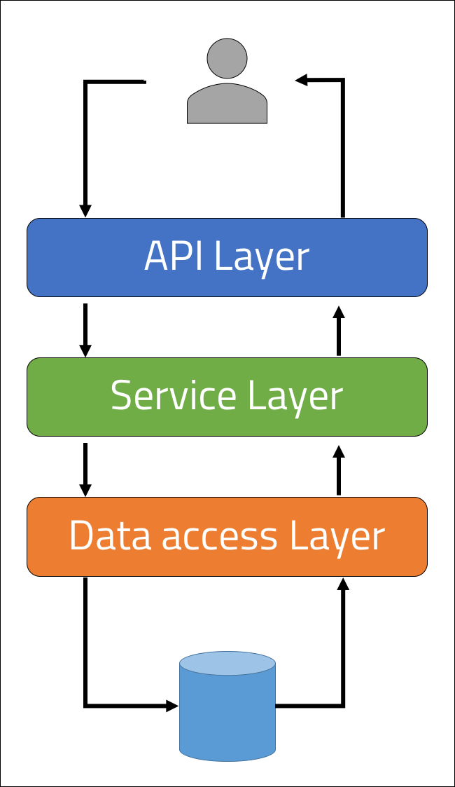

 
<strong>Key Takeaways</strong> 
&#8226; Understand the key layers to a Spring application architecture. 
&#8226; Explore the role and importance of the Spring IoC container. 
&#8226; Understand the significance and differences between the @Component, @Controller, @Service and @Repository class annotations. 

 
<h4>Spring application architecture</h4>

The architecture of a Spring application relates to the organisation of classes and functions. The Separation of Concern (SoC) design principle is used to ensure an application has delegated sections to address separate concerns. By separating the different classes of an application based upon its responsibility, the overall architecture of the application supports the long-term maintenance and growth of the application and discourages code rot. 
The Spring framework architecture uses 3 key layers that can be used to designate classes and functions based upon their responsibility.

Each layer within the architecture is designed to communicate with the layer above and/or below it. The layers include: 
&#8226; API/Web layer. Used to accept and authenticate user input and handle HTTP requests. Spring MVC is used to separate the web view, the servlet controller and the model objects which are later handled by the service layer. 
&#8226; Service layer. Interacts with the API layer to provide authorization and processing of custom business logic.  
&#8226; Data access/integration layer, also known as Repository layer. The basic CRUD operations are exposed in the data access layer to send operations to the database. Object to relational mapping (ORM) is used to integrate data to and from the database.  

 
<h4>Separating layers into a request and response</h4>

The below example illustrates the layers of a Spring application and how it would be handled by a request made by a user.

When a user makes a request, it is first intercepted by the API layer. The API layer is used to handle HTTP requests such as GET, PUT, DELETE and POST.

The request can then be processed by the service later to implement business logic. Such logic may include authorizing the request, transforming the request or logging. 

The data access/integration layer receives the request by the user and transforms the request using ORM to interact with the database. The database is persisted outside the layer and will return a response that is then relayed back to the user.

 
<h4>Spring IoC Container</h4>

Before we look into the different Spring class annotations, we will review the Spring IoC container and what beans are. The different class annotations define different type of beans with various automatic configurations to cater for their existence at a particular layer.

The Spring Inversion of Control Container is a core Spring Framework component. The IoC container is responsible for creating, wiring, managing and configuring objects to be used by the application. The components that make the application are injected by the framework using dependency injection.

There are two types of containers within the Spring Framework: 
&#8226; BeanFactory. 
&#8226; ApplicationContext. 

<strong>BeanFactory</strong> 
The BeanFactory is responsible for maintaining the registry of different beans and their dependencies. 
Beans are then injected into the classes that depend upon them. 

<strong>ApplicationContext</strong> 
The ApplicationContext container contains the same functionality of the BeanFactory, however it also includes functionality load file resources, to publish events to event listeners and to resolve messages for internationalisation support.

 
<h4>Spring class annotations</h4>

@Service is used for the business logic
@Controller is used for the API layer
@Repository is used for the data access layer

 
<h4>Conclusion</h4>

 
<small style="float: right;" >Picture: xxx, xxx by <a target="_blank" href="https://unsplash.com/@xxx">xxx</small></a> 