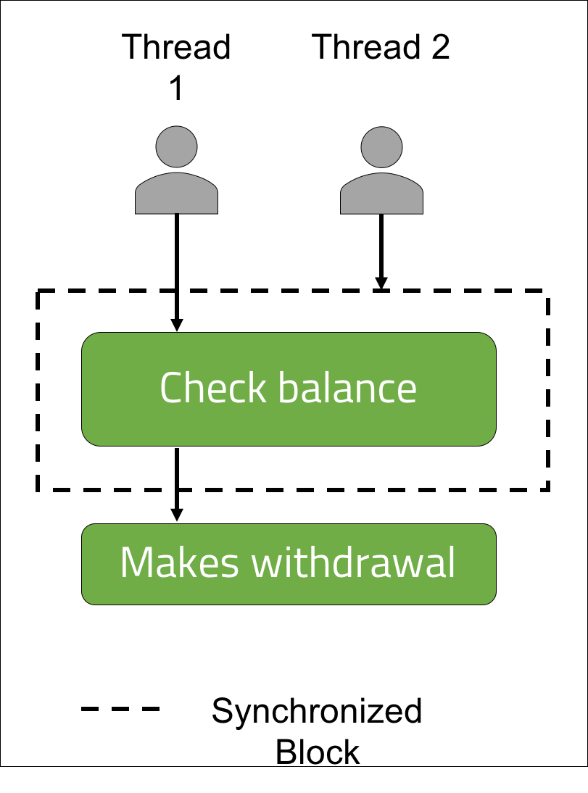
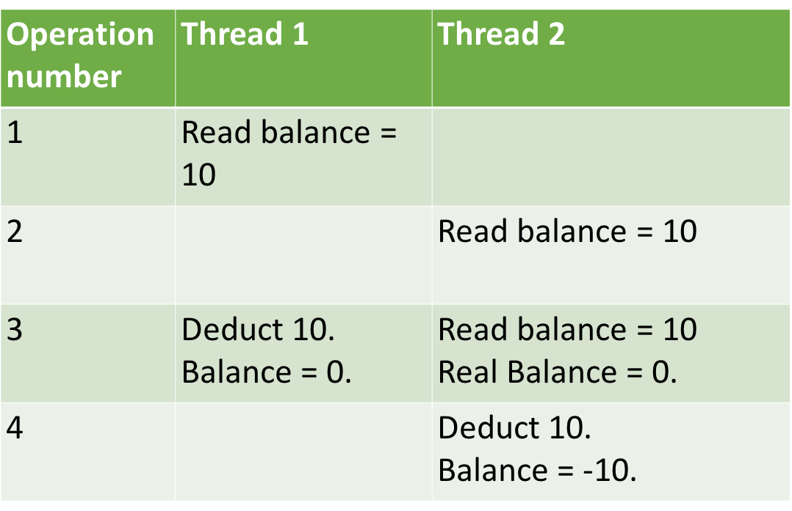
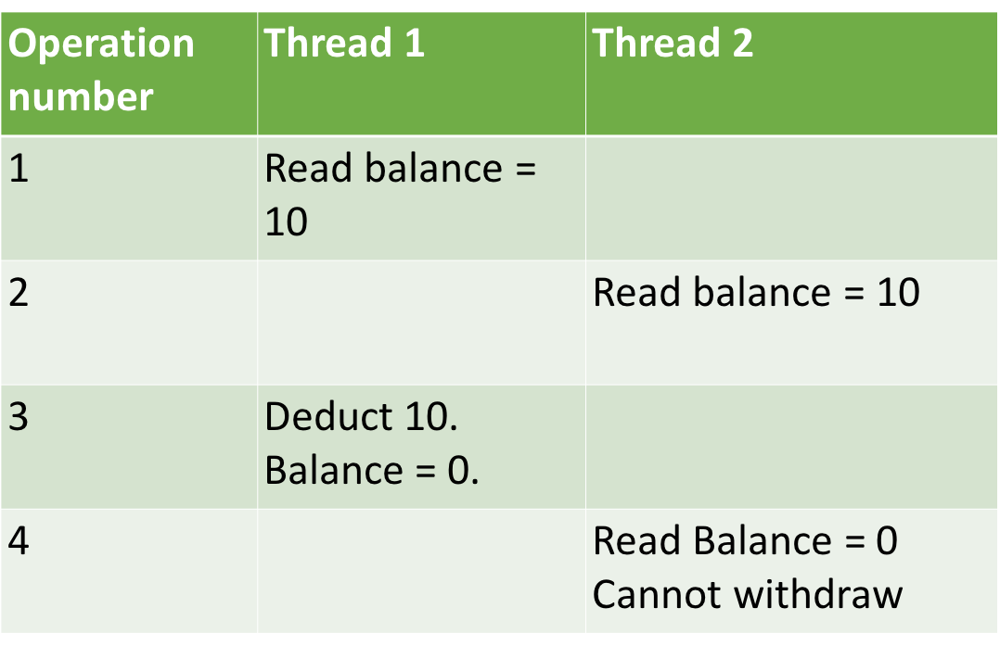

<br>
<strong>Key Takeaways</strong><br>
&#8226; Explore the different ways a race condition can be mitigated within multi-threaded applications.<br>
&#8226; Implement the Immutable class design pattern.<br>
&#8226; Understand the differences between various strategies to resolve race conditions.<br>

<br>
<h4>What is race condition?</h4>
<p>
Race condition is a term that originates from electronics to describe a condition where a systems behaviour is dependent on the timing of uncontrollable events.
</p>
<p>
In the context of a multi-threaded application, race condition can arise where two threads are performing an activity simultaneously where the context of the outcome is stateful. Stateful Objects contain data that is represented by the business logic in the current state of the application. A stateless Object will contain data that is not in any way impacted by the state of the application.
</p>
<p>
A static variable may be one example of a stateful object. It's existence can be dependent on the interactions it has with other instances of the class, whereas a method-local variable does not carry such a relationship. 
</p>
<h4>A shared bank account</h4>
<p>
To describe the how a race condition may arise, I will use a scenario of a shared bank account. The bank account is now allowed to go into overdraft, therefore when a request is made, it should only be processed if there is sufficient funds in the account.
</p>
<p>
A race condition can occur when both people make a transaction at similar times using different threads.<br>
The process of checking the balance and withdrawing funds is completed in multiple steps of the same method; it can be possible that in the time between checking the balance and withdrawing the funds, the balance has been reduced by a different thread therefore causing the balance to become overdrawn by the transaction in process.
</p>


<p>
The diagram above illustrates how both threads perform the balance followed by a short wait (for theoretical processing time), and then make the withdrawal against the balance.<br>
The race condition occurs as the outcome of the transaction is deterministic upon the internal method thread speeds.
</p>
<br>
<h4>The possible stateful outcomes</h4>
<p>
The outcome from the scenario can be one of three:<br>
1. Alice can spend the money and Bob is not able to.<br>
2. Bob can spend the money and Alice is not able to.<br>
3. Alice and Bob can spend the money, thus causing the account to become overdrawn.<br>
</p>
<p>
To implement the race condition, I will create a BankAccount class that has a withdraw method.<br> 
The below code sample demonstrates how the race condition can occur within the <code>spend(int amount)</code> method of the Person class:

```java{numberLines:true}
public class BankAccount {

    private int balance = 50;

    public  void withdraw(int spend){

        int temp = balance;
        System.out.println("Withdrawing from balance: " + balance);
        balance = temp - spend;
        System.out.println(spend + " withdrawn. New balance: " + balance);

    }

    public int getBalance(){
        return this.balance;
    }

}
```
</p>
<p>
The BankAccount instance has an initial balance of 50. The withdraw method will first pass the balance into a variable <code>temp</code> before making the withdrawal and printing the balance to the console.
</p>

<p>
If I were to run the following single-threaded test, the application would perform as expected:

```java{numberLines:true}
  @Test
    public void bankAccountWithdraws() throws InterruptedException{

        for(int i = 0; i< 5; i++){
            bankAccount.withdraw(10);
        }

        assertEquals(0, bankAccount.getBalance());
    }
```

```{numberLines:true}
Balance: 40
Balance: 30
Balance: 20
Balance: 10
Balance: 0
```

</p>
<br>
<h4>Introducing latency and a possible race condition</h4>
<p>
The current execution of the single thread acts as expected as the <code>withdraw()</code> method is only called once at any one time. I can introduce latency into the application by using the <code>wait()</code> method that causes all threads to stop before before continuing. The <code>withdraw()</code> method must become synchronized to ensure only one thread enters the method at a single time.
</p>
<p>
The following update to the <code>withdraw()</code> method will cause the threads to check the balance, wait for each other, then to complete the transaction. As a result, each thread will read in the opening balance before making a transaction against the balance:


```java{numberLines:true}
   public synchronized void withdraw(int spend) throws InterruptedException{

        int temp = balance;
        System.out.println("Withdrawing from balance: " + balance);
        wait(100);
        if(balance - spend >=0){
            balance = temp - spend;
            System.out.println(spend + " withdrawn. New balance: " + balance);
        }
    }
```
</p>
<p>
The single threaded test will continue to behave as expected, however multiple threads can be used to execute the code by using an Executor Service:

```java{numberLines:true}
  @Test
    public void counterWithConcurrency() throws InterruptedException{

        int numberOfThreads = 5;
        ExecutorService es = Executors.newFixedThreadPool(10);
        CountDownLatch latch = new CountDownLatch(numberOfThreads);

        for(int i = 0; i<numberOfThreads; i++){
           es.execute(() -> {

               try {
                   bankAccount.withdraw(10);
               } catch (InterruptedException e) {
                   e.printStackTrace();
               }

               latch.countDown();
           });
        }
        es.shutdown();
        latch.await();
        assertEquals(0, bankAccount.getBalance());
    }
```

```
Withdrawing from balance: 50
Withdrawing from balance: 50
Withdrawing from balance: 50
Withdrawing from balance: 50
Withdrawing from balance: 50
10 withdrawn. New balance: 40
10 withdrawn. New balance: 40
10 withdrawn. New balance: 40
10 withdrawn. New balance: 40
10 withdrawn. New balance: 40
```
```java
java.lang.AssertionError: 
Expected :0
Actual   :40
```
</p>
<p>
The separation between reading a balance and withdrawing against it can be create further problems if the account were to become overdrawn:
</p>

<br>
<h4>Resolving the race condition</h4>
<p>
We can resolve the race condition by asserting that only one thread can access a shared resource at any one time or by ensuring all threads are aware of the balance at any one time. In our BankAccount so far, we have already utilised one of the keywords used to create thread-safety: <code>synchronized</code>.
</p>
<p>
<strong>Synchronized methods</strong><br>
The <i>Synchronized</i> keyword in Java can be applied to either a method signature or a block of code to ensure that only one thread can access it at a single time. The <code>withdraw()</code> method is changed to a <code>public void synchronized withdraw()</code> signature to ensure only one thread can obtain the lock for the method at a single time. When the thread reaches the <code>wait()</code> method, it releases the lock allowing another thread to enter the method. The synchronized keyword is used to control access into the method. 



</p>

<strong>Thread communication</strong>
<p>
Our <code>withdraw()</code> method may be able to stop multiple threads from accessing the method together, however the <code>wait()</code> method call means all the threads are executing the <code>spend()</code> function together. As a result, they all make a transaction against the balance of 50 that they had read in earlier. To resolve the problem, all Thread instances must be able to see the updates that are made, and all updates made must be publicly visible to all threads.
</p>

<strong>Atomic variables</strong><br>
<p>
The atomic variables within Java aim to resolve the visibility problem that can occur between two threads of an application. 
When two threads read in the balance from the account, it will reflect the current balance as per the local cache of the thread. 
Even if the account balance is marked as transient, the operation performed on the account balance is made to the local value.
The table below illustrates how the threads will see the value and perform the operation:
</p>



<p>
Atomic variables within Java provide values that are updated across all threads of the application at the same time.
An atomic value in this context is useful to ensure all the threads can see the latest balance before making a transaction. This way, the if statement will be applied to the most up-to-date value of the balance. The BankAccount is updated to use AtomicIntegers accordingly:
</p>

```java{numberLines:true}
public class BankAccount {

    private volatile AtomicInteger balance = new AtomicInteger(50);

    public synchronized void withdraw(int spend) throws InterruptedException{

        System.out.println("Withdrawing from balance: " + balance);
        wait(100);
        if(balance.get() - spend >= 0) {
            balance.addAndGet(-spend);
            System.out.println(Thread.currentThread().getName() +  " has withdrawn " + spend + ". New balance: " + balance);
        }
    }

    public AtomicInteger getBalance(){
        return this.balance;
    }

}
```
<p>
The shared cache between the threads means the update to balance that is made is visible across all threads. 
As a result, the second thread is able to see the updated <code>balance</code> value and will evaluate the if statement appropriately.


</p>

<p>
The AtomicInteger is used to communicate across the threads. When the penultimate thread is executed, the balance is atomically updated to 0 across all threads. Therefore the final thread evaluates the bank account balance to 0 and is no longer able to make the final -10 transaction. 
</p>

```
Withdrawing from balance: 50
Withdrawing from balance: 50
Withdrawing from balance: 50
Withdrawing from balance: 50
Withdrawing from balance: 50
Withdrawing from balance: 50
pool-1-thread-1 has withdrawn 10. New balance: 40
pool-1-thread-2 has withdrawn 10. New balance: 30
pool-1-thread-3 has withdrawn 10. New balance: 20
pool-1-thread-4 has withdrawn 10. New balance: 10
pool-1-thread-5 has withdrawn 10. New balance: 0
```

<br>
<h4>Conclusion</h4>
<p>
Multi-threading allows our code to utilise the multiple cores of the CPU. The danger of multi-threading however leads to potential errors between the threads, one of which is known as race condition.<br>
The synchronized keyword in Java allows a thread to obtain a key to a code block or method during its execution to ensure no other thread is able to access the code at the same time. The concurrent.atomic package in Java includes many Atomic variables that can be used to provide cross-thread visibility of changes to a shared value.
</p>
<p>

</p>

<br>
<small style="float: right;" >Picture: xxx, xxx by <a target="_blank" href="https://unsplash.com/@xxx">xxx</small></a><br>