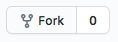
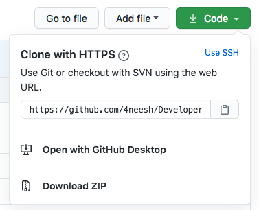
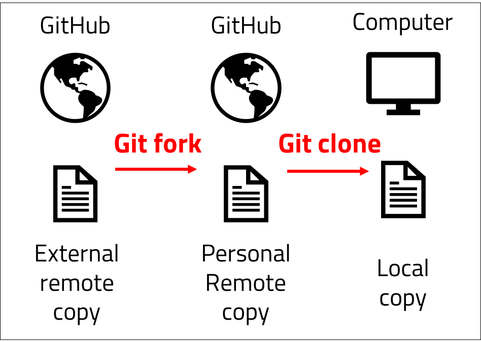
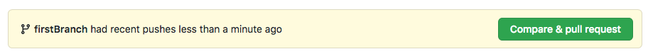
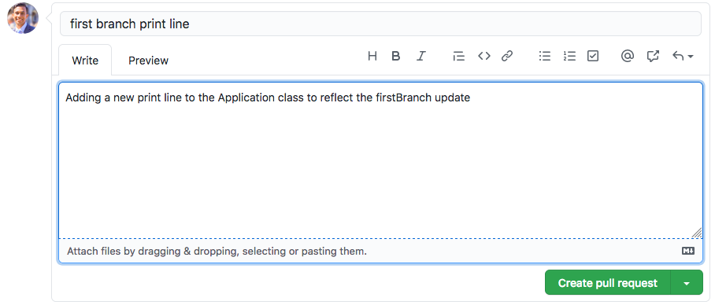
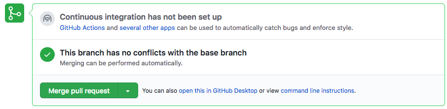

<br>
<strong>Key Takeaways</strong><br>
&#8226; Understand how to store and manage files using Git.<br>
&#8226; Use Git to manage branches and make pull requests for source code reviews and inclusion.<br>
&#8226; Use Git to update branches with the latest updates from the remote repository.<br>

<br>
<h4>What is Git and version control?</h4>
<p>
Git is a distributed version-control system that enables you to manage your code and updates in a centralised repository.
Git stores snapshots of the source code each time it is saved to enable you to revise historical updates to source code and track changes.
We use Git and other version control systems to control the updates and revisions made to our source code in a distributed contribution environment. 
</p>
<p>
Version control is equally valuable to all developer projects regardless of the number of contributors; it formalises the process of creating, updating, and reviewing code before it is submitted to the main application source code.
</p>
<p>
In this blog post, I will be using GitHub to manage source code. GitHub is a Git repository hosting service that provides a GUI for interacting and collaborating with Git repositories.
Git is used to store local source code in a remote (online) location. The remote location is then accessed by all contributors and updated and reviewed in unison. 


</p>
<br>
<h4>Creating a repository</h4>
<p>
A repository can first be created in GitHub from the website by selecting 'New Repository'.
</p>
<p>
The git repository is mapped into a local directory. Create and navigate to the directory from the command line and initialise the directory as a Git repository with the following command:

```
git init
```
</p>
<p>
<i>Git init</i> will create a .git file in the directory that creates an empty repository. The initilisation makes other git commands available that can be used to add and manage source code within the local and remote repository.
</p>

<br>
<h4>Adding code updates</h4>
<p>
I have created a new project in the local directory where <i>git init</i> was called to complete the following print function.
</p>

```java{numberLines:true}
public class Application {

    public static void main(String[] args) {

        System.out.println("Hello from the main branch");
    }
}
```
<p>
The remote GitHub repository is currently empty and the our local repository contains source code that is yet to be added. 
The following command line instructions can be used to move the local source code into GitHub.
</p>

```
git status
```
<p>
<i>git status</i> allows you to inspect a local repository. The command will display the state of the directory against which changes are staged and which files are not tracked by git.
The status will inform you which files are staged, unstaged and untracked.<br>
Staged files are files that have been added to the current file history and are to be pushed into the remote repository in GitHub on the next 'push' command (more on 'push' later)<br>
Unstaged files are files that are currently tracked by Git, have been updated, but are not included in the next 'push' command<br>
Untracked files are brand-new files that are not acknowledged by Git at any point.
</p>

```
git add .
```
<p>
<i>git add .</i> is the first instruction that tells Git to save a snapshot of the current project state into the git commit history.<br>
When you later review all the updates to the source code, you will be able to review against each state of the source code each time <i>git add .</i> was called.<br>
The " ." that follows the keyword 'add' instructs git to add all updates within the directory and sub-directories for the local repository. It is possible to replace " ." with specific files 
for fine-grained updates.<br>
Once <i>git add .</i> is called, the files are moved to the staging area and are ready to be committed to the remote repository.
</p>
<p>
<i>git add .</i> will ensure all untracked files become tracked and all unstaged changed become staged.
</p>

```
git commit -m "my first commit"
```
<p>
<i>git commit -m"my first commit"</i> is used to create a new revision of the source code that includes the previous version and all the files staged from the previous call(s) to 'git add'.
<br>
Each commit command must be made with a comment. <i>-m "my first commit"</i> is the command instruction to include the comment in the speech marks. It is best practice to include a comment that describes the update made, and the problem that the commit is resolving. 
</p>

```
git push -u origin <git url.git>
```
<p>
<i>git push</i> will take the current staged commit and push it into the remote repository. The above command includes three further instructions that are required for the very first commit to the repository.<br>
<i>-u</i> instructs git that it is making an upstream push into the origin. 'origin' is the default name for the remote repository and the url for the origin is passed in as a parameter. 
</p>

<br>
<h4>Why we branch code</h4>
<p>
Branching creates a controlled copy of the code to be modified within a safe environment. Branches are used to make granular and specific updates to the code without the risk of creating side-effects or regression to the existing source code. Branches are created and merged into the main source code in a series of events that allow code updates to be reviewed and combined safely.
</p>

<br>
<h4>Branching to make changes</h4>
<p>
Before we can create a branch from the main remote repository, we need to create a copy of the source code in our personal remote repository. If you own the repository, you can skip this step, however if you are contributing to open source software, the source code will exist in a remote repository that is not your own. Therefore you must create a copy of the remote source code into your own remote location that is linked to the main remote repository. To perform the remote copy, we use <i>git fork</i>.<br>
Forking is the first part of 4 steps to update an existing source code:<br>
1. (If you do not own the central repository) Fork the repository from the remote central location to the remote personal location.<br>
2. Clone the forked repository from the remote personal location to the local location.<br>
3. Apply a fix or update.<br>
4. Submit a pull request for the update to be included in the remote central location.<br>
</p>
<p>
I will first create a fork of the repository by selecting "Fork" on the GitHub repository page.



</p>
<p>
The Forked repository will now exist in your own GitHub remote account. Select the repository and copy the URL that appears under the "Code" tab. 

</p>



<p>
In the command line, navigate to the directory where you would like to store the cloned repository and use the following command to create a local copy of the forked repository:

```
git clone <forked repository URL>
```
</p>




<p>
The local repository now includes a copy of the personal remote repository. Use the following command to create a new branch on the local repository:
</p>

```
git checkout -b "firstBranch"
```

You can see all the available branches by running the following command:

```
git branch -a
```
<p>
A new branch has now been created called firstBranch.


</p>
<p>
In the command line, we are able to check the branch we are currently on with 'git status'

```
on branch firstBranch
```
</p>

<p>
The main branch can be accessed by using the following command:

```
git checkout main
```
</p>


<p>
The 'git status' command will now read as "on branch main"
</p>
<p>
We will navigate back to the firstBranch and apply a single update to the source code on line 6:

```java{numberLines:true}
public class Application {

    public static void main(String[] args) {

        System.out.println("Hello from the main branch");
        System.out.println("Hello from the first branch");
    }
}                                                                                                                                                                                                                                                 
```
</p>
<p>
The first branch is updated using the following commands:<br>
&#8226; git add .<br>
&#8226; git commit -m "first branch print line"<br>
</p>
<p>
The first branch now has an update that we would like to add to the main branch. You can see the differences between the two branches (main and firstBranch) by using the following command to switch between branches:

```
git checkout main
```

```
git checkout firstBranch
```
</p>

<p>
The update from firstBranch can be submitted into the main branch through a <i>pull request</i>:

```
git push --set-upstream origin firstBranch
```

The above command uses 3 instructions on the push statement. firstBranch has not specified where it is pushing the latest update to. The upstream target is set to the origin (main) branch and the branch name is specified at the end.
</p>
<br>
<h4>Handling a pull request</h4>
<p>
The upstream push from the firstBranch has created a new pull request in the main branch.
The pull request can be reviewed in GitHub from the main repository page:



The following page allows you to submit the pull request with comments to the maintainers of the main repository. A maintainers of a repository are dedicated individuals who review and approve updates to the main application source code.



If you are the owner or maintainer of the repository, the pull request merge option will be seen as below after any conflicts are reviewed:


</p>

<br>
<h4>Updating branches with the latest change</h4>
<p>
The main branch from the application has now been updated with the additional print line from the firstBranch. The local copy of the main branch has not reflected the update and only contains a single print line. The latest update to the remote repository can be "pulled" into the local repository using the following command:

```
git pull
```

<i>git pull</i> performs two actions:<br>
First, git pull performs a <i>git fetch</i> command to download the latest commits, file, and references from the remote repository locally.
Second, git pull will integrate the new data into the working files. The local repository now reflects the latest updates to the source code that is stored remotely.
</p>
<br>
<h4>Conclusion</h4>
<p>
In this post I have used Git version control to clone a remote repository locally, to create a branch for updates, and to submit a pull request for review and inclusion in the main application source code. The updates to the remote repository are then reflected locally by pulling them from the remote repository using Git.
</p>
<p>
Git is a popular version control tool used across industries in different forms (such as svn or mercurial). The flows of forking a repository, pulling changes from the remote version and submitting pull requests are important to understand and apply appropriately to standardise and formalise the process for code enhancements and bug fixes.
</p>
<p>
Working with version control is important within a team and open-source environment; use the techniques from this blog to develop patterns of pulling, updating, and submitting code updates in a safe manner across branches and pull requests in open or even your own closed repositories.
</p>

<br>
<small style="float: right;" >Picture: Kyoto, Japan by <a target="_blank" href="https://unsplash.com/@agathemarty">Agathe Marty</small></a><br>