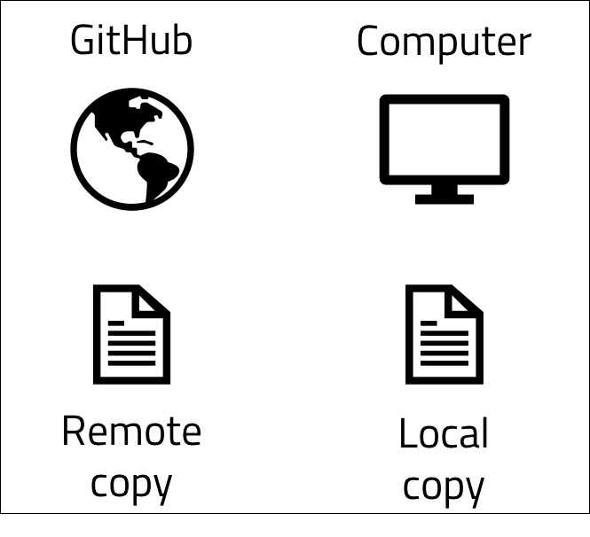
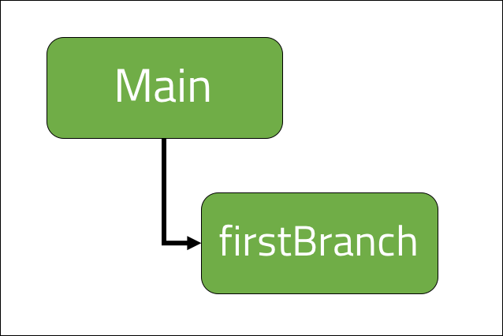

<br>
<strong>Key Takeaways</strong><br>
&#8226; The .<br>
&#8226; The .<br>
&#8226; The.<br>


<br>
<h4>What is Git and version control?</h4>
<p>

difference between remote and local



</p>
<br>
<h4>Creating a repository</h4>
<p>
A repository can first be created in GitHub from the website by selecting 'New Repository'.
</p>
<p>
The first step to do is to create a directory in your local machine for the git source code.
In the command line, navigate to the respective directory and initialise it as a Git repository with the following command:

```
git init
```
</p>
<p>
<i>Git init</i> will create a .git file in the directory that creates an empty repository. The initilisation makes available other git commands that can be used to begin adding the source code into the repository.
</p>

<br>
<h4>Adding code updates</h4>
<p>
The first addition of code to the repository will include a single print line which is saved into a file of the directory where <i>git init</i> was called:
</p>

```java{numberLines:true}
public class Application {

    public static void main(String[] args) {

        System.out.println("Hello from the main branch");
    }
}
```
<p>
The GitHub repository is currently empty and the our directory contains source code that is yet to be added. 
The following command line instructions from the directory with the .git file can be used to move the source code into GitHub.
</p>

```
git status
```
<p>
<i>git status</i> allows you to inspect a repository. The command will display the current state of the directory against which changes are staged and which files are not tracked by git.
The status will inform you which files are stages, unstaged and untracked.<br>
Staged files are files that have been added to the current file history and are to be pushed into the Remote repository in GitHub on the next 'push' command (more on 'push' later)<br>
Unstaged files are file that are currently tracked by Git, but have been updated and not to be added into the remote repository upon the next 'push' command<br>
Untracked files are brand-new files that are not acknowledged within the Git history at any point.
</p>

```
git add .
```
<p>
<i>git add .</i> is the first instruction that tells Git to save a snapshot of the current project state into the git commit history.<br>
When you later review all the updates to the source code, you will be able to review against each state of the source code each time <i>git add .</i> was called.<br>
The '.' that follows the keyword 'add' instructs git to add all updates that are possible within the directory and sub-directories. It is also possible to replace '.' with specific files 
to include in snapshot only.<br>
Once <i>git add .</i> is called, the files are moved to the staging area and are ready to be committed to the remote repository.
</p>
<p>
<i>git add .</i> will ensure all untracked files become tracked and all unstaged changed become staged.
</p>

```
git commit -m "my first commit"
```
<p>
<i>git commit -m"my first commit"</i> is used to create a new revision of the source code that includes the previous version and all the files staged from the previous call(s) to 'git add'.
<br>
Each commit command must be made with a comment. <i>-m "my first commit"</i> is the command instruction to include the comment in the speech marks. It is best practice to include a comment that describes the update made, and the problem that the commit is resolving. 
</p>

```
git push -u origin <git url.git>
```
<p>
<i>git push</i> will take the current staged commit and push it into the remote repository. The above command includes three further command instructions as it includes the very first commit to the repository.
<i>-u</i> instructs git that it is making an upstream push into the origin. 'origin' is the default name for the remote repository.
The upstream command is implied 
</p>
<br>
<h4>Copying source code from the remote into the local copy</h4>
<p>
The following sections will describe how to create and manage branches from a git repository.
You can copy a remote repository into your local machine with the following command:
</p>

```
git clone <repository url.git>
```
<p>
The clone of the repository will be the main branch. You can then extend your own branch from the working copy on your machine.
</p>

<br>
<h4>Why we branch code</h4>
<p>
Branching is important with version control as it allows a controlled copy of the code to be practiced upon.
Branching allows us to make changes to a controlled environment and also allows a rudimentary control of events for publishing and reviewing updates to the code (more on pull requests later).
</p>
<br>
<h4>Branching to make changes</h4>
<p>
To begin making a branch, perform the following command from your directory:
</p>

```
git branch -b "First branch"
```

<p>
A new branch has now been created called first branch.



</p>
<p>
In the command line, we are able to check the branch we are currently on with 'git status'
</p>
```
on branch main
```
<p>
The new branch can be accessed by using the following command:
</p>
```
git checkout "First branch"
```

<p>
The 'git status' command will now read as "on branch First branch"
</p>
<p>
The first branch will make a single update to the source code:

```java{numberLines:true}
public class Application {

    public static void main(String[] args) {

        System.out.println("Hello from the main branch");
        System.out.println("Hello from the first branch");
    }
}
```
</p>
<p>
The first branch is updated using the following commands:<br>
&#8226; git add .<br>
&#8226; git commit -m "first branch print line"<br>
&#8226; git push<br>
</p>
<br>
<h4>Making a pull request</h4>
<p>


</p>


<br>
<h4>Updating branches with the latest change</h4>
<p>


</p>


<br>
<h4>Conclusion</h4>
<p>


</p>

<br>
<small style="float: right;" >Picture: xxx, xxx by <a target="_blank" href="https://unsplash.com/@xxx">xxx</small></a><br>