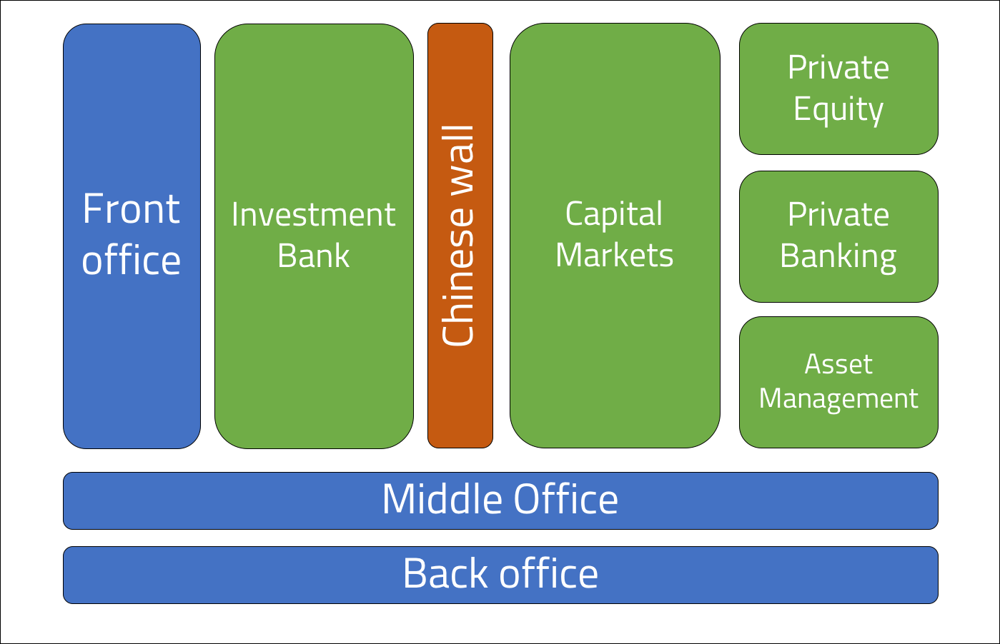

 
<strong>Key Takeaways</strong> 
&#8226; Understand the difference between retail banks and investment banks. 
&#8226; Review the various divisions that exist within an investment bank. 
&#8226; Understand the main activities of each division within an investment bank. 

 
<h4>My first blog on financial services...</h4>

For the past 5 months ( my first 5 months of blogging) I have written about the software engineering practices and tools I encounter on a daily basis. I have decided to begin writing about financial services to accompany the software engineering blogs to reflect upon the context of my job, and to consolidate my understanding for the business I work within. I find the financial services industry to be engaging, even more so due to the growing role of technology to the strategy and growth of all the players within the industry.

This blog post will provide an overview of the various functions within financial services and how they are used to generate a profit for the bank.

 
<h4>Introduction to financial services</h4>

Financial services can be split into two broad categories: retail and investment banking. Both services involve the matching of 'buyers' and 'sellers', however the two categories differ by the scale and instruments that are consulted upon, and the characteristics of the client/customer to the bank.

Retail banking broadly constitutes a service that is provided to families and homeowners who would like a loan or mortgage for their livelihoods. The bank will offer a loan to the mortgage <strong>buyers</strong> with an interest rate of 'r' (e.g 3%) on the repayments. On the other side, the retail bank will also accept deposits from <strong>sellers</strong> who wish to save their excess money. The seller is enticed to deposit their money for an interest repayment on their savings of 's' (e.g 2%). The retail bank will earn a profit through the loan repayments where 'r' is greater than 's' (e.g 1%). This is a general idea of retail banking in the public sector, however the remainder of this post will look into the operations of an investment bank.

An investment bank deals with private and public buyers and sellers that are corporations, high net worth individuals, and government entities. Investment banking will deal with much larger volumes of capital and are therefore able to provide services that generate higher profits for the company and bonuses for the employees. 

 
<h4>Divisions of an investment bank</h4>

The umbrella term 'investment bank' can often take different definitions and meaning. 'Investment bank' must not be mistaken for the 'investment banking division' as the latter describes a group of functions performed by an investment bank. The divisions are used to group the services provided by the bank and are categorised based upon the clients that are dealt with, the services provided, and the style of revenue generation to the bank. The divisions of a bank also supports the regulatory compliance towards information sharing, I will later touch upon this topic.

The image below illustrates the divisions that can exist within an investment bank. 

The 'Chinese wall' that splits the investment banking division from the others is a virtual information barrier to separate non-public information and public information. The investment banking division will often have access to non-public information due to their research services, and must therefore use to a chinese wall to prevent insider information from spilling into the other divisions.

 
<h4>Core services provided within the investment bank</h4>

In the following section, I will describe the core services of each division. The terms 'buy side' and 'sell side' are often used to describe the nature of revenue generation for the function, I have briefly defined them:
 
<i>Buy side: services involved with directly investing capital to purchase securities.</i> 
<i>Sell side: services involved with issuing, selling, or trading securities and advisory services.</i>

<h5><strong>Investment banking division (IBD)</strong></h5>

<strong>Underwriting</strong> 
Underwriting is one of the primary services provided within IBD. The process of underwriting sees the bank support a client (business, corporation, government) with raising capital through the sale of stock (equity) or bonds (debt). The investment bank will profit from a percentage of the overall value of the underwritten securities.

The underwriting process can take the form of either an initial public offering (IPO) or a follow-on offerings. An IPO refers to the process of offering the shares of a private corporation to the general public (thus making it a public corporation). The issuance of new stock is used to raise capital for the corporation. A follow-on offering is the issuance of stock after the IPO. During the IPO, the investment bank will make one of three agreements for underwriting: 
&#8226; Full commitment. The investment bank will buy all the securities and sell them in a secondary market. 
&#8226; Best efforts. A good faith promise is made to sell as much of the security as possible. 
&#8226; All or none. The IPO will only go ahead if all the securities are sold. 

<strong>Market Making</strong> 
As a market maker, an investment bank can act on both sides of the sale for a security. A bid (buy) and ask (sell) price can be quoted by the investment bank and a profit can be realised from the spread (ask - buy) of the security when it is later sold. The investment bank will take on a risk of holding a security as it may depreciate with time, however their market making services provide liquidity to a security that would otherwise not be sold in other markets.

<strong>Advisory</strong> 
Advisory services include research and guidance on M&A (merger and acquisition) and corporate strategy.

The M&A advisory service includes the negotiation and structuring of a merger or acquisition between two corporations. The corporations can be public or private, and the investment bank are able to provide support through their expansive network to find partners and deep-grained industry knowledge on the markets.

Corporate strategy advisory can be used to support the short and long-term strategic direction of corporations in the ways of financing change.

 
<h5><strong>Asset management division</strong></h5>

The asset management division is responsible for growing a fund with investments that cater to the client's risk tolerance and short and long term goals. Investments will be made across instruments such as stocks, bonds, real estate, commodities and derivatives (futures, options, swaps). The client can be high net worth individuals as well as high-end institutions. The relationship between a client and the fund manager is important to maintain as the clients may seek support in reevaluating goals or understanding the opportunities that lie ahead.

Funds will be managed by a portfolio managers who will utilise the research and guidance of their teams to make investment decisions upon the fund. The fund will have a specific criteria such as the risk tolerance, type of securities that are invested upon, and liquidity to adhere to.

 
<h5><strong>Capital Markets division</strong></h5>

Capital markets are where suppliers with excess capital and those in need of capital meet to satisfy their ambitions. Capital markets in this sense are similar to retail banks with mortgages and savings accounts however the entities involved are corporations, governments and individuals. Securities are exchanged within primary market of newly issued securities and secondary markets for re-sold securities. 

<strong>Sales</strong> 
The sales component of capital markets will be responsible for suggesting trading ideas to their clients and to take orders from them. The sales component will also consist of financial analysts that provide support in research and strategies. The order will then be communicated to the trading desks where they are priced and executed.

<strong>Proprietary Trading</strong> 

'Prop' trading is conducted by a special set of traders who invest directly within the capital markets themselves on behalf of the bank, and not the client. The investment bank will directly profit from the market activity as opposed to the margins from client profits they realise. 

<strong>Structuring</strong> 
Structured products provide access for retail investors to derivatives by using complex strategies to switch the underlying payment flows of a security with a fixed value that is derived from a derivative. The complexity of a structured product will require a blog itself to explain, however the summary is that it provides access for retail investors to derivatives.

 
<h5><strong>Private Banking division</strong></h5>

The private banking division is split into two separate services that cater to high net worth individuals: private banking and wealth management.

Private banking provides a personalised and concierge-type service to HNWI for managing their finance. The products offered within private banking are largely identical to those offered within retail banking, however the client to the bank will experience a far greater level of service. Private banks will often use a 6-figure benchmark as a deposit for clients of the bank. The private bank will also offer advisory services for planning, retirement, taxation and inheritance for the client when managing their assets.

Wealth management involves the optimization of a clients portfolio of assets with regards to the individuals risk, goals and asset preference. Wealth management is more aligned to the growth of the clients assets.

 
<h5><strong>Private Equity division</strong></h5>

The private equity division will invest in private institutions with the objective of achieving a mark-up in their value and a return on service fees. Private institutions are ones that have not had an IPO and are therefore not traded on the stock exchange. The private equity division will have many funds that consist of investments from HNWI, corporations, and also loans from banks. The fund is used to purchase multiple private institutions to renovate or provide advisory services to. The growth and enhanced performance for the acquired institution will eventually drive the share price up enabling the private equity fund to realise the profits on the sale. The private equity division will realise profits from a fee of managing the fund and from the percentage share in the fund they had when the private institutions are sold.

 
<h4>Conclusion</h4>

Financial services is a major industry that incorporates a vast array of services from advisory and research to execution and market making. The differences between these services can depend upon the client being served, the institutions being managed, and the active involvement with investments themselves. Services can be split between 'buy side' and 'sell side', however the overarching principle within financial services is to aid in the movement of money. This blog has only touched upon the differences between the services, I will use this to reflect upon in later posts when I look slightly deeper into how financial services works and why technology is playing such an influential role in strategy.

 
<small style="float: right;" >Picture: New York City, New York by <a target="_blank" href="https://unsplash.com/@juniorwebd">Roberto Júnior</small></a> 