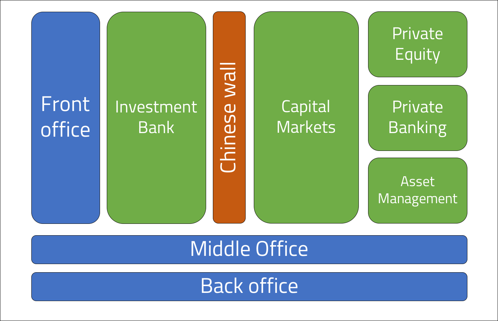

 
<strong>Key Takeaways</strong> 
&#8226; The . 
&#8226; The . 
&#8226; The. 

 
<h4>My first blog about financial services...</h4>

For the past 5 months, (my first 5 months of blogging) I have written about the software engineering practices I use in my job. I have decided to begin writing about financial services as well as software engineering to reflect upon the context of my job, and to consolidate my understanding for the business I work within. I find the financial services industry to be engaging to learn and follow with the growing role of technology to shape the strategies of banks.

This blog post will dive into the financial services industry, how it works, and how technology is forcing major players to transform their traditional practices to remain competitive.

 
<h4>Introduction to financial services</h4>

Financial services can be split into two broad categories: retail and investment banking. Both services involve the matching of buyers and sellers, however the two categories differ by the scale and instruments that are consulted upon, and the characteristics of the customer to the bank.

When we think about retail banking, this is a service often provided to families and homeowners who would like a loan or mortgage for their livelihoods. The bank will offer a loan to the mortgage buyers with an interest rate of 'r' on the repayments. On the other side, the retail bank will also accept deposits from their customers who wish to save their excess money. The customer is enticed to deposit their excess money for an interest repayment on their savings, let's say at a rate of 's'. The retail bank will earn a profit through the loan repayments where 'r' is greater than 's'. This is a general idea of retail banking in the public sector, however the remainder of this post will look into the operations of an investment bank.

An investment bank, on the other hand, deals with buyers and sellers that are corporations, high net worth individuals, and government entities. Investment banking is often thought of as a larger sums of money are handled and the opportunity for larger profits and bonuses are prevalent. 

 
<h4>Divisions of an investment bank</h4>

The umbrella term 'investment bank' can often take different definitions and meaning. 'Investment bank' must not be mistaken for 'investment banking division' which describes collectives activities of an investment bank. The investment bank will include many divisions which can help group the services provided by the bank, whether that be based upon the information they require or the clients they cater towards. The divisions of a bank also supports the regulatory compliance towards information sharing, I will later touch upon this topic.

The image below illustrates the divisions that can exist within an investment bank. 

The 'Chinese wall' that splits the investment banking division from the rest is a virtual information barrier to separate non-public information and public information. The investment banking division will often have access to non-public information due to their research services, and must therefore comply to a chinese wall to prevent insider information from spilling into the other divisions.

 
<h4>Core services provided within the investment bank</h4>

In the following section, I will describe the core services of each division. The terms 'buy side' and 'sell side' are often used to describe the nature of revenue generation for the service, I have briefly defined them:
 
<i>Buy side: services involved with directly investing capital.</i> 
<i>Sell side: services involved with raising capital for a client.</i>

<h5><strong>Investment banking division</strong></h5>

<strong>Underwriting and market making</strong> 

<strong>Advisory</strong> 

<strong>IPO</strong> 

<strong>M&A</strong> 

 
<h5><strong>Asset management division</strong></h5>

The asset management division is responsible for growing a fund with investments that cater to the client's risk tolerance and short and long term goals. Investments will be made across many instruments including stocks, bonds, real estate, commodities and derivatives. The client can be high net worth individuals as well as high-end institutions. The relationship between a client and the fund manager is important to maintain to reevaluate the client's goals and to explain the opportunities that lie ahead.

<strong>Open ended funds management</strong> 

<strong>Closed ended fund management</strong> 

 
<h5><strong>Capital Markets division</strong></h5>

Intro to capital markets

<strong>Sales</strong> 

<strong>Proprietary Trading</strong> 

<strong>Structuring</strong> 

 
<h5><strong>Private Banking division</strong></h5>

Wealth management for HNWI

 
<h5><strong>Private Equity division</strong></h5>

Merchant banking

 
<h4>Conclusion</h4>

 
<small style="float: right;" >Picture: xxx, xxx by <a target="_blank" href="http">xxx</small></a> 