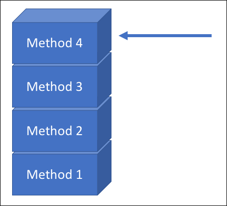
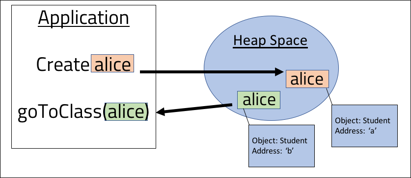

<br>
<strong>Key Takeaways</strong><br>
&#8226; Understand the differences between stack and heap memory.<br>
&#8226; Java uses both pass by reference and pass by value.<br>
&#8226; Java primitives and Objects behave differently when passed between methods.<br>

<br>
<h4>Where do we store our objects?</h4>
<p>
When discussing the JVM, the terms 'stack' and 'heap' are often used to describe how Objects are assigned memory and how the application is is able to refer to accumulate a runtime list of events.
By understanding the difference between the stack and heap, and how they work, we can better understand how Objects are created, used, recycled and removed from the application memory. This can 
enable us to think critically about application memory from a design perspective. In this blog, I will discuss how the memory locations differ and their use by the JVM.
</p>

<br>
<h4>Heap vs Stack</h4>
<p>
The JVM uses the heap and stack to divide memory locations of how to assign Objects memory and how to define the application runtime. By splitting the memory locations between the two, the requirement upon 
the RAM from an application can be appropriately managed as the number of referenced Objects increase.  
</p>
<p>
The <strong>heap</strong> memory is used throughout the life of the Java application to allocate memory for Objects and JRE classes. The garbage collector is used to manage objects within the heap to free memory that is no longer referenced by the application. Read more about the garbage collector in my blog <a target="_blank" href="https://aneesh.co.uk/how-the-jvm-manages-memory">here</a>.
</p>
<p>
The stack is used for temporary memory where variables are stored when methods are invoked. When a method is called, its memory is allocated on top of the stack in a first-in-last-out (FILO) order. Once the method has completed, its memory allocation is cleared from the stack. The diagram below represents 4 different method calls made, where the most recent method call sits at the top of the stack and is pointed to by the JVM.



</p>

<br>
<h4>How Objects are referenced within the heap</h4>
<p>
Different programming languages will reinforce one of two ways to reference Objects within the heap space: by value or by reference. The reference of Objects is used whenever an instance 
or primitive value is processed or used by a different method within the application. 
The method which the Objects are referenced will determine how you manipulate Object properties and how the JVM might determine if the Object is ready for garbage collection.
</p>
<p>
The <i>pass by reference</i> variable movement involves passing the address of the Object from the heap space into the following method. 
In the below example, an instance of <code>Student</code> is created ('alice') and it is stored in memory location 'a' in the heap space. 
On line 5, the Student is passed into a method called <code>goToClass()</code>. The goToClass method will receive the location 'a' of Alice and will 
set the 'attendance' boolean to true on line 9.

```java{numberLines:true}
public static void main(String[] args){
    
    Student alice = new Student("Alice");

    goToClass(alice);
}

private static void goToClass(Student student){
    student.setAttendance(true);
}


```


</p>
<p>
The <i>pass by value</i> variable movement involves passing a copy of the Object itself from the heap space into the following method.
Using the same example as above, the pass by value movement of the Object would involve creating a new copy of the Object and then passing that into the method.



In the diagram above, an identical copy of <code>alice</code> is made within the heap space and is then passed into the <code>goToClass</code> method.
</p>

<br>
<h4>How Java passes Objects within the heap space</h4>
<p>
The JVM uses a combination of pass-by-reference and pass-by-value for managing Objects in the heap space. Technically, Java uses pass-by-value as the characteristics of the heap space show a copy of the Object being passed to the method call, however Java does not make a copy of the Object, however it will pass a copy of the Object address in the heap space.

</p>


<p>
We are able to test how Java passes Objects with the below code snippet. The code will attempt to switch the Person Objects:

```java{numberLines:true}
class Person{

private String name;

    public Person(String name){
        this.name = name;
    }

    public String getName(){
        return this.name;
    }
}


```
```java{numberLines:true}
class Main{

    public static void main(String[] args){
        Person alice = new Person("Alice");
        Person bob = new Person("Bob");
        swap(alice, bob);

        System.out.println(alice.getName());
    }

    public static void swap(Object a, Object b){
        Object c = a;
        a = b;
        b = c;
    }
}
```
</p>
<p>
The output from the above code will be:
```
Alice
```
The <code>swap()</code> method will not work as expected as we are not actually altering the location of alice and bob, but are altering the location of a copy of the reference:

```java{numberLines:true}
public static void swap(Object a, Object b){   //(copy of)alice = location a, (copy of)bob = location b
        Object c = a;   //c = location a
        a = b;          //a = location b
        b = c;          //b = location a
        
        //final result: (copy of)alice = location b, (copy of)bob = location a
    }
```
</p>
<p>
If the actual reference of the Person was passed into the <code>swap()</code> method, then alice would point to location B and have the name "Bob" and vice versa. However as a <u>copy</u> of the reference was passed, the actual Person objects of Alice and Bob remain unchanged.
</p>
<p>
The use of the <code>new</code> keyword within Java will allocate a new memory location of an Object. When the Object is then passed around the application, it will be the reference location that is copied and sent across. In the below code snippet, the creation of a new Student Object will result in a new Object being referenced with its own address. Assume the Student Alice has been passed in.

```java{numberLines:true}

public void changeStudent(Student student){      //student = (copy of) Alice: location a
    student.setName("Alex");                //student = location a
    student = new Student("Charlie");       //student = location c
}

```
Alice's name is first changed to "Alex". As the reference location is passed into the method, the name will be changed on the Alice instance. 
Once the student is referenced to a 'new' Object, the memory location of the Object has been changed and all further method calls to 
the Object 'student' within the method will apply to the the Student instance of Charlie. 
If you were to query the name of Alice after this method has run, the output would remain as "Alice". The reference of 
Charlie will be lost after the method as it is no longer referenced within the method. 


</p>
<br>
<h4>Passing primitives</h4>
<p>
Java extends the use of pass by value to replicate primitive variables and to pass them across methods.
<p>
The benefit of using pass by value with reference locations is that the properties of the Object passed in can still be obtained and modified, however they are protected from being realigned elsewhere.
</p>
<br>
<h4>Conclusion</h4>
<p>


</p>

<br>
<small style="float: right;" >Picture: Furnace Creek, USA by <a target="_blank" href="https://unsplash.com/@garciasaldana_">Pablo García Saldaña</small></a><br>