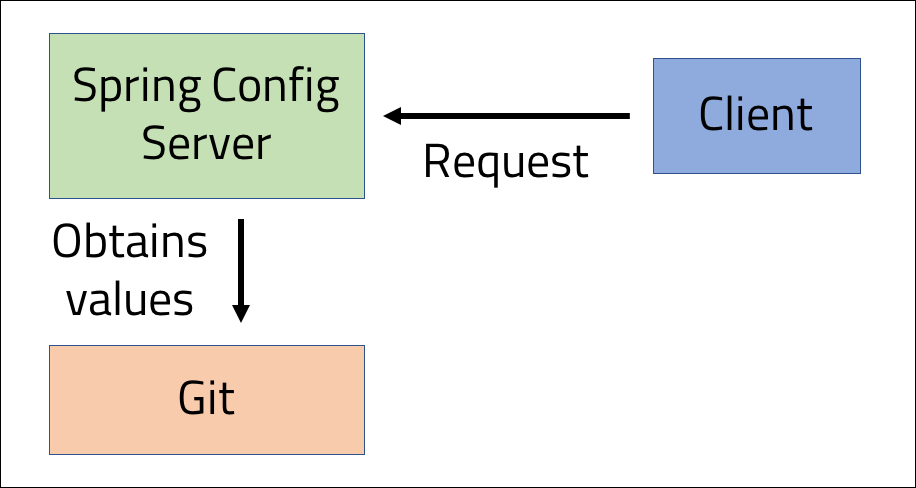

<br>
<strong>Key Takeaways</strong><br>
&#8226; Use Spring Cloud Config for externalised configuration in a distributed system.<br>
&#8226; Understand how to configure the server and how values are obtained across files.<br>
&#8226; Consume the Config server from a client.<br>

<br>
<h4>Centralised configuration</h4>
<p>
Configuration is externalised for a modular architecture.
We use configurations to represent all the changes that might take place between deployments. For example, this could include login credentials, connections to database versions, hostnames and also logging levels. Configurations for services within a Spring Boot application is often defined within the application.properties file. 
The externalised configuration provides a configuration to multiple services at the same time to reduce the repetitive configuration code that is required.

Configuration in an enterprise environment can be used for different environments.
In this case, I will use the configuration to change the behaviour without having to change runtime behaviour.
One example may be to change the location of servers of environment variables.

By centralising configuration, the risk of different environment relying on a local file or falling out of sync is reduced. 
Environment variables can be tracked and maintained across environments. 
Services may also require restarting if they rely on environment variables, whereas with a config server, they will not.
</p>
<p>
Spring Cloud Config is designed to store and server distributed configuration to its clients. 
It uses different storage medium, but is ideally version controlled with git. 

Services can later use the config server as a REST service to obtain values for their properties.
In this example, I will use GitHub to host the configuration server for remote configuration.
We use Spring Cloud Config server.



</p>

<br>
<h4>Creating a Config Server</h4>
<p>
A Spring Config server can be created using the Spring Config Server dependency and Spring web dependency. The Spring web dependency provides the REST functionality of the 
service while the config server will read the properties files:

```
<dependency>
  <groupId>org.springframework.cloud</groupId>
  <artifactId>spring-cloud-config-server</artifactId>
</dependency>

<dependency>
  <groupId>org.springframework.boot</groupId>
  <artifactId>spring-boot-starter-web</artifactId>
</dependency>


```
The server can be activated through a single annotation in the main class:

```java{numberLines:true}
@SpringBootApplication
@EnableConfigServer
public class ConfigServerApplication {

	public static void main(String[] args) {
		SpringApplication.run(ConfigServerApplication.class, args);
	}

}
```

The <code>@EnableConfigServer</code> annotation will activate the server to act as a REST service to find key-value pairs from properties files to be included for reference by clients.
</p>

<p>
The server can use many different medium for storing the configuration values including JDBC, Redis, or AWS S3. The default storage is git as used in this demo.
The values of the configuration will scan a directory within the server to return a hierarchy of values. In the application.properties file, we will use the following propertiesL

```{numberLines:true}
server.port= 8888
spring.cloud.config.server.git.uri = https://github.com/4neesh/DeveloperBlogDemos
spring.cloud.config.server.git.searchPaths= SpringConfig/Config-files*, SpringConfig/Config-files/prod*, SpringConfig/Config-files/dev*
```
The first line will host the Config server on port 8888.
Line 2 will specify where the server will look up the config git repository. This is the home directory of the Git repository (where the .git file is located).
Line 3 defines the search paths to find the appropriate '.properties' files to be included in the configuration server.
The search path will first enter the SpringConfig folder, followed by scanning all files within the Config-files sub-directory, and finally the sub-directory of 'prod' and 'dev'.
The Config server will register all .properties files within these folders to create the values to be upon.
</p>
<p>
The search path will scan each of the following folders:
- /SpringConfig/Config-files/application.properties
- /SpringConfig/Config-files/prod/drinks-prod.properties
- /SpringConfig/Config-files/prod/food-prod.properties
- /SpringConfig/Config-files/dev/drinks-dev.properties
- /SpringConfig/Config-files/dev/food-dev.properties

```
├── SpringConfig
│   └── Config-files
│         ├── application-prod.properties
│         ├── application-dev.properties
│         ├── application-default.properties
│         └── prod
│         │     ├── drinks-prod.properties
│         │     └── food-prod.properties
│         └── dev
│               ├── drinks-dev.properties
│               └── food-dev.properties
```
</p>
<p>
When the service has started, you will be able to send GET requests to the server to find the proper
You can call the server from Postman to return the Environment Object. 
</p>
<br>
<h4>Adding the properties files</h4>
<p>
The properties files are added to the Git repository. They are used to define different values
The Configuration properties folder is added to the Git repo and folders are held within it to store the default application.properties file, and the tech or automotive properties file depending on the stock to be analysed.
</p>
<p>
Each properties file will include information about the database name they are for, the username and password for the access to each of these. 
The application-prod and application-dev property files will include an additional key-value for the environment where they will be 'PROD' and 'DEV' respectively. 
You can see the config files on GitHub <a href="https://github.com/4neesh/DeveloperBlogDemos/tree/master/SpringConfig/Config-files" target="_blank">here</a>.
</p>


<br>
<h4>Navigating the Config server</h4>
<p>
The config server can be browsed by sending GET requests to the 8888 port.<br>
I am using the Postman API development tool to make the requests and to illustrate the different values that can be returned.
The naming convention for the config files will be {application name} - {active profile}.
</p>
<p>
We are able to send a request to the port 8888 with the following name convention:<br>
/{application}/{profile}
/{application}-{profile}.properties
</p>
<p>
The application and profile variables are required parameters when making calls to the configuration server.<br>
The application specifies the first part of the file name that is reviewed. In this instance, the available names are "application", "food" and "dev". By default, "application" is returned to the user
</p>
<p>
The profile is used to specify the environment of the configuration file. The "default" profile will return the files without a profile, however if "dev" was entered, the dev property files will be returned. The profile tells the config server which files to prioritise when processing, however the application name is considered as the first place to look following the exact profile and application combination.
</p>
<p>
The below examples demonstrate how the properties returned from the config server follow a hierarchy:

localhost:8888/food/prod returns:

```
{
    "name": "food",
    "profiles": [
        "prod"
    ],
    "label": null,
    "version": "f6d1b8edc6e75c5586e369188e6bf6284120f46c",
    "state": null,
    "propertySources": [
        {
            "name": "https://github.com/4neesh/DeveloperBlogDemos/SpringConfig/Config-files/prod/food-prod.properties",
            "source": {
                "Database": "mysql-food-prod",
                "User": "serviceAccount",
                "Password": "serviceAccount"
            }
        },
        {
            "name": "https://github.com/4neesh/DeveloperBlogDemos/SpringConfig/Config-files/application-prod.properties",
            "source": {
                "Database": "mysql-application-prod",
                "User": "serviceAccount",
                "Password": "serviceAccount",
                "Environment": "PROD"
            }
        }
    ]
}
```

The first tags returns include the name of the application and the profile of the request. 
Towards the bottom are the config properties returned from the config server. The first set of values come from the food-prod properties file and the second set of values are from the application-prod properties file. The config server has returned the properties files that are appropriate to the application name and the profile of prod. 
</p>
<p>
Another example to demonstrate the config server: localhost:8000/drink/dev:

```
 "propertySources": [
        {
            "name": "https://github.com/4neesh/DeveloperBlogDemos/SpringConfig/Config-files/dev/drink-dev.properties",
            "source": {
                "Database": "mysql-drink-dev",
                "User": "user",
                "Password": "password"
            }
        },
        {
            "name": "https://github.com/4neesh/DeveloperBlogDemos/SpringConfig/Config-files/application-dev.properties",
            "source": {
                "Database": "mysql-application-dev",
                "User": "user",
                "Password": "password",
                "Environment": "DEV"
            }
        }
    ]

```
</p>
<p>
If we request an unknown application name, we will receive the default application properties file:

localhost:8080/cook/dev:

```
"propertySources": [
        {
            "name": "https://github.com/4neesh/DeveloperBlogDemos/SpringConfig/Config-files/application-dev.properties",
            "source": {
                "Database": "mysql-application-dev",
                "User": "user",
                "Password": "password",
                "Environment": "DEV"
            }
        }
    ]

```
</p>

<br>
<h4>Consuming the configuration server</h4>
<p>
We have seen how the config server will return properties as a REST service and how the properties files are prioritised over each other. A client can instead perform GET requests to the service to obtain the values to be injected at runtime. 
</p>
<p>
The client will need to load the configuration server before the application uses its local properties by defining the server in the bootstrap.properties file.
That way the config server takes precedence over the local properties that are defined. 


</p>

<p>
The client service will require the web dependency to make the GET request and Config-client to register the config server:

```
<dependency>
  <groupId>org.springframework.boot</groupId>
  <artifactId>spring-boot-starter-web</artifactId>
</dependency>

<dependency>
  <groupId>org.springframework.cloud</groupId>
    <artifactId>spring-cloud-starter-config</artifactId>
</dependency>
```
Below property can be used to clone the server into the local service when it starts.

```{numberLines:true}
cloud.config.uri=http://localhost:8888
spring.application.name=drink
spring.profiles.active=prod
```
The cloud.config.uri will point to the location of the config server.
The spring.application.name value will determine the application name for which to query.
The spring.profiles.active property will tell the application which profile it will assert for the config property search. 
When the Spring client has loaded, the config properties from the localhost:8888/drink/prod will be accessible to the application.
As a result, the following values are pre-loaded into the application:

```
Database=mysql-drink-prod
User=serviceAccount
Password=serviceAccount
Environment=PROD
```
Where the Environment property has been taken from the application-prod.properties file.
If you check the console for when the application is started, you will see the following line to tell you the config files are being loaded:

```
Fetching config from server at : http://localhost:8888
```
</p>

<br>
<h4>Using the values within the application</h4>
<p>
The client can use a RestController to obtain the values from the config server:

```java{numberLines:true}
@RestController
public class ClientController{

  @Value
  public String home;

  @GetMapping("/home")
  public String getHome(){
    return home;
  }

}

```
</p>

<br>
<h4>Using the config server for automatic properties</h4>
<p>
You may remember that we are importing the config files from the server within the bootstrap.properties file.
As a result, the config server will theoretically populate items into the application.properties file. 
To test this, we can update the drink-prod.properties file to include a further property:

```
server.port=7777
```
This will instruct the client to go to the 7777 port. This would only ever work for a single client for the drink-prod application name and profile. 
However if we were to restart the client, we can see it will start on port 7777:
```
Tomcat initialized with port(s): 7777 (http)
```
This demonstration illustrates how relieve a lot of additional configuration for our clients through the config server. Using the application.{profile} property files, 
we will be able to configure many key properties such as discovery servers, jdbc drivers, database locations and credentials. 
</p>

<br>
<h4>Refreshing the config server</h4>
<p>
The way the client currently works is to first read in the properties from the config server, and to then use the properties within the application. But what happens if we change a property within the config server? To reflect the update, we will need to restart the client to pull in the latest updates.
Thankfully, there is an easier way to get the latest updates, but using the <code>@RefreshScope</code>. 
In the RestController, I will add the @RefreshScope annotation to instruct the controller to refresh upon a client refresh. 
We are able to refresh the client by invoking the 'refresh' endpoint from the Spring actuator with the below dependency:

```
<dependency>
  <groupId>org.springframework.boot</groupId>
  <artifactId>spring-boot-starter-actuator</artifactId>
</dependency>
```
</p>
<p>
To test the refresh scope of the client, I will change the property of 'user' in the drink-prod.properties file:

```
Database=mysql-drink-prod
User=serviceAccount2.0
Password=serviceAccount
server.port=7777
```
By default, not all actuator endpoints are accessible. Therefore in the application.properties file for the client, we are to add the following line the enable the /refresh endpoint:

```
management.endpoints.web.exposure.include=refresh
```
I will then send an empty POST request to the refresh endpoint: localhost:7777/actuator/refresh using Postman.
If I refresh the /username endpoint, we will be able to see the configuration file has been updated without restarting the service.
</p>
<p>
The RefreshScope annotation will mark the Controller class as 'lazy' where they are initialised when they are used rather than at the application initialisation. 
The scope of the class will act a cache for storing the initialised values. As a result, the bean can be re-initialised as and when required. 
It is important to consider what other beans are within the scope of the class as they will also be re-initialised when the actuator refresh endpoint is called. 
This consideration can have an impact on the efficiency of the refresh and the actual effect of beans that are refreshed. 
</p>

</p>
<br>
<h4>Summary</h4>
<p>


</p>

<br>
<small style="float: right;" >Picture: Petra, Jordan by <a target="_blank" href="https://unsplash.com/@aqaisieh">Ahmad Qaisieh</small></a><br>