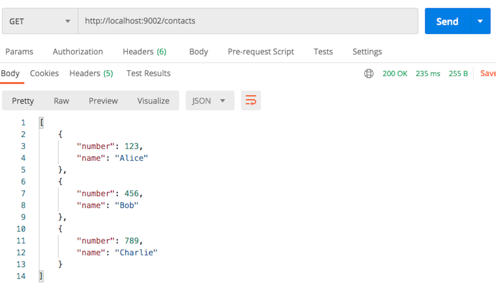

<br>
<strong>Key Takeaways</strong><br>
&#8226; Create a discovery service with Spring Cloud Netflix for registering and consuming services.<br>
&#8226; Connect microservices to the eureka discovery service.<br>
&#8226; Enable services to use Eureka to call each other regardless of client host or port.<br>


<br>
<h4>Netflix Eureka Registration service</h4>

- Eureka Ribbon will periodically refresh its cache of IP addresses from the discovery service so it doesnt need to keep asking the discovery service for the latest information on services. The cache is eventually consistent and refreshes every 30 seconds

<p>
Service discovery constitutes the process of finding other services within a distributed architecture. Discovery can be achieved through a properties file, or configuration that is centrally accessed, or more formally using a UDDI. 
Netflix Eureka is a microservice registration tool developed and open sourced by Netflix. 
Within a microservices environment, microservices will be communicating with each other across different IP addresses and ports thus requiring the management of many connection locations that may be subject to change. 
Service discovery supports the horizontal scaling  of services. Development teams are able to see the number of services and instances/CPU that are available for each service from a single point. 
For a monolithic application, this would result in vertical scaling across the group, whereas service discovery supports the view across services and to reinforce individuals with horizontal scaling. 
</p>
<p>
The Eureka server is itself a microservice that is used to register and store the location of other microservices within the same system. The services register themselves to the server where they can be identified and located by other microservices when required. The service registry is like a phone-book for services within the microservice architecture. It tells each other where they live and if they exist. 
</p>
<p>
As well as service registration, Eureka enables services to call each other by name to support the dynamic nature of the API address and port number changing. 
Eureka also provides other key information about the service health such as available memory, CPU, number of instances launched for each service, their status, and the number of services it is receiving a renewal from. 
</p>
<p>
This blog will demonstrate the use of Eureka as a service registry service where services can register to and also use to call other services. 
We will also look into some of the health information Eureka provides and support it provides for load balancing.
</p>

<br>
<h4>Creating the registration server</h4>
<p>
The eureka server will maintain a pool of services that consistently send a heartbeat of its life.
This is essentially an alternative to a domain name service or a load balancer as service discovery supports re-routing unhealthy instances for the consumers.
</p>
<p>
To create the registration service, you must include the dependency <code>spring-cloud-starter-eureka-server</code> which will provide the Eureka server along with Ribbon, a client-side load balancer. 

```
<dependency>
	<groupId>org.springframework.cloud</groupId>
	<artifactId>spring-cloud-starter-netflix-eureka-server</artifactId>
</dependency>

```
</p>
<p>
The main class of the new Spring project will be annotated with <code>@EnableEurekaServer</code> to instruct the service to provide service registration:

```java
@SpringBootApplication
@EnableEurekaServer
public class DiscoveryServerApplication {

	public static void main(String[] args) {
		SpringApplication.run(DiscoveryServerApplication.class, args);
	}

}
```
</p>

<p>
In the application properties file, the server is configured to instruct upon certain key values in its service registration:

```{numberLines:true}
server.port=9001
eureka.server.eviction-interval-timer-in-ms=3000
eureka.client.service-url.defaultZone= http://localhost:9001/eureka
```
The <code>server.port</code> specifies the port the Eureka service is located. By default, it is port 8761.
The <code>eviction-interval-time</code> will define the number of milliseconds to wait for a service to be evicted from the server once it stops receiving the heartbeat. The <code>defaultZone</code> change the default behaviour of the server to to fetch the registry of services from the server.
</p>
<p>
If we navigate to localhost:9001, we can find the server without any instances registered to it:


</p>
<p>
The 'Environment' at the top of the page is defaulted to 'Test', however can be overridden within the application properties file with <code>eureka.environment</code> key. The section at the top right will show the uptime of the server and the renews threshold and renews. The threshold defines the number of expected heart beats it expects per minute. 
</p>
<p>
In the second half, information including the available memory and CPUS are also gathered with the memory usage with a useful percentage for the included services. As we add instances to the discovery server, we can review how the general info changes. At the bottom of the page includes the instance information such as the address and status.

</p>

<br>
<h4>Configuring a Discovery client</h4>
<p>
In this example, we will use two clients to the eureka server. 
1 service will provide phone numbers of different users
1 service will be the hr-service that requests the phone numbers from the phone-book service.
</p>
<p>
The client to the discovery server will require the <code>spring-cloud-starter-eureka</code> dependency to allow it to register itself. This will come with some further properties that can be configured within the properties file of the service.

```
<dependency>
	<groupId>org.springframework.cloud</groupId>
	<artifactId>spring-cloud-starter-netflix-eureka-client</artifactId>
</dependency>
```
</p>
<p>
Add <code>@EnableDiscoveryClient</code> can be used to activate the discovery client to the server.
This is a marker annotation for others to know it is a Eureka client. We do not necessarily have to use it. 
Alternatively, you can use @EnableEurekaClient. EnableDiscoveryClient will instead select the implementation (Consul, ZooKeeper, Eureka) from the classpath and assign it.
</p>
<p>
The microservice will use two starter-dependencies that support the use of the service-discovery and the ability to call other services.
Both services will include a model class called 'Contact':

```java{numberLines:true}
public class Contact {
	
	private int number;
	private String name;
	
	public Contact(int number, String name) {
		super();
		this.number = number;
		this.name = name;
	}
	public int getNumber() {
		return number;
	}
	public void setNumber(int number) {
		this.number = number;
	}
	public String getName() {
		return name;
	}
	public void setName(String name) {
		this.name = name;
	}
	
}
```
</p>
<p>
Within the phone-book service, we will use a controller class to display a list of Contacts:

```java
@RestController
public class PhoneController {
	
    @GetMapping("/contacts")
    public ResponseEntity<?> getContacts() {
    	
	 List<Contact> contactList = new ArrayList<>();
		contactList.add(new Contact(123, "Alice"));
		contactList.add(new Contact(456, "Bob"));
		contactList.add(new Contact(789, "Charlie"));
        	
        return ResponseEntity.ok(contactList);
    }	
}
```
</p>
<p>
We can navigate to the '/contacts' endpoint to retrieve the list of contact instances:



</p>
<p>
The properties file of the Phone-book service will be configured to register itself to the Eureka server:

```
server.port=9002
spring.application.name=phone-book
eureka.client.serviceUrl.defaultZone= http://localhost:9001/eureka/
```

The <code>application.name</code> will register the name of the service as the key within the Eureka server.
The <code>serviceUrl.defaultZone</code> will instruct the Phone-book service where to register itself to the Eureka Server.
</p>
<p>
In the below image you will see the client registered to the eureka service.
The Eureka service will typically take 30 seconds to show the new service registered as it requires 3 consistent heartbeats from a service for it to be registered.

Upon starting the Phone-book service, you can see it registered within the Eureka server:


The number inside the brackets will tell you how many instances of the service are running. That is, the number of instances registered to the Eureka server with the same name. If we add more service, the number will increase and the status will show the address of each of the services:


</p>

<br>
<h4>Consuming the Phone-book service</h4>
<p>
A 'HR-Service' is created to consume the Phone-book service to obtain the appropriate contact numbers.
The Phone-book will be consumed through a RestTemplate. 
</p>
<p>
The HR service is registered:
The controller will use a RestTemplate to obtain the call to the phone-book.
The RestTemplate is Ribbon-aware. Meaning ...

The properties file will look as such:

```numberLines:true
eureka.client.fetchRegistry=true
server.port=9003
spring.application.name=hr-service
eureka.client.serviceUrl.defaultZone= http://localhost:9001/eureka/
```
The first line will instruct the service to obtain a list of all services registered to the eureka server at to store them within the cache of the service. The cache is restored every 30 seconds.
The server port is defined for the service
The third line instructs the name of the service, which will be the key stored in the Eureka service. The name is used by other services to obtain the IP address and port of the service when making calls to it. 
The fourth line will define the location of the Eureka server to register to. 
</p>
<p>
The controller will look as such:

```java
@RestController
public class HrController {

	@Autowired
	RestTemplate restTemplate;
	
	@GetMapping("/request-contacts")
	@ResponseBody
	public Contact[] contacts() {
	        Contact[] result = restTemplate.getForObject("http://phone-book/contacts", Contact[].class);
	        return result;
	    }
	
}
```
</p>
<p>
When a client registers itself to the discovery service, it registers its path, port and IP address. These details will be consistent for all instances of the client. However they will be registered under the same Key name in the discovery service. The key will be the name of the service.
</p>


<br>
<h4>Enabling microservices to communicate through Eureka</h4>
<p>
A strength from the Eureka discovery service is that the services within the infrastructure do not require an understanding of the location of other services, just their name. Therefore the Eureka server is able to map requests to the appropriate service as and when they move location.
In our example, this will involve moving a service from port 8881 to 8882 and still being able to communicate with it from the second service.

</p>
<p>
The Spring application name is used to register to the Eureka server. Therefore important to think about the name given. This is what is used for finding services, not the port of host name. 
You can use a configuration server for determining the port to search or live on. 

</p>

two key points; load balanced and fetchRegistry
We use the @LoadBalanced annotation to tell Spring to create a Ribbon-backed rest template. The Ribbon slightly changes the way we interact with the service as we Spring no longer expects the physical location of the service to be provided, instead it expects the Eureka service ID (Application name) to be called.
The Ribbon-enabled RestTemplate parses the URL as the server name key to query Ribbon for a service instance.

1. The service that is being called (PhoneBook) will need to expose the endpoint controller to be called by the other service.
2. It will return a ResponseEntity<?> as we are sending HTTP messages from client to server. 
3. We are able to configure a HTTP response by using the ResponseEntity
<p>
HTTP Messages (why we are using ResponseEntity<?> and ResponseBody)
HTTP messages used for exchanging data between a client and a server. These consists of a request and a response. 
The messages share a similar structure that consists of a start-line describing the request as a header code, optional HTTP headers to describe the message or specifying the request
a blank line indicating all meta-data for the request has been sent, and an optional body containing the data associated with the request. 
</p>
<br>
<h4>Summary</h4>
<p>
The Spring Cloud Eureka Netflix 

You can find the source code from this blog on GitHub <a href="https://github.com/4neesh/DeveloperBlogDemos/tree/master/Eureka">here</a>.
</p>

<br>
<small style="float: right;" >Picture: xxx, xxx by <a target="_blank" href="http">xxx</small></a><br>
