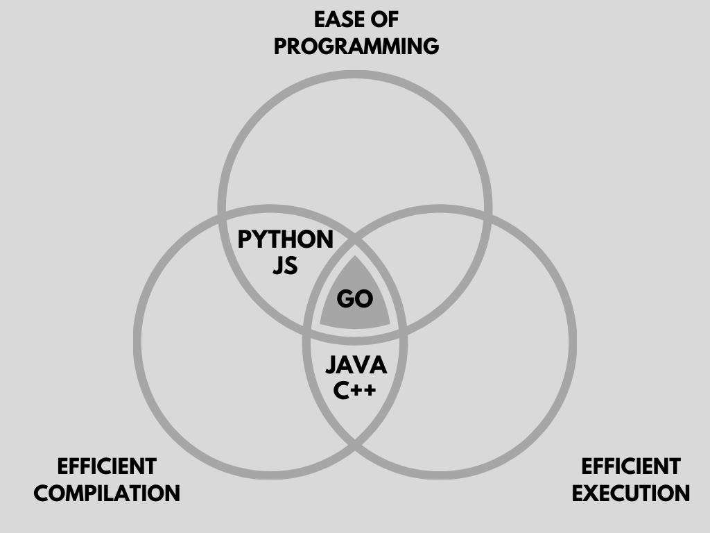

<br>
<strong>Key Takeaways</strong><br>
&#8226; Understand the drivers for the invention of Go programming language.<br>
&#8226; Review the popular use-cases for choosing Go in a project.<br>
&#8226; Review the syntax and configuration for Go to begin building applications.<br>

<br>
<h4>Introduction</h4>
<p>
Go (often referred to as 'Golang') was created by 3 engineers who worked together at Google during 2009: Ken Thompson, Rob Pike and Robert Griesemer. 
Go has since been developed into an open source programming language that is used upon many major platforms including Docker, Kubernetes and Terraform. But why is Go used in these cases?
</p>
<p>
Go came about as a programming language to tackle some of the persistent issues of slow compilation and slow application builds faced by the developers of large, distributed servers at Google. 
As a result, Go was designed to be the only programming language to serve all 3 sought-after capabilities:<br>
&#8226; Efficient compilation.<br>
&#8226; Efficient execution.<br>
&#8226; Ease of programming.<br>
</p>
<p>
Languages such as Java and C++ provide efficient compilation and execution, languages such as JavaScript and Python are able to provide ease of programming with efficient compilation, however before Go, there had
not been a language to offer the tri-standard.<br>



</p>
<p>
Go is a statically typed, compiled and lightweight programming language. Go achieves rapid compilation as well as other extensive behaviours to provide developer support with a shallow learning curve, backward compatibility and built-in support for features such as web services and testing.<br>
The extended features of Go can be categorised into 4 key areas:<br>
&#8226; Simplicity of implementation.<br>
&#8226; Concurrency support.<br>
&#8226; Out-of-the-box experience.<br>
&#8226; Cross-system performance.<br>
</p>

<br>
<h4>Simplicity of implementation</h4>
<p>
Go is able to pair rich features with an elegant approach to language design.
The framework for testing and profiling Go is provided for multiple types of testing by default. 
Unit tests can be written in parallel with the code; Go also provides in-built tools to understand test coverage and code documentation. 
</p>
<p>
Go is a multi-paradigm programming language using OOP and procedural code. Go supports the use of types and methods similar to OOP, however it does not use a class hierarchy. Go uses imperative features such as statements and loops to change the state of an Object as well as concurrency for multi-core processing.
</p>
<p>
The simplicity of Go syntax and minimal nature of its keywords means generics are not supported beyond the built-in data structures of slices and maps. If Go were to add support for custom generics, it will counter the simplicity and clarity objectives while driving up the compile time. 
</p>
<p>
The Go language updates are designed to provide further support for applications that are written in prior versions of the language through backward compatibility. The support for backward compatibility provides confidence to the developers to upgrade with the latest features of Go without risking the functionality of their applications. Other than the exception for security patches and bug-fixes, Go will continue to be completely backward-compatible. 
</p>

<br>
<h4>Concurrency</h4>
<p>
Go was developed during a modern period of computer hardware where the presence of multiple cores to a system were standard by design. Go places the management of multiple cores within its design 
where other languages may fault around the challenges of maintaining database connections and managing caches. Go achieves its capacity for concurrency through the use of <i>goroutines</i>, a lightweight
alternative to individual threads that consequently support a huge scaling capacity of a Go application.
</p>
<p>
Go features its own network awareness where threads can be executed in a thread-safe manner. 
Goroutines are able to safely communicate with each other through channels using the Go schedular to assign threads to tasks. Go uses <i>channels</i> to act as a conduit for goroutines to communicate with each other. Channels prevent the potential for race conditions when multiple goroutines access shared memory. Creating a goroutine can be implemented by adding the keyword <code>go</code> before calling a method (line 8 below):
</p>

```go{numberLines:true}
func concatenate(string a, string b) (string){
    return a + b
}

func main(){
    concatenate("hello", "world")

    go concatenate("hello world", "goroutine")
}
```

<p>
In the below example, the <code><-</code> syntax is used to assign and use a value that is passed to a channel:

```go{numberLines:true}
    names := make(chan string)

    go func() {
        name <- "John Adams"
    }()

    name :=  <-names

   fmt.Printf("The name we got is: %s", name)

```
</p>
<p>
The in-built features for handling multi-thread communication and the <code>go</code> keyword for the creation of goroutines make concurrency easily accessible to the developer. The creation of goroutines has also made concurrency more widely possible without the usual limitation of threads as experienced with Java.
</p>

<br>
<h4>Out of the box experience</h4>
<p>
Unlike other programming languages, Go does not require extensive libraries and applications to be pulled in to perform the most basic of application designs and uses. The standard library may not be as extensive as other languages, however it focusses on a few core features. Go has been supported by third parties who have built standard libraries to provide support for core components including:<br>
&#8226; String manipulation within the application.<br>
&#8226; Data exportation to create external archives.<br>
&#8226; Web APIs for creating and consuming web services such as the 'net/http' package.<br>
&#8226; File handling and operations.<br>
&#8226; Testing APIs, a comprehensive in-built test suite.<br>
</p>

<p>
The Go CLI provides the developer with ample support across the creation of application builds, artifacts and documentation for their source code. From the command line, the developer can execute the following commands to utilise the complete CLI support from Go:
</p>
<p>
&#8226; <code>go build</code> to compile and package a Go application with its dependencies. The resulting executable is named after the first source file.<br>
&#8226; <code>go generate</code> to generate Go files by processing source.<br>
&#8226; <code>go get</code> to add dependencies to the current module and to install them.<br>
&#8226; <code>go test</code> to automate the testing of packages and to print the result to the command line.<br>
&#8226; <code>go doc</code> prints the package documentation.<br>

The application profile also performs analysis upon the application consumption of CPU, network, goroutines and requirements. 
</p>


<br>
<h4>Cross-system performance</h4>
<p>
Go contains its own runtime library and is deployed as a single executable binary file. Go eliminates the potential for version or dependency mis-match. The performance advantage of Go is realised from the executable binary file that does not rely on a virtual machine to abstract its execution. Without the VM, Go does not have a write-once-run-everywhere ability like the JVM, however Go builds can be adapted for different operating systems from a single parameter instruction within the build:<br>
For Windows

```
GOOS=windows go build main.go
```

For MAC OS

```
GOOS=darwin go build main.go
```

The architecture for the platform can also be defined with the <code>GOARCH</code> property.
</p>
<p>
The benefits of Go as a compiled language can be realised from enhanced execution time where the operating system does not need to interpret the code at runtime. This advantage is also realised from other languages such as C++ over Java where Java uses an interpreter as well as the compiler used by C++. 
</p>
<p>
A final element of Go's multi-dimensional features are its garbage collection feature for heap memory management. This example demonstrates how Go combines the benefits of garbage collection from Java with the compile performance of C++ and an enhanced ease for programming. 
</p>

<br>
<h4>Use cases for Go</h4>
<p>
As previously mentioned, Go provides a unison between some of the most popular languages, taking their best features and combining them into a lightweight language.
The features of Go may make it seem appealing for all use-cases, however its standard library may limit its potential. Despite this, there are a few use-cases that really do emphasise 
the benefits to choosing Go as the language for development to tackle the challenges of compilation, concurrency and simplicity that it addresses.
</p>
<p>
The primary use cases for Go extend to web services, stand-alone tools and DevOps which lend themselves to the support, scaling and performance attributes of Go. 
</p>
<p>
<strong>Distributed services</strong><br>
Distributed services require a vast capacity for concurrency to support communication and data transfer. Go supports distributed services and networks through goroutines and channels. The message delivery and network awareness features of Go and its 'http' package provide extensive support for distributed systems. As a result, Go is a popular language for the creation of APIs and web servers. As a cross-platform language with extensive network features, Go is also popular amongst cloud-native applications.
</p>
<p>
<strong>Stand-alone tools</strong><br>
The single binary output of a Go application make them highly suitable as a utility program. The Go application can quickly launch and perform a service to make them optimal for single-service applications.
</p>
<p>
<strong>DevOps and SRE</strong><br>
Go's 'build once and promote everywhere' principle makes it a valuable language when used for building CICD pipelines and enhancing web scalability and durability. Go-based API builds can also be used for communicating with middleware to take advantage of the networking capability of Go and making them powerful within a CICD process. 
</p>

<br>
<h4>Configuring a Go project</h4>
<p>
Before we create a new Go Project, we must navigate to the Go src workspace from where packages and classes are defined. First navigate to the Go directory on your machine. You will find 3 sub directories: pkg, src, and bin. The src folder may not preexist and must therefore be created.
</p>
<p>
Go workspaces (folders) can be created within the src folder for each project. While it is possible to create a Go workspace at any other directory in your machine, we will later review the benefits of using the Go src workspace directory as we understand how utility packages and class references are made with Go.
</p>

<br>
<h4>Utility packages in Go</h4>
<p>
Utility packages in Go are similar to creating classes in Java that are later referenced or used as a service by another class. In Go, we can achieve a similar behaviour of different classes that can be referenced from different workspaces.
</p>
<p>
Packages can contain types, variables and functions that we want to use from other Go packages. 
Utility packages in Go allow us to separate responsibilities of classes and to create layers to the application. You could think of the layers being similar to a repository-service-controller layer for a web service. Before we can use a utility package, we must first create the class in the Go workspace and install it into the 'pkg' folder of Go using the CLI. 
The below example demonstrates how a <code>main.go</code> file can access the <code>car.go</code> class as a service:

```go
package main

import "demo/car"

func main(){

    car.MakeSound()
}

```

```go
package car

import "fmt"

func MakeSound(){
    fmt.Print("vroom")
}
```
</p>
<p>
The current main class will show a compile error:

```
failed to import utility package "demo/car"
```
We can resolve this problem by installing the car package into the 'pkg' directory on the Go path. 
The below command will change into the car directory, then install the car package into the 'pkg' folder where it can be referenced.
```
cd car
go install
```
</p>
<p>
The compile error on the main class will no longer appear, and a new folder 'demo/car' will appear within the pkg folder with a <code>car.a</code> file. The package can then be used as a service 
for other Go applications. 
</p>

<br>
<h4>Go syntax</h4>
<p>
Go is designed with ease of programming as an objective. Amongst the garbage collector for memory management, Go achieves ease through omission of generics, use of types and the use of complete units to express a statement.
</p>
<p>
I have found learning the Go syntax easiest when using a reference point of Java. The reflection in Java will then allow me to understand and explain the difference in syntax design.
The Go syntax was built with a mantra of 'do more with less' to enable an expansive number of actions with a lightweight design. From my initial understanding of Go, I have found the most evident key differences:<br>
&#8226; Method names start capitalised (inherited from C#)<br>
&#8226; Functions are defined with <code>func()</code>. The function return type comes after the name.<br>
&#8226; Go does not handle explicit exceptions, only error values which are returned from a method call.<br>
&#8226; Object instances are passed by reference using an ampersand and asterisk syntax. 
</p>
<p>
<strong>Creating functions</strong><br>
Functions in Go are marked with the keyword 'func' at the start followed by a name, expected parameters and return type. 
Unlike Java, Go functions can return more than 1 value, in-fact it is very common for Go methods to return an error as well as a returned value. This is similar to throwing an exception in Java. 
</p>
<p>
An example of a simple function in Go can appear below:

```go
func concatenate(string a, string b) (string){
    return a + b
}
```
The equivalent in Java would be:

```java{numberLines:true}
public String concatenate(String a, String b){
    return a + b;
}

```
</p>
<p>
Some methods will return an error and a response thus causing two outcomes to be handled by the code.
In Java, this is similar to having a try-catch block for a method call, instead with Go, we will express the return as two arguments. 
The below example demonstrates the <code>Marshal</code> method which will return JSON for a person along with an error from the method call:

```go{numberLines:true}
json, err := json.Marshal(person)
if err != nil{
    w.WriteHeader(http.StatusInternalServerError)
    return
}
```
Lines 2 to 5 in the above Go code snippet is a common pattern for handling errors. The error <code>err</code> is checked to be nil before returning a http response (or otherwise returning an error message). 
The Go function is the equivalent to a try-catch block as below:

```java{numberLines:true}
try{
    convertToJson(person);
}
catch(Exception e){
    System.out.println(e.getMessage())
}
```
</p>

<p>
<strong>Naming conventions</strong><br>
Go uses camelCase naming convention for identifiers. The first letter will also determine the visibility of the Object to other packages and classes.<br>
The name provided to Objects, such as 'person', 'Animal' etc, are accessible within and outside their package depending on its naming convention. A capital letter at the start of the name (Animal) will allow the class to be accessed outside of its package. Otherwise a lowercase letter (person) will not be accessible outside its package. 
</p>
<p>
<strong>Passing values</strong><br>
Go uses pass-by-value within the source code. This means when a parameter is passed between functions, it will always create a copy of the value and pass it onwards.
Go however defines two different types of parameters to be passed: the value or a reference.
As Java uses pass by value, where a copy of the Object reference is passed between the methods, the address of the Object is accessed by the calling method:

```java
Person alice = new Person("Alice");
changeName(alice, "Bob");
System.out.println(alice.getName());
```
prints:
```
Bob
```
The reference of alice is passed into the changeName method that updates the name to "Bob" of the Object instance. 
</p>
<p>
In Go, trying to achieve the same objective would not update the instance itself:

```go
func main(){
    person := Person{"Alice"}
    changeName(person)
    fmt.Println(person)
}
func changeName(p Person){
    p.name = "Bob"
}
```
returns:
```
Alice
```

Instead, to pass the actual reference of the instance to the <code>changeName</code> method, we need to use an ampersand (&) to send the reference of the instance, and an asterisk (*) to receive an address of the instance:

```go
func main(){
    person := Person{"Alice"}
    changeName(&person)
    fmt.Println(person)
}
func changeName(p *Person){
    p.name = "Bob"
}
```
returns:
```
Bob
```
The syntax behind the ampersand and asterisk is useful to remember for addressing instances within the application.
</p>

<br>
<h4>Summary</h4>
<p>
Go is a young programming language that has been developed out of a drive to improve compile time and the ease of programming alongside the enhanced execution time offered by a compiled language. The lightweight design of Go along with its enhanced support for concurrency have made it a bespoke language for various use cases including networking and DevOps. In this blog I have looked at how Go came about, its key use-cases and the key syntax design of the language.
</p>
<p>
The most valuable features of Go exist from its lightweight design and niche use cases. The Go standard library is designed to offer comprehensive support to networking and concurrency that can make building modern and rapid-fast application performance much easier and simple out-of-the-box. This is an important consideration to make before considering Go for a project and the growth of a project with time. 
</p>
<p>
In my next blog, I will use Go to create a RESTful API service to crete and return JSON data to other services.
</p>
<br>
<small style="float: right;" >Picture: Beijing, China by <a target="_blank" href="https://unsplash.com/@hjiang">Hong Jiang</small></a><br>