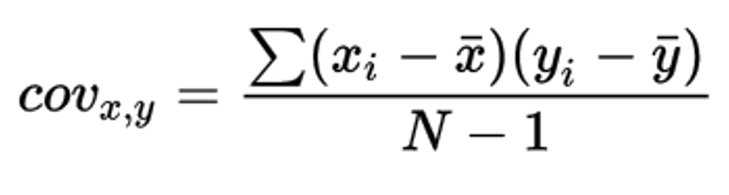
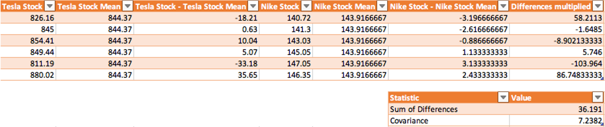
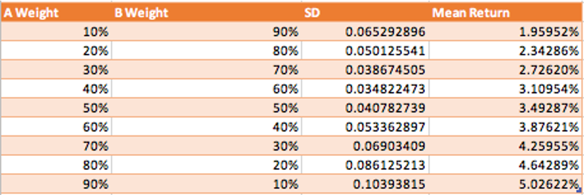

 
<strong>Key Takeaways</strong> 
&#8226; Understand modern portfolio theory and its reflection of investors expectation. 
&#8226; The . 
&#8226; Understand the benefits and differences between the key asset classes. 

 
<h4>Modern portfolio theory</h4>

Modern portfolio theory (MPT) was first introduced in 1952 by Harry Markowitz to describe how risk-averse investors can achieve optimal returns from their investments at a given level of accepted risk. Harry later received a Nobel prize for the work.

MPT involves a process of identifying how the assets within a portfolio of investments contribute to the funds overall risk profile and its return. Through MPT, we are able to understand how the asset risk and return directly vary with each other, and how an optimal mix of the assets can achieve the highest level of expected return for the fund at a given level of risk. 

As with any investment, it is inherent that a larger appetite for risk can yield larger returns for the investor. Despite this, a portfolio of investments may not always yield the same level of returns for the additional risk, thus the relationship is not always linear. 

In this blog, I will look at the some of the key statistics involved with MPT to understand what they tell us about an asset and portfolio, and what their criticisms are. I will also review how an optimal mix of assets can be found for a portfolio of assets. I will conclude the blog by reviewing the different types of assets that can be included within a portfolio and how MPT has since been adapted to provide a greater level of transparency to a portfolio.

 
<h4>What is asset and portfolio risk?</h4>

In MPT, risk is split into two types: systematic and unsystematic risk. Systematic risk, also known as undiversifiable risk, is implicit with the market; it includes risk that will always be present across the market as a whole (such as interest rate or inflation changes). Unsystematic risk, also known as diversifiable risk, is present with the nature of the asset and <strong>can</strong> be mitigated with other financial products. One example of an unsystematic risk may be the presence within the airline industry which subsequently caused the likes of Ryanair and EasyJet stock price to tumble during Covid-19.

MPT calculates risk of an asset from its <u>variance</u> which is later transformed into the <u>standard deviation</u>. The variance of an asset is defined as its average percentage deviation away from its mean value. In this blog I will use 2 different assets to calculate upon: Tesla Stock (TSLA) and Nike (NKE). I will construct the values based upon the past 6 days of their stock price, however in reality a much larger time frame will be used for more accurate and meaningful values.

The past 6 stock prices for TSLA are: 826.16, 845, 854.41, 849.44, 811.19, 880.02, creating a mean value of 844.37. The past 6 stock prices for NKE are: 140.72, 141.3, 143.03, 145.05, 147.05, 146.35, creating a mean value of 143.91.

The variance of these two assets is defined as their average deviation away from the mean. To calculate the variance, I will subtract the stock price away from their mean and square the remaining value. I will then take the average of the values to obtain the variance.

I have used Excel to calculate the values, you will also see the field 'SD' which stands for standard deviation. The variance of TSLA and NKE are 471.72 and 5.81 respectively. These values can become distorted as the difference between each stock price and the mean is squared. The standard deviation provides a normalised version of the variance with values of 21.72 and 2.41 respectively. 

The standard deviation tells us that the TSLA stock deviates from the mean on average by 21.72 cents, whereas the NKE stock deviates from the mean by 5.81 cents. The standard deviation in our case may not however be very fair given the small sample of data (6 points). 

 
<h4>Constructing risk in a portfolio</h4>

The risk profile of a portfolio is derived from the combined risk of the assets that it is made up from with respect to the weight that each asset has within the portfolio. We can construct the combined risk of two assets by understanding how their risk profiles are related.

<u>Covariance</u> is a statistical measure used to determine the <u>directional</u> relationship between two assets. Covariance does not capture the strength of a relationship between the assets, but just the direction of the movement. If two asset prices move up together, they will have a positive covariance value. Alternatively, if the assets move in different directions to each other, they will have a negative covariance.

The formula for covariance is below:

We describe cov(x,y) as the covariance between x and y. This is the sum of each point of x less its mean multiplied by each data point of y less its mean divided by the sample size less 1. 

The covariance of TSLA and NKE is calculated below:

The covariance value of 7.24 tells us that there is a slightly positive relationship to TSLA and NKE. As a result, the movement of one of the stocks would create an emphasised increase in the portfolio that consisted of both.

In our case, the combination of the assets do not work against each other, but for each other, this will ultimately increase the risk of the portfolio to greater than the level of the two assets on their own. On the contrary, if the two assets had a negative covariance, the portfolio would experience a lower risk profile. The portfolio would no longer be exposed to the individual risk profiles of the assets, but a reduced degree. A negative covariance would mean the portfolio value does not exclusively fall to the same amount that an individual asset would fall; the negative covariance in the other asset would offer a protection to some degree against the fall as it rises.

The combination of assets that have a negative covariance within the same portfolio is known as <u>diversification</u>. The portfolio becomes more diversified as it adds assets which have contradicting risk exposures, thus reducing the overall risk of the fund.

 
<h4>Using MPT to find the optimal mix of assets</h4>

So far we have taken a look at a few key statistics from the assets to understand their risk and return profile. In this section, we will look at how they can be combined to create a portfolio with a single risk and return value. The portfolio can be created in many different ways by combining the assets in different weights. For example, creating a portfolio with 10% of TSLA stock and 90% NKE stock. 

We can simulate many different portfolio combinations in Excel by changing the weights of the assets in the portfolio. The portfolio expected return value will be a sum of all the asset mean stock prices multiplied by the weight it represents in the portfolio.

The formula for finding the portfolio variance is slightly more complex: 

In the formula, the <i>w</i> represents the weight of the asset in the portfolio, and the <i>&sigma;</i> represents the standard deviation of the asset. 

We will then take the square root of the portfolio variance to leave the normalised variance, the portfolio standard deviation. 

The efficient frontier is mapped on a graph to show the expected return and risk of a portfolio. If we were to construct a portfolio of two assets: Stock A and Stock B, we can draw a graph of the different expected returns and risk of the portfolio as we adjust the percentage weightings that the portfolio holds in Stock A. 

The portfolio expected return is calculated by the sum of its assets expected return multiplied by their weighting in the portfolio.

If we assume Stock A returns 10% with a standard deviation of 5%, and Stock B returns 8% with a standard deviation of 3%, we can build a table of the portfolio expected risk and return:

If we take a 2 dimensional graph of risk and return, we can plot the portfolio' risk and return profile for different weightings of assets as we change them. If we add a few points:

If we add 10 more points:

And finally if we add 100 points:

What you will be able to see is a shape take place on the graph of different portfolio make-ups and a risk-return profile. This simulation of all the different portfolio 

When reducing the unsystematic risk from a portfolio, a manager may look at the various asset classes as a resort to achieving consistent and defining characteristics of a security to their portfolio. It is therefore important to understand how asset classes differ and the common properties they distinguish upon in regards to risk and return. One objective for achieving diversification is through an asset allocation fund. An asset allocation fund will seek diversification through a mix of asset classes. 

 
<h4>The Sharpe ratio</h4>

The Sharpe ratio, developed by William F Sharpe, is a metric used to compare the return of a security/portfolio when compared to the unsystematic risk that it bears. The formula for the Sharpe ratio is equal to the the return of the portfolio less the risk-free rate of return divided by the standard deviation of the portfolio's excess return. In the formula, the risk-free rate of return is the rate at which a return can be obtained without bearing a 'risk', for example the yield of a Treasury bond which has the lowest possible risk of an investment. 

The Sharpe ratio of an asset will inform the investor of the isolated risk-adjusted return the asset creates. By understanding the Sharpe ratio of different assets, a favourable weight can be placed on those with higher potential for return. 

As a portfolio includes more and more assets that are not correlated with each other, the Sharpe ratio of the portfolio will reduce as the overall risk of the portfolio reduces and the return potential increases. 

 
<h4>Achieving diversification with asset classes</h4>

Depending on where you look, you will find a varying number of asset classes, from 3 to 8. If we rewind 70 years, there were just three asset classes: equities, bonds/fixed income, and alternatives. 

The advent of new derivatives and exotic investment opportunities have introduced new types of asset classes including commodities, real estate, financial derivatives and most recently, cryptocurrencies. In this blog, I will reflect upon 5 asset classes: equities, bonds/fixed income, cash and cash equivalents, real estate and derivatives. 

 
<h4>Asset class: Equities</h4>

Equity, also known as stocks and shares represent a percentage ownership in a publicly listed company. Investors of equities benefit from a dividend received typically biannually, and through the resale of the equity at the price determined by the market.

Equities are often classed by their market capitalisation into small-cap, mid-cap and large-cap. 

 
<h4>Asset class: Bonds and fixed income</h4>

Bonds represent an issued loan from a company that is repaid over the life of the bond. The bond will have a maturity date, when the original investment is repaid to the investor, and a rate of interest that is paid to the investor at set intervals until maturity. 

Fixed income assets are investments in bonds that pay a fixed stream of income during their life before the maturity date when the principal is repaid to the investor. Bonds are often considered less risky than equity for several reasons: 
&#8226; Bond investments come with a promise to be repaid at maturity unlike equity. 
&#8226; The fixed interest repayment on the bond is guaranteed unlike a dividend payment on equity. 
&#8226; Bond owners have higher priority during liquidation given their promise of repayment. 

 
<h4>Asset class: Cash and cash equivalents</h4>

The benefit of cash and cash equivalents lies in their liquidity. They are readily available. Cash equivalents are also known as money market instruments that consist of low risk and short-term securities such as T-bills, certificates of deposit and commercial paper. 

 
<h4>Asset class: Real estate and tangible assets</h4>

Real estate and assets of a tangible nature offer a hedge against inflation as the asset value reflects the domestic inflation of the currency. 

 
<h4>Asset class: Commodities, FX and other derivatives</h4>

A commodity is an economic good that has a fungibility. The market will perceive the good as the equivalent on a global scale without concern to where it was produced.
Commodities are divided into two types: hard commodities that are mined such as oil and gold, and soft commodities that are harvested or livestock such as what, rice and cattle.

The foreign exchange (FX) market an over-the-counter (OTC) market where currencies are traded on a global scale.

Derivatives represent financial instruments whose value is derived from a particular asset. 

This final asset class encapsulates many different markets that 

 
<h4>Limitations of modern portfolio theory</h4>

While covariance is incredibly useful in understand the <u>directional</u> relationship between two assets, it does not inform us of the strength of that relationship. For example, do two assets equally rise and fall with each other or is the relationship less prevalent in their movement. <u>Correlation</u> takes covariance a step further by providing a scale of strength between the two assets of their relationship on a scale of -1 to 1. The most popular correlation is known as the Pearson correlation coefficient, however we are falling off track now..

 
<h4>Post-modern portfolio theory</h4>

 
<h4>Summary</h4>

In this blog, we have looked at modern portfolio theory to understand how the risk and return of a portfolio of assets might not always be optimised by the weightings they are selected by together. Amongst MPT, we have also looked at how assets will have their own variance and covariance with other securities. These degrees of volatility help us to understand how different assets perform in the market against and with each other.

Given MPT was invented 70 years ago, it has received criticism for its use of only variance to generalise the risk of the asset. 

 
<small style="float: right;" >Picture: Paris, France by <a target="_blank" href="https://unsplash.com/@alexandrelallemand">Alexandre Lallemand</small></a> 