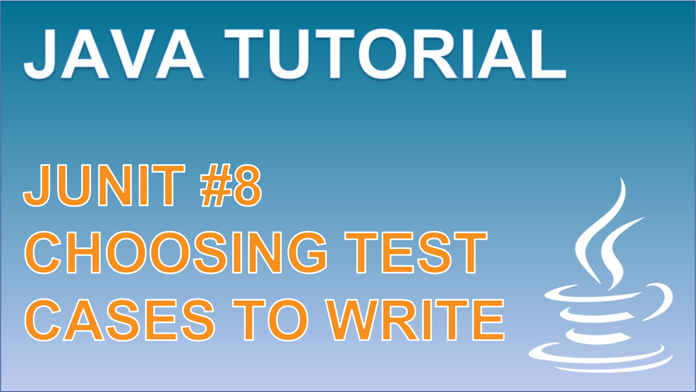

 
<h4>Choosing tests to write for a method</h4>

Learn about the different types of data values we might want to consider when testing our methods for the different type of contexts that they may be used in. 
Following this video, you will understand the differences between expected, boundary and strange values that can support enhance the test cases you write. 

