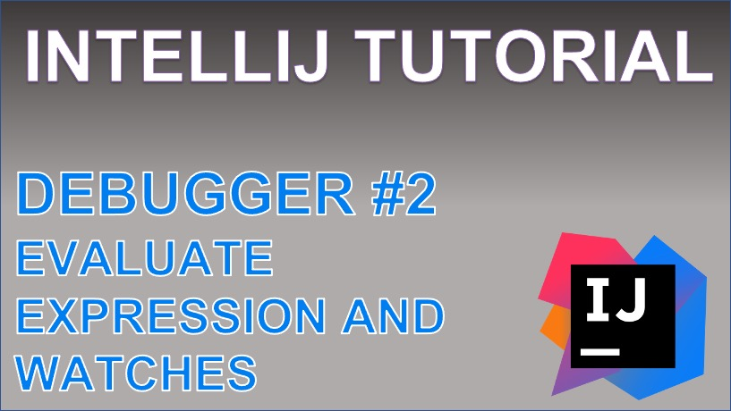

 
<h4>Evaluate expression and Watches with IntelliJ</h4>

Learn how the evaluate expression and watches tools within IntelliJ can assist with debugging an application. 
The evaluate expression will allow you to perform operations on an Object that is locally stored. For example, you can stream a List, get a value from a Map, or perform mathematical calculations on a value. 
 
The Watches tool will allow you to perform an operation on an Object, and to monitor that same operation as the debugger runs frame by frame.

