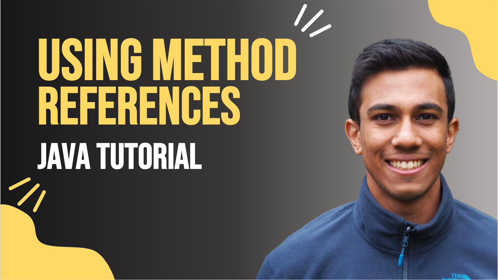

 
<h4>Method References in Java 8</h4>

Learn how, and when you can use method references to improve the readability of your Lambda functions. 
Introduced with Java 8, method references can be used to replace lambda expressions that point to a class method, an instance method, and a class constructor. 
By understanding how and when method references can be used, you will reduce the boilerplate code written for your lambda expressions. 

