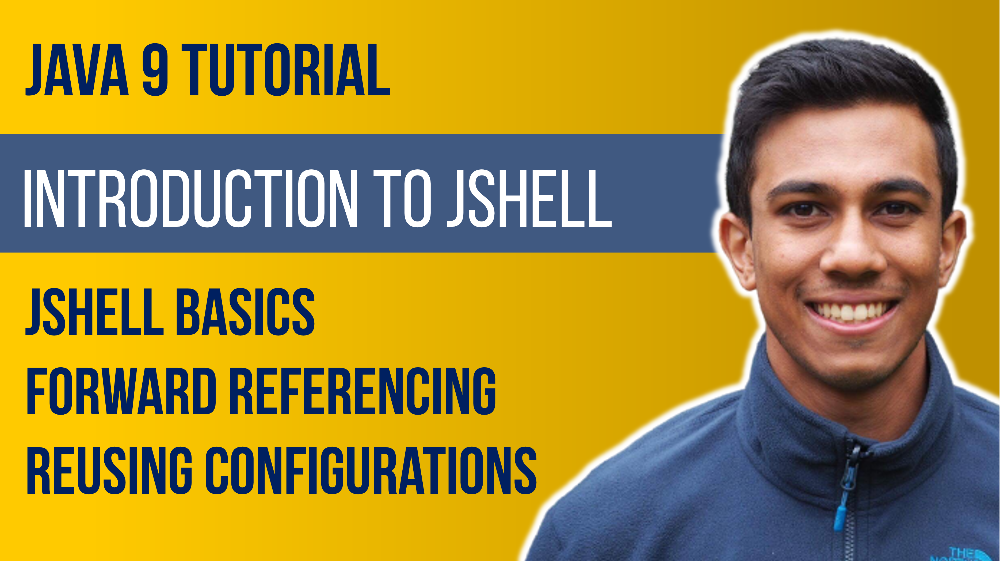

 
<h4>How to use JShell - Java 9 Tutorial</h4>

JShell provides a REPL (Read, evaluate, print - loop) service for Java engineers to test their logic in a convenient way through a terminal. This video will look at how we can define different variables, methods and classes within JShell, how we can save our sessions and load external classes, and some of the most useful keywords from JShell.

