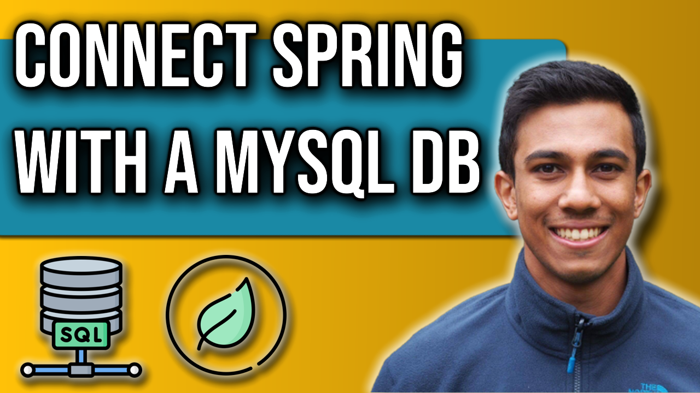

 
<h4>Create a MySQL Database Connection and table</h4>

This video will look at how we can connect our Spring Boot Application with a MySQL Database.
We will use the Spring data-jpa package to leverage a connection and to provide out-of-the-box 
methods and functionality to our controller. 
At the end of this video, we will have created 2 REST endpoints that obtain data from our MySQL database, 
and present them to the user as a JSON response.

Link to source code: https://github.com/4neesh/YouTube-Channel/tree/main/Store

