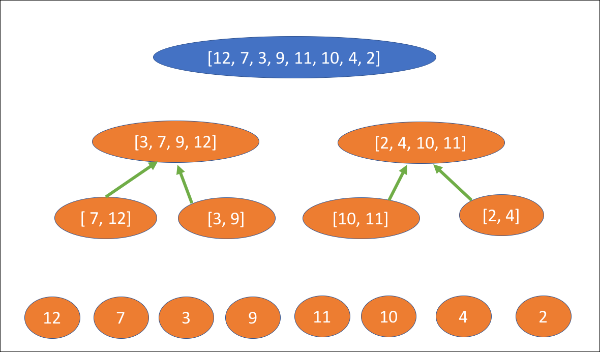

 
<strong>Key Takeaways</strong> 
&#8226; . 
&#8226;  
&#8226;  

 
<h4>Assessing assets and portfolios with the Sharpe ratio</h4>

The Sharpe ratio, developed by William F Sharpe, is a metric used to compare the return of a security/portfolio when compared to the unsystematic risk that it bears. The formula for the Sharpe ratio is equal to the the return of the portfolio less the risk-free rate of return divided by the standard deviation of the portfolio's excess return. In the formula, the risk-free rate of return is the rate at which a return can be obtained without bearing a 'risk', for example the yield of a Treasury bond which has the lowest possible risk of an investment. 

The Sharpe ratio of an asset will inform the investor of the isolated risk-adjusted return the asset creates. By understanding the Sharpe ratio of different assets, a favourable weight can be placed on those with higher potential for return. 

As a portfolio includes more and more assets that are not correlated with each other, the Sharpe ratio of the portfolio will reduce as the overall risk of the portfolio reduces and the return potential increases. 

The Sharpe ratio may seem like a useful metric to understand the risk-return profile of a portfolio, however the number may be misrepresentational as it does not capture the risk of liquidity or default risk. Extreme returns and risk values may be omitted from the calculation provided the likelihood of them. And Sharpe does also not account for derivatives within the portfolio. 

 
<h4>The risk free rate of return</h4>

10 year gilt or 10 year treasury bond. 

 
<h4>Capital Market Line</h4>

 
<h4>Conclusion</h4>

 
<small style="float: right;" >Picture: xxx, xxx by <a target="_blank" href="http">xxx</small></a> 