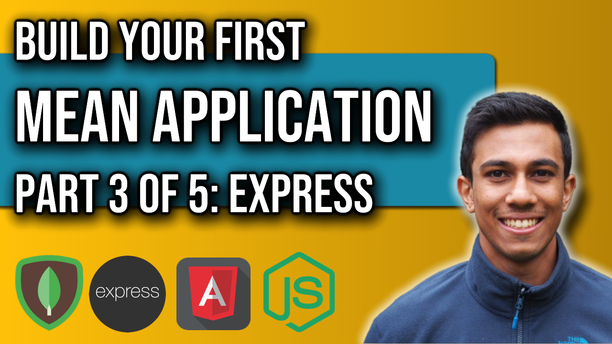

 
<h4>MEAN Application: Part 3</h4>

Part 3 of our MEAN application series will incorporate Express.js into our application.
Express will allow us to add valuable middleware into our backend service to register different
endpoints for our backend service to provide unique data responses to.
We will begin to connect our Angular static webpages to the backend by registering URI's with express
and by formatting and returning data. In Angular, we will use the http package to make back-end calls to the node server to retrieve the data. 
We also dive into CORS policy and what it means to our application.

Link to source code: 
https://github.com/4neesh/MyDiary

🕒 Timestamps 🕒

00:00 - Introduction
00:22 - Getting started with Express
04:08 - Using next()
05:03 - Registering URI's
05:50 - Migrating Data from Angular to Express
07:48 - Angular HTTP requests

