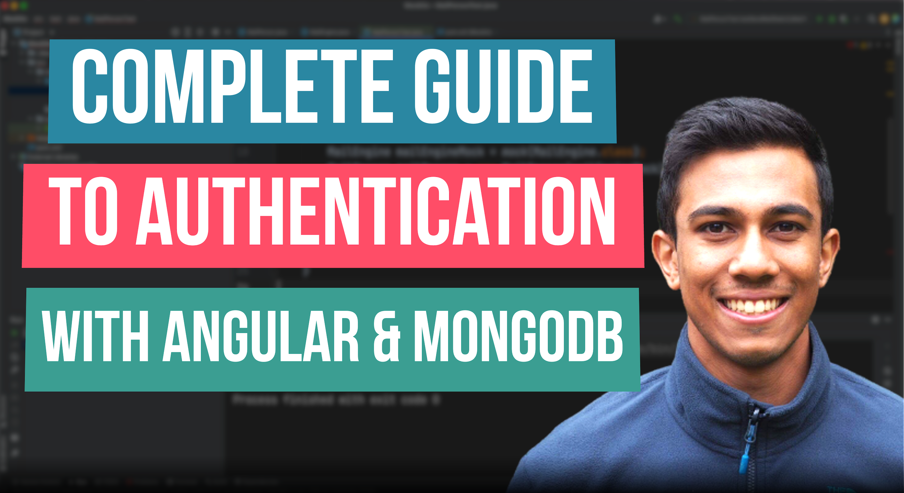

 
<h4>Angular authentication with MongoDB</h4>

This video is a complete tutorial on Angular Authentication with MongoDB. 
In the video, we will cover how you can set up an authentication table with MongoDB, and how to connect
the application to allow sign-up, login, logout and automated authentication. 

Link to source code: https://github.com/4neesh/YouTube-Channel/tree/main/mongodb-auth-complete

🕒 Timestamps 🕒

00:00 - Introduction
00:46 - Generate View Components
06:43 - Storing users with MongoDB
10:06 - Hashing user password
12:12 - MongoDB and Angular connection
12:51 - Create the Login endpoint
28:30 - Storing the web token
29:53 - Enriching HTTP requests
34:52 - Token Verification
36:58 - UI Enhancements for actions
41:09 - Removing edit and delete buttons
44:05 - User redirection
44:46 - Route Guarding
48:39 - Logging out
52:02 - Timed Logout 
54:22 - Automated Login 

