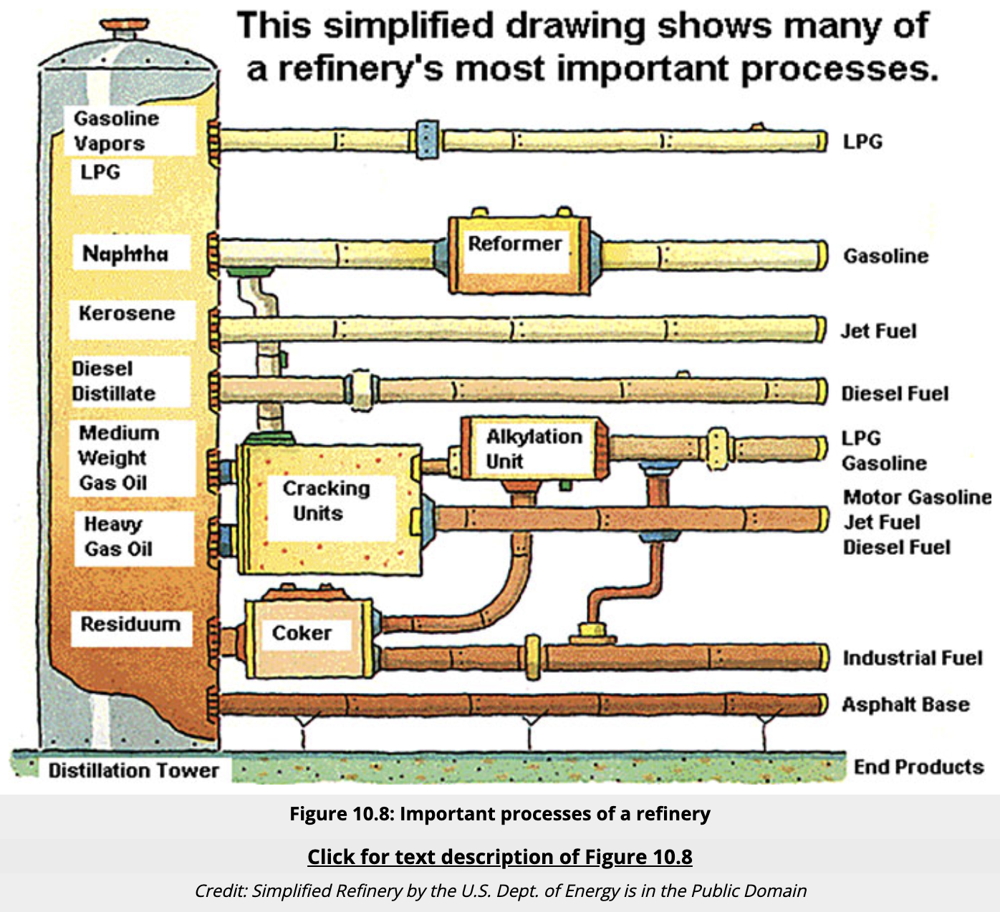
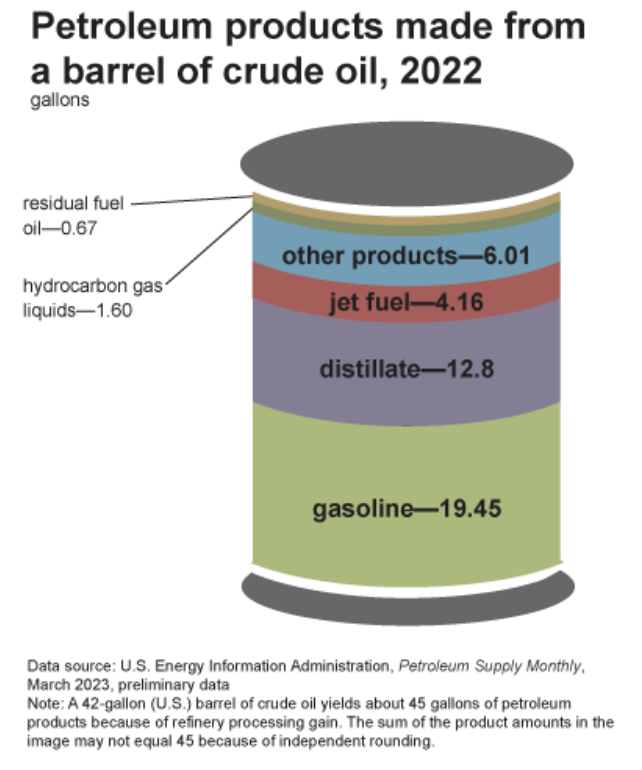

 
<strong>Key Takeaways</strong> 
&#8226; An introduction to the complex commodity of Petrochemicals. 
&#8226; Understand how refineries operate and have changed over the past 5 years. 
&#8226; Explore the strategies refineries will adopt to meet changing demand of petrochemicals. 

Pretty much everything around us is made from petrochemicals. If it isn't made from rocks, plants, animals, or metal, it is likely to be made from petrochemicals. In this blog, I am going to take a look at how the petrochemical industry is undergoing a major change in the transformation of crude oil and natural gas into petrochemical derivatives. Before I look into petrochemicals in a little details, I will briefly cover their chemical make-up.

 
<h4>A chemical introduction</h4>

Petrochemicals are based around the carbon atom, in different forms. Carbon contains 4 electrons in it's outer shell enabling it to form bonds with other elements such as other carbon atoms and hydrogen. A group of 2 or more atoms form a molecule. When carbon connects to itself, and you add in hydrogens, you form a molecule known as a hydrocarbon. 

Within this blog, I will mention a few common hydrocarbons that are methane, ethane, propane and butane. Hydrocarbons can differ by the number of carbon and hydrogen atoms that form them, for example Methane has one hydrogen atom and 4 carbon atoms, whereas Ethane has 2 carbon atoms and 6 hydrogen atoms. 

 
<h4>Where to find Hydrocarbons</h4>

Hydrocarbons are mostly found deep underground as crude oil and natural gas. Crude oil and natural gas are formed from the forces of temperature and weight upon plants and animal fossils over thousands of years, thus giving them the name 'fossil fuels'. The gaseous form mostly consists of methane, however the liquid form can consist of a mixture of ethane, propane and butane.

Hydrocarbons are obtained using techniques such as horizontal drilling, hydraulic fracturing (a.k.a fracking) and seismic imaging. These are highly technical processes for extraction. 

 
<h4>Crude Oil Distillation</h4>

We use the term 'petrochemicals' to describe the synthetic compounds that are derived from the hydrocarbons of crude oil and natural gas. 
Unlike the energy market that I work within, petrochemicals come in many different forms. These derivatives can be broadly split into the categories of olefins and aromatics. 

The process of converting fossil fuels into petrochemicals takes place at a refinery.

The first process of refinement is known as fractional distillation, it forms the heart of the refinery. 
Crude oil itself is made up of different hydrocarbon compounds with differing lengths of carbon chains, thus altering many properties including their boiling point. Hydrocarbons with longer carbon chains have a higher degree of viscosity. This viscosity means the forces of attraction between the molecules are greater, and thus require a higher degree of force to separate.

Distillation involves pumping crude oil (or is this refined petroleum) through hot pipes in furnaces to separate the hydrocarbon molecules in a distillation tower. When heated, the crude oil is transformed into vapour. The vapour is passed into a fractional column, think of this unit as a large tall cylinder. The cylinder will be cooler at the top than the bottom, thus causing the vapour to cool and transform into liquid in a process known as condensation. Hydrocarbon chains with lower boiling points will rise higher in the tower and therefore are captured in trays at the top of the tower. 
As the liquid cools, it is not all equal, but differs in their weight. Within the distillation unit, there will be stacks of trays to capture the liquids at different densities, thus leading to various fractions of the crude oil. This process separates crude oil into liquids such as gasoline, naphtha, kerosene, diesel and heavy oil. 

As groups of hydrocarbons with a similar chain length condense at the same temperature, they form what are known as hydrocarbon fractions. The main fractions from crude oil are refinery gasses, gasoline, kerosene, diesel, fuel oil and bitumen. 

Near the top of the tower will be lighter liquids such as gasoline, liquified petroleum gas (LPG) and Naphtha. LPG turns into propane, butane and other things. 

 
<h4>Using fractions to meet demand with supply</h4>

You may notice from the image above that many end products are repeated for different feedstock to the distillation tower. For example, jet fuel can be crated as an end product from heavy gas oil and keresene. The decision to transform these fractions into end products is driven by supply and demand. Refineries are strategic in how they transform between different feedstock. As you may notice, demand is heavily driven from the middle of the distillation tower, where diesel, jet fuel and gasolines are derived. 

This transformation can either involve taking heavier liquids and passing them through a cracker so they can become lighter. On the other end, lighter products such a naphtha can be reformed at a molecular level to become gasoline. 

The second process is known as cracking. A process called cracking is used upon heavy oil to convert it into more valuable products. Heavy oil will consist of longer strings of hydrocarbon molecules. A catalyst can be used to cut these chains to make them into lighter fluids.

Heavy oil can be converted into gasoline and jet fuels. 

A cracker can be used to convert Ethane into Ethylene. It will use high temperatures to 'crack' the bond between carbon atoms, and then force them to make two bonds with each other. Ethane enters the cracker through a pipeline, it is heated to break the bonds, transported via another pipeline where it can either be made into plastic, or other petrochemical derivatives. These derivatives are used as raw materials to create speciality materials. These materials can enhance plastic to make it stronger, more resilient or flexible. 

The third process involves treating. This is where impurities such as sulphur and nitrogen are removed, thus reducing the air pollution created when the fuels are used.
Treating is a process used to product cleaner gasoline. Gasoline molecules contain impurities such as sulpher that can be removed. When the molecules are heated and come into contact with a catalyst, a chemical reaction occurs that will dissolve sulpher away, which can be used for fertilisers and pharmaceuticals.  

Fourth is Reforming and blending. 
Reforming is a process that increases the amount of gasoline that is created from crude oil. One of the liquids that are separated in the distilling process is a liquid called Naphtha. The structure of naphtha differs from gasoline such that reforming it make it similar to gasoline molecule.

Blending different refinery products to make finished petroleum fuel. Gasoline is blended to create different octane grades, thus leading to different grades of gasoline at a pump, such as regular and premium. Different engine-types will require different gasoline grades.  

Through the process of cracking and reforming, refineries are generally equipped to optimise for gasoline production from crude oil, driven by the demand of the transportation sector and petroleum products to run vehicles. 
From a single 42-gallon barrel of crude oil, 45 gallons of petroleum products can be produced. The increased volume of production occurs due to a term called processing gain where th dense crude oil is transformed into a less dense product. Similar to corn kernels turning into popcorn. A single barrel will be converted into roughly 20 gallons gasoline, 13 gallons diesel distillate 4 gallons jet fuel, 6 gallons other products and 2 gallons hydrocarbon gas. 

The end-product from crude oil refinement is feedstock. Feedstock is defined as a raw material used to provide reactants for an industrial reaction. In-turn, these industrial reactions create petrochemicals - a substance made from crude oil using chemical reactions. Let's look at these reactions and petrochemicals that are produced. 

 
<h4>From petrochemicals to consumer products</h4>

With the diversity of products that can be created from crude oil, we can now begin to break down the products into different categories. First we have gasses that high the lowest boiling points. These are methane, ethane, propane, butane. Where steam cracking can convert ethane to ethene, propane to propene and butane into ethene or propene.
Second, we have naphtha which can use steam cracking to form ethene, propene, butenes. Naphtha can also be reformed to create branched alkanes and cyclohexane. Roughly 60 to 70% of the raw materials are naphtha. 

When receiving crude oil and natural gas, refineries will create different feedstocks following distillation. Crude oil can be refined to create Naphtha, natural gas can be processed to create feedstocks ethane, propane and methane, coal can be oxidised to create synthesis gas which can create methanol that can be converted into light olefins, and lastly plants, which can be fermented to create ethanol which can be converted into ethylene. 

Following the process of cracking, feedstocks are transformed into commodity chemicals such as olefins of Ethylene, Propylene, Butylene, and aromatics which are Benzene, Toluene, Xylene. These chemical commodities are considered the start of the value chain in petrochemicals. Both the feedstock and commodity chemicals are considered to be 'petrochemicals'. Downstream from this process are products which are considered 'petro-derivatives'. 

The second stage of a petro-derivative are known as an intermediate. This is a chemical product that is produced when a basic chemical is reacted with another chemical to crate a new product. For example, Ethylene can react with oxygen to create the intermediate Ethylene oxide. Ethylene oxide can be reacted with water to produce Glycol. 

The third stage of a petro-derivative are known as polymers. These are manufacturing products that are produced through the use of polymerisation upon the petro-derivative. For example, ethylene can be polymerised into polyethylene. This is usually an end-product before it is sold for someone to turn into a manufactured product. These are specialty or performance chemicals. Manufacturing products also include rubber, fibers, resins, adhesives. 

The final stage is the manufacturing of consumer goods where specialty chemicals are transformed into products such as clothing, healthcare products, pharmaceuticals, packaging, vehicle parts and more. 

When we consider crude oil, there are different ways that the refineries will compete to product different products. 
Natural gas will use gas processing and fractionation to create Ethane, Propane and Butane. These are then turned into Ethylene, Propylene and Butadiene (Olefins).
Using a Steam Cracker, the EPB can be converted into Benzene, Toluene, Xylenes (BTX) using a BTX Extraction. These are aromatics.
More than natural gas goes into the BTX Extraction, it also comes from Coal, which are obtained from steel mills and a coke oven, but more from Crude Oil which uses an oil refinery to create Naphtha. This will use a Roformate to be sent for BTX extraction or is sent to a gasoline pool. 

The magic behind hydrocarbons are a double bond which makes them highly reactive and allows them to attract other atoms. They can be combined into many combinations. Such as plastics, bricks, chemicals.

this is why they are called petrochemicals. They are formed from petroleum and natural gasses. 

Ethylene is used to help us keep food fresher for longer
Propylene is used for creating carbon fibers that are lighter and stronger than steel.
Butylene is used for healing punctured tyres.
Benzylene is used to transform video displays. 
Zylene makes hi-tec sports wear 
Tylene is essential for creating artifical bones using 3D printers. 

the building blocks of modern life. 
What are petrochemicals?

- We have aromatics that consist of Xylene and Bentene, and Olefins, that consist of Butadene, Propylene, Ethylene
- Crude oil is refined into Gas Oil and Naptha that leads to Aromatics and Olefins

 
<h4>The market for Petrochemicals</h4>

The process of converting these natural gasses and crude oil to petrochemicals is complex. 476.2 billion market value in 2020. 

APAC has dominated with half of the global market share. 

industry declined during Covid mostly driven by the travel sector.
Refineries are where the the crude oil is converted into other products. 
Fractions of distills are obtained such as diesel, waxes, heating oil, feedstock, lubricating oil, ashville. 

 
<h4>Changing demand for Petrochemicals</h4>

When hydrocarbons are burned, they release carbon dioxide leading to the contribution for climate change. 
The consumption of these petrochemicals isn't all that contributes to environmental damage. The process of crude oil and natural gas extraction has a huge impact on the environment to the surrounding areas and the release of pollutants. 

Alternatives to hydrocarbons
see: https://www.investopedia.com/terms/h/hydrocarbon.asp#:~:text=Understanding%20Hydrocarbons,-Hydrocarbons%20occur%20naturally&text=They%20are%20mostly%20found%20deep,trapped%20deep%20beneath%20the%20oceans.

 
<h4>Impact on refineries</h4>

- pressure for cleaner-burning fuelds from regulation and environmental awareness, such as high sulfer fuel oil is low in demand, meaning refineries look to new markets for HSFO
- plateau in fuel oil demand, expected by 2030 duue to EVs. Therefore refiners need to explore ways to maintain level of yield on crude oil
[add diagram of petchems growth]

Petchem accounts for 14% of oil and 8% of gas demand. the petchem segments is expected to grwo fdue to higher demand for plastics from developing countries. 
Yield of petchem feedstock depends on complxity of refining, this is a 17.2% atm but will be 40%

Refineries had previously been set-up to produce transportation fuels. COTC will change this to create high value chemical products.
At the moment 10% of the barrel can be used to produce chemical feedstock, thuus can be changed to 70-80%

 
<h4>Crude Oil To Chemicals</h4>

- expected to lead to major reconfiguration of crude oil refineries

McKinsey
gasoline is expected to experience the greatest fall in demand as it is used by light-duty passenger vehicles.
major oil derived petchems are ethane, ipg, naptha. these are used in production of polymers for plastics and synthetic fibers and more. Driven by demand from global wealth.
Refineries are facing challenges to reduce output of diesels, less gasoline and more jet fueld and petchem feedstock
Refiners around the world must plan now given time is takes to change and the capital expenditure expectation.
the approach to refineries to change can be in a different ways
1. fluid catalytic cracking. Converts vacuum gasoil into gasoline. FCC gasoline cracking naptha and aromatic materials that can be separated out also includes olefins
2. High severity FCC
- used to optimise propylene yield. Allows refiners to convert heavy oils into high value products for integrated processes
3. FCC to steam cracking
- maximise monomer output with catalyitc cracking. 
- expected to yield 70%. Petchems of ethylene, propylene, bezelene, toluene, xylene

New Refinery Configurations
- how refiners can change product yield by changing the mix and arrangement of refining process units
1. increaased hydrocracking. Hydrocracking compete with FCC for deestock. HC yield is more higher quality deiseld, jet fueld, LPG and naptha
This shift to HC will increase Naptha output
2. maximse aromatics reforming

Strategies
- steam cracking for ethylene, propylene, naptha, gas oil, ethance. This involves preconditioned crude oil fed into a steam cracker
- hydroo processing, deasphalting and steam cracking
hydrocracking technologieis

COTC currently planned in construction in china and the middle east. It is focussed on yield in light olefins or aromatics. Such as benzene, iolene and xylene. 

 
<h4>Conclusion</h4>

