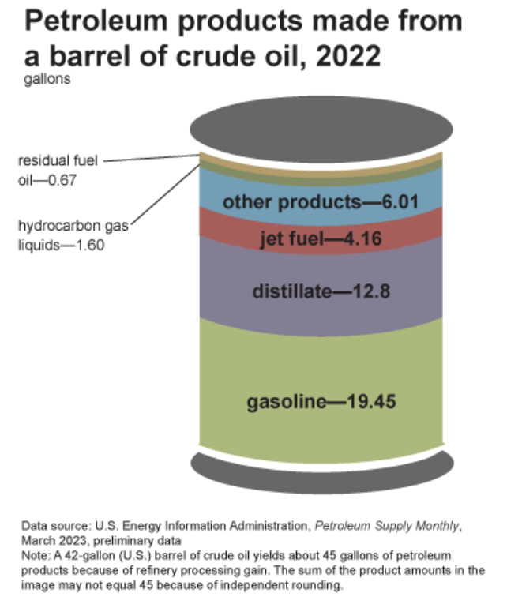

- need to refactor to talk more consistently about the purpose of the blog

 
<strong>Key Takeaways</strong> 
&#8226; An introduction to the complex commodity of Petrochemicals. 
&#8226; Understand how refineries operate and have changed over the past 5 years. 
&#8226; Explore the strategies refineries will adopt to meet changing demand of petrochemicals. 

Pretty much everything around us is made from petrochemicals. If it isn't made from rocks, plants, animals, or metal, it is likely to be made from petrochemicals. In this blog, I am going to discuss how the petrochemical industry is undergoing a major change in the transformation of crude oil and natural gas into petrochemical derivatives. Before I look into petrochemicals further, I will briefly cover their chemical make-up.

 
<h4>A chemical introduction</h4>

Petrochemicals are based around the carbon atom in different forms. Carbon contains 4 electrons in it's outer shell enabling it to form bonds with other elements such as other carbon atoms and hydrogen. When two atoms bond, they for a group of 2 or more, creating a molecule. When carbon connects to itself and other hydrogens, you form a molecule known as a hydrocarbon.

Within this blog, I will mention a few common hydrocarbons that are methane, ethane, propane and butane. Hydrocarbons can differ by the number of carbon and hydrogen atoms that form them, for example methane has one hydrogen atom and 4 carbon atoms, whereas ethane has 2 carbon atoms and 6 hydrogen atoms. 
 
The magic behind hydrocarbons is realised through a double bond which makes them highly reactive and allows them to attract other atoms. They can be combined into many combinations to form products such as plastics, bricks, chemicals.

 
<h4>Where to find Hydrocarbons</h4>

Hydrocarbons are mostly found deep underground in the form of crude oil and natural gas. Crude oil and natural gas are formed from the forces of temperature and weight upon plants and animal fossils over thousands of years, thus giving them the name 'fossil fuels'. The gaseous form mostly consists of methane, however crude oil can consist of a mixture of ethane, propane and butane.

Hydrocarbons are extracted from the Earth using techniques such as horizontal drilling, hydraulic fracturing (a.k.a fracking) and seismic imaging. These are highly technical processes for extraction that require expensive machinery and planning achieve.

 
<h4>Crude Oil Distillation</h4>

We use the term 'petrochemicals' to describe the synthetic compounds that are derived from the hydrocarbons of crude oil and natural gas. Petrochemicals themselves are diverse in properties and uses, and are thus broadly categorised as olefins and aromatics. The process of converting crude oil into 'fractions' is known as distillation.

Crude oil and natural gas are made up of different hydrocarbon compounds with differing lengths of carbon chains. Longer carbon chains have a higher degree of 'viscosity', a term used to describe the forces of attraction between the molecules. A higher viscosity requires a greater force to separate the molecules, this is achieved through distillation within a refinery, where crude oil is divided into different 'fractions'. 

Upon arriving at a refinery, crude oil is pumped (or is this refined petroleum) through hot pipes in furnaces to convert it into a vapour that is fed into a distillation tower. The distillation tower appears as a tall cylinder and is kept at a cooling temperature the higher up you go. As the crude vapour enters the tower, hydrocarbon chains with lower boiling points will rise higher in the tower as they are turned into vapour faster, while longer-chain hydrocarbons will remain lower in the tower until their boiling point is reached. The cool temperature within the tower will cool the vapour at different heights to transform into a liquid. The process of heating crude oil and cooling the vapour allows the molecules within crude oil to be captured as liquid within different stacks of trays of the distillation tower. The result from distillation are fractions of crude oil that can be grouped as: liquified petroleum gas (LPG), gasoline, naphtha, kerosene, diesel and heavy oil (or bitumen?). 

LPG is a unique fraction of crude oil as it's hydrocarbons are so short that they remain as a gas within the distillation tower. These hydrocarbons consist of propane and butane. 

 
<h4>Transforming fractions of Crude</h4>

You may notice from the image above that various fractions can be used to create the same feedstock within the refinery. For example, jet fuel can be derived from heavy gas oil as well as kerasene. The 'feedstock' products from various fractions of crude oil is achieved by transforming and processing fractions in processes known as reforming and cracking.  

Cracking is a process used upon long-chained heavy oil to convert it into a more valuable product. For example, heavy oil is passed into a container where a catalyst will cut the molecules into lighter fractions such as gasoline and jet fuels. 
The catalyst uses a high temperatures to 'crack' the bond between carbon atoms of the molecule, and force them to make two bonds with each other. A common conversion using a cracker includes ethane into ethylene.

The reverse process, where short-chain molecules are converted into longer-chain molecules, is achieved through a process called catalytic reforming. The process of reforming will pass the fraction over the catalyst at a high pressure to rearrange the molecular structure of the hydrocarbon, thus altering their properties and the fraction they belong to. A further process, known as isomerization is used to rearrange the atoms within the molecule and thus the structure of it to create a usable product.

Note that the hydrocarbon is not reduced in size during reforming, but is instead reshaped to change their properties. Catalytic reforming is often used upon low-quality gasoline to improve their combustion characteristics. One of the liquids that are separated in the distilling process is called naphtha. The structure of naphtha differs from gasoline such that reforming it make it similar to gasoline molecule. Naphtha can be converted with reforming to increase the octane number of it's structure to create different grades of gasoline. You will likely have come across these grades of gasoline at a petrol station where you can choose between 'regular' and 'premium' petrol.

Once the fractions have been processed, they will be 'treated' as a means to remove impurities such as nitrogen and sulphur. Treatment involves heating the molecules and using a catalyst to dissolve sulphur. Treatment improve the chemical as they will reduce the air pollution created once used, the extracted sulphur can then be used in fertilisers and pharmaceuticals. 

Through the process of cracking and reforming, refineries are generally equipped to optimise for gasoline production from crude oil, driven by the demand of the transportation sector and petroleum products to run vehicles. 
From a single 42-gallon barrel of crude oil, 45 gallons of petroleum products can be produced. The increased volume of production occurs due to a term called 'processing gain' where th dense crude oil is transformed into a less dense product. Similar to corn kernels turning into popcorn. A single barrel will be converted into roughly 20 gallons gasoline, 13 gallons diesel distillate, 4 gallons jet fuel, 6 gallons of other products and 2 gallons hydrocarbon gas.  

 
<h4>From petrochemicals to consumer products</h4>

Following distillation, a refinery will continue to develop crude fractions into basic chemicals and polymers that transform their value in the chain to be passed onto manufacturers for product development. 
Broadly speaking, crude fractions can be divided into two categories: fuels and light hydrocarbons. Fuels make-up the majority of crude products as it is treated to created diesels, petrols and jet-fuels. Light hydrocarbons include natural gasses and naphtha that are converted into basic chemicals and petrochemicals. 

I have briefly covered the creation of different fuels in the section on reforming; the process is fairly simple as the fuel product does not require extensive processing and transformation to prepare it for consumption. Natural gasses and Naphtha, on the other hand, are processed to a much greater degree in a refinery. 

Natural gasses are separated into ethane, propane and butanes. You may be familiar with propane and butane as they are used power your barbecue and fuel your lighter respectively. Amongst the three gasses, ethane is most valuable in the chain as it's simple structure enables it to be easily transformed into plastics. Despite ethane's popularity, all three are used as a feedstock to create petrochemicals. 

The separate natural gasses have the potential to be transformed into a dynamic array of plastics with varying properties and uses. Before the gasses are transformed into plastics, they are converted into further polymers.

Ethane is first transformed into Ethylene using a process of cracking. Propane and butane also use a process of cracking to form propylene and butylenes. The difference between ethane, propane and butane with their former products lies in a double bond that is formed following cracking. These three chemicals are known as olefins. 

Ethane, propane and butane can also be converted into the chemicals of benzene, toluene and xylene using a steam cracker. These three, often categorised as BTX, are known as aromatics. 

All 6 chemicals can be transformed into plastics of various properties such as helmets, car parts, clothing, medical devices and even wind turbines. 

Just below the natural gasses in the distillation tower, with a slightly higher boiling poin, is Naphtha. Naphtha can be converted into the basic chemicals of ethene, propene and butenes. Naphtha can also be reformed to create branched alkanes and cyclohexane. 

??Roughly 60 to 70% of the raw crude oil is naphtha.??

Downstream processes from these basic chemicals are used to transform them into products considered 'petro-derivatives'.  
The second stage of a petro-derivative are known as an intermediate, derived from the chemical reaction of two feedstocks. For example, Ethylene can react with oxygen to create the intermediate Ethylene oxide. Ethylene oxide can be reacted with water to produce Glycol. 

what is polymerisation??
why is the double bond important from ethane to ethylene steam cracking??

The third stage of a petro-derivative are known as polymers. Polymers are manufacturing products that are created through the use of polymerisation upon the petro-derivative. For example, ethylene can be polymerised into polyethylene. This is usually an end-product before it is sold to be turned into a manufactured product. Common manufactured products from petrochemicals include rubber, fibers, resins and adhesives. 

The final stage is the manufacturing of consumer goods where the polymers are transformed into products such as clothing, healthcare products, pharmaceuticals, packaging, vehicle parts and more. 

 
<h4>The market for Petrochemicals</h4>

The process of converting these natural gasses and crude oil to petrochemicals is complex. 476.2 billion market value in 2020. 

APAC has dominated with half of the global market share. 

industry declined during Covid mostly driven by the travel sector.
Refineries are where the the crude oil is converted into other products. 
Fractions of distills are obtained such as diesel, waxes, heating oil, feedstock, lubricating oil, ashville.

 
<h4>Changing demand for Petrochemicals</h4>

When hydrocarbons are burned, they release carbon dioxide leading to the contribution for climate change. 
The consumption of these petrochemicals isn't all that contributes to environmental damage. The process of crude oil and natural gas extraction has a huge impact on the environment to the surrounding areas and the release of pollutants. 

Alternatives to hydrocarbons
see: https://www.investopedia.com/terms/h/hydrocarbon.asp#:~:text=Understanding%20Hydrocarbons,-Hydrocarbons%20occur%20naturally&text=They%20are%20mostly%20found%20deep,trapped%20deep%20beneath%20the%20oceans.

 
<h4>Impact on refineries</h4>

- pressure for cleaner-burning fuelds from regulation and environmental awareness, such as high sulfer fuel oil is low in demand, meaning refineries look to new markets for HSFO
- plateau in fuel oil demand, expected by 2030 duue to EVs. Therefore refiners need to explore ways to maintain level of yield on crude oil
[add diagram of petchems growth]

Petchem accounts for 14% of oil and 8% of gas demand. the petchem segments is expected to grwo fdue to higher demand for plastics from developing countries. 
Yield of petchem feedstock depends on complxity of refining, this is a 17.2% atm but will be 40%

Refineries had previously been set-up to produce transportation fuels. COTC will change this to create high value chemical products.
At the moment 10% of the barrel can be used to produce chemical feedstock, thuus can be changed to 70-80%

 
<h4>Crude Oil To Chemicals</h4>

- expected to lead to major reconfiguration of crude oil refineries

McKinsey
gasoline is expected to experience the greatest fall in demand as it is used by light-duty passenger vehicles.
major oil derived petchems are ethane, ipg, naptha. these are used in production of polymers for plastics and synthetic fibers and more. Driven by demand from global wealth.
Refineries are facing challenges to reduce output of diesels, less gasoline and more jet fueld and petchem feedstock
Refiners around the world must plan now given time is takes to change and the capital expenditure expectation.
the approach to refineries to change can be in a different ways
1. fluid catalytic cracking. Converts vacuum gasoil into gasoline. FCC gasoline cracking naptha and aromatic materials that can be separated out also includes olefins
2. High severity FCC
- used to optimise propylene yield. Allows refiners to convert heavy oils into high value products for integrated processes
3. FCC to steam cracking
- maximise monomer output with catalyitc cracking. 
- expected to yield 70%. Petchems of ethylene, propylene, bezelene, toluene, xylene

New Refinery Configurations
- how refiners can change product yield by changing the mix and arrangement of refining process units
1. increaased hydrocracking. Hydrocracking compete with FCC for deestock. HC yield is more higher quality deiseld, jet fueld, LPG and naptha
This shift to HC will increase Naptha output
2. maximse aromatics reforming

Strategies
- steam cracking for ethylene, propylene, naptha, gas oil, ethance. This involves preconditioned crude oil fed into a steam cracker
- hydroo processing, deasphalting and steam cracking
hydrocracking technologieis

COTC currently planned in construction in china and the middle east. It is focussed on yield in light olefins or aromatics. Such as benzene, iolene and xylene. 

 
<h4>Conclusion</h4>

