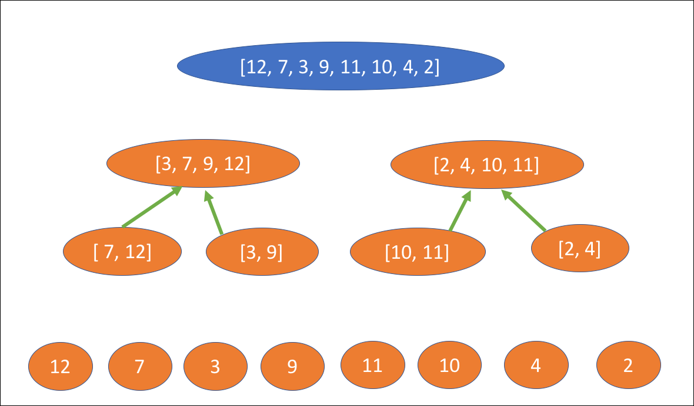

<br>
<strong>Key Takeaways</strong><br>
&#8226; Create a discovery service with Spring Cloud Netflix for registering and consuming services.<br>
&#8226; Connect microservices to the eureka discovery service.<br>
&#8226; Enable services to use Eureka to call each other regardless of client host or port.<br>



<br>
<h4>Eureka Server</h4>
<p>
This service registry was built by Netflix and then open sourced.
</p>
<p>
It allows you to enable microservices to see each other, to register and be discoverable. The service registry is like a phone-book for services within the microservice architecture. It tells each other where they live and if they exist. 
Other microservices are discoverable by the server by registering it. In this blog I will create the discovery server. 
The service discovery allows services to communicate with each other without hard coding the hostname or the port. 
The discovery server sits centralised to the other clients to enable the consumption of services without necessarily knowing their location. In this way, the discovery server is a broker to clients. 
If the location of a client changes, the consumers will not need to know as the server will re-route the clients. 

Eureka provides the host name and port to the clients.

</p>


<br>
<h4>Creating the registration server</h4>
<p>
Add @EnableEurekaServer to the main class of the service. (compulsory)
In the application properties file add:

```{numberLines:true}
server.port=9001
spring.application.name= discovery-server
eureka.server.eviction-interval-timer-in-ms=3000
eureka.client.registerWithEureka = false
eureka.client.fetch-registry=false
eureka.client.service-url.defaultZone= http://localhost:9001/eureka
```
Line 1 will specify the port to host. Port 8761 is the default value
Line 2 will name the service, however this is not necessarily required
Line 3 will define the number of milliseconds to wait for a service to be evicted from the server once it stops receiving the heartbeat
Lines 4 and 5 change the default behaviour of the server to firstly register itself to the server, and also for it to fetch the registry of services from the server.
Line 6 changes the default location of the server from port 8761 to port 9001
</p>
<p>
If we navigate to localhost:9001, we can find the server without any instances registered to it:

//image of server.
</p>


<br>
<h4>Configuring the client</h4>
<p>
In this example, we will use two clients to the eureka server. 
1 service will provide phone numbers of different users
1 service will be the hr-service that requests the phone numbers from the phone-book service.
</p>
<p>
The microservice will use two starter-dependencies that support the use of the service-discovery and the ability to call other services.
Both services will include a model class called 'Contact':

```java{numberLines:true}
public class Contact {
	
	private int number;
	private String name;
	
	public Contact(int number, String name) {
		super();
		this.number = number;
		this.name = name;
	}
	public int getNumber() {
		return number;
	}
	public void setNumber(int number) {
		this.number = number;
	}
	public String getName() {
		return name;
	}
	public void setName(String name) {
		this.name = name;
	}
	
}
```
</p>
<p>
Within the phone-book service, we will use a controller class to display a list of Contacts.
- list is returned

- properties file includes registering to eureka url

//show image of list 

//show it being registered to eureka
</p>
<p>
The HR service is registered:
The controller will use a RestTemplate to obtain the call to the phone-book 

The properties file will look as such:

```numberLines:true
eureka.client.fetchRegistry=true
server.port=9003
spring.application.name=hr-service
eureka.client.serviceUrl.defaultZone= http://localhost:9001/eureka/
```
The first line will instruct the service to obtain a list of all services registered to the eureka server.
</p>
<p>
The controller will look as such:


--important to have a default no arg constructor in the model class otherwise it doesnt like it.

-- show what happens when you dont 

</p>
<p>
When the client registers to the discovery server, it provides metadata about itself such as the port, health indicator URL and homepage. The client will send heartbeat messages to the server to register its existence.
</p>
<p>
Add the Eureka client dependency

</p>

<br>
<h4>Configuring the server properties</h4>
<p>
spring.application.name = config-server
eureka.client.serviceUrl.defaultZone= defaultZone: http://localhost:9001/eureka/
eureka.client.registerWithEureka=false

The default zone will tell the client where to look for the eureka server.
</p>
<p>
Add @EnableDiscoveryClient to activate the discovery client to the server.
This is a marker annotation for others to know it is a Eureka client. We do not necessarily have to use it. 

Alternatively, you can use @EnableEurekaClient. EnableDiscoveryClient will instead select the implementation (Consul, ZooKeeper, Eureka) from the classpath and assign it. 
</p>


<br>
<h4>Enabling microservices to communicate through Eureka</h4>
<p>
A strength from the Eureka discovery service is that the services within the infrastructure do not require an understanding of the location of other services, just their name. Therefore the Eureka server is able to map requests to the appropriate service as and when they move location.
In our example, this will involve moving a service from port 8881 to 8882 and still being able to communicate with it from the second service.

</p>
<p>
The Spring application name is used to register to the Eureka server. Therefore important to think about the name given. This is what is used for finding services, not the port of host name. 
You can use a configuration server for determining the port to search or live on. 

</p>

two key points; load balanced and fetchRegistry

1. The service that is being called (PhoneBook) will need to expose the endpoint controller to be called by the other service.
2. It will return a ResponseEntity<?> as we are sending HTTP messages from client to server. 
3. We are able to configure a HTTP response by using the ResponseEntity
<p>
HTTP Messages (why we are using ResponseEntity<?> and ResponseBody)
HTTP messages used for exchanging data between a client and a server. These consists of a request and a response. 
The messages share a similar structure that consists of a start-line describing the request as a header code, optional HTTP headers to describe the message or specifying the request
a blank line indicating all meta-data for the request has been sent, and an optional body containing the data associated with the request. 
</p>
<br>
<h4>Summary</h4>
<p>
The Spring Cloud Eureka Netflix 

You can find the source code from this blog on GitHub <a href="https://github.com/4neesh/DeveloperBlogDemos/tree/master/Eureka	">here</a>.
</p>

<br>
<small style="float: right;" >Picture: xxx, xxx by <a target="_blank" href="http">xxx</small></a><br>
