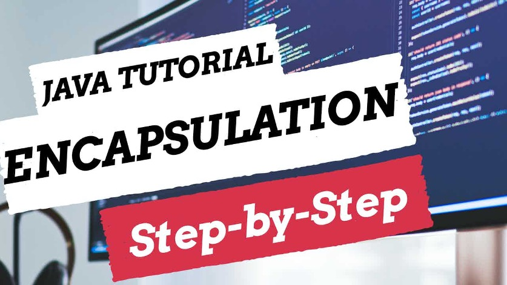

 
<h4>Title</h4>

Encapsulation is one of the four concepts of object-orientated programming. 
This video is a step-by-step guide on how you can develop software using encapsulation with Java. There will be an overview of the key access modifiers and a demonstration within 
IntelliJ.

Encapsulation is implemented in our design of how we enable the attributes and behaviours of our classes to be seen and used by the other classes and packages of the application.

