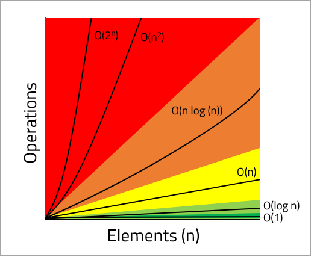

<br>
<strong>Key Takeaways</strong><br>
&#8226; Time complexity expresses the efficiency of an algorithm. The Big O is one such measure<br>
&#8226; The Big O Notation classifies the type of growth an algorithm implies to CPU has as input elements increase<br>
&#8226; The time complexity of an algorithm is only as efficient as it’s least efficient operation<br>


<br>
<h4>What is time complexity?</h4>
<p>
The term ‘time complexity’ is used to describe the efficiency of an algorithm with respect to its number of input elements. Defining the efficiency of an algorithm can be difficult while accounting for variables such as memory, disk, and network usage. The Big O Notation is used to classify time complexity for the upper-bound runtime; the Big O is expressed for an algorithm's CPU usage alone, therefore discarding the other variables from consideration.
</p>
<p>
The Big O is part of a family of asymptotic notations which, include Big Theta Θ and Big Omega Ω. The notations define the upper and lower asymptotic bounds for an algorithm. The Big O is only concerned with the approximate worst-case complexity of an algorithm; in other words, the guaranteed time in which an algorithm will complete.
</p>
<p>
Big O defines how the resources required (from the steps taken) in the algorithm scale up as the input elements grow. The Big O does not reflect the performance of an algorithm. The performance of an algorithm would capture how much time or memory is consumed when the algorithm is executed.
The graph below illustrates the 5 classifications an algorithm can have:
</p>




&#8226; <span style="background-color: rgb(0,176,80)">Constant time O(1)</span><br><br>
&#8226; <span style="background-color: rgb(146,208,80)">Logarithmic time O(log n)</span><br><br>
&#8226; <span style="background-color: #FFFF00">Linear time O(n)</span><br><br>
&#8226; <span style="background-color: rgb(237,125,49)">N logarithmic time O(n log (n))</span><br><br>
&#8226; <span style="background-color: rgb(255,0,0)">Polynomial time O(n&sup2;) / Exponential time O(2<sup>n</sup>)</span><br>


<br>
<h4>Defining the Big O of each operation within an algorithm</h4>
<p>

We are able to identify the Big O classification of each operation with the help of the Big O Cheat Sheet found <a target="_blank" href="https://www.bigocheatsheet.com/">here</a><br>
Below are two examples of algorithms that capture a classifcation themselves from a single operation:<br>

<span style="background-color: rgb(0,176,80)">Constant time O(1)</span> translates to ‘Order of 1’. The resources required to complete the operation will not change as the input size grows. The below example illustrates an O(1) operation:<br>
</p>

```java{numberLines: true}
public void algorithm(List<Integer> values){
    System.out.println(values.get(0));
}
```

<p>
<span style="background-color: #FFFF00">Linear time O(n)</span>, defines the linear growth of algorithm complexity in-line with the growth of elements. The below code snippet illustrates an operation of O(n)<br>
</p>

```java{numberLines: true}
public void algorithm(int n){
    for (int i = 0; i<n; i++){
        System.out.println("got the value: " + i);
    }
}

```
<p>
The remaining classifications follow the linear time pattern, where the resources required will increase at the respective growth of n. For (n log (n)), this would mean as the input elements grow, the resources required would approximately increase at the rate of (n log (n)), and so on.
</p>
<br>
<h4>How do we calculate the Big O of an algorithm?</h4>
<p>
As algorithms will usually consist of multiple operations, we will use the example below to understand how we consider multiple operations into a Big O calculation.<br>
</p>

```java{numberLines: true}
public void calculateMaxValue(List<Integer> values){
    int max = 0;
    for(int i=0; i< values.size(); i++){
        if(values.get(i) > max){
            max = values.get(i);
        }
    }
    System.out.println("Max Value is: " + max);
}

```


<p>
Line 2 is used to initialise a variable. As this line is not influenced by the size of <code class="language-java">values</code> as the input, line 2 has a Big O of O(1). <br>
From lines 3 to 7, the function will loop through each member of the <code class="language-java">values</code> and identify if it is the maximum value of the List. If <code class="language-java">values</code> = {1,2,3,6,3}, the number of elements, n, will be 5. <br>
The code block will run a total of 5 times in order to validate that the largest value is found within the list. It will run for int i = 0,1,2,3, and 4 as <code class="language-java">values.size()</code> = 5. A total of 5 operations for an elements size of 5 means the code block has a Big O of O(n).<br>
From lines 3 to 7, if <code class="language-java">values</code> = {1,2,3}, then <code class="language-java">values.size()</code> will equal 3, and the number of operations ran will also be 3. Therefore supporting the linear time classification.
Line 8 is used to print the result of the algorithm. This line is not influenced by the number of input values, therefore it is constant time and has a Big O of O(1).
</p>
<p>
As we account for the three operations within the algorithm, we have accumulated a Big O of: O(1) + O(n) + O(1).<br>
The accumulation can be summarised into: 2 O(1) + O(n).<br>
One defining characteristic of the Big O is that it is not concerned with the <u>rate</u> of growth, but it is concerned with the <u>type</u> of growth. Big O will not define how tightly an algorithm fits within the classification, but it will define the type of classification it falls within.</p>
As we understand that it is only the type of growth we will consider, we can remove the constants from the accumulated Big O value.<br>
As a result, 2 O(1) + O(n) is reduced to: O(1) + O(n).<br>
<p>
With multiple operations within an algorithm, we are able to obtain the Big O of an algorithm by releasing the non-dominant terms.<br>
Working from the least-efficient classifications of Exponential growth, back to constant growth, we can identify the category the algorithm belongs as soon as any of its operations satisfies a classification.<br><br>
&#8226; Exponential/Polynomial time: &#10008;<br>
&#8226; N logarithmic time: &#10008;<br>
&#8226; Linear time: &#10003;<br>
&#8226; Logarithmic time: &#10008;<br>
&#8226; Constant time: &#10003;
</p>
<p>
We can see from the above checklist, the algorithm satisfies the linear time complexity first (due to the for-loop). It later satisfies constant time, however this is discounted as it is not first satisfied classification. As a result, the algorithm has a Big O Notation of: O(n).<br>
</p>
<p>
The Big O notation enables us to better understand how the individual operations within an algrithm can contribute to its upper-bound CPU consumption.<br>
By breaking down an algorithm and understanding how each operation will consume more resources as the input elements increase, we are better able to identify where possible inefficiencies lie.<br>
Calculating the Big O provides an excellent opportunity to explore and utilise the data structures available to create CPU-optimised algorithms.<br>
The time complexity of our algorithms provide a measurable and reflective purpose for us to review our algorithms, both simple and complex, for how well each operation can scale up.
</p>
<br>
<small style="float: right;" >Picture: Cocora Valley, Salento by <a target="_blank" href="https://unsplash.com/@shawn_appel">Shawn Appel</small></a><br>

