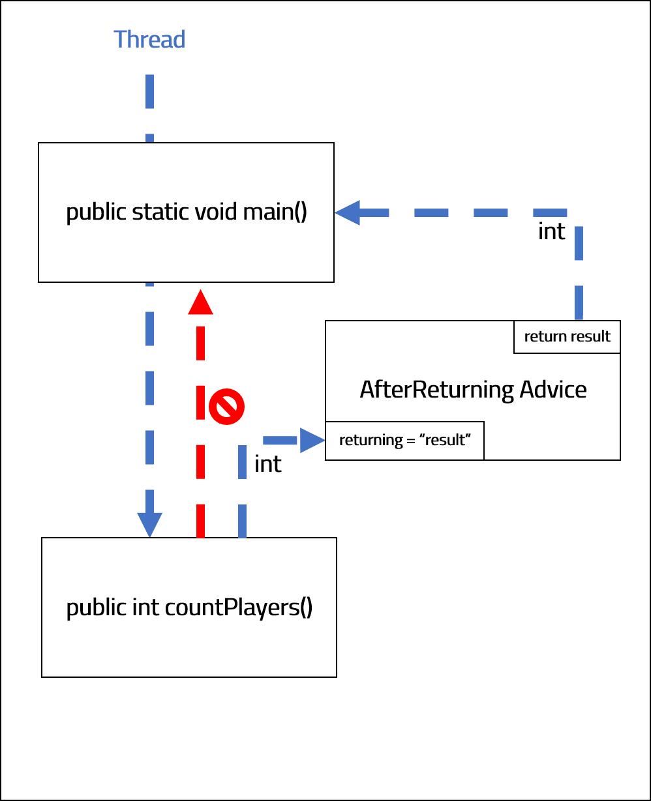

<br>
<strong>Key Takeaways</strong><br>
&#8226; AOP provides modular implementations for separating cross-cutting concerns<br>
&#8226; Pointcut expressions enable fine-grained AOP implementations<br>
&#8226; Spring AOP makes use of light-weight AspectJ AOP classes and methods<br>

<br>
<h4>What is AOP?</h4>
<p>
Aspect-orientated programming provides a tool we can implement in our applications to provide modular separation of cross-cutting concerns. Cross-cutting concerns depend upon core elements of a system, but do not fit appropriately into design.<br> For example, you may consider logging within your application. Logging can be a great way to debug and record the progress of an application, but if you need to apply it to multiple methods and classes, it wouldn’t be long before you realise clutter being created in your source code thus impeding the reading experience. <br>Other uses for AOP may be for security plug-ins or audit trails. Spring AOP provides a lightweight AOP implementation that uses AspectJ annotations and classes, it is best practice to use AOP for cheap operations and short functions to run.<br>
</p>
<p>
AOP introduces many keywords with its implementation that can quickly become confusing.<br>
We will use the below example to describe a simple business logic application.<br>

```java{numberLines: true}
public class FootballGame {
	
	public void playGame() {
		System.out.println("Game has started.");
	}
}
```
<p>
The method 'playGame' is known as the <strong>Joinpoint</strong>. The Joinpoint is an exact point within the execution of a program and can be defined upon the thread. An example of a Joinpoint can be calling a constructor or method, or throwing an exception.<br>
We are able to define different Joinpoints within our application by using <strong>Pointcut expressions</strong>. A Pointcut expression is a predicate that can match different Joinpoints. We define Pointcut expressions to pin-point certain Joinpoints within the application that we would like to apply our cross-cutting concerns to. If we defined a Pointcut expression for the above example, it would define the package, classname and method signature exactly.<br> In AOP, <strong>Advice</strong> is the action that is taken when a Pointcut expression is satisfied. The Advice is the method that is called, which for example can be logging, calling a security concern, or other business logic. Both the Pointcut expressions and the Advice are defined together within an <strong>Aspect</strong> class. The Aspect class is a handy way Spring can identify if, and where, to find possible AOP implementations to be made before processing a Joinpint. <br>You may be wondering when, in relation to the Joinpoint execution, that the Advice method is called. Advice methods contain 5 different types that define this exactly.
<br>
The diagram below illustrates the 5 types of Advice that exist for our Joinpoint, which is calling the method <i>playGame()</i>:<br>
</p>


&#8226; <strong>@Before</strong> is called before playGame is executed. <br>
&#8226; <strong>@After</strong> is called after playGame is executed.<br>
&#8226; <strong>@Around</strong> is called both before and after playGame is executed.<br>
&#8226; <strong>@AfterReturning</strong> is called after playGame is executed and return a value.<br>
&#8226; <strong>@AfterThrowing</strong> is called after playGame is executed, and if it throws an Exception.<br><br>

<h4>Implementing AOP step by step</h4>
<p>
AOP requires two dependencies to our spring project, we will define them in our POM.xml file:
</p>

```
    <dependencies>
        <!-- https://mvnrepository.com/artifact/org.springframework/spring-context -->
        <dependency>
            <groupId>org.springframework</groupId>
            <artifactId>spring-context</artifactId>
            <version>${spring-version}</version>
        </dependency>
        <!-- https://mvnrepository.com/artifact/org.aspectj/aspectjweaver -->
        <dependency>
            <groupId>org.aspectj</groupId>
            <artifactId>aspectjweaver</artifactId>
            <version>1.9.5</version>
        </dependency>
    </dependencies>

```

<p>
We will be using the spring-context dependency for defining and using Spring components and aspectj for the Aspect class and Advice implementations.
</p>

<p>
We will begin by instructing the main thread to call a Joinpoint called playGame().<br>
<strong>AnnotationConfigApplicationContext</strong> is used to import the Spring Configuration class that defines the package to scan for Spring components.<br>
The <code class="language-java">context</code> will be used to obtain a Spring bean to which it will define a new Joinpoint in the application. 
</p>

```java{numberLines: true}
public static void main(String[] args) {
		AnnotationConfigApplicationContext context
		= new AnnotationConfigApplicationContext(SpringConfig.class);

		FootballGame footballGame = context.getBean("footballGame", FootballGame.class);
		footballGame.playGame();
		context.close();
	}

```

<p>
The Spring configuration class exists as below:
</p>

```java{numberLines: true}
@Configuration
@EnableAspectJAutoProxy
@ComponentScan("com.aneesh.aopdemo")
public class SpringConfig {

}

```
<p>
The <strong>@Configuration</strong> annotation defines the class as a configuration class.<br>
<strong>@EnableAspectJAutoProxy</strong> enables the configuration class to find all the classes that are Aspects.CHECK<br>
<strong>@ComponentScan("com.aneesh.aopdemo")</strong> directs the Spring application on where to search for components.<br>

</p>

<p>
The FootballGame class is very simple. It will start with a single void method that starts a football game.
</p>

```java{numberLines: true}
@Component
public class FootballGame {

	public void playGame() {
		System.out.println("Game has started.");
	}
	
}
```
<p>
The class FooballGame includeds the <strong>@Component</strong> annotation to ensure it is scanned upon by <code class="language-java">class SpringConfig</code>:
</p>


<p>
Now that we have defined our business logic class (FootballGame) and the configuration class, we are able to create the Aspect class that will hold the Advice and Pointcut expressions:
</p>


```java{numberLines: true}

@Aspect
@Component
public class footballAspect {

	
}
```

<p>
The <strong>@Aspect</strong> annotation directs Spring to look for Advice within this class.
</p>

<h5>Defining Pointcut expressions</h5>
<p>
Before we define the Advice, we need to understand which Joinpoint(s) we would like the Advice to be called upon.<br>
When applying our Pointcut expressions, we use the term "execution". "execution" is the primary method of implementing Pointcut expressions in the following structure: <br>
<code class="language-java">"execution([optional]{access modifier} {return type} {package} {class} {method name} {arguments}")</code><br>
By default, the access modifier is 'Public', therefore it can be left undefined from the expression.<br>
For each of the other input values, you can specify custom values or leave it open with an asterisk (*). <br>
</p>

<code class="language-java">"execution(* com.aneesh.aopdemo.* .* () )"</code><br>
Scan all public access modifiers, all return types for all classes within the com.aneesh.aopdemo package with all method names and no arguments<br><br>
<code class="language-java">"execution(* com.aneesh.aopdemo.FootballGame .* () )"</code><br>
Scan all public access modifiers, all return types for only the FootballGame class within the com.aneesh.aopdemo package with all method names and no arguments<br><br>
<code class="language-java">"execution(* com.aneesh.aopdemo.FootballGame .playGame () )"</code><br>
Scan all public access modifiers, all return types for only the FootballGame class within the com.aneesh.aopdemo package with the method name "playGame" and no arguments<br><br>
<code class="language-java">"execution(* com.aneesh.aopdemo.FootballGame .playGame (..) )"</code><br>
Scan all public access modifiers, all return types for only the FootballGame class within the com.aneesh.aopdemo package with the method name "playGame" and all possible arguments<br><br>
<code class="language-java">"execution(private void com.aneesh.aopdemo.FootballGame .playGame (..) )"</code><br>
Scan all private access modifiers, void return types for only the FootballGame class within the com.aneesh.aopdemo package with the method name "playGame" and all possible arguments<br><br>
<code class="language-java">"execution(public void com.aneesh.aopdemo.FootballGame .playGame (String, int) )"</code><br>
Scan all public access modifiers, void return types for only the FootballGame class within the com.aneesh.aopdemo package with the method name "playGame" and arguments of String followed by int<br><br>

<p>
We can see from the above examples that the Pointcut expressions can be very specific across the entire application.<br>
The granularity of Pointcut expressions enable us to explicitly define which method calls we want to be scanned.<br>
We can use the 5 Advice types then provide further granularity to specify where in the Joinpoint we would like to implement the advice.<br>
The below example will implement before and after advice on our playGame Joinpoint:
</p>

```java{numberLines: true}

@Aspect
@Component
public class footballAspect {

@Before("execution( void com.aneesh.aop.* .playGame (..))")
	public void beforeAspect() {
		
		System.out.println("Make sure players warm up before game.");
	}

@After("execution( void com.aneesh.aop.* .playGame (..))")
	public void afterAspect() {

		System.out.println("Make sure players warm down after a game.");
	}
}
```

<p>
The outcome follows:
</p>

```t
Make sure players warm up before game.
Game has started.
Maintain hydration after the game.
```

<p>
The <strong>@Around</strong>, <strong>@AfterReturning</strong>, and <strong>@AfterThrowing</strong> Advice are implemented slightly differently, introducing a few more variables.<br>
To illustrate the annotations, we will introduce a new method, <code class="language-java">countPlayers()</code>, that returns the number of players on the pitch if it is equal to 22, otherwise will throw an Exception.<br>
The FootballGame class has been updated (below) and the main class will now call <code class="language-java">countPlayers()</code> instead of <code class="language-java">playGame()</code>.
</p>

```java{numberLines: true}
public class FootballGame {
	
	int playersOnPitch = 22;

	public void playGame() {
		System.out.println("Game has started.");
	}

	public int countPlayers() throws Exception{

		if (playersOnPitch == 22){
			System.out.println("FootballGame Class has successfully got 22 players.");
			return playersOnPitch;
		}
		else{
			System.out.println("FootballGame Class has not got 22 players and will throw Exception.");
			throw new Exception("FootballGame class Exception: Incorrect number of players.");
		}

	}	

}
```

```java{numberLines: true}

public static void main(String[] args) {
		
		AnnotationConfigApplicationContext context
		= new AnnotationConfigApplicationContext(SpringConfig.class);

		FootballGame footballGame = context.getBean("footballGame", FootballGame.class);

//		footballGame.playGame();
		try {
			System.out.println("Main method has counted players value of: " + footballGame.countPlayers());
		}
		catch (Exception e){
			System.out.println("Main method has caught exception: " + e.getMessage());
		}

		context.close();
		
	}

```
<p>
We will create new Advice methods in the Aspect class to process the information from the new Joinpoint, both around its execution and upon returning a value or exception.
</p>

```java{numberLines: true}
@Around( "execution(  int com.aneesh.aop.* .countPlayers (..))")
	public Object aroundAspect(ProceedingJoinPoint proceedingJoinPoint) throws Throwable {

		System.out.println("Around: Count the players on the pitch...");

		Object result = proceedingJoinPoint.proceed();

		System.out.println("Around: Count is done.");
		return result;
	}

@AfterReturning(pointcut = "execution( int com.aneesh.aop.* .countPlayers (..))", returning="result")
	public void afterReturningAspect(int result)  {

		System.out.println("AfterReturning has the result: " + result);
	}

@AfterThrowing(pointcut = "execution( int com.aneesh.aop.* .countPlayers (..))", throwing = "thrownExpression")
	public void afterThrowingAspect(Throwable thrownExpression)  {

		System.out.println("AfterThrowing has received a message: " + thrownExpression.getMessage());
	}

```
<p>
On line 1 we use the <strong>@Around</strong> type Advice. The Around Advice is much different to Before or After as it is intercepting the method call to the application.
You will see on line 2 that the method returns an <code class="language-java">Object</code>.<br>
The business logic expects the call to countPlayers to return an int. The Around Advice will intercept that method, but it now has the responsibility to retain the business logic and return an int.<br>
This is achieved in 3 key sections of the Around Advice type: {line 4}, {line 6}, and {lines 8 & 9}.<br>
Line 4 will be the business logic processed Before the countPlayers method is called. <br>
Line 6 will utilise the <strong>ProceedingJoinPoint</strong> to execute the actual countPlayers method.<br>
PJP for short, acts as the connection between the Advice and the countPlayers method. By using <code class="language-java">.proceed()</code>, we are telling the Advice to allow the method to be executed in the application.<br>
PJP.proceed is a unique method to the @Around Advice as it sits on both sides of the Joinpoint.<br>
By default, the <code class="language-java">.proceed()</code> method will return an Object. We have defined an Object as the result on line 6, however this can be wrapped in an Integer and returned.<br>
On Lines 8 and 9, we process the business logic for after the method has returned and then return the int back to the application as it would have expected had the Advice not been called.
</p>
<p>
On Line 12 we use the <strong>@AfterReturning</strong> Advice to process information after countPlayers has returned an Object (int).<br>
The argument to the Advice, however, does not only consist of a Pointcut expression. We define the Pointcut to the variable "pointcut", then we also define a String called "return" to the "returning" property.<br>
The value of "returning" is used in the Advice method. The "returning" value is obtained from the countPlayers method and passed into the Advice method which is then used with business logic.<br>
We could use the result in the business logic and return it to the application adjusting the method signature (on line 13) and returning int, however this example will only return void.<br>
On line 13 we can see the method will take in an int which comes directly from the countPlayers method. The business logic is processed on line 15. <br>
The AfterReturning Advice intercepts the method response from countPlayers which sends the int back to the application by processing a small piece of business logic before returning the int to the application.<br>
The diagram below illustrates the movement of values between the countPlayers method and the Advice, before being returned to the application:
</p>



<p>
The current application does not throw an Exception, but if we were to change the playersOnPitch value in the FootballGame class, the countPlayers method would throw an Exception.<br>
On line 18 we have defined the Advice in a similar pattern to the AfterReturning Advice. Instead of using the "returning" parameter, we are using "throwing", and we pass the Exception into the Advice method as a Throwable on line 19.<br>
On line 21, we simply process the message of the exception before allowing the Exception to be sent to the application.<br>
In real business logic, we may log the Exception or transform it before sending it back to the application. <br>
The AfterReturning Advice will return the following:
</p>

```
Around: Count the players on the pitch...
FootballGame Class has successfully got 22 players.
Around: Count is done.
AfterReturning has the result: 22
Main method has counted players value of: 22

```
<p>
If we change the number of players so an Exception is thrown, the AfterThrowing Advice would be called to return:
</p>

```
Around: Count the players on the pitch...
FootballGame Class has not got 22 players and will throw Exception.
AfterThrowing has received a message: FootballGame class Exception: Incorrect number of players.
Main method has caught exception: FootballGame class Exception: Incorrect number of players.

```

<p>
Note that the second Around Advice has not been called as an Object was not returned to the Advice. Instead, the thread has thrown an Exception that is caught in the main method.<br>
The AfterThrowing Advice is acknowledged and run before the Exception is sent back to the main method.
</p>
<h4>Conclusion</h4>
<p>
Spring AOP provides simple and effective tools that enable us to implement AOP into our applications. By defining Pointcut expressions, we are able to specify exact Joinpoints that we would like to add additional processing to. We use Advice types to specify when we define processing to happen, and as a result, we are able to precisely add additional functionality to our application.<br>
AOP provides a unique, modular, perspective to inspecting our application that can be used to a great effect.
</p>


<small style="float: right;" >Picture: Rio De Janeiro, Brazil by <a target="_blank" href="https://unsplash.com/@phaelnogueira">Raphael Nogueira</small></a><br>