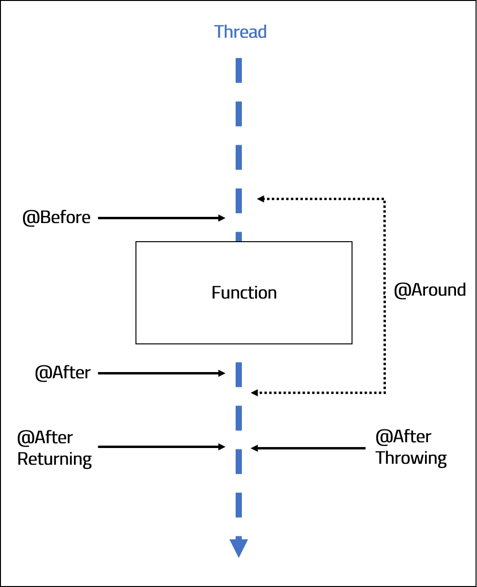

<br>
<strong>Key Takeaways</strong><br>
&#8226; AOP is useful for separating cross-cutting concerns<br>
&#8226; PointCut Expressions enable fine-grained AOP implementations<br>
&#8226; Spring AOP incorporates light-weight AspectJ AOP classes and methods<br>

<br>
<h4>What is AOP?</h4>
<p>
Aspect-orientated programming provides a tool we can implement in our applications to provide modular separation of cross-cutting concerns. Cross-cutting concerns depend upon core elements of a system, but do not fit appropriately into design. For example, you may consider logging within your application. It wouldn’t be long before you realise the logging of methods being called, or results being returned can quickly clutter your source code thus impeding the reading experience. Other uses for AOP may be for exception logging or audit trails. Spring AOP provides a lightweight AOP implementation that uses AspectJ annotations and classes, it is best practice to use AOP for cheap operations and short functions to run.<br>
Advice is a particular action taken by an aspect at a particular joinpoint. 
</p>

```java{numberLines: true}
@Configuration
@EnableAspectJAutoProxy
@ComponentScan("com.aneesh.aopdemo")
public class SpringConfig {

}

```
<p>
We then create the class which the AOP will act upon. The class will included @Component at the top to ensure it is scanned upon by the Configuration class.
</p>

```java{numberLines: true}
@Component
public class FootballGame {
	
    String opponents = "Leeds Utd";

	public void playGame() {
		System.out.println("Game has started.");
	}

    public String obtainOpponents(){
        return this.opponents;
    }
	
}
```
<p>
The main class, which is used to call the method, will include two key classes: AnnotationConfigApplicationContext, which is used to import the Configuration class, and identify the components to scan. The Context will then be used to obtain a Spring bean to which it will call actions upon. 
</p>

```java{numberLines: true}

public static void main(String[] args) {
		
		AnnotationConfigApplicationContext context
		= new AnnotationConfigApplicationContext(SpringConfig.class);

		FootballGame footballGame = context.getBean("footballGame", FootballGame.class);

		footballGame.playGame();
		
		context.close();
		
	}

```
<p>
The Aspect class is used to define the methods we would like to call at the respective advice point. 
We acknowledge the class with the @Aspect annotation which defines it as a class that contains Advice.
</p>

```java{numberLines: true}

@Aspect
@Component
public class footballAspect {

	
}
```
<p>
The aspect class will include individual advices made to implement AOP functionality. An advice describes when an action is taken upon a particular joinpoint.
<br>
The diagram below illustrates the 5 joinpoints that exist for each method:<br>
</p>




&#8226; <strong>@Before</strong> is called before any method is run. <br>
&#8226; <strong>@After</strong> is called after any method is run.<br>
&#8226; <strong>@Around</strong> is called both before and after a method is run.<br>
&#8226; <strong>@AfterReturning</strong> is called after a method is run and succsesfully returns.<br>
&#8226; <strong>@AfterThrowing</strong> is called after a method throws an Exception. <br>

<h5>Pointcut Expressions</h5>
<p>
Before we begin to define the advice, we also need to understand which method(s) we would like the advice to be called from. For this, we use <strong>Pointcut Expressions</strong>.<br>
Pointcut expressions define the package and method signature of the method(s) we would like the advice to be called from. "Execution" is the primary method of implementing poincut expressions in the following structure: <br>
"execution([optional]{access modifier} {return type} {package} {class} {method name} {arguments}")<br>
The access modifier is defaulted to 'Public', therefore it can be left out from the expression. For each of the other input values, you can define the signature to look for, or leave it open with astericks (*). <br>


<code class="language-java">"execution(* com.aneesh.aopdemo.* .* () )"</code><br>  
Scan all public modifiers, all return types for all classes within com.aneesh.aopdemo package with all method names and no arguments<br><br>
<code class="language-java">"execution(* com.aneesh.aopdemo.FootballGame .* () )"</code><br>
Scan all public modifiers, all return types for only the FootballGame class within com.aneesh.aopdemo package with all method names and no arguments<br><br>
<code class="language-java">"execution(* com.aneesh.aopdemo.FootballGame .playGame () )"</code><br>
Scan all public modifiers, all return types for only the FootballGame class within com.aneesh.aopdemo package with the method name "playGame" and no arguments<br><br>
<code class="language-java">"execution(* com.aneesh.aopdemo.FootballGame .playGame (..) )"</code><br>
Scan all public modifiers, all return types for only the FootballGame class within com.aneesh.aopdemo package with the method name "playGame" and all arguments<br><br>
<code class="language-java">"execution(private *void* com.aneesh.aopdemo.FootballGame .playGame (..) )"</code><br>
Scan all private modifiers, all return types for only the FootballGame class within com.aneesh.aopdemo package with the method name "playGame" and all arguments<br><br>
<code class="language-java">"execution(public void com.aneesh.aopdemo.FootballGame .playGame (String, int) )"</code><br>
Scan all public modifiers, void return types for only the FootballGame class within com.aneesh.aopdemo package with the method name "playGame" and arguments of String and int<br><br>

<p>
We can see from the above examples that the pointcut expressions can be very specific across all variables to a method call. The granularity of PointCut Expressions enable us to 
explicitly define which method calls we want to be scanned. The 5 joinpoints provide further granularity to specify where in the method execution we would like to implement the advice.
</p>


<small style="float: right;" >Picture: Rio De Janeiro, Brazil by <a target="_blank" href="https://unsplash.com/@phaelnogueira">Raphael Nogueira</small></a><br>