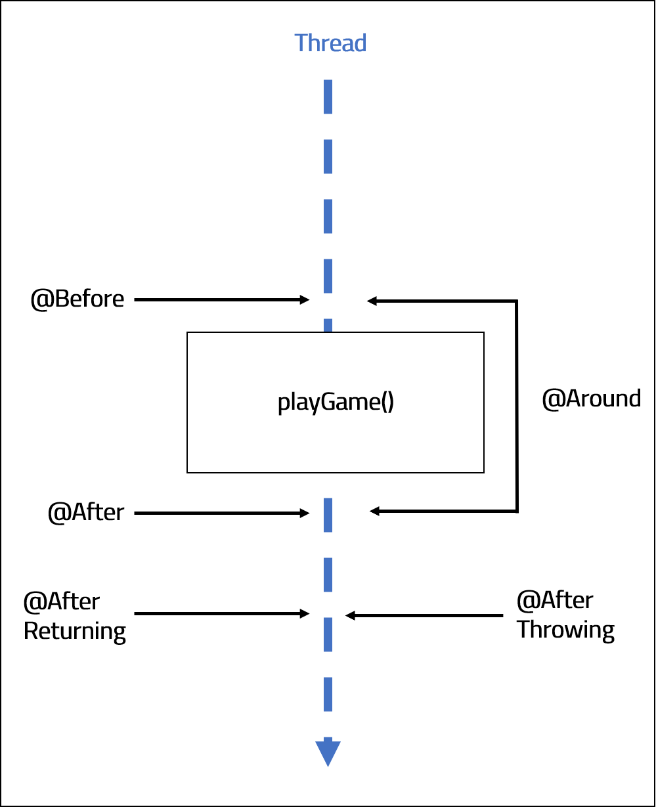

<br>
<strong>Key Takeaways</strong><br>
&#8226; AOP provides modular implementations for separating cross-cutting concerns<br>
&#8226; Pointcut expressions enable fine-grained AOP implementations<br>
&#8226; Spring AOP makes use of light-weight AspectJ AOP classes and methods<br>

<br>
<h4>What is AOP?</h4>
<p>
Aspect-orientated programming provides a tool we can implement in our applications to provide modular separation of cross-cutting concerns. Cross-cutting concerns depend upon core elements of a system, but do not fit appropriately into design.<br> For example, you may consider logging within your application. Logging can be a great way to debug and record the progress of an application, but if you need to apply it to multiple methods and classes, it wouldn’t be long before you realise clutter being created in your source code thus impeding the reading experience. <br>Other uses for AOP may be for security plug-ins or audit trails. Spring AOP provides a lightweight AOP implementation that uses AspectJ annotations and classes, it is best practice to use AOP for cheap operations and short functions to run.<br>
</p>
<p>
AOP introduces many new words with its implementation that can quickly become confusing. We will use the below example to describe a simple business logic application.<br>

```java{numberLines: true}
public class FootballGame {
	
	public void playGame() {
		System.out.println("Game has started.");
	}
}
```
<p>
The method 'playGame' is known as the <strong>Joinpoint</strong>. The Joinpoint is an exact point within the execution of a program and can be defined upon the thread. An example of a Joinpoint can be calling a constructor or method, or throwing an exception.<br>
We are able to define different Joinpoints within our application by using <strong>Pointcut expressions</strong>. A Pointcut expression is a predicate that can match different Joinpoints. We define Pointcut expressions to pin-point certain Joinpoints within the application that we would like to apply our cross-cutting concerns to. If we defined a Poincut expression for the above example, it would define the package, classname and method signature exactly.<br> In AOP, <strong>Advice</strong> is the action that is taken when a Pointcut expression is satisfied. The Advice is the method that is called, which for example can be logging, calling a security concern, or other business logic. Both the Pointcut expressions and the Advice are defined together within an <strong>Aspect</strong> class. <br>You may be wondering when, in relation to the Joinpoint execution, that the Advice method is called. Advice methods contain 5 different types that define this exactly.
<br>
The diagram below illustrates the 5 types of Advice that exist:<br>
</p>




&#8226; <strong>@Before</strong> is called before any method is run. <br>
&#8226; <strong>@After</strong> is called after any method is run.<br>
&#8226; <strong>@Around</strong> is called both before and after a method is run.<br>
&#8226; <strong>@AfterReturning</strong> is called after a method is run and succsesfully returns.<br>
&#8226; <strong>@AfterThrowing</strong> is called after a method throws an Exception. <br>

<h4>Implementing AOP step by step</h4>
<p>
Before we implement AOP, we need to define dependencies in our POM.xml file.
</p>

```t
    <dependencies>
        <!-- https://mvnrepository.com/artifact/org.springframework/spring-context -->
        <dependency>
            <groupId>org.springframework</groupId>
            <artifactId>spring-context</artifactId>
            <version>${spring-version}</version>
        </dependency>
        <!-- https://mvnrepository.com/artifact/org.aspectj/aspectjweaver -->
        <dependency>
            <groupId>org.aspectj</groupId>
            <artifactId>aspectjweaver</artifactId>
            <version>1.9.5</version>
        </dependency>
    </dependencies>

```

<p>
We we will be using the spring-context dependency for defining and using Spring components and aspectj for the Aspect and Advice implementations.

</p>

<p>
The main class, which is used to call the method, will include two key instances: <strong>AnnotationConfigApplicationContext</strong>, which is used to import the Configuration class, and identify the components to scan. The context will then be used to obtain a Spring bean to which it will call actions upon. 
</p>

```java{numberLines: true}
public static void main(String[] args) {
		AnnotationConfigApplicationContext context
		= new AnnotationConfigApplicationContext(SpringConfig.class);

		FootballGame footballGame = context.getBean("footballGame", FootballGame.class);
		footballGame.playGame();
		context.close();
	}

```

<p>
The FootballGame class is very simple. It will start with a single void method that starts a football game.
</p>

```java{numberLines: true}
@Component
public class FootballGame {

	public void playGame() {
		System.out.println("Game has started.");
	}
	
}
```
<p>
The class FooballGame includeds the <strong>@Component</strong> annotation to ensure it is scanned upon by the configuration class "SpringConfig":
</p>


```java{numberLines: true}
@Configuration
@EnableAspectJAutoProxy
@ComponentScan("com.aneesh.aopdemo")
public class SpringConfig {

}

```

<p>
The <strong>@Configuration</strong> annotation defines the class as a configration class.<br>
<strong>@EnableAspectJAutoProxy</strong> enables the configuration class to find all the classes that are Aspects.CHECK<br>
<strong>@ComponentScan("com.aneesh.aopdemo")</strong> directs the Spring application on where to search for components.<br>

</p>
<p>
Once we have built the configuration class, we are able to create the Aspect class that will hold the Advice and the respective Pointcut expressions.<br>
</p>


```java{numberLines: true}

@Aspect
@Component
public class footballAspect {

	
}
```

<p>
We acknowledge the class with the <strong>@Aspect</strong> annotation to direct the application to search for Advice from within.
</p>

<h5>Defining Pointcut expressions</h5>
<p>
Before we define the Advice, we need to understand which Joinpoint(s) we would like the Advice to be called upon. When applying our Pointcut expressions, we use the term "Execution". "Execution" is the primary method of implementing Poincut expressions in the following structure: <br>
<code class="language-java">"execution([optional]{access modifier} {return type} {package} {class} {method name} {arguments}")</code><br>
The access modifier is default of 'Public', therefore it can be left undefined from the expression. For each of the other input values, you can specify custom values or leave it open with an astericks (*). <br>
</p>

<code class="language-java">"execution(* com.aneesh.aopdemo.* .* () )"</code><br>  
Scan all public modifiers, all return types for all classes within com.aneesh.aopdemo package with all method names and no arguments<br><br>
<code class="language-java">"execution(* com.aneesh.aopdemo.FootballGame .* () )"</code><br>
Scan all public modifiers, all return types for only the FootballGame class within com.aneesh.aopdemo package with all method names and no arguments<br><br>
<code class="language-java">"execution(* com.aneesh.aopdemo.FootballGame .playGame () )"</code><br>
Scan all public modifiers, all return types for only the FootballGame class within com.aneesh.aopdemo package with the method name "playGame" and no arguments<br><br>
<code class="language-java">"execution(* com.aneesh.aopdemo.FootballGame .playGame (..) )"</code><br>
Scan all public modifiers, all return types for only the FootballGame class within com.aneesh.aopdemo package with the method name "playGame" and all arguments<br><br>
<code class="language-java">"execution(private *void* com.aneesh.aopdemo.FootballGame .playGame (..) )"</code><br>
Scan all private modifiers, all return types for only the FootballGame class within com.aneesh.aopdemo package with the method name "playGame" and all arguments<br><br>
<code class="language-java">"execution(public void com.aneesh.aopdemo.FootballGame .playGame (String, int) )"</code><br>
Scan all public modifiers, void return types for only the FootballGame class within com.aneesh.aopdemo package with the method name "playGame" and arguments of String and int<br><br>

<p>
We can see from the above examples that the Pointcut expressions can be very specific across all variables to a method call. The granularity of PointCut Expressions enable us to explicitly define which method calls we want to be scanned. The 5 Advice types then provide further granularity to specify where in the Joinpoint we would like to implement the advice.<br>
We will now implement some before advice:
</p>

```java{numberLines: true}

@Aspect
@Component
public class footballAspect {

@Before("execution( void com.aneesh.aop.* .playGame (..))")
	public void beforeAspect() {
		
		System.out.println("Make sure players warm up before game.");
	}

@After("execution( void com.aneesh.aop.* .playGame (..))")
	public void afterAspect() {

		System.out.println("Make sure players warm down after a game.");
	}
}
```

<p>
The Before Advice that is called for any playGame that returns void within
the com.aneesh.aop package will print "Make sure players warm up before the game." whenever such as method is called.<br>
The After Advice will be called following the method and will print "Make sure you warm down after the game."<br>
</p>
<p>
The outcome from the method execution will be:
</p>

```t
Make sure players warm up before game.
Game has started.
Maintain hydration after the game.
```

<p>
The <strong>@Around</strong>, <strong>@AfterReturning</strong>, and <strong>@AfterThrowing</strong> Advice are implemented slightly differently with a few more complications.<br>
For this, we will use a new method, countPlayers(), that returns the number of players on the pitch, otherwise will throw an Exception. The FootballGame class has been updated (below) and the main class will now call countPlayers() instead of playGame().
</p>

```java{numberLines: true}
public class FootballGame {
	
	int playersOnPitch = 22;

	public void playGame() {
		System.out.println("Game has started.");
	}

	public int countPlayers() throws Exception{
		
		if (playersOnPitch == 22){
			return playersOnPitch;
		}
		else{
			throw new Exception("incorrect number of players");
		}

	}	

}
```
<p>
The countPlayers method will validate there are sufficient players on the pitch otherwise return an exception. We will create new Advice methods in the Aspect class to process the information from the new method.
</p>

```java{numberLines: true}
@Around( "execution(  int com.aneesh.aop.* .countPlayers (..))")
	public Object aroundAspect(ProceedingJoinPoint proceedingJoinPoint) throws Throwable {

		System.out.println("Count the players on the pitch...");

		Object result = proceedingJoinPoint.proceed();

		System.out.println("Count is done.");
		return result;
	}

@AfterReturning(pointcut = "execution( int com.aneesh.aop.* .countPlayers (..))", returning="result")
	public void afterReturningAspect(int result)  {

		System.out.println("After returning has the result: " + result);
	}

@AfterThrowing(pointcut = "execution( int com.aneesh.aop.* .countPlayers (..))", throwing = "thrownExpression")
	public void afterThrowingAspect(Throwable thrownExpression)  {

		System.out.println("After throwing has received a message: " + thrownExpression.getMessage());
	}

```
<p>
On line 1 we use the <strong>@Around</strong> type Advice. The Around Advice is much different to Before or After as it is intercepting the method call to the application.
You will see on line 2 that the method returns an Object. As the countPlayers method returns an int to the application, and the Around method intercepts the call, it must also return the int to the application. So how does the Around Advice intercept and return the value?<br>
We can break the method into 3 key sections: {line 5}, {line 7}, and {lines 9 & 10}.<br>
Line 5 will be the business logic processed Before the countPlayers() method is called. <br>
Line 7 will utilise the <strong>ProceedingJoinPoint</strong>. PJP for short acts as the connection between the Advice and the countPlayers method. By calling the .proceed() method, we are telling the Advice to allow the method to be executed in the application. This is a unique property to @Around as it sits on both sides of the JoinPoint.<br>
By default, the .proceed() method will return an Object. We have defined an Object as the result, however this can be wrapped in an Integer and returned.<br>
On Lines 9 and 10 we process the business logic for after the method has returned and then return the result back to the application as it would have expected if the Advice was not called.
</p>
<p>
On Line 13 we use the <strong>@AfterReturning</strong> Advice to process information after the method has returned an Object. The argument to the Advice however does not only consist of a Pointcut expression. We define the Pointcut to the variable "pointcut", the also define a String to "returning". The value of "returning" is used in the Advice method. The "returning" value is obtained from the countPlayers method and passed into the Advice method which is then used with business logic. We could manipualte the result in the business logic and return it by adjusting the method signature and returning result, however this example will only return void.<br> On line 14 we can see the method will take in an int which comes directly from the countPlayers method. The business logic is processed on line 16. <br>
The AfterReturning Advice intercepts the method response from countPlayers which sends the int back to the application by processing a small piece of business logic before returning the int to the application. 
</p>
<!-- insert graph here to demonstrate -->
<p>
The current application does not throw an Exception, but if we were to change the playersOnPitch value in the FootballGame class, the countPlayers method would throw an Exception. On line 19 we have defined the Advice in a similar pattern to the AfterReturning advice. Instead of using the "returning" parameter, we are using "throwing", and we pass this into the Advice method as a Throwable on line 20. On line 22 we simply process the message of the exception before allowing the Exception to be sent to the application. 
</p>


<h4>Conclusion</h4>
<p>
Spring AOP provides simple and effective tools that enable us to implement AOP into our applications. By defining Pointcut expressions, we are able to specify exact Joinpoints that we would like to add additional processing to. We use Advice types to specify when we define processing to happen, and as a result, we are able to precisely add additional functionality to our application.<br>
AOP provides a unique, modular, perspective to inspecting our application that can be used to a great effect.

</p>


<small style="float: right;" >Picture: Rio De Janeiro, Brazil by <a target="_blank" href="https://unsplash.com/@phaelnogueira">Raphael Nogueira</small></a><br>