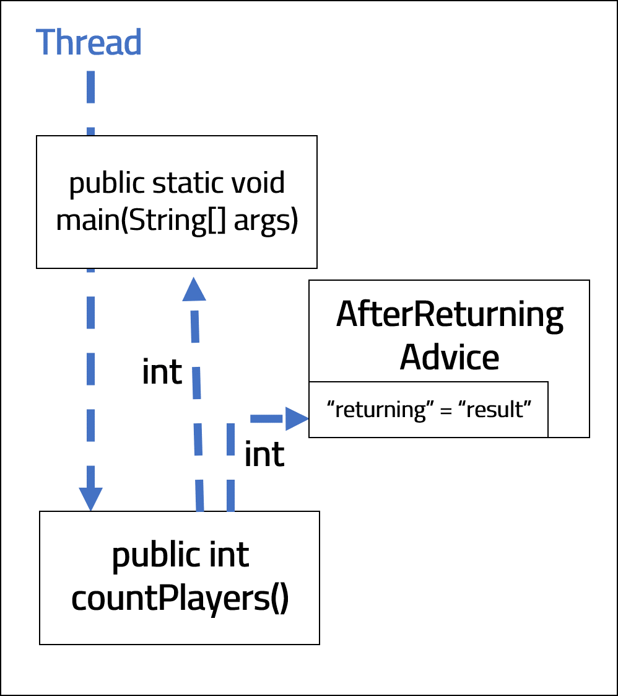

<br>
<strong>Key Takeaways</strong><br>
&#8226; AOP enables us to separate cross-cutting concerns from within our application.<br>
&#8226; Pointcut expressions enable fine-grained AOP implementations.<br>
&#8226; Spring AOP makes use of light-weight AspectJ AOP classes and methods.<br>

<br>
<h4>What is AOP?</h4>
<p>
AOP enables us to apply additional functionality to our application to separate cross-cutting concerns without updating the business logic source code.<br>
A cross cutting concern, for example, may include security, logging, or analytics.<br>
</p>
<p>
AOP introduces several keywords during its best-practice.<br>
We will use the below example to describe a simple business logic application.<br>

```java{numberLines: true}
public class FootballGame {
	
	public void playGame() {
		System.out.println("Game has started.");
	}
}
```

</p>
<p>
The method <code class="language-java">playGame()</code> is known as the <strong>Joinpoint</strong>. The Joinpoint is an exact point within the execution of an application that can be defined on the thread. An example of a Joinpoint can be calling a constructor or method, or throwing an <code class="language-java">Exception</code>.<br>
We are able to define different Joinpoints within our application by using <strong>Pointcut expressions</strong>. A Pointcut expression is a predicate that can match different Joinpoints. We define Pointcut expressions to pin-point certain Joinpoints within the application that we would like to apply our cross-cutting concerns to. If we defined a Pointcut expression for the above example, it would define the package, class name and method signature exactly.<br> In AOP, <strong>Advice</strong> is the action that is taken when a Pointcut expression is satisfied. Both the Pointcut expressions and the Advice are defined together within an <strong>Aspect</strong> class. The Aspect class is a handy way Spring can identify if, and where, to find possible AOP implementations to be applied in conjunction with a Joinpoint. <br>You may be wondering when, in relation to the Joinpoint execution, that the Advice method is called. The exact position in relation to the Joinpoint can be defined by the of 5 different types of Advice, illustrated below:

</p>


&#8226; <strong>@Before</strong> is called before <code class="language-java">playGame()</code> is executed. <br>
&#8226; <strong>@After</strong> is called after <code class="language-java">playGame()</code> is executed.<br>
&#8226; <strong>@Around</strong> is called both before and after <code class="language-java">playGame()</code> is executed.<br>
&#8226; <strong>@AfterReturning</strong> is called after <code class="language-java">playGame()</code> is executed and returns a value.<br>
&#8226; <strong>@AfterThrowing</strong> is called after <code class="language-java">playGame()</code> is executed, and if it throws an <code class="language-java">Exception</code>.<br><br>
<br>
<h4>Implementing AOP step by step</h4>
<p>
AOP requires two dependencies in our Spring project, we will define them in our POM.xml file:
</p>

```
    <dependencies>
        <!-- https://mvnrepository.com/artifact/org.springframework/spring-context -->
        <dependency>
            <groupId>org.springframework</groupId>
            <artifactId>spring-context</artifactId>
            <version>${spring-version}</version>
        </dependency>
        <!-- https://mvnrepository.com/artifact/org.aspectj/aspectjweaver -->
        <dependency>
            <groupId>org.aspectj</groupId>
            <artifactId>aspectjweaver</artifactId>
            <version>1.9.5</version>
        </dependency>
    </dependencies>

```

<p>
We will be using the <code class="language-java">spring-context</code> dependency for supporting Spring components and <code class="language-java">aspectj</code> for supporting the Aspect class and Advice implementations.
</p>


```java{numberLines: true}
public static void main(String[] args) {
		AnnotationConfigApplicationContext context
		= new AnnotationConfigApplicationContext(SpringConfig.class);

		FootballGame footballGame = context.getBean("footballGame", FootballGame.class);
		footballGame.playGame();
		context.close();
	}

```
<p>
We will begin by instructing the main thread to call a Joinpoint called <code class="language-java">playGame()</code>.<br>
<strong>AnnotationConfigApplicationContext</strong> is used to import the Spring Configuration class that defines the package to scan for Spring components.<br>
<code class="language-java">Context</code> will be used to obtain a Spring bean to which it will later be used to call <code class="language-java">playGame()</code>.
</p>
<p>
The Spring configuration class exists as below:
</p>

```java{numberLines: true}
@Configuration
@EnableAspectJAutoProxy
@ComponentScan("com.aneesh.aopdemo")
public class SpringConfig {

}

```
<p>
The <strong>@Configuration</strong> annotation defines the class as a configuration class.<br>
<strong>@EnableAspectJAutoProxy</strong> enables support for handling Aspect classes.<br>
<strong>@ComponentScan("com.aneesh.aopdemo")</strong> directs the Spring application on where to search for components.<br>

</p>

<p>
Business logic is processed in <code class="language-java">public class FootballGame</code>. This class will begin with a single void method that prints "Game has started.".
</p>

```java{numberLines: true}
@Component
public class FootballGame {

	public void playGame() {
		System.out.println("Game has started.");
	}
	
}
```
<p>
The above class includes the <strong>@Component</strong> annotation to ensure it is scanned by <code class="language-java">SpringConfig</code>.
</p>


<p>
We will now build the Aspect class that will hold the Advice and Pointcut expressions to our business logic:
</p>


```java{numberLines: true}

@Aspect
@Component
public class footballAspect {

	
}
```

<p>
The <strong>@Aspect</strong> annotation informs Spring that there may be Advice within this class to process.
</p>
<br>
<h5>Defining Pointcut expressions</h5>
<p>
Before we define the Advice, we need to understand which Joinpoint(s) we would like the Advice to be called upon.<br>
When applying our Pointcut expressions, we use the term "execution". "execution" is the primary method of implementing Pointcut expressions in the following structure: <br>
<code class="language-java">"execution([optional]{access modifier} {return type} {package} {class} {method name} {arguments}")</code><br>
By default, the access modifier is 'Public', therefore it can be left undefined from the expression.<br>
For each of the other input values, you can specify custom values or leave it open with an asterisk (*). <br>
</p>

<code class="language-java">"execution(* com.aneesh.aopdemo.* .* () )"</code><br>
Scan all public access modifiers, all return types for all classes within the com.aneesh.aopdemo package with all method names and no arguments<br><br>
<code class="language-java">"execution(* com.aneesh.aopdemo.FootballGame .* () )"</code><br>
Scan all public access modifiers, all return types for only the FootballGame class within the com.aneesh.aopdemo package with all method names and no arguments<br><br>
<code class="language-java">"execution(* com.aneesh.aopdemo.FootballGame .playGame () )"</code><br>
Scan all public access modifiers, all return types for only the FootballGame class within the com.aneesh.aopdemo package with the method name "playGame" and no arguments<br><br>
<code class="language-java">"execution(* com.aneesh.aopdemo.FootballGame .playGame (..) )"</code><br>
Scan all public access modifiers, all return types for only the FootballGame class within the com.aneesh.aopdemo package with the method name "playGame" and all possible arguments<br><br>
<code class="language-java">"execution(private void com.aneesh.aopdemo.FootballGame .playGame (..) )"</code><br>
Scan all private access modifiers, void return types for only the FootballGame class within the com.aneesh.aopdemo package with the method name "playGame" and all possible arguments<br><br>
<code class="language-java">"execution(public void com.aneesh.aopdemo.FootballGame .playGame (String, int) )"</code><br>
Scan all public access modifiers, void return types for only the FootballGame class within the com.aneesh.aopdemo package with the method name "playGame" and arguments of String followed by int<br><br>

<p>
The examples above illustrate how specific or generic a Pointcut expression can be.<br>
The granularity of Pointcut expressions enable us to define explicitly which Joinpoint(s) we want to be scanned.<br>
We can then use the 5 Advice types to provide further granularity to specify where in the Joinpoint we would like to implement the Advice.<br>
The below example will implement before and after Advice on our <code class="language-java">playGame()</code> Joinpoint:
</p>
<br>
<h5>Using @Before and @After</h5>

```java{numberLines: true}

@Aspect
@Component
public class footballAspect {

@Before("execution( void com.aneesh.aop.* .playGame (..))")
	public void beforeAspect() {
		
		System.out.println("Make sure players warm up before game.");
	}

@After("execution( void com.aneesh.aop.* .playGame (..))")
	public void afterAspect() {

		System.out.println("Make sure players warm down after a game.");
	}
}
```

<p>
The outcome produced from running the application:
</p>

```
Make sure players warm up before game.
Game has started.
Maintain hydration after the game.
```
<p>
The application has run the Before and After methods in their respective order as expected. As a result, the application has performed some additional behaviours beyond the business source code.
</p>
<p>
The <strong>@Around</strong>, <strong>@AfterReturning</strong>, and <strong>@AfterThrowing</strong> Advice are implemented slightly differently, introducing a few more variables.<br>
To illustrate the annotations, we will introduce a new method, <code class="language-java">countPlayers()</code>, that returns the number of players on the pitch if it is equal to 22, otherwise it will throw an code class="language-java">Exception</code>.<br>
<code class="language-java">class FootballGame</code> has been updated (below) and the main class will now call <code class="language-java">countPlayers()</code> instead of <code class="language-java">playGame()</code>.
</p>

```java{numberLines: true}
public class FootballGame {
	
	int playersOnPitch = 22;

	public void playGame() {
		System.out.println("Game has started.");
	}

	public int countPlayers() throws Exception{

		if (playersOnPitch == 22){
			System.out.println("FootballGame Class has successfully got 22 players.");
			return playersOnPitch;
		}
		else{
			System.out.println("FootballGame Class has not got 22 players and will throw Exception.");
			throw new Exception("FootballGame class Exception: Incorrect number of players.");
		}

	}	

}
```

```java{numberLines: true}

public static void main(String[] args) {
		
		AnnotationConfigApplicationContext context
		= new AnnotationConfigApplicationContext(SpringConfig.class);

		FootballGame footballGame = context.getBean("footballGame", FootballGame.class);

		try {
			System.out.println("Main method has counted players value of: " + footballGame.countPlayers());
		}
		catch (Exception e){
			System.out.println("Main method has caught exception: " + e.getMessage());
		}

		context.close();
		
	}

```
<br>
<h5>Using @Around</h5>

<p>
We will create new Advice methods in the Aspect class to process the information from the new Joinpoint. We will include around the execution, and upon returning an <code class="language-java">int</code> or <code class="language-java">Exception</code>.
</p>

```java{numberLines: true}
@Around( "execution(  int com.aneesh.aop.* .countPlayers (..))")
	public Object aroundAspect(ProceedingJoinPoint proceedingJoinPoint) throws Throwable {

		System.out.println("Around: Count the players on the pitch...");

		Object result = proceedingJoinPoint.proceed();

		System.out.println("Around: Count is done.");
		return result;
	}

```
<p>
On line 1 we use the <strong>@Around</strong> type Advice. The Around Advice is very different to Before or After as it is intercepting the method call from the main method to <code class="language-java">countPlayers()</code>.
You will see on line 2 that the method returns an <code class="language-java">Object</code>.<br>
The business logic expects the call to <code class="language-java">countPlayers()</code> to return an <code class="language-java">int</code>. The Around Advice will intercept that method, but it now has the responsibility to retain the business logic and return an <code class="language-java">int</code>.<br>
The process of receiving, processing, and returning the int is achieved in 3 key sections: {line 4}, {line 6}, and {lines 8 & 9}.<br>
Line 4 will be the business logic processed <u>before</u> <code class="language-java">countPlayers()</code> is called. <br>
Line 6 will use the <strong>ProceedingJoinPoint</strong> to execute the actual <code class="language-java">countPlayers()</code> method.<br>
ProceedingJoinPoint acts as the connection between the Advice and the <code class="language-java">countPlayers()</code> Joinpoint. By calling <code class="language-java">.proceed()</code>, we are telling the Advice to continue with executing the Joinpoint in the application.<br>
<code class="language-java">proceedingJoinPoint.proceed()</code> is a unique method to the <strong>@Around</strong> Advice as it sits on both sides of the Joinpoint.<br>
By default, the <code class="language-java">.proceed()</code> method will return an <code class="language-java">Object</code>. We have defined an <code class="language-java">Object</code> as the result on line 6, however this can be wrapped in an <code class="language-java">Integer</code> and returned.<br>
On lines 8 and 9, we process the business logic <u>after</u> the method has returned from <code class="language-java">countPlayers()</code>. The <code class="language-java">int</code> is then sent to the main application as it would have expected to be delivered had the Advice not been used. In this example, the int is packaged as an <code class="language-java">Object</code>.
</p>
<br>
<h5>Using @AfterReturning</h5>

<p>
The below example uses <strong>@AfterReturning</strong>:
</p>

```java{numberLines: true}
@AfterReturning(pointcut = "execution( int com.aneesh.aop.* .countPlayers (..))", returning="result")
	public void afterReturningAspect(int result)  {

		System.out.println("AfterReturning has the result: " + result);
	}

```
<p>
On Line 1 we use the <strong>@AfterReturning</strong> Advice to process information after <code class="language-java">countPlayers()</code> has returned an <code class="language-java">Object</code> (otherwise an <code class="language-java">int</code>).<br>
The argument to the Advice, however, does not only consist of a Pointcut expression. We define the Pointcut to the variable "pointcut", then we also define a <code class="language-java">String</code> called "return" to the "returning" property.<br>
The value of "returning" is used in the Advice method. The "returning" value is equal to what is returned from <code class="language-java">countPlayers()</code>. The "returning" value is later back to the main method after the Advice.<br>
We could use the result from <code class="language-java">countPlayers()</code> in the Advice and return it to the application by adjusting the method signature (on line 2) and returning an int at the end of the method (line 5), however this example will only return void.<br>
On line 2 we can see the method will take an <code class="language-java">int</code> argument which comes directly from <code class="language-java">countPlayers()</code>. The business logic is processed on line 4. <br>
The diagram below illustrates the movement of Objects between the <code class="language-java">countPlayers()</code> and the Advice, before being returned to the main method:
</p>




<p>
The result from processing the AfterReturning Advice would be:
</p>

```
Around: Count the players on the pitch...
FootballGame Class has successfully got 22 players.
Around: Count is done.
AfterReturning has the result: 22
Main method has counted players value of: 22

```

<br>
<h5>Using @AfterThrowing</h5>

<p>
The current application does not throw an <code class="language-java">Exception</code>, but if we were to change the <code class="language-java">playersOnPitch</code> value in <code class="language-java">class FootballGame</code>, <code class="language-java">countPlayers()</code> would throw an <code class="language-java">Exception</code>.<br>
The example below demonstrates how an <code class="language-java">Exception</code> would be handled with Advice.
</p>

```java{numberLines:true}
@AfterThrowing(pointcut = "execution( int com.aneesh.aop.* .countPlayers (..))",
				 throwing = "thrownExpression")
	public void afterThrowingAspect(Throwable thrownExpression)  {

		System.out.println("AfterThrowing has received a message: " + thrownExpression.getMessage());
	}

```
<p>

On line 2 we have defined the Advice in a similar pattern to the <strong>AfterReturning</strong> Advice. Instead of using the "returning" parameter, we are using "throwing", and we pass the <code class="language-java">Exception</code> into the Advice method as a Throwable on line 3.<br>
On line 5, we simply process the message of the <code class="language-java">Exception</code> before allowing the <code class="language-java">Exception</code> to be sent back to the main method.<br>
In real business logic, we may log the <code class="language-java">Exception</code> or transform it before sending it back. <br>
</p>

<p>
If we change the number of players so an <code class="language-java">Exception</code> is thrown, the <strong>AfterThrowing</strong> Advice would return:
</p>

```
Around: Count the players on the pitch...
FootballGame Class has not got 22 players and will throw Exception.
AfterThrowing has received a message: FootballGame class Exception: Incorrect number of players.
Main method has caught exception: FootballGame class Exception: Incorrect number of players.

```

<p>
Notice that the second Around Advice has not been called as an <code class="language-java">Object</code> was not returned to the Advice. Instead, the thread has thrown an <code class="language-java">Exception</code>.<br>
The <strong>AfterThrowing</strong> Advice is acknowledged when the <code class="language-java">Exception</code> is thrown and run before the <code class="language-java">Exception</code> is sent back to the main method.
</p>
<br>
<h4>Conclusion</h4>
<p>
Spring provides simple and effective tools that enable us to implement AOP into our applications. <br>
By defining Pointcut expressions, we are able to specify exact Joinpoints where we would like to add additional processing. We use Advice types to define when we would like the processing to happen, and as a result, we are able to delicately add additional functionality to our application.<br>
By using AOP with object-orientated programming, we are able to drastically improve the maintainability of our source code by grouping additional features and behaviours of our application into modular sections.<br>
Furthermore, we are able to cross boundaries that are defined by packages and classes within our application to provide shared behaviour and functionality that can, incredibly, be defined by just a single method.

</p>
<br>


<small style="float: right;" >Picture: Rio De Janeiro, Brazil by <a target="_blank" href="https://unsplash.com/@phaelnogueira">Raphael Nogueira</small></a><br>