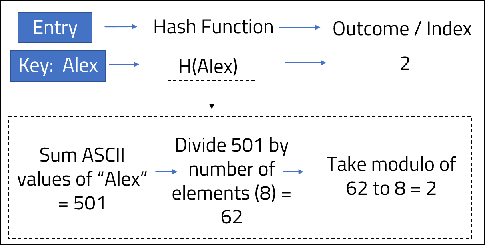

 
<strong>Key Takeaways</strong> 
&#8226; Hash tables and hash maps are efficient data structures to be used for data that requires dictionary operations. 
&#8226; Collisions occur when a hash function computes to the same value for different keys. 
&#8226; Collisions can be resolved with open addressing and closed addressing techniques. 

 
<h4>What are hash functions and why do we use them?</h4>

Hash functions are used to map data of any arbitrary size into a fixed length. Java uses hash functions in hash maps and hash tables as key-value data structures. 
Hash map and hash table are both efficient data structures to use for dictionary operations (insert, search, delete). There are just a few differences between hash map and hash table: 
&#8226; Hash map data is not synchronised, hash table data is synchronised. 
&#8226; Due to synchronisation, hash map operations can be performed faster than hash table. 
&#8226; Hash map allows one null key and any null values, hash table does not allow any null keys or values. 

As the differences between a hash maps and hash tables are negligible, the remainder of this post will use hash tables for consistency. The context of hash functions are equally as applicable to hash maps. 
Hash tables store data in a key-value pair that use a fast-access location known as a "bucket" for storing the value. Buckets are stored in an array; when an entry is made to a hash table, the position in which the value is stored within the array is calculated through the key of the entry. Hash tables can be designed for "direct-addressing" where each key is an integer and is directly used as the index position for where the corresponding value is stored in the array. Direct-addressing can create a problem as the size of the array used for storing keys can become excessively large. The number of keys stored within the array may be relatively small thus meaning the majority of the array space (and computer memory) assigned to the hash table is not utilised. 
Hash functions provide a solution to direct-addressing by reducing the array size for storage, but keeping an appropriate number of open buckets to store values. Each entry will use the key as an input to a hash function which will produce the index position to the bucket that the value is stored in. 

The hash function is defined by the <code class="java">public int hashCode()</code> method of the key. The example below demonstrates how a key-value pair of peoples names and age {String, Integer} can be placed within a hash table; H({key}) is read as "hash of {key}" and describes the use of the hash function to obtain the index position. 

 In other implementations of the hash table, the key and value can be completely different types of Objects. 

<strong>The benefit of using a hash table</strong>
 

Hash table resolves the time-complexity problem for searching, inserting, or deleting a value within an array when the index position is unknown. If an array has 100 integers, a for-each loop would result in up to 100 searches, and a time-complexity of O(n) - learn more on the time complexity <a target="_blank" href = "https://aneesh.co.uk/calculating-the-time-complexity-of-algorithms">here</a>. Hash tables support the direct searching of a value based upon its key. As a result, the hash table can pinpoint the index of the value instantly, regardless of the number of elements within the hash table. Hash tables support dictionary operations with a constant time O(1).

 
<h4>Hash function collisions</h4>

The example above does not explain how the hash function actually derived the Integer value from the String. The below image shows the formula within the hash function:

A collision will occur when the hash function computes two different keys into the same index position of the array. 
If a fourth entry with a key-value pair of: {"Phillip" , 19} was added to the hash table, the index position would equal 2 if we follow the same hash function: 
1. "Phillip" ASCII value = 722 
2. 722 / 8 = 90 
3. 90 % 8 = 2 
The addition of a new key, "Phillip", will create a collision with "Alex", which is also stored at index 2. Without a collision resolution, {"Alex" , 47} will be replaced by the key-value pair {"Phillip" , 19}.

As the hash table is populated with more entries, the potential for collisions increase. 
<strong>Load factor</strong> is an important statistic used with hash tables, defined as the <u>number of entries divided by the number of buckets</u>. A hash table can implement <strong>dynamic resizing</strong> where the array will be doubled in size when the load factor has reached a certain value. In practice, a load factor of 75% is deemed the upper-bound limit of populated buckets within the hash table array before it is resized. 

 
<h4>Resolving collisions</h4>

There are two strategies used for resolving collisions: 
&#8226; <strong>Open addressing</strong>: finding alternative locations for storing the collided value, ensuring only one value is stored per bucket. 
&#8226; <strong>Closed addressing</strong> (also known as chaining): storing an arbitrary number of values per bucket by using a separate data structure from within the bucket. 

 
<h5>Open addressing</h5>

<strong>Linear probing</strong>

Linear probing will re-direct the index to point to the next available bucket in the hash table. For the case of "Phillip", which otherwise would fall into bucket 2, the next available bucket would be bucket 3. As a result, the value of "Phillip" will be stored in bucket 3. If another key is added to the hash table with a hash function of 2, the value will instead be stored in bucket 4. 

<u>Cluster effects</u>

Clustering in hash tables refers to the degree that items are "bunched" when stored. A high degree of clustering is likely to increase the chances of collisions, and as a result, can result in less efficient storage of data.  

Linear probing can create high amounts of clustering within an array as buckets become populated near each other. Quadratic and double-hash probing algorithms aim to reduce the possibility of high clustering within an array.

<strong>Quadratic probing</strong>

Quadratic probing resolves collisions by using a quadratic equation to compute the new index away from the original hash function index. The following indices would be checked sequentially for the example of "Phillip" (also assuming a much larger size array): 
&#8226; 7 + (1*1) = index 8.  
&#8226; 7 + (2*2) = index 11.  
&#8226; 7 + (3*3) = index 16.  
&#8226; 7 + (4*4) = index 23.  
&#8226; 7 + (5*5) = index 32.  
&#8226; 7 + (6*6) = index 43.  
The quadratic probing collision resolution will result in a less dense cluster of values than linear probing.

<strong>Double-hash probing</strong>

Double-hash probing resolves collisions by applying a secondary hash to the computed index to create a new random index. A second hash function can be defined and the subsequent index will be computed upon by alternating between hash functions until an empty bucket is found. 

 

Open addressing can enable collisions to be resolved with loose clustering to reduce the chance of repeated collisions. The use of quadratic and double-hashing algorithms, however, increases the compute time of the hash function. When a search operation is performed on a hash table, the computational cost will accumulate through the additional probing algorithms and the degree of clustering within the hash table. Closed addressing offers a resolution to collision hashing which avoids the need for expensive computations to find new index positions.

 
<h5>Closed addressing</h5>

Closed addressing offers a more direct approach to collision resolution; rather than finding a new bucket to store the value, each bucket contains a linked list that can be appended upon. 
When a hash function identifies a new collision, the value will be placed in the next available position within the linked list of the bucket. 
When a search is conducted upon the hash table, the hash function will identify the bucket and list position of the respective value. The addition and retrieval of a value within a linked list is performed at constant time O(1), therefore closed addressing supports the efficient storage of values to the hash table.

 
<h4>Conclusion</h4>

Hash functions are algorithms that are used to convert a key into an arbitrary integer. Hash functions enable the hash table to have an efficient computer memory consumption by defining the boundaries of possible index positions in which a value can be stored. Collision resolution techniques are important to understand as they support the use of hash functions by maintaining the integrity and performance of the hash table. 
By understanding the differences between open and closed addressing, a hash table can be designed to store collided hash values in an optimised manner. 

 
<small style="float: right;" >Picture: Riobamba, Ecuador by <a target="_blank" href="https://unsplash.com/@ezekiel">Fernando Tapia</small></a> 