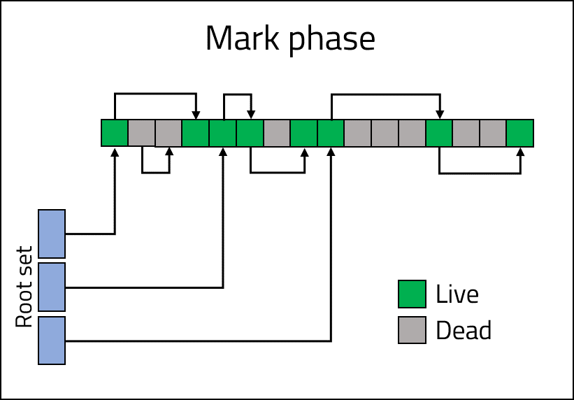
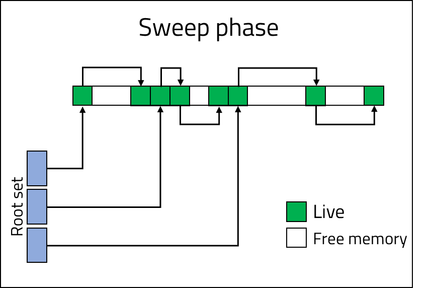
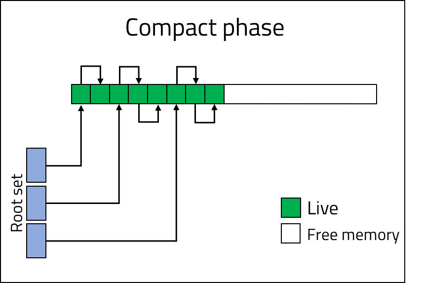
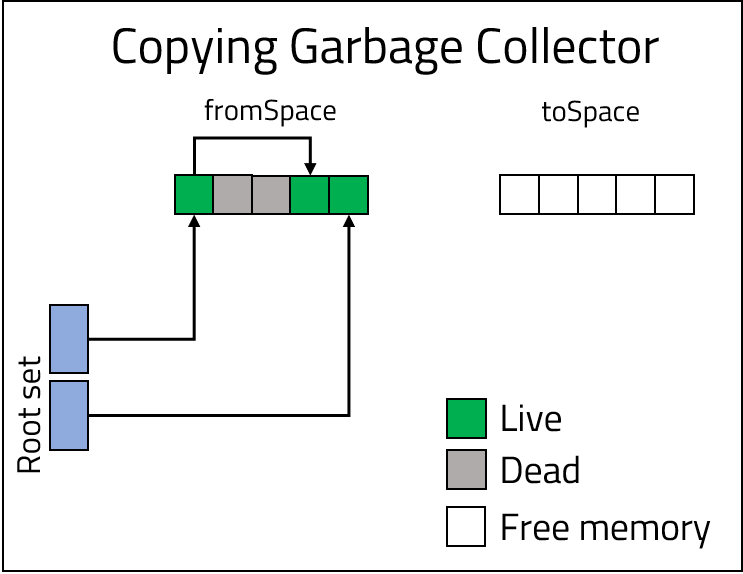
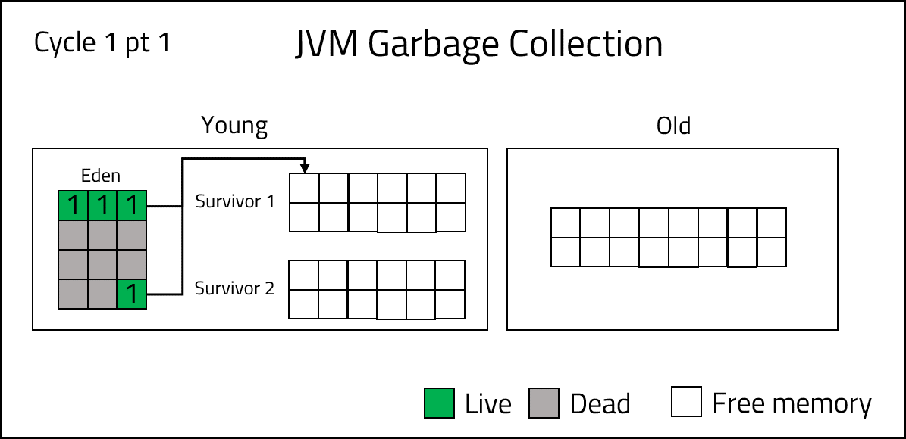
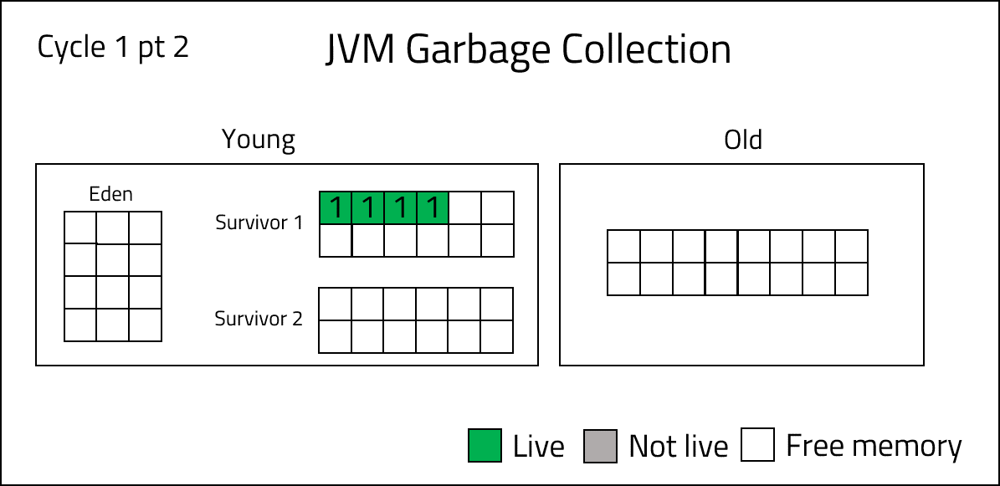
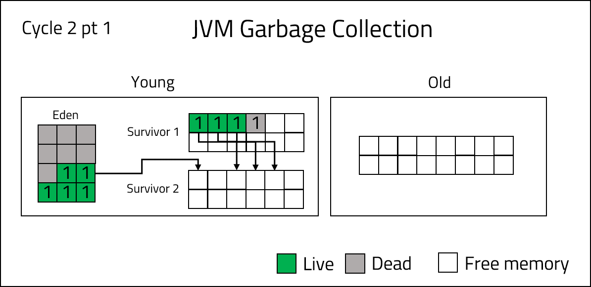
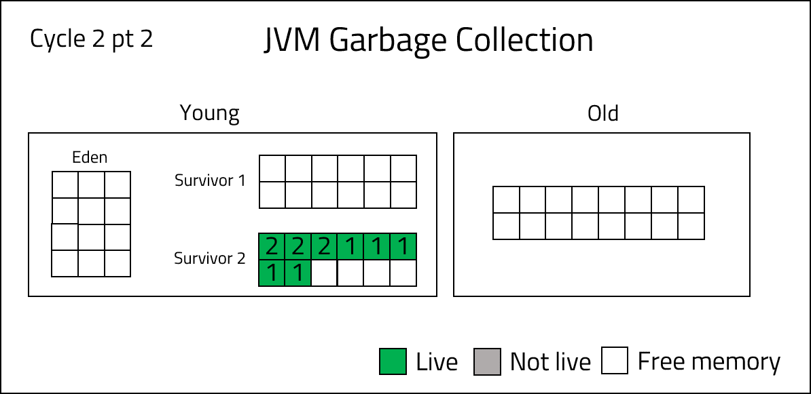
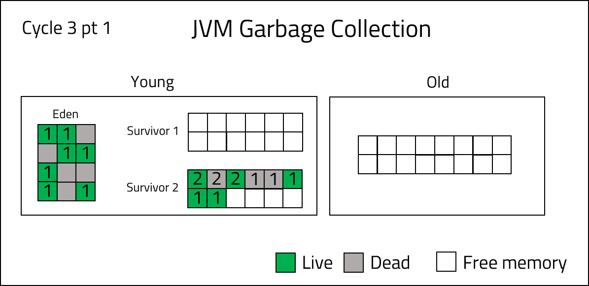
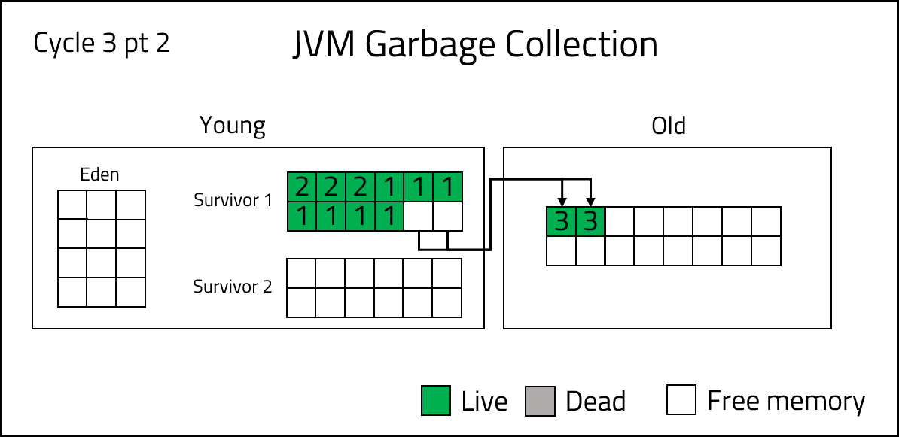

<br>
<strong>Key Takeaways</strong><br>
&#8226; Memory management plays a vital role in the performance of an application.<br>
&#8226; Java uses a garbage collector to automatically manage memory on behalf of the developer.<br>
&#8226; There are six different types of garbage collectors.<br>

<br>
<h4>Automated memory collection in Java</h4>
<p>
Memory management is the process of assigning memory to Objects created by an application and releasing the memory when the Object is no longer required.<br>
In languages such as C++ and C, the developer will need to manually allocate Objects memory using methods such as <code class="language-c++">malloc()</code> and <code class="language-c++">calloc()</code>. If the developer does not remember to release the Object from the memory, a <i>Memory leak</i> could occur.<br>
<p>
<strong><i>Memory leak: when an Object continues to consume memory even after it is needed or when an Object stored in memory cannot be accessed by the programme.</i></strong> 
</p>
Memory management can be completed with many different strategies to ensure the application efficiently frees and allocates memory during execution. Memory management techniques used within applications are primarily concerned with the performance requirements of the following factors:<br>
&#8226; <strong>Throughput</strong>: how quickly memory can be freed from Objects that are no longer required.<br>
&#8226; <strong>Stop the world events</strong>: a period when the application is completely stopped to allow memory to be freed and assigned to all live Objects in the application.<br>
&#8226; <strong>Memory fragmentation</strong>: when memory is unevenly distributed across a memory block, leaving gaps of unfilled memory slots between Objects. There is a cost-benefit consideration that may arise between the performance gain of leaving memory fragmented against the cost of memory defragmentation to the application runtime.<br>
</p>

<br>
<h4>Garbage collectors</h4>
<p>
Java makes use of garbage collectors which promise the developer that Objects later referenced within the application will not be deleted from memory. Without such as promise, it is possible that a separate thread may obtain access to an Object reference and remove its memory allocation thus resulting in a null pointer when the Object is referenced from a different thread.
</p>
<br>
<h4>The different types of garbage collectors</h4>
<p>
There are 6 different types of garbage collectors that can be selectively used together. The different types of collectors allow an application to efficiently manage memory with the relative importance of throughput, memory fragmentation, and stop the world events implemented by design. 
</p>
<br>
<h5>Do nothing garbage collector</h5>
<p>
Do nothing collectors will only guarantee that live Objects are kept alive.
</p>
<h5>Reference counting garbage collector</h5>
<p>
Reference counting resolves the problem of having circular references within our code. As the garbage collector is responsible for collecting dead (unreferenced) Objects, a circular reference, where two Objects reference each other, can create a condition whereby neither Object will be collected. Circular referencing exists in the example below:

```java{numberLines: true}
class One {
    private Two two;
     
    public void setTwo(Two two) {
        this.two = two;
    }
}
 
class Two {
    private One one;
     
    public void setOne(One one) {
        this.one = one;
    }
}
 
public class App {
    public static void main(String[] args) {
        //one instance of each class is created
        One instanceOne = new One();
        Two instanceTwo = new Two();
 
        // A circular reference is made between the two classes
        instanceOne.setTwo(instanceTwo);
        instanceTwo.setOne(instanceOne);
 
        // Although the classes are now null, their reference to each other
        // remains in the other's method, therefore preventing collection
        instanceOne = null;
        instanceTwo = null;
    }
}
```

</p>
<p>
Reference counting will resolve the problem of circular references; each Object will own a counter that is incremented and decremented as they are referenced and dereferenced. As a result, the counter assigned to each Object will allow the garbage collector to identify Objects that are truly referenced by the root set.<br><br>
<strong><i>Root set: the initial set of Objects from which the reachability of all the other Objects can be derived upon.</i></strong>
</p>
<br>
<h5>Mark and sweep garbage collector</h5>
<p>
Mark and sweep performs three individual phases in garbage collection:<br>
&#8226; <strong>Mark</strong>: identify Objects that are currently in use.<br>
&#8226; <strong>Sweep</strong>: remove unused Objects.<br>
&#8226; <strong>Compact</strong>: remove memory fragmentation that may occur from the sweep phase.<br>
</p>

<strong>Mark phase</strong>
<p>
During the mark phase, the Objects that are reachable are identified by following the course of the root set.<br>
In the image below, the identified Objects within the memory are marked as 'live', Objects that reference each other without a root set reference will not be marked as live.
</p>



<br>
<strong>Sweep phase</strong>
<p>
During the sweep phase, the Objects that were not marked as 'live' are removed from the heap memory. As a result, the memory block contains only live Objects.
</p>




<br>
<strong>Compact phase</strong>
<p>
The current memory block contains a fragmented distribution of Objects. During the compact phase, the physical memory address of each Object is changed. The Objects are rearranged in the memory block so that they are aligned next to each other. If a compact phase was not executed, Objects would need to fit within the fragmented spaces of the memory block if they are to be stored. Following the compact phase, the memory block has an open space to add Objects as they are assigned to the heap, thus allowing the full memory block to be utilised.
</p>




<h5>Copying garbage collector</h5>
<p>
The copying garbage collector uses two memory blocks: 'fromSpace' and 'toSpace'. During each garbage cycle, Objects will be stored in one of the blocks; the block used for storage is known as the 'fromSpace' block. When the 'fromSpace' block becomes full, a mark and sweep will be performed by the garbage collector, moving the live Objects into the 'toSpace' memory block. The 'fromSpace' memory block will now be empty and will be referenced as the 'toSpace' memory block for the next collection cycle.




</p>
<br>
<h5>Incremental garbage collector</h5>
<p>
An incremental garbage collector does not look at all the Objects during a collection; the cost of the collection is therefore reduced. Similar to the copying garbage collector, the incremental collector will use different memory blocks to divide the Objects that are to be reviewed based upon certain characteristics.
</p>
<br>

<h5>Generational garbage collector</h5>
<p>
A generational garbage collector is a form of incremental garbage collector. Generational collectors aim to improve the efficiency of a mark and sweep cycle by dividing Objects into sets (generations) according to when they were last used. As an Object survives a mark and sweep cycle, they are promoted into an 'older' generation which are reviewed less frequently for collection. Different generational garbage collectors will implement rules that determine when an Object is promoted and when generations are reviewed by the cycle. Once an Object is moved into the older generation, the younger generation is cleared to allow new Objects to be assigned memory. 
</p>

<br>
<h5>How the Java Virtual Machine uses garbage collection</h5>
<p>
The JVM uses generational, copying, and mark and sweep garbage collectors strategies. The JVM garbage collector consists of two generations: young and old. There are two types of garbage collections: <strong>minor</strong> collections that occur within the young generation, and <strong>full</strong> collections that occur across both generations.<br>
The young generation has 3 different memory spaces within it: <br>
&#8226; <strong>Eden space</strong>: where new Objects are directly allocated memory.<br>
&#8226; <strong>Survivor space 1 and 2</strong>: live Objects are assigned into one of the spaces following a minor collection. The two spaces are used for copying garbage collection and memory defragmentation.
</p>
<p>
<strong>Garbage collection cycles within the JVM</strong><br>
The example below shows the movement of Objects within a JVM garbage collection:<br>
1. New Objects are assigned to the Eden space upon creation.<br>
2. When the Eden space is full, a minor collection is run using a mark and sweep. <br>




<p>
3. Objects that survive the mark and sweep are assigned into one of the survivor spaces. Below, 
the marked Objects from the Eden space are moved into the Survivor 1 memory block.<br>

</p>



<p>
4. When the Eden space becomes full again, the minor collection will be performed on the Eden and Survivor 1 space. The Objects that survive the collection are moved into the survivor space 2.<br>
</p>



<p>
The Objects are compressed in survivor space 2. They have a number assigned to them which represents the number of cycles they have survived.
</p>



<p>
5. The JVM can define a number of cycles an Object must survive before it is eligible to be promoted into the old generation. In the example below, 3 cycles are used as the promotion value. When the survivor and eden space are full, Objects that meet the criteria for promotion are moved into the old generation. The old generation Objects will no longer be reviewed by the minor collection.
</p>



<br>



<p>
6. When the old generation eventually becomes full, a <strong>full</strong> garbage collection is run. The full collection will scan both generations, perform a mark and sweep and remove dead Objects from the young and old generations. 
</p>

</p>
<p>
The JVM garbage collector assumes that Objects either live for a short time, or they live <i>forever</i>. By dividing the memory blocks into generations, the memory management system can utilise minor collections to identify and remove short-lived Objects while only using stop the world events sparingly during full collections of the old and young generation.
</p>
<br>
<h4>Conclusion</h4>
<p>
Garbage collectors introduce different types of mechanisms for allocating and freeing memory within an application.
There are many variables that are involved with garbage collection that require consideration. The many types of implementations also allow the garbage collector to leverage different styles to efficiently manage memory. The JVM garbage collector process covered in this blog post is the default serial garbage collector. The multi-threaded capability of Java can enable concurrent garbage collectors to minimise the use of stop the world events. There are three other collectors that can be used in Java which offer various advantages and drawbacks for application behaviour: G1, parallel, and CMS.
</p>

<br>
<small style="float: right;" >Picture: Golden Gate Bridge, San Francisco by <a target="_blank" href="https://unsplash.com/@mvdheuvel">Maarten van den Heuvel</small></a><br>