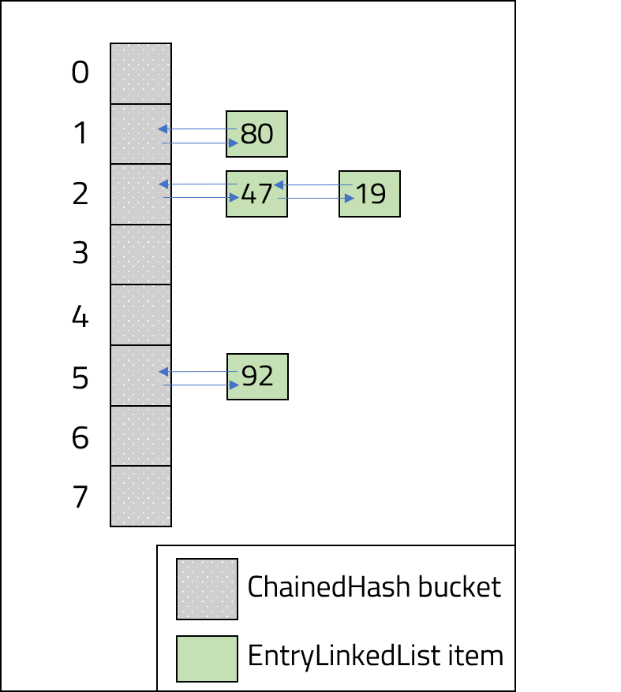
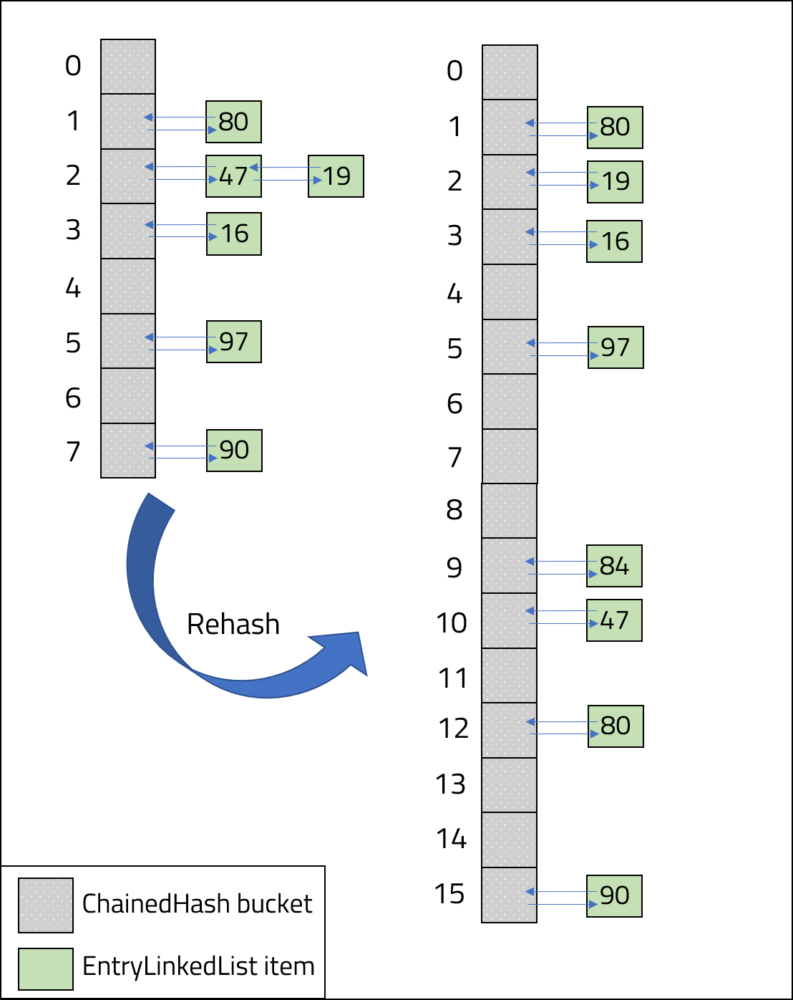

<br>
<strong>Key Takeaways</strong><br>
&#8226; Write functions to enable a hash table to resolve collisions with chaining.<br>
&#8226; Write a rehash function to recreate a hash table with a smaller load factor.<br>
&#8226; Use variables such as load factor, hash function and buckets to influence hash table performance.<br>

<br>
<h4>Chaining in a hash table</h4>
<p>
Hash collisions occur within a hash table or hash map when multiple keys have the same output from a hash function. 
Chaining, also known as closed addressing, is a technique used to store the value of a key when a hash collision occurs.
If you are unfamiliar with chaining, please visit my blog where I explore hash collisions and solutions <a target="_blank" href="https://aneesh.co.uk/resolving-hash-collisions"><u>here</u></a>.<br>
In this post, I will implement chaining with a hash table. The hash table will resolve collisions that occur within a bucket by storing the collided values into a LinkedList.
</p>

<h4>Implementing chaining</h4>
<p>
The hash table design will consist of two classes:<br>
&#8226; <code class="language-java">ChainedHash</code>: the hash table class.<br>
&#8226; <code class="language-java">EntryLinkedList</code>: the LinkedList Object appended to each bucket of the ChainedHash instance.<br>
The diagram below illustrates how the two classes will be used together. The numbers inside the EntryLinkedList Objects represent the values from their key:<br>
</p>



<br>
<p>
The ChainedHash class will use the following methods to implement chaining:<br>
&#8226; <code class="language-java">put(key, value)</code> to place key-value pairs in the hash table.<br>
&#8226; <code class="language-java">hashFunction(key)</code> to calculate the hash value of the key.<br>
&#8226; <code class="language-java">validateLoadFactor()</code> to ensure the load factor of the hash table is monitored and adjusted as new entries are made.
<br>
</p>
<p>
The buckets within the ChainedHash class will be an array of EntryLinkedList Objects. Each EntryListObject will contain the following variables:<br>
&#8226; <code class="language-java">String key</code> to store the key.<br>
&#8226; <code class="language-java">int value</code> to store the value.<br>
&#8226; <code class="language-java">EntryLinkedList nextListEntry</code> to link additional key-value pairs to the bucket.<br>
</p>
<br>
<h5>Class: EntryLinkedList</h5>
<p>
The EntryLinkedList constructor will instantiate the key, value and nextListEntry.
There are getters and setters for the value and nextListEntry, and a getter for the key.<br>

```java{numberLines: true}
    private String key;
    private int value;
    private EntryLinkedList nextListEntry;
        
    EntryLinkedList(String key, int value) {
        this.key = key;
        this.value = value;
        this.nextListEntry = null;
    }
```

</p>
<br>
<h5>Class: ChainedHash</h5>
<p>
The ChainedHash class instantiates its buckets from the constructor. The load factor for the hash table will be evaluated against a static constant: <code class="language-java">MAX_LOAD_FACTOR</code>. The MAX_LOAD_FACTOR represents the upper-bound value of the load factor. The constructor will take an argument to define the initial number of buckets and it will instantiate all buckets to null.
<br>

```java{numberLines: true}
    private double loadFactor;
    EntryLinkedList[] hashTableBuckets;
    private static int numberOfBuckets;
    private double numberOfEntries = 0;
    public static final double MAX_LOAD_FACTOR = 0.75;

    public ChainedHash(int bucketsToCreate){
        numberOfBuckets = bucketsToCreate;
        hashTableBuckets = new EntryLinkedList[numberOfBuckets];
        for (int i = 0; i < numberOfBuckets; i++) {
            hashTableBuckets[i] = null;
        }
    }
    ...

```

<br>
The <code class="language-java">hashFunction(String key)</code> method is used to calculate the hash value of the key passed in. The hash function will sum the ascii values of the String (lines 4 to 6) and return the modulo of the sum against the number of buckets (line 9 and 11):<br>

```java{numberLines: true}
    public static int hashFunction(String key) {

        int asciiValue = 0;
        for (int i = 0; i < key.length(); i++) {
            char c = key.charAt(i);
            asciiValue = asciiValue + (int) c;
        }

        int hashValue = Math.round(asciiValue % numberOfBuckets);

        return hashValue;
    }
```
<br>
The <code class="language-java">validateLoadFactor()</code> method is called within the put(key, value) method to ensure the load factor of the hash table is not greater than the MAX_LOAD_FACTOR constant. If the load factor is greater than MAX_LOAD_FACTOR, the numberOfBuckets static value is doubled (line 4) and the hash table is replaced by calling the <code class="language-java">rehash()</code> method (line 6).

```java{numberLines: true}
    private void validateLoadFactor() {
        if(calculateLoadFactor() > MAX_LOAD_FACTOR){
            System.out.println("Current load factor: " + calculateLoadFactor() );
            numberOfBuckets = numberOfBuckets * 2;
            System.out.println("Buckets raised to: " + numberOfBuckets + " buckets.");
            this.rehash();
        }
    }
```
<br>
<p></p>
The rehash method will recreate the hash table using the updated number of buckets in 4 steps:<br>
1. On line 3, a temporary EntryLinkedList array is created as a replica of the existing array.<br>
2. On line 5, the existing EntryLinkedList is replaced by a new array with the new number of buckets.<br>
3. On line 6, the <code class="language-java">numberOfEntries</code> static value is reset to ensure the new load factor is correctly recalculated.<br>
4. From line 7, the new hash table is created by looping through the previous entries in the <code class="language-java">temp</code> array and appending them into the new EntryLinkedList.<br>
</p>
<p>
Note, the hash function is also adjusted to the new <code class="language-java">numberOfEntries</code> value and will therefore compute new index positions for each key into the new EntryLinkedList array. 
</p>

```java{numberLines:true}
  private void rehash(){

        EntryLinkedList[] temp = hashTableBuckets;

        hashTableBuckets = new EntryLinkedList[numberOfBuckets];
        numberOfEntries = 0;
        for(int i = 0; i< temp.length; i++){
            if(temp[i] != null){
                this.put(temp[i].getKey(), temp[i].getValue());

                while(temp[i].getNextListEntry()!= null){
                    this.put(temp[i].getNextListEntry().getKey(), temp[i].getNextListEntry().getValue());
                    temp[i] = temp[i].getNextListEntry();
                }
            }
        }
    }


```
<br>
<p>
The diagram below illustrates the change made to the hash table following a rehash as it doubles in size and realigns each key-value pair.<br>
</p>



<br>
<p>
The <code class="language-java">put(key, value)</code> method is used to add a new key-value pair into the hash table. The put method consists of 4 key steps:<br>
1. The <code class="language-java">hashFunction(key)</code> method is used on line 2 to calculate the hash value for the key.<br>
2. On line 5, the load factor is verified against the MAX_LOAD_FACTOR. <br>
3. On line 7, the put method checks if the existing hashFunction value already has an EntryLinkedList Object in the array.
If the array position is null, the put method will create a new EntryLinkedList and populate the first position with the value (line 9).<br> 
4. If there already exists an EntryLinkedList in the bucket, the put method will loop over the EntryLinkedList array (line 14) to either replace the value of the existing key (line 20) or append the value into the next position on the EntryLinkedList (line 23).
</p>

```java{numberLines: true}
    public void put(String key, int value) {
        int hashValue = hashFunction(key);
        numberOfEntries++;

        validateLoadFactor();

        if (hashTableBuckets[hashValue] == null) {

            hashTableBuckets[hashValue] = new EntryLinkedList(key, value);

        } else {
            EntryLinkedList hashValueLinkedList = hashTableBuckets[hashValue];

            while (hashValueLinkedList.getNextLinkedValue() != null && !hashValueLinkedList.getKey().equals(key)) {
                hashValueLinkedList = hashValueLinkedList.getNextLinkedValue();
            }

            if (hashValueLinkedList.getKey().equals(key)) {
                hashValueLinkedList.setValue(value);
            } else {
                Application.numberOfCollisions++;
                hashValueLinkedList.setNextListEntry(new EntryLinkedList(key, value));
            }
        }
    }
```

<br>
<h5>Using the hash table from the main method</h5>
<p>
The main method will begin by instantiating a ChainedHash instance with 8 buckets. The instance will then call the put method followed by the <code class="language-java">printEntryLinkedList()</code> method which will print each entry of the hash table to the console.<br>
</p>

```java{numberLines: true}
    ChainedHash hashTable = new ChainedHash(8);

        System.out.println("First entry (Alex, 47)..");
        hashTable.put("Alex", 47);
        hashTable.printEntryLinkedList();

        System.out.println("\nOne more entry (George, 80)..");
        hashTable.put("George", 80);
        hashTable.printEntryLinkedList();

        System.out.println("\nOne more entry (Phillip, 19)..");
        hashTable.put("Phillip", 19);
        hashTable.printEntryLinkedList();

        System.out.println("\nOne more entry (Eliza, 97)..");
        hashTable.put("Eliza", 97);
        hashTable.printEntryLinkedList();

        System.out.println("\nOne more entry (John, 90)..");
        hashTable.put("John", 90);
        hashTable.printEntryLinkedList();

        System.out.println("\nOne more entry (Lin, 16)..");
        hashTable.put("Lin", 16);
        hashTable.printEntryLinkedList();

        System.out.println("\nOne more entry (Miranda, 84)..");
        hashTable.put("Miranda", 84);
        hashTable.printEntryLinkedList();

        System.out.println("\nTotal collisions: " + numberOfCollisions);

```

<br>
<h5>Output review</h5>
<p>
The output includes many debugging lines such as the hash table output and a prompt of what action is being taken for the explanation.
</p>
<p>
The main method adds key-value pairs as expected up to the third put call (line 11 main method). The key-value pair of (Phillip, 19) maps into index position 2 from the hash function. As a result of the collision, the value of Phillip is appended to the EntryLinkedList instance with (Alex, 47) on line 10 in the output.
</p>
<p>
When the 7th entry is made on line 28 in the main method (Miranda, 84), the load factor of the hash table is calculated as 0.875 (line 31 in the output). The load factor exceeds the 0.75 MAX_LOAD_FACTOR constant and the hash table is doubled in size to 16 buckets (line 32 in the output). Each entry of the existing hash table is recalculated in the rehash.</p>
<p>
The final output of the hash table is shown from lines 33 to 39 in the output. Each index position for the key-value pairs are recalculated and almost all entries move to a different bucket. The new hash table reduces the likelihood of collisions as there are more buckets. The only collision that occurred from the original 8-bucket ChainedHash has been reduced to separate buckets.
</p>
<p>
The efficiency of the hash table can be evaluated against the number of collisions that are created (as a result of the hash function) and the number of times a rehash is performed. Collisions  retain constant time access within the hash table, however rehashing will create a performance cost as each entry must be recalculated and entered.  
</p>

```{numberLines: true}
First entry (Alex, 47).. 
[hash value='2', key='Alex', value=47], null

One more entry (George, 80)..
[hash value='1', key='George', value=80], null
[hash value='2', key='Alex', value=47], null

One more entry (Phillip, 19)..
[hash value='1', key='George', value=80], null
[hash value='2', key='Alex', value=47], [hash value='2', key='Phillip', value=19], null

One more entry (Eliza, 97)..
[hash value='1', key='George', value=80], null
[hash value='2', key='Alex', value=47], [hash value='2', key='Phillip', value=19], null
[hash value='5', key='Eliza', value=97], null

One more entry (John, 90)..
[hash value='1', key='George', value=80], null
[hash value='2', key='Alex', value=47], [hash value='2', key='Phillip', value=19], null
[hash value='5', key='Eliza', value=97], null
[hash value='7', key='John', value=90], null

One more entry (Lin, 16)..
[hash value='1', key='George', value=80], null
[hash value='2', key='Alex', value=47], [hash value='2', key='Phillip', value=19], null
[hash value='3', key='Lin', value=16], null
[hash value='5', key='Eliza', value=97], null
[hash value='7', key='John', value=90], null

One more entry (Miranda, 84)..
Load factor is too high: 0.875
Buckets raised to: 16 buckets.
[hash value='2', key='Phillip', value=19], null
[hash value='3', key='Lin', value=16], null
[hash value='12', key='Miranda', value=84], null
[hash value='5', key='Eliza', value=97], null
[hash value='9', key='George', value=80], null
[hash value='10', key='Alex', value=47], null
[hash value='15', key='John', value=90], null

Total collisions: 1
```
</p>
<br>
<h4>Conclusion</h4>
<p>
The implementation of chaining in a hash table can be achieved with just a few methods that cover the load factor evaluation, rehash, and put. By experimenting with the hash function, MAX_LOAD_FACTOR and the number of buckets from instantiation, the performance of the hash table can be altered to reduce the number of rehashes required, the bunching of values in buckets and collision frequency.<br>
Feel free to clone the source code from this blog on <a target="_blank" href="https://github.com/4neesh/HashTableChainingDemo"><u>GitHub</u></a> to test the impact of more entries on the performance of the hash table.
</p>

<br>
<small style="float: right;" >Picture: Bariloche, Argentina by <a target="_blank" href="https://unsplash.com/@ggiqueaux">Geronimo Giqueaux</small></a><br>