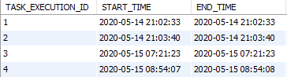
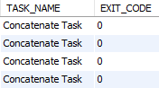
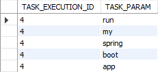

<br>
<strong>Key Takeaways</strong><br>
&#8226; Use Spring Cloud Task to create a microservice that executes an asynchronous task.<br>
&#8226; Connect a Spring Cloud Task to a MySQL database to store runtime execution data.<br>
&#8226; Review the information that can be obtained by default from the Spring Cloud Task execution.<br>

<br>
<h4>What is an asynchronous task?</h4>
<p>
An asynchronous task is a parallel function that is executed separately from the main application thread. Asynchronous tasks are designed to be stateless and have a distinct start and end time. Without asynchronous tasks, microservices may wait upon other microservices to finish executing their task before they resume processing. As a result, application performance can risk a latency build-up due to a single task execution.

Spring Cloud Task enables asynchronous tasks to be performed within a Spring Boot application. 
One example of an asynchronous task may involve messaging. Rather than a microservice depending on feedback that a message has been processed and executed, the message can be sent to a bus using Spring Cloud Task. As a result, the dependency of message processing is decoupled from the microservice and the bus can be independently scaled to process messages with event-driven computing.

In this post, Spring Cloud Task will be used to execute simple business logic. The runtime execution of the task generates a log of default fields that can be persisted in a MySQL database.
</p>
<br>
<h4>Creating a Spring Cloud Task</h4>
<p>
A Spring Cloud Task can be created through the Spring initializer. The dependencies of a MySQL Driver and JDBC API are also necessary for connecting with a MySQL Database:<br>
    &#8226; Spring Cloud Task.<br>
    &#8226; MySQL Driver.<br>
    &#8226; JDBC API.<br>
</p>

    
```
	<dependency>
        <groupId>org.springframework.cloud</groupId>
        <artifactId>spring-cloud-starter-task</artifactId>
    </dependency>

    <dependency>
        <groupId>mysql</groupId>
        <artifactId>mysql-connector-java</artifactId>
    </dependency>
			
    <dependency>
        <groupId>org.springframework.boot</groupId>
        <artifactId>spring-boot-starter-jdbc</artifactId>
    </dependency>
```

<p>
The main class is annotated with <strong>@EnableTask</strong> to bootstrap the functionality of Spring Cloud Task. By default, the annotation will equip the microservice with a log of data from the runtime execution, known as the TaskRepository, stored in-memory.
</p>


```java{numberLines:true}
    @SpringBootApplication
    @EnableTask
    public class AdditionApplication {

        public static void main(String[] args) {
            SpringApplication.run(AdditionApplication.class, args);
        }
    }

```
<p>
A sub-class that implements CommandLineRunner is used to execute the business logic.<br> 
The CommandLineRunner interface is one of two interfaces (along with ApplicationRunner) that allows methods to be run once a Spring Boot application has started. The CommandLineRunner interface provides access to the arguments passed into the application by overriding the <code class="java">run(String... args)</code> method.<br>
If the microservice has multiple implementations of CommandLineRunner, the classes can be ordered with the <strong>@Order</strong> annotation. 
</p>

```java{numberLines: true}
	public class Concatenator implements CommandLineRunner{

		@Override
		public void run(String... args) throws Exception {

			if(args.length > 0) {
				StringBuilder concatenation = new StringBuilder();
				for(String argument : args) {
					concatenation = concatenation.append(argument);
				}
				System.out.println("Concatenated arguments: " + concatenation);
			}
			else {
				System.out.println("No arguments made to spring task");
			}	
		}		
	}
```
<p>
A bean is added to the main class to ensure the sub-class and the business logic is processed by Spring at runtime.
</p>

```java{numberLines:true}
    @Bean
	public Concatenator createConcatenator() {
		return new Concatenator();
	}

```

<br>
<h4>Creating a MySQL database</h4>
<p>
A database named 'springCloudTask' is created within the MySQL CLI using the following command:
</p>

```
mysql> create database springCloudTask
```
<p>The database exists without any tables and can be validated with the following commands:</p>

```
mysql> use springCloudTask
Database changed
mysql> show tables;
Empty set (0.07 sec)
```
<p>
When the Spring Cloud Task is connected to the database, it will automatically create and populate tables if they do not exist.
</p>
<br>
<h4>Connecting the Spring Cloud Task with the MySQL database</h4>
<p>
Before the Spring Cloud Task can be run, the <strong>application.properties</strong> file must be updated to reference the newly created database:<br>
</p>

```{numberLines:true}
spring.application.name=Concatenate Task
logging.level.org.springframework.cloud.task=DEBUG
spring.datasource.url=jdbc:mysql://localhost:3306/springcloudtask?useSSL=FALSE
spring.datasource.username={ENTER USERNAME}
spring.datasource.password={ENTER PASSWORD}

```
<p>
Line 1 will provide a name to the application for debugging.<br>
Line 2 will provide additional debugging into the log.<br>
Line 3 will connect to the database through the port number.<br>
Lines 4 and 5 are to be updated with the appropriate credentials for database connection.
</p>
<p>
Before the Spring Cloud Task is executed, update the run configurations to include arguments that are to be concatenated by the business logic. For example, pass in the arguments "run my spring boot app".
</p>
<br>
<h4>Task execution</h4>
<p>
After running the Spring Cloud Task, the following lines are printed amongst many others to the console:<br>
</p>

```
Initializing task schema for mysql database
```
```
Creating: TaskExecution{executionId=0, ..., taskName='Concatenate Task', startTime= {...}, endTime=null, exitMessage='null',..., arguments=[run, my, spring, boot, app]}
Concatenated arguments: runmyspringbootapp
```
<p>
The Spring Cloud Task has executed and shown the start and end time of the task along with the arguments that have been processed.<br>
The execution has also created 5 new tables in the database, found through the MySQL CLI:</p>

```
mysql> show tables;

+---------------------------+
| Tables_in_springcloudtask |
+---------------------------+
| task_execution            |
| task_execution_params     |
| task_lock                 |
| task_seq                  |
| task_task_batch           |
+---------------------------+
5 rows in set (0.16 sec)

```
<p>
The tables show the following information:<br>
&#8226; <strong>task_execution</strong>: key details about when the task runtime such as id, start time, end time, exit code and exit message.<br>
&#8226; <strong>task_execution_params</strong>: log of the parameters passed into the Spring Cloud Task.<br>
&#8226; <strong>task_lock</strong>: stores information when Spring Cloud Task restrictions are applied.<br>
&#8226; <strong>task_seq</strong>: an incremental Id is stored and obtained as a reference for the next execution.<br>
&#8226; <strong>task_task_batch</strong>: links the task execution with the batch execution.<br>
</p>
<p>
The <strong>task_execution</strong> and <strong>task_execution_params</strong> tables are most relevant to this example as they provide details of the runtime execution. The tables can be viewed from the workbench or the CLI:
</p>
<p>
Task execution table:






</p>
<br>

<p>
Task execution parameters table:



</p>
<br>
<h4>Conclusion</h4>
<p>
Spring Cloud Tasks enable tasks with a set start and end time to be decoupled within a microservices architecture. With just a few dependencies and lines in the application.properties file, task execution can be logged into a persistent database.<br>
The Spring Cloud Task can be taken further by deploying it into a Maven repository where it can be called upon by other microservices. <br>
The code sample from this blog can be found on GitHub <a target="_blank" href="https://github.com/4neesh/DeveloperBlogDemos/tree/master/SpringCloudTask">here</a>.
</p>

<br>
<small style="float: right;" >Picture: Split Rock Lighthouse, Minnesota by <a target="_blank" href="https://unsplash.com/@saluken">Luke Tanis</small></a><br>