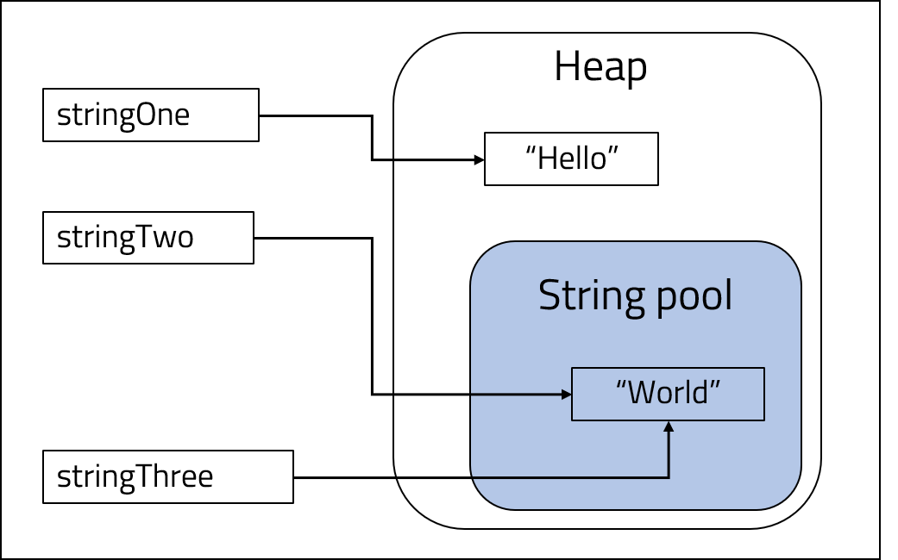
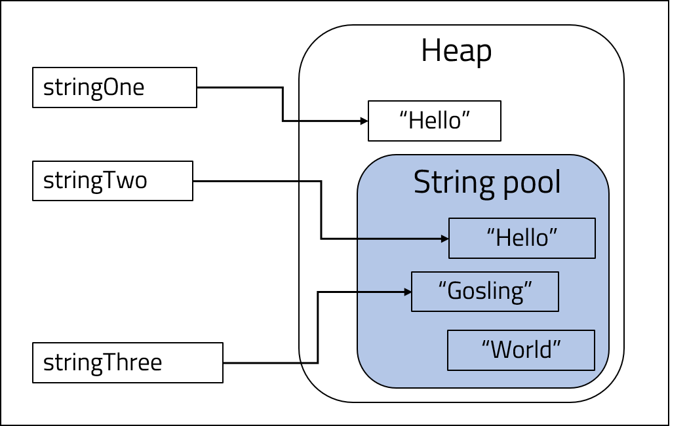
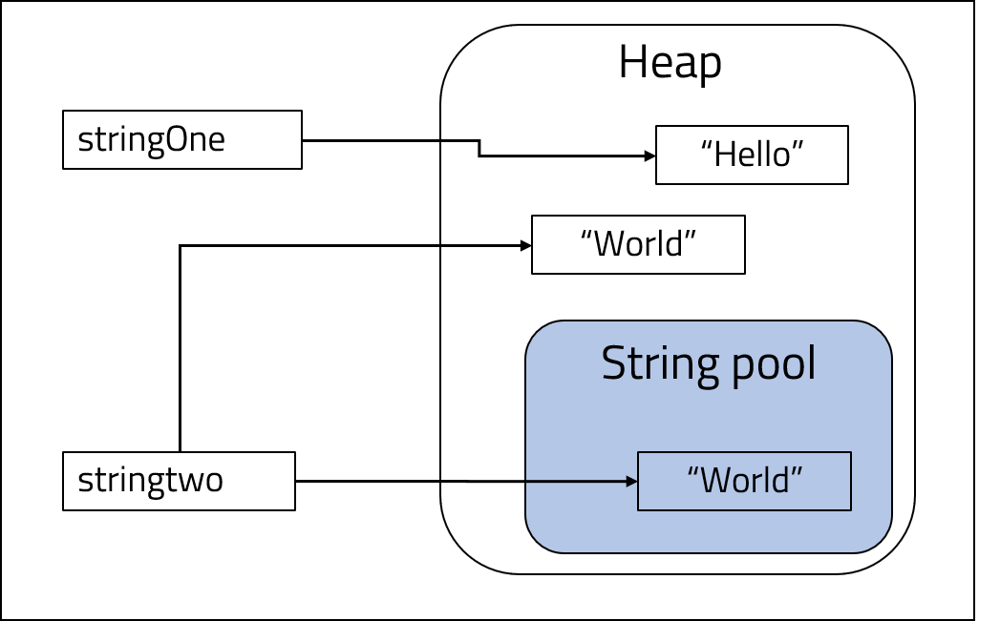

<br>
<strong>Key Takeaways</strong><br>
&#8226; String literals are stored within a dedicated area of the heap area.<br>
&#8226; String instantiation can determine how it can be equated to other Strings.<br>
&#8226; The StringBuffer and StringBuilder classes offer methods that allow a sequence of characters to be handled as a mutable Object.<br>

<br>
<h4>Introduction to java.lang.String</h4>
<p>
The String class is used in Java to create an immutable sequence of unicode characters; each String Object is immutable and final, and therefore thread-safe. The following code sample demonstrates how a String can be instantiated with the <code language="java">new</code> operator or as a literal:
</p>

```java{numberLines:true}
    String stringOne = new String("Hello");
    String stringTwo = "World";
```
<p>
The memory allocation of String Objects is determined by how they are instantiated. The <code language="java">new</code> operator will assign the String into the heap memory, however, a literal String will be stored into the <i>String pool</i>.
</p>
<p>
<strong>String pool</strong><br>
The String pool is a dedicated area within the heap memory for storing String Objects.  Before a String literal is created, the JVM will scan the String pool to check if the String value already exists; if the String already exists within the String pool, the String literal will point to the String pool Object.<br>
The String pool is demonstrated using the below example:
</p>

```java{numberLines:true}
    String stringOne = new String("Hello");
    String stringTwo = "World";
    String stringThree = "World";

```
<p>
&#8226; When <code language="java">stringOne</code> is created, the String Object is created in the heap space.<br>
&#8226; When <code language="java">stringTwo</code> is created, the String is assigned to the String pool.<br>
&#8226; When <code language="java">stringThree</code> is created, the literal will point the existing String in the String pool.

</p>



<p>
The immutable nature of a String Object means new Objects are created when the value of String is updated. If <code language="java">stringTwo</code> and <code language="java">stringThree</code> were assigned to different values, the JVM will create two new Objects providing the new values are not found in the String pool. The String pool will retain the memory address of the value "World", however it will remain unreferenced in the pool:
</p>

```java{numberLines:true}
    String stringTwo = "World";
    String stringThree = "World";
    stringTwo = "Hello";
    stringThree = "Gosling";
```




<br>
<h4>Interning Strings</h4>
<p>
<code language="java">intern()</code> is a public method of the String class that is used to assign a String Object into the String pool. All literal instantiations of a String object call the intern() method by default. When a String is created with the <code language="java">new</code> operator, the <code language="java">intern()</code> method is not called and the String is only stored in the heap area. Calling <code language="java">intern()</code> on a String Object that is instantiated with the <code language="java">new</code> operator will provide <strong>additional</strong> storage of the String into the String pool. The reference to the String object will now point to the String pool. As a result, twoString can be similarly compared using the <code language="java">==</code> operator as opposed to the <code language="java">.equals()</code> method.<br>
The below example demonstrates the use of <code language="java">intern()</code>: <br>
&#8226; stringOne is created once: in heap memory<br>
&#8226; stringTwo is created twice: in the heap and String pool.<br>
</p>

```java{numberLines:true}
    String stringOne = new String("Hello");
    String stringTwo = new String("World").intern();

```



<br>
<h4>Comparing Strings</h4>
<p>
String Objects can be compared with either <code language="java">==</code> or <code language="java">.equals()</code>. <code language="java">==</code> is a reference comparator and will compare the memory locations of the two Strings. <code language="java">.equals()</code> is a content comparator and will compare the value of the two Strings.<br>
By using the <code language="java">intern()</code> method, the String Object will evaluate to true when using <code language="java">==</code> to compare references with a String literal of the same value. While the <code language="java">==</code> method is a more time efficient comparator, the equality of two String Objects is dependent upon their location reference and not their content. As a result, two Strings with the same value may not evaluate to true if one was created in the heap area. 
The code sample below demonstrates how different String Objects can be compared using their memory address and value:
</p>

```java{numberLines:true}

    String stringOne = "Hello";
    String stringTwo = new String("Hello");
    String stringThree = new String("Hello").intern();

    System.out.println(stringOne == stringTwo);         //false
    System.out.println(stringOne == stringThree);       //true
    System.out.println(stringOne.equals(stringTwo));    //true
    System.out.println(stringOne.equals(stringThree));  //true
    System.out.println(stringTwo == stringThree);       //false

```

<h4>StringBuffer and StringBuilder</h4>
<p>
The StringBuffer and StringBuilder classes provide support to using Strings as mutable Objects. StringBuffer and StringBuilder Objects are created within the heap area.
</p>
<p>
The StringBuffer and StringBuilder classes differ by their thread safety. StringBuffer Objects are accessed through synchronized methods and can therefore only be accessed by a single thread at a single time. The StringBuilder Object is not thread-safe and can be accessed simultaneously by different threads. The StringBuilder class is often preferred due to its latency performance over StringBuffer.
</p>
<p>
Both StringBuffer and StringBuilder Objects provide functions that enable a String to be transformed and accessed in memory:<br>
&#8226; <code language="java">append(String)</code> to concatenate String Objects onto the StringBuffer/Builder<br>
&#8226; <code language="java">insert(int, String)</code> to insert the specified String within the StringBuffer/Builder at the <code language="java">int</code> position.<br>
&#8226; <code language="java">reverse()</code> to reverse a StringBuffer/Builder.<br>
&#8226; <code language="java">delete(int, int)</code> to delete the characters from the start and end index defined by the two arguments.<br>
An additional benefit to using the StringBuffer and StringBuilder aligns to their resemblance of the builder pattern to enhance code readability:
</p>

```java{numberLines:true}
    public String createString(stringArg){
    
        StringBuilder sb = new StringBuilder("hello");

        sb.append(stringArg);           //add argument to sb
        sb.insert(3,"__");              //add "__" at third position
        sb.deleteCharAt(sb.length()-1); //remove the final char
        return sb.toString();           //return sb as a String object

    }

```
<br>
<h4>Conclusion</h4>
<p>
The String class is uniquely handled by the JVM with an optimized pipeline and storage. The immutability of a String means new Objects are created when the String value is modified. A String Object can be instantiated into the heap area which effectively alters how the String Object is equated to other String Objects. Lastly, the JVM offers StringBuffer and StringBuilder classes to provide functionality for String Objects as a mutable Object.
</p>

<br>
<small style="float: right;" >Picture: Ayers Rock, Uluru by <a target="_blank" href="https://unsplash.com/@henriquefelix">Henrique Félix</small></a><br>