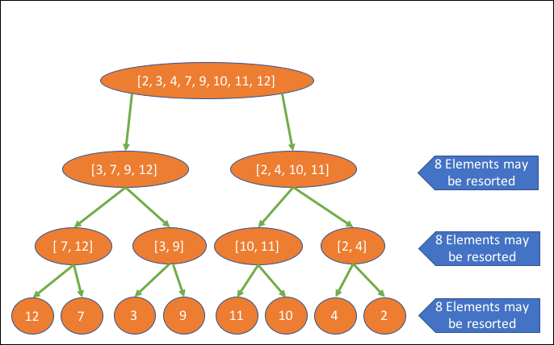

 
<strong>Key Takeaways</strong> 
&#8226; Understand when logarithms are used to calculate algorithm time complexity. 
&#8226; Review how binary trees work. 
&#8226; Understand the steps taken to perform a search and a sort using binary trees. 

 
<h4>Logarithms in Computer science</h4>

This post will explore the use of logarithms with data structures, and more importantly, why we care about them. If you are unfamiliar with time complexities, please visit my blog where I review their importance to algorithms <a href="https://aneesh.co.uk/calculating-the-time-complexity-of-algorithms">here</a>.

Logarithms apply to two different rates of growth within time complexity: 
&#8226; <i>log (n)</i>  
&#8226; <i>n log (n)</i> 

While there is no consistency for when <i>log (n)</i> and <i>n log (n)</i> appear within algorithm operations, log (n) most frequently appears when using tree data structures and n log (n) most frequently appears when using sorting algorithms. The 'Big O cheat sheet', <a href="https://www.bigocheatsheet.com/">here</a> provides a breakdown of each operation. 

Within calculus, logarithms are introduced as a means to inverse a function of exponentiation. 3 to the power of 4, also known as 3 exponent 4 is equal to 81. Consequently, logarithm 81 with base 3 is equal to 4. 

 
Within computer science, logarithms play a role in identifying the number of levels to a binary tree. The value, n, is the number of elements, and the base, b, is set to 2. The calculation of <i>log (n)</i>, where 2 is an assumed base, therefore tells you the number of times the value can be divided by 2 before it is less than 1. But why is this understanding important?

 
<h4>Logarithm for searching</h4>

Binary trees are a data structure used to split data into nodes. Each node will be further split into two until there are no more nodes. The final node of a binary tree is known as the leaf and each node within the binary tree is known as a child. The diagram below illustrates a balanced binary tree for the sorted array of: [0, 4, 6, 12, 7, 5, 9, 3]: 

If we were to search for the value of 6 within the tree, we would traverse a total of 2 levels. First the node of 7 is consulted, as 6 is less than 7 we descend left into the value 6 on the second level. 
The diagram visually represents the maximum number of levels that need to be consulted: 3.

When using a binary tree to find a value, we are able to identify the maximum number of operations required to find the value once we know the number of elements, n. 
In the example above, where n is 8, the maximum number of moves (or levels) that need to be traversed is 3. The Big O of 3 can be calculated by truncating log (8) <i>with an implied base of 2</i>. 
The case for using a base of 2 for calculating the time complexity is further supported for all binary tree data structures such as red-black tree and AVL tree.

 
<h4>Merge Sort: n log (n)</h4>

Merge sort and quicksort are a popular sorting algorithm that use the divide and conquer strategy.
Merge sort performs the following actions to sort the array: [12, 7, 3, 9, 11, 10, 4, 2]: 

1. The array is split into sub arrays until they are individual elements 

2. Each array is sequentially rebuilt between each value in an ordered fashion 

Once: 

Twice: 

And finally a third time: 

Step 1 looks very similar to the search operation in the binary tree from earlier. The array is split into two until each element owns its own node. The time complexity for step 1 is therefore log (n).  
Step 2 introduces further operations to the algorithm to return each element into the sub array above them sorted. 
Each sub-step in step 2 merges the sub-arrays into larger arrays of sorted values. At each level of the tree, the maximum number of steps that are required to be taken is equal to the number of elements within the array: 

In the example above, the array is not perfectly unsorted, therefore a total of 22 operations are performed:

As 22 operations are performed, the total time complexity for the merge sort is: n log (n). 
The log(n) defines the number of levels that are traversed upon within the array, and the multiplication of log(n) to n will define the number of operations that are performed horizontally for each sort of the sub arrays.  
In the example above, 24 would be the worst-case number of operations, however as the data is sorted between elements 3 and 9, 2 less operations are required leaving 22 in total.

 
<h4>Conclusion</h4>

 
<small style="float: right;" >Picture: Serengeti, Tanzania by <a target="_blank" href="https://unsplash.com/@huchenme">Hu Chen</small></a> 