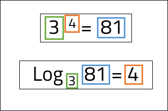
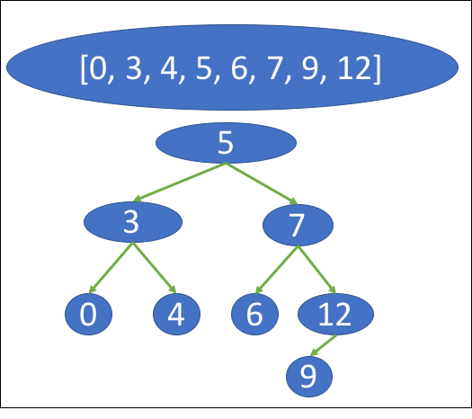
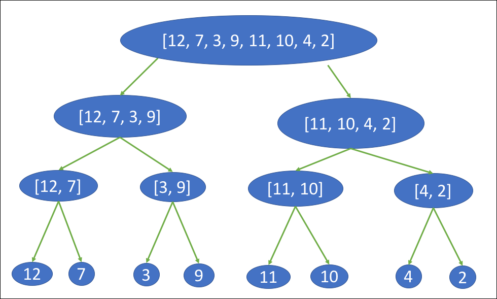
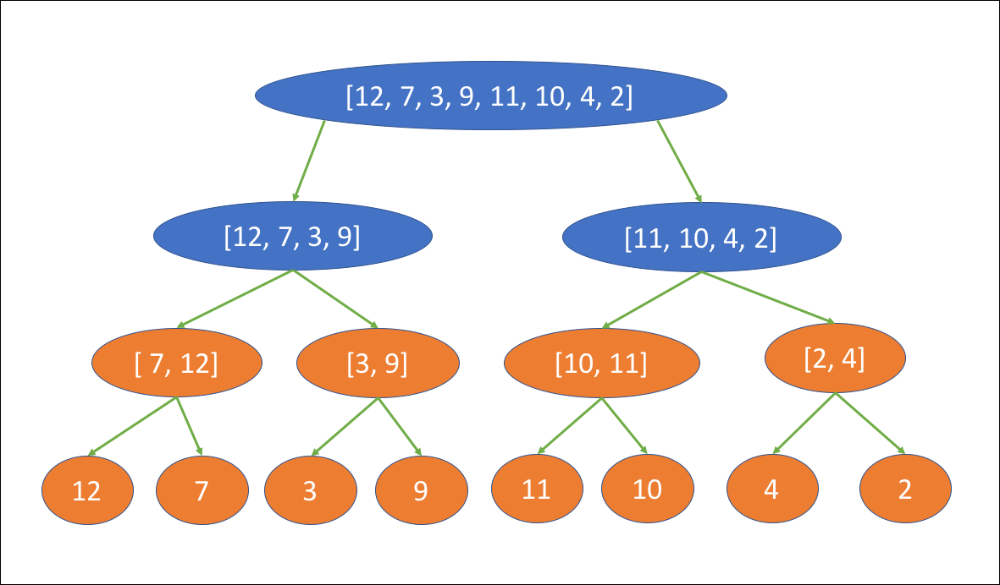
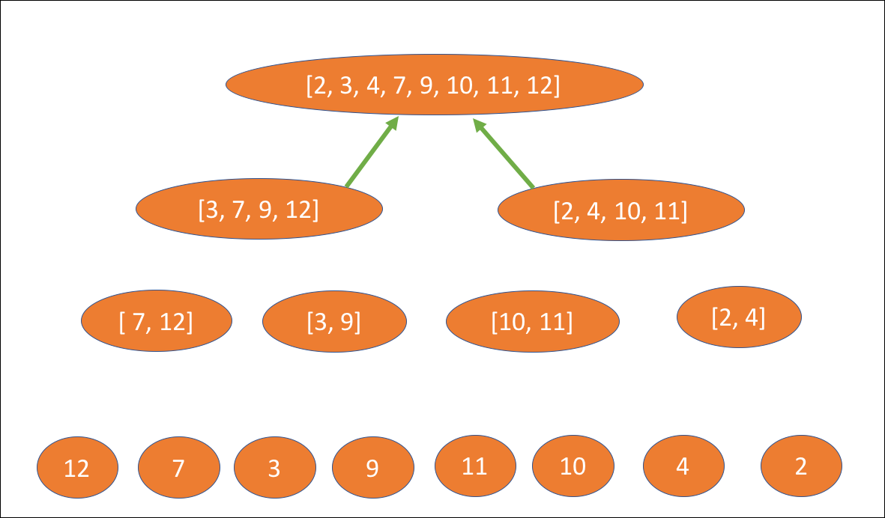
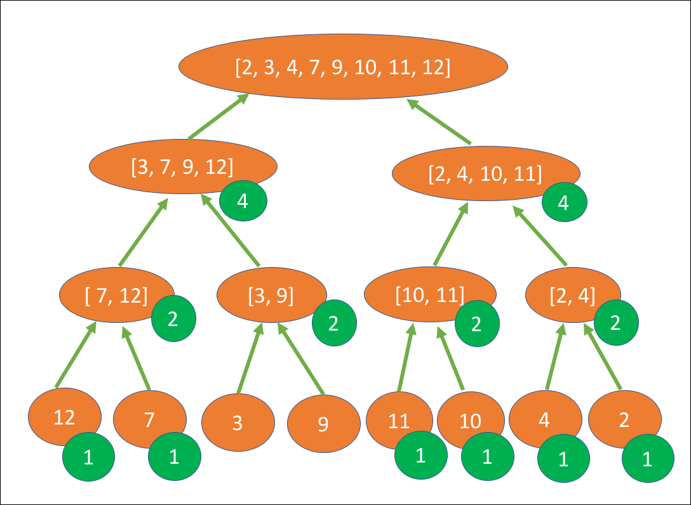

 
<strong>Key Takeaways</strong> 
&#8226; Understand why logarithms are used to calculate the time complexity for certain operations and algorithms. 
&#8226; Explore how binary trees are designed and used for searching. 
&#8226; Understand how sorting algorithms may use binary trees. 

 
<h4>Logarithms in computer science</h4>

This post will explore why logarithms might appear within our calculation of time complexity. The post will then begin to explore the context for why the base of a logarithm is implied as 2 within software data structures. If you are unfamiliar with time complexities, please visit my blog where I review their importance to algorithms <a target="_blank" href="https://aneesh.co.uk/calculating-the-time-complexity-of-algorithms">here</a>.

Logarithms apply to two different rates of growth within time complexity: 
&#8226; <strong>log (n)</strong>  
&#8226; <strong>n log (n)</strong> 

While there is no distinguished pattern for when <strong>log (n)</strong> and <strong>n log (n)</strong> appear within data structures and operations, <strong>log (n)</strong> most frequently appears when using tree data structures and <strong>n log (n)</strong> most frequently appears when using sorting algorithms. The Big O cheat sheet, <a target="blank" href="https://www.bigocheatsheet.com/">here</a>, provides a breakdown for each occurrence. 

Within calculus, logarithms are introduced as a means to inverse a function of exponentiation. 3 to the power of 4, also known as 3 exponent 4, is equal to 81. Consequently, logarithm 81 of base 3 is equal to 4. 

 
Within computer science, logarithms are used to understand the depth of a binary tree. The value, n, is the number of elements within the tree, and the base, b, is set to 2. By setting the base to 2, the logarithm of n will calculate the exponent of 2 to reach n. In other words, we are asking the logarithm how many times the value n can be divided by 2 before it is equal to 2. The value we obtain is rounded up to the nearest integer. 
But why do we care about the depth of a binary tree?

 
<h4>Searching within a binary tree</h4>

Binary trees split data collections into pairs of nodes from the root node. Each node will be further split into 2 until all elements from the collection are included in the tree. The diagram below illustrates a balanced binary tree for the sorted array of: [0, 4, 6, 12, 7, 5, 9, 3]. The value of each node is identified by finding the middle value of the collection from the node above it and the start or end. Nodes that are greater than the node above it are sent to the right, and nodes that are less are sent to the left: 

<strong>Calculating the Big O of a binary tree search</strong>

If we were to search for the value of 6 within the tree, we would traverse a total of 2 levels. Level 0 is the value 5. As 7 is greater than 5, we search down the right side path. The 1st level shows the value 7. As 6 is less than 7, we now look down the left side of the node. Finally, we find the value 6 on the second level.

When using a binary tree to find a value, we are able to identify the maximum number of operations required to find the value once we know the number of elements, n. 
In the example above, where n is equal to 8, the maximum number of moves (or levels) that need to be traversed is 3. The Big O of 3 can also be calculated with log (8) <i>with an implied base of 2</i>. 

 
<h4>Merge Sort: n log (n)</h4>

Merge sort and quicksort are a popular sorting algorithm that use the divide and conquer strategy.
Merge sort performs the following actions to sort the array: [12, 7, 3, 9, 11, 10, 4, 2]: 

Step 1 (Divide): The array is split into sub arrays until they are individual elements. 

Step 2 (Conquer): Each sub array is sequentially sorted and returned to the array above it. 

First the elements are sorted into pairs: 

The pairs are sorted into collections of 4: 

And finally the two collections are returned to the final array at the top: 

<strong>Calculating the Big O of a merge sort algorithm</strong>

The number of operations required to sort a binary tree is defined within step 2 of the merge sort.
the total operations is equal to the number of elements that are sorted at each level multiplied by the number of levels within the tree. 
The diagram below illustrates the number of operations performed to sort the sub arrays at each level. Each sub-array except [3, 9] is re-sorted, resulting in a total of 22 operations to be performed:

If sub-array [3, 9] required sorting from the 3rd level, a total of 24 operations would be performed. The Big O for the algorithm is therefore equal to 24, but how can the Big O be calculated? 
First, we can see that the maximum number of sorting operations that are performed in the tree is 8 at each level. A total of 8 sorting steps are taken at levels 1 and 2, and only 6 at the third level due to [3, 9] remaining sorted.  
From the earlier search example, we know that the number of levels in a binary tree is equal to log (n). Therefore the total number of operations = 8 * log (8), also more generally defined as: 
<strong>n log (n)</strong>. 

 
<h4>Conclusion</h4>

Logarithms are used within data structures to understand the time complexity for binary tree operations and sorting algorithms. By implying a base of 2, we are able to understand how many times a value (number of elements) can be divided by 2, and therefore the depth of its binary tree. 
Popular sorting algorithms such as QuickSort and Merge sort implement divide and conquer strategies that split the data into a logarithmic number of levels before implementing the sorting phase. 
By understanding how logarithms are used within data structures and algorithms, we are better positioned to understand how time complexity can accrue and where it can be optimized.

 
<small style="float: right;" >Picture: Serengeti, Tanzania by <a target="_blank" href="https://unsplash.com/@huchenme">Hu Chen</small></a> 