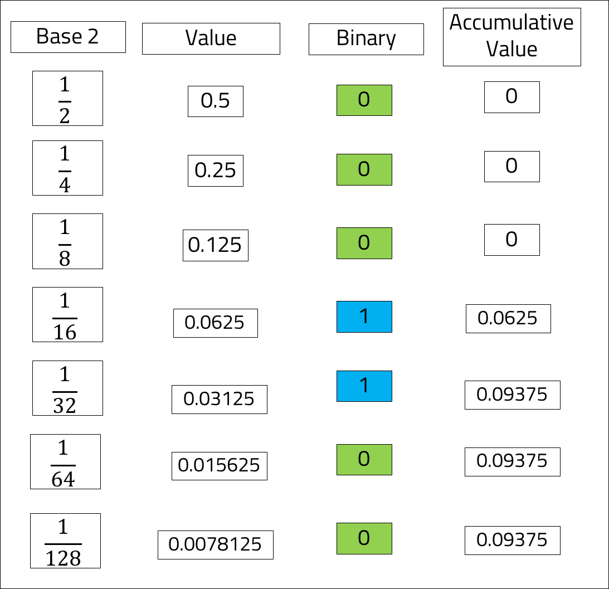

<br>
<strong>Key Takeaways</strong><br>
&#8226; Understand why floating point precision may not always produce predictable results.<br>
&#8226; Understand how the float and decimal primitives deduce values in the JVM.<br>
&#8226; Use the math.BigDecimal class to resolve floating point precision inaccuracies.<br>

<br>
<h4>Floating point primitives</h4>
<p>
The primitive data types <code>float</code> and <code>double</code> offer floating point values to be used for non-whole numbers. Floating point numbers store a fixed number of binary digits: <code>float</code> has a storage of 4 bytes, whereas <code>double</code> has 8 bytes. As a result <code>double</code> can scale up to 15 digits compared to just 9 for <code>float</code>.<br>
The benefits of using floating point numbers are their speed and efficiency. The JVM is able to very quickly calculate and store the values. 
</p>
<br>
<h4>Binary digits and floating point inaccuracies</h4>
<p>
The JVM stores floating points values as a binary representation of a fraction and exponent. As a result, floating point values are calculated using a Base 2 notation.<br>
In calculus, the value of 0.1 can be calculated as 10<sup>-1</sup>. Similarly, the value of 0.55 can be calculated as 55 * 10<sup>-2</sup>.<br>
The JVM, however, interprets floating point numbers to the Base of 2. When a decimal is defined, the JVM will represent it using the base of 2. The JVM is able to interpret the values without conversion and therefore creates the property of speed that floating points exude.
</p>
<p>
The example below demonstrates how the value of 0.1 can be defined in binary code.<br>
The base of 2 is sequentially halved  with the power of -1, -2, and so on. The binary value indicates whether or not the value of Base 2 can increment towards the value of 0.1.<br>
As Base 2 increments, the Base value is reduced and the accumulative value nears 0.1.
</p>




<p>
The binary code of 0001100 will continue infinitely into 0001100110011001100. The float and double primitive values will however round the value according to their memory limit (4 and 8 bytes respectively). If the double value was 0.75, it would be represented as expected as 2<sup>-1</sup> + 2<sup>-2</sup> = 0.5 + 0.25 = 0.72. 0.75 can therefore be represented as a binary fraction of finite length.<br>
As float and double primitives are not able to define the exact value of the decimal, they create unexpected results when applied to operations:
</p>

```java{numberLines:true}

    double a = 0.2;
    double b = 0.19;

    float c = 0.2f;
    float d = 0.19f;

    System.out.println("double answer:  " + (a-b));
    System.out.println("float answer:   " + (c-d));
```
<br>

```
    double answer:  0.010000000000000009
    float answer:   0.010000005
```

<br>
<h4>Resolving floating point precision with math.BigDecimal</h4>
<p>
The math package of Java introduces a class called <code>BigDecimal</code> to provide control over the scale and precision of decimal numbers. The following example demonstrates how BigDecimal resolves the problem of floating point values:
</p>

```java{numberLines:true}

    BigDecimal e = new BigDecimal("0.2");
    BigDecimal f = new BigDecimal("0.19");  
    System.out.println("Big decimal answer: " + e.subtract(f));

```
<br>

```
    Big decimal answer: 0.01
```
<br>
<h4>How BigDecimal works</h4>
<p>
As previously mentioned, BigDecimal provides control over the scale and precision of decimal numbers. With the example of 1.23, scale refers to the number of decimal places with a base of 10 (2), and precision refers to the length of arbitrary numbers (3). BigDecimal uses the unscaled value (123) and the scale (10<sup>-2</sup>) to create the precision value 1.23<br>
As BigDecimal employs Base 10 calculations for the decimals, it can precisely represent all 2 decimal placed numbers. BigDecimal therefore plays a valuable role with applications that deal with currency representation. 
</p>
<strong>Constructors</strong>
<p>
The BigDecimal constructor can take arguments such as BigInteger, String, int, double, float, and char to convert into a BigDecimal. When supplying a BigInteger, the constructor can also take a scale argument to build the decimal:
</p>

```java{numberLines:true}
    int a1 = 1;
    char a2 = 'a';
    double a3 = 2.4;
    String a4 = "2.4";
    BigInteger a5 = new BigInteger("1234");

    System.out.println("BigDecimal (int): " + new BigDecimal(a1));
    System.out.println("BigDecimal (char): " + new BigDecimal(a2));
    System.out.println("BigDecimal (double): " + new BigDecimal(a3));
    System.out.println("BigDecimal (String): " + new BigDecimal(a4));

    System.out.println("BigDecimal (BigInteger): " + new BigDecimal(a5));
    System.out.println("BigDecimal (BigInteger, scale): " + new BigDecimal(a5, 2));
```

```
BigDecimal (int):               1
BigDecimal (char):              97
BigDecimal (double):            2.399999999999999911182158029987476766109466552734375
BigDecimal (String):            2.4
BigDecimal (BigInteger):        1234
BigDecimal (BigInteger, scale): 12.34
```

<p>
The example above illustrates several ways a BigDecimal can be instantiated.<br>
The use of double <code>a3</code> on line 9 prints the binary value of 2.4 as a 32-bit integer. The String constructor on line 10 however prints the expected value of 2.4. Line 12 and 13 demonstrate how BigInteger can be used with a scale operation to build a decimal number.
</p>
<strong>Why use the String constructor</strong>
<p>
The example above demonstrates the successful use of the String constructor with BigDecimal. Unlike the constructor that takes a double, by passing in a String, the BigDecimal no longer relies upon the binary fraction to create the value, and instead uses the Base 10 to represent the value.
</p>
<br>
<strong>Methods</strong>
<p>
The BigDecimal class does not override operators such as <code>+</code> or <code>-</code> used for applying primitive data types to each other. Instead, methods such as <code>add()</code>, <code>subtract()</code>, <code>multiply()</code>, and <code>divide()</code> are implemented for operating with other BigDecimal instances.
</p>

<br>
<h4>BigDecimal Performance</h4>
<p>
The BigDecimal class introduces precision of decimal values by implementing Base 10 calculations. The final value, derived from the unscaled 32-bit value multiplied by 10<sup>-scale</sup> results in a heavy performance cost to the application.<br>
As a result, performance costs from BigDecimal can rise up to 90 times slower than using <code>double</code>. The decision to implement BigDecimal should strongly consider the importance of exact values to the context over speed.
</p>
<br>
<h4>Conclusion</h4>
<p>
The JVM uses binary functions to compute floating-point primitive values <code>float</code> and <code>double</code>. Their design enables the values to be efficiently calculated and stored.<br>
The Base 2 function for deriving floating point values introduces a degree of precision loss from rounding. 
BigDecimal is a class within the math package of Java and enables decimal values to be computed against a Base 10. As a result, the decimal value created does not contain an unexpected rounded value.<br>
BigDecimal is a useful class implemented with applications that handle currencies. BigDecimal however introduces performance costs that are to be considered with their use.
</p>

<br>
<small style="float: right;" >Picture: Black River, Mauritius by <a target="_blank" href="https://unsplash.com/@xaviercoiffic">Xavier Coiffic</small></a><br>