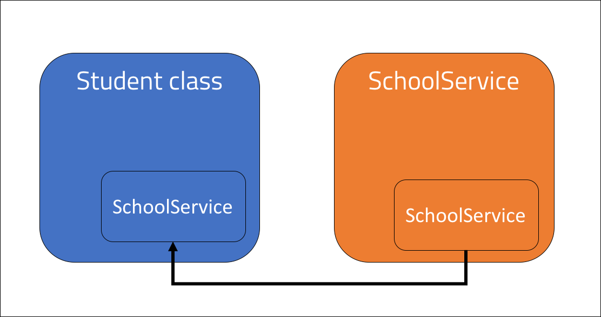
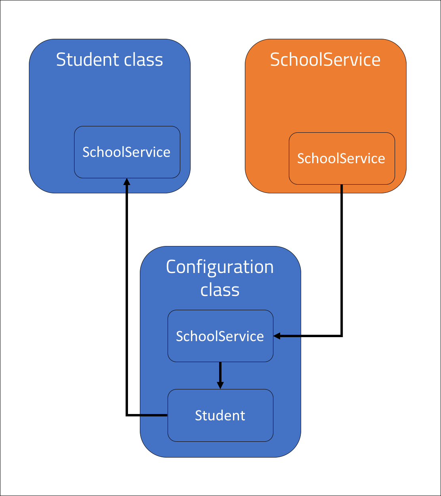

<br>
<strong>Key Takeaways</strong><br>
&#8226; Understand the importance of dependency injection and why it supports modular code design.<br>
&#8226; Implement dependency injection with three different techniques.<br>
&#8226; Review the benefits and drawbacks to each dependency injection technique.<br>


<br>
<h4>What is dependency injection?</h4>
<p>
Dependency injection is a technique used to decouple classes that depend upon each other. Class dependency arises when once class uses the functionality (method) of another class 'as a service'. 
<br>Classes are deemed to have a <i>hard dependency</i> if their invocation creates a 'new' instance of another class. 
Dependency injection falls under the broader design of 'inversion of control'. Inversion of control enforces the fifth principle of SOLID whereby a client's implementation is transferred from the class itself to a framework. 
In the example below, the client, <code>Student</code> has a hard dependency on the <code>SchoolService</code>. The SchoolService is used to return a List of classes the student would have within the learn() method.
</p>

```java{numberLines:true}
    public class Student{

        SchoolService schoolService;

        public Student(){
            schoolService = new ArtSchool();
        }

        public List<String> learn(){
            
            return schoolService.getClasses();

        }
    }
```

<p>
The Student Object will create the ArtSchool at compile time, however a problem may arise if the we want the Student to instead attend the LiteratureSchool. The class will need to change its dependency implementation accordingly:
</p>

```java{numberLines:true}

public Student(){
    schoolService = new LiteratureSchool();
}

```


<br>
<h4>Why use dependency injection?</h4>
<p>
By using dependency injection, the application will delegate the responsibility of creating Objects away from the individual classes, and into a single framework.<br>
The task execution is decoupled from implementation and a further degree of modularity is achieved. <br>
Further benefits can be seen during unit-testing where components can be mocked and passed with dependency injection for more concise and light-weight tests.
</p>
<br>
<h4>Implementing dependency injection</h4>
<p>
Dependency injection design can be implemented by refactoring the Student class to reference a pre-existing instance of the SchoolService.
</p>
<p>
Dependency injection can be achieved in one of many way, including, but not limited to:<br>
&#8226; Constructor injection: using the client constructor to take in the service as an argument.<br>
&#8226; Spring constructor injection: using a Spring bean to inject the bean as a dependency.<br>
&#8226; Spring setter injection: using a setter method within a Spring bean to instantiate the dependency.<br>
</p>

<strong><u>Constructor dependency injection</u></strong>
<p>
A constructor parameter can take a dependency as an argument to be used by the class.
Rather than the Student class defining the type of SchoolService it depends upon, the responsibility is delegated to the class that instantiates the Student instance:
</p>

```java{numberLines:true}
public class Student{

        private SchoolService schoolService;

        public Student(SchoolService schoolServiceArgument){
            this.schoolService = schoolServiceArgument;
        }
    }

```

<p>
From the main method, the SchoolService can be passed in as an argument:
</p>

```java{numberLines:true}
public class Main{

    public static void main(String[] args){

        SchoolService myService = new ArtSchool();
        Student myStudent = new Student(myService);

        myStudent.learn();
    }  
}

```




<br>
<strong><u>Spring Constructor dependency injection</u></strong>
<p>
The Spring framework offers annotations that can inject dependencies into the class.<br>
Before using Spring for dependency injection, it is important to ensure the annotation-driven injection is enabled by creating a configuration class:
</p>

```java{numberLines:true}

@Configuration
public class Config {

	@Bean
	public SchoolService schoolService() {
		return new ArtSchool();
	}

    @Bean
	public Student student() {		
		return new Student(schoolService());
	}
	
}

```

<p>
The <strong>@Configuration</strong> annotation indicates that the class declares bean definitions. The class is therefore processed by the Spring IoC container at runtime to create the beans. 
The Bean <code>schoolService</code> returns a new instance of <code>ArtSchool</code>.
In the Student bean, the SchoolService is injected with the bean definition of ArtSchool. The Spring framework is now responsible for the schoolService injection, and not the Student class itself.
</p>

```java{numberLines:true}
	public class Student {

	private SchoolService schoolService;

	public Student(SchoolService schoolService) {

		this.schoolService = schoolService;

	}
    ...

```




<br>
<strong>The @Autowired annotation</strong>
<p>
The <Strong>@Autowired</Strong> annotation is used in Spring to implicitly inject dependencies into a class. 
It is not necessary to use the <strong>@Autowired</strong> annotation if the Student class only defines a single constructor. If more than one constructor is defined, <strong>@Autowired</strong> must be used to instruct the Spring container to inject the dependency into the class.
</p>
<br>
<strong><u>Spring setter dependency injection</u></strong>
<p>
Rather than using the constructor of the Student class to instantiate the schoolService, Spring bean definitions can call a setter method when defining the bean.
In the Configuration class, the Student bean is updated to create a Student instance, to call the setter method, and to return the Student. 
</p>

```java{numberLines:true}
	
	@Bean
	public Student student() {
		Student student = new Student();
		student.setSchoolService(schoolService());
		
		return student;
	}

```

<p>
The Student class must now define the new no-argument constructor. 
If the Bean for the Student class was not defined, the dependency injection will no longer work with two constructors. Instead, the <strong>@Autowired</strong> annotation is necessary to ensure the schoolService is injected with the Bean when a Student is instantiated:
</p>

```java{numberLines:true}
public class Student {

    @Autowired
	private SchoolService schoolService;

	public Student(SchoolService schoolService) {
				
		this.schoolService = schoolService;

	}
	
	public Student() {
		
	}
```
<br>
<h4>Choosing a dependency injection technique</h4>
<p>
The constructor and setter dependency injection achieve the same objective in slightly different ways.
The setter method can be seen as more readable against the constructor injection. Setter injections can also resolve a potential <i>ObjectCurrentlyInCreationException</i> where a circular dependency between two Objects arise.
</p>
<p>
The constructor injection, however, ensures that the Object is not created without the dependency injected. It may still be possible to create a Student class with an incomplete dependency if relying upon the setter injection. The constructor is also not liable to being overridden by child classes, while the setter method can be, introducing an implementation security concern.
</p>

<br>
<h4>Conclusion</h4>
<p>
Dependency injection is technique used to enable Objects and the services they depend upon to be created as separate entities.<br>
This blog has reviewed three of the most common ways of implementing dependency injection, however there are other annotations such as <strong>@Resource</strong> and <strong>@Inject</strong> that can achieve similar outcomes and are worth exploring in Spring.
</p>
<p>
When using test-driven-development, or any kind of unit test, dependency injection can greatly reduce the weight and complexity of unit tests through mocking frameworks.
As well as improving code readability and reducing boilerplate code, dependency injection shifts the implementation of an application away from individual classes, and into a modular framework. <br>
The code sample from this blog can be found on GitHub <a target="_blank" href="https://github.com/4neesh/DeveloperBlogDemos/tree/master/DependencyInjectionDemo">here.</a>
</p>

<br>
<small style="float: right;" >Picture: Tissamaharama, Sri Lanka by <a target="_blank" href="https://unsplash.com/@roxannedesgagnes">Roxanne Desgagnés</small></a><br>