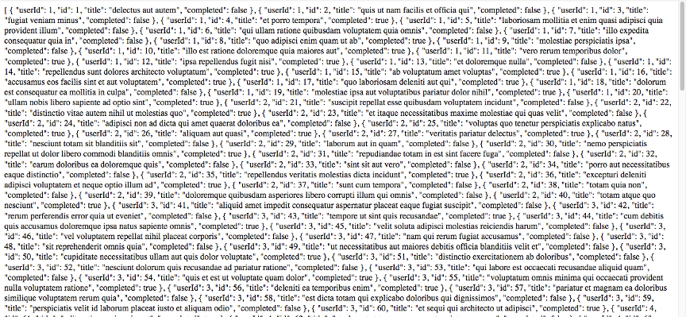
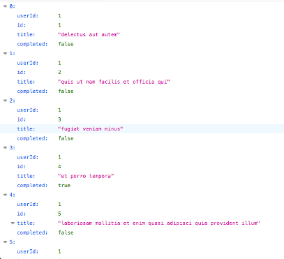
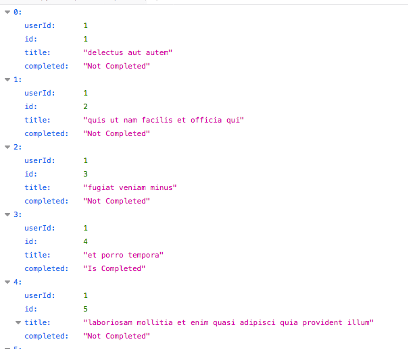

<br>
<strong>Key Takeaways</strong><br>
&#8226; Understand what an API is and how they work.<br>
&#8226; Use Spring to make GET requests to the API.<br>
&#8226; Explore how the GET request can be broken down and used within a service.<br>

<br>
<h4>What is an API?</h4>
<p>
An "application programming interface", abbreviated to "API" is a software intermediary between applications. I like to think of an API as the waiter between you (the client) and your meal (the data) in a restaurant.<br>
APIs allow applications to speak to each other. When an application request is made, it will send the data message to the server where it is interpreted and a response is returned. The application will then interpret the response and display the output to the user.<br>
APIs are all around us in the applications we use; they provide new bounds of opportunities for the information an application can retrieve and interact with.
</p>
<br>
<h4>RESTful APIs and CRUD</h4>
<p>
The term "REST" in computer systems stands for "Representational state transfer". REST defines a standard to make it easier for computer systems to communicate over the internet. REST-compliant systems are stateless and separate of concerns between client and server.<br>
A RESTful API uses HTTP requests to access and modify the data. As a result, RESTful APIs expose data to the be consumed by our applications.</p>
<p>
CRUD operations are the four basic functions of persistent storage. RESTful APIs allow CRUD operations to be performed:</p>
<p>
&#8226; CREATE: A new data entry can be made with the <strong>POST</strong> HTTP request.<br>
&#8226; READ: Data can be read with a <strong>GET</strong> HTTP request.<br>
&#8226; UPDATE: Data can be updated with a <strong>PUT</strong> HTTP request.<br>
&#8226; DELETE: Data can be deleted with a <strong>DELETE</strong> HTTP request.<br>
</p><p>
In the following example, I will send a GET request using the Spring framework to access a RESTful API service.
</p>
<br>
<h4>Performing a GET Request with Spring</h4>
<p>
In this example, I will be using the free RESTful API service by jsonplaceholder.typicode.com to obtain the some sample data of a to do list. <br>
</p>
<strong><u>Setting up Spring</u></strong><br>
<p>
The Spring <strong>RestTemplate</strong> class offers template methods for making HTTP requests of RESTful API services. 
The RestTemplate class is obtained through the <code>spring-boot-starter-web</code> dependency in a Spring boot application:
</p>

```
<dependency>
    <groupId>org.springframework.boot</groupId>
    <artifactId>spring-boot-starter-web</artifactId>
</dependency>

```
<p>
In the main application class, I will create an instance of the RestTemplate in a bean to be later injected:
</p>

```java{numberLines:true}
@SpringBootApplication
public class ToDoGetDemo {
	
	public static void main(String[] args) {
		SpringApplication.run(ToDoGetDemo.class, args);
	}

	@Bean
	public RestTemplate getRestTemplate() {
		return new RestTemplate();
	}
}
```
<p>
The RestTemplate is injected into a class that contains a RestController. The API is then called upon with a GET Mapping:
</p>

```java{numberLines:true}
@RestController
public class APIController {

	@Autowired
	private RestTemplate restTemplate;
	
	@GetMapping("/todo-items")
	public String getPrices(){
		String url = "https://jsonplaceholder.typicode.com/todos";
		return this.restTemplate.getForObject(url, String.class);
	
	}
}

```

<p>
There are quite a few points to take from the class above, so I will break it down line by line:
<br>
On line 1, the <strong>@RestController</strong> annotation is used to mark the class as a request handler. The annotation will be responsible for mapping request data to the defined request handler method.<br>
On line 4 and 5, the RestTemplate is injected into the class. The RestTemplate will be used as a service for making the GET request.<br>
On line 7, the <strong>@GetMapping</strong> annotation is used to map the request to the "/todo-items" handler. GetMapping was introduced in Spring 4.3 as an amalgamation of "@RequestMapping" and "method=RequestMethod.GET".<br>
On line 9, the URL for the RESTful API is defined. The URL can be tested with an API development tool such as Postman to validate the information we expect to see.<br>
Line 10 uses the RestTemplate instance by passing in the url and mapping the response to an instance of the String class.
</p>

<p>
Once the class is built, the Spring application can be run and the output from the API can be found on localhost:8080/todo-items. The output will appear as a large String in the browser:



</p>

<br>
<strong><u>Converting JSON to a POJO</u></strong><br>
<p>
The JSON API content can be converted into a POJO (plain old java object) to allow us to navigate and use the data. 
Rather than passing the GET request into an item of the String class, we will create our own class to store the values within. The class will then be held in an array of instances.</p>
<p>
A new class, "ToDo" is created to store the fields of the API call according to their content type from the request:
</p>

```java{numberLines:true}
public class ToDo{

	private int userId;
    private int id;
    private String title;
    private boolean completed;

    //getters and setters...
}

```
<p>
The RestController is updated to reference an array of the ToDo class as the response mapping to a new handler "todo-objects":
</p>


```java{numberLines:true}
@GetMapping("/todo-objects")
	public ToDo[] getPostAsObject() {
		String url = "https://jsonplaceholder.typicode.com/todos";
		return this.restTemplate.getForObject(url, ToDo[].class);
		
	}
```
<p>
When the "/todo-objects" request is made in the browser, the output is in a JSON format:



</p>


<br>
<h4>Custom deserialisation with Jackson</h4>
<p>
The current GET request is deserialised by our application into a POJO. One way we may want to refactor the output of the request could be to make the "completed" boolean into a descriptive String.<br>
The <strong>JsonDeserializer</strong> class from the jackson.databind package enables custom deserialisation of the API response to transform the data.</p>
<p>
The custom deserialisation will take place in a new class "ToDoDeserialiser" which extends the JsonDeserialiser class.<br>
The ToDo class will make use of the custom deserialisation class with the <strong>@JsonDeserialize</strong> annotation where the ToDoDeserialiser is referenced (line 1):<br>
</p>

```java{numberLines:true}
@JsonDeserialize(using = ToDoDeserialiser.class)
public class ToDo{

	private int userId;
    private int id;
    private String title;
    private String completed;

```
<p>
The "completed" field is marked as a String to reflect the new data type we wish to return. Ensure the getter and setter fields, along with the argument-constructor is updated to reflect the change in type.
</p>
<p>
The ToDoDeserialiser class overrides the deserialize method of the JsonDeserializer class to provide custom logic for deserialisation:</p>

```java{numberLines:true}
public class ToDoDeserialiser extends JsonDeserializer {

    @Override
    public Object deserialize(JsonParser jsonParser,
				 DeserializationContext deserializationContext) throws IOException {

        JsonNode node = jsonParser.getCodec().readTree(jsonParser);
        int userId = node.get("userId").intValue();
        int id = node.get("id").intValue();
        String title = node.get("title").textValue();
        boolean completed = node.get("completed").asBoolean();
        String isCompleted = completed ? "Is Completed" : "Not Completed";
        return new ToDo(userId, id, title, isCompleted);
    }
    
}
```
<p>
The deserialize method first obtains a new JsonNode <code>node</code> on line 7 from the JsonParser. The JsonParser provides read-only access to the JSON data. Each JsonNode represents an instance of ToDo in the request.<br>
Lines 8 to 11 obtains the values from the node which are later passed into a constructor for the ToDo item that is returned.<br>
Line 12 will convert the boolean "completed" into a descriptive String as per custom logic.<br>
The new String conversion is returned in the ToDo constructor and as a result, the GET mapping translates into a new JSON output where the "completed" value is a String:



</p>

<br>
<h4>Conclusion</h4>
<p>
RESTful APIs provide a bridge that enables services to interact with other services in a standardised manner.
Spring frameworks can be used to interact with RESTful API services that can expand the capabilities of an application. Building microservices that provide RESTful endpoints can also enable you to share data between services. <br>
The JSON format of data can be passed into a POJO that can be used to resolve business logic. The JsonDeserializer class can also be extended to provide custom modification and processing of data from the REST endpoint.
<br>
The source code from this blog can be found on GitHub <a target="_blank" href="https://github.com/4neesh/DeveloperBlogDemos/tree/master/ConsumingRestAPIDemo">here</a>.
</p>

<br>
<small style="float: right;" >Picture: Ella, Sri Lanka by <a target="_blank" href="https://unsplash.com/@the_bracketeer">Hendrik Cornelissen</small></a><br>