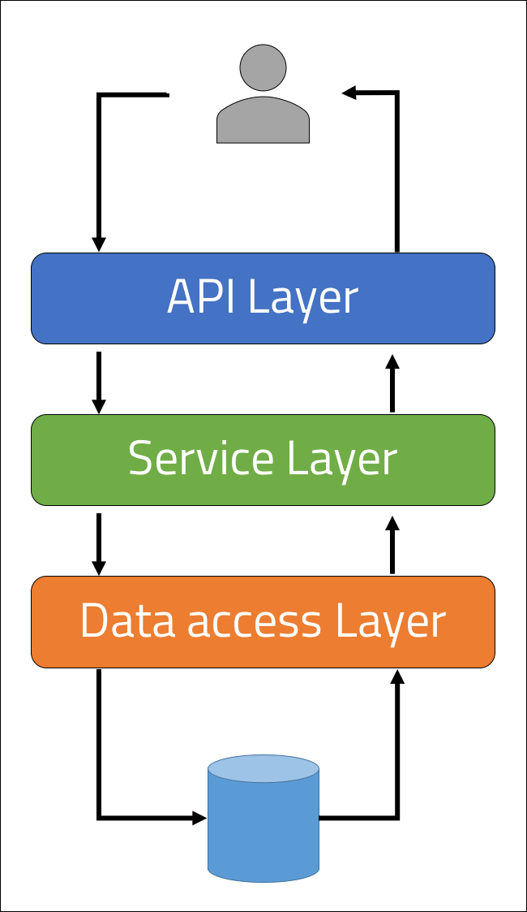
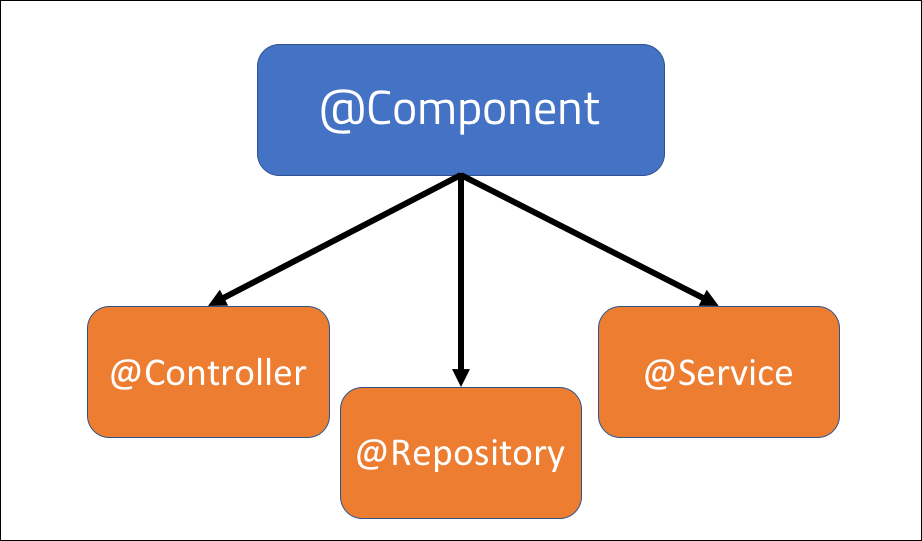

 
<strong>Key Takeaways</strong> 
&#8226; Compare the properties of the different layers within a Spring application. 
&#8226; Review the importance of the Spring IoC container, BeanFactory, and ApplicationContext. 
&#8226; Understand the differences between the beans created from @Component, @Controller, @Service or @Repository. 

 
<h4>Spring application architecture</h4>

The architecture of a Spring application may reflect upon the intent and organisation of packages and classes. 
The Separation of Concern (SoC) design principle aims to create a modular architecture where delegated classes address well-defined functions of the application. SoC supports the long-term maintenance and growth of the application and discourages code rot.

The Spring framework architecture uses 3 layers to offer a degree to separate concerns between classes based upon their responsibility within the application. 
Each layer is placed to communicate with the layer above and/or below it. The layers include: 

&#8226; <strong>API/Web layer</strong>. Used to accept and authenticate user input and handle HTTP requests. Spring MVC is used to separate the web view, the servlet controller and the model objects. 
&#8226; <strong>Service layer</strong>. Interacts with the API layer and model objects to provide authorization and custom business logic processing.  
&#8226; <strong>Data access/integration layer</strong>, also known as Repository layer. The basic CRUD operations are exposed in the data access layer to send operations to the database. Object to relational mapping (ORM) is used to map data to and from the database.  

 
<h4>Separating layers into a request and response</h4>

The diagram below illustrates the layers of a Spring application and how it would handle a request made by a user.

A user request is first intercepted by the API layer. The API layer is used to handle HTTP requests such as GET, PUT, DELETE and POST.

The request can then be processed by the service layer to implement business logic. Such logic may include checking authorisation, transforming the request or logging. 

The data access/integration layer transforms the request using ORM to interact with the database. The database is persisted outside the layer and will return a response that is then relayed back to the user.

 
<h4>Spring Inversion of Control Container</h4>

The Spring IoC Container is a core Spring Framework component responsible for creating, wiring, managing and configuring objects to be used by the application. The components enable Spring to perform dependency injection as they are wired into classes that require them.

The objects that are configured by the IoC container are known as Spring beans. Each bean contains metadata that includes information for how to create the bean, the bean's dependencies, and the lifecycle details. 

There are two types of containers within the Spring Framework: 
&#8226; BeanFactory. 
&#8226; ApplicationContext. 

<strong>BeanFactory</strong> 
The BeanFactory is responsible for maintaining the registry of different beans and their dependencies. 
Beans are injected into the classes that depend upon them with lazy loading and is therefore only used when memory consumption is critical.

<strong>ApplicationContext</strong> 
The ApplicationContext container can perform all the functions of the BeanFactory with additional functionality: 
&#8226; Load file resources. 
&#8226; Publish events to event listeners. 
&#8226; Resolve messages for internationalisation support. 
&#8226; Support for Annotation-based dependency injection. 
&#8226; Integration with Spring AOP. 

Unlike the lazy-loading of bean from the BeanFactory, the ApplicationContext will load all beans upon instantiation and is therefore considered heavy-weight in comparison to BeanFactory.

 
<h4>Spring class annotations</h4>

The Spring class-level annotations are used to register beans into the Spring IoC container. Class-level annotations are detected by the ApplicationContext container during a classpath scan of the application. 
The following annotations are applied at the class level according to layer they are responsible within. Each annotation except for @Service contains unique properties to the bean that support their function at the layer.

<strong>@Component</strong> 

The <strong>@Component</strong> annotation is the parent annotation to the other layer-level annotations <strong>@Controller</strong>, <strong>@Service</strong> and <strong>@Repository</strong>. 
Classes marked with <strong>@Component</strong> will be automatically detected by the Spring framework and added to the ApplicationContext. 
The <strong>@Controller</strong>, <strong>@Service</strong>, and <strong>@Repository</strong> annotations all use <strong>@Component</strong> in their definition, therefore their use also results in the class being added into the ApplicationContext.

<strong><u>@Controller</u></strong> 

<strong>@Controller</strong> is a specialised version of <strong>@Component</strong> to be used for classes at the API/web layer. When a class is marked with <strong>@Controller</strong>, the ApplicationContext will register the class as a bean, and the class will be looked upon differently for web-specific tools and services. 
When a client request is made to the Spring Application, the dispatcher servlet, which is responsible for forwarding requests to the MVC controllers, will scan all classes marked as <strong>@Controller</strong> to find the appropriate <strong>@RequestMapping</strong> annotation to handle the request.

 
<strong><u>@Service</u></strong> 

<strong>@Service</strong> is a wrapper version of <strong>@Component</strong> and is used to mark the class as a service.
The service class will provide business logic functionality to process requests before passing them to the data access layer for persistence.

The <strong>@Service</strong> annotation does have include further behaviour that is different to <strong>@Component</strong>, however service classes should be marked with <strong>@Service</strong> to mark the intent of the class within the application.

 
<strong><u>@Repository</u></strong> 

The <strong>@Repository</strong> annotation differs from <strong>@Component</strong> for the single purpose of catching persistence-specific exceptions. 
The <strong>@Repository</strong> annotation will import the ORM beans into the ApplicationContext container and change the unchecked exceptions eligible for translation into a DataAccessException.
The annotation provides enhanced functionality for exception handling.

 
<h4>Conclusion</h4>

The Spring IoC container allows the framework to provide dependency injection across the application. 
The Spring framework is constructed of 3 layers that separate the responsibility of the class when handling requests and responses. 
The ApplicationContext container is a heavy-weight framework for dependency injection that supports annotation-based injection. The <strong>@Component</strong> annotation is used to register a bean at the class-level into the ApplicationContext. 
The Spring framework offers three further annotations that extend from <strong>@Component</strong> to provide unique properties the bean generated to assist with the responsibility of each layer.

 
<small style="float: right;" >Picture: Wellington, New Zealand by <a target="_blank" href="https://unsplash.com/@glebelt_">Guillaume Lebelt</small></a> 