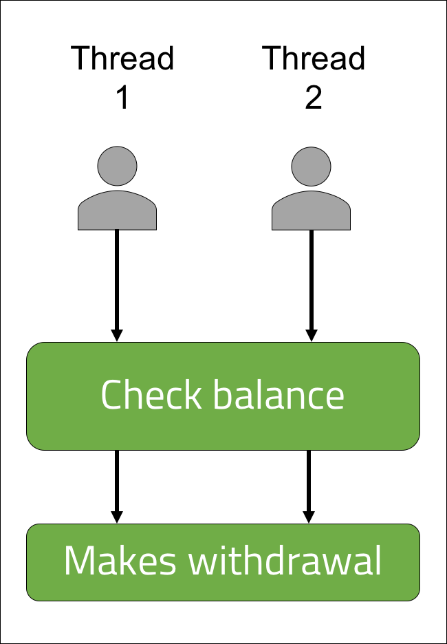

<br>
<strong>Key Takeaways</strong><br>
&#8226; Understand how a race condition can arise in a multi-threaded application.<br>
&#8226; Use Atomic values to create thread-safe variables.<br>
&#8226; Use Synchronized blocks to control the accessibility of code blocks to different threads.<br>

<br>
<h4>What is a race condition in multi-threading?</h4>
<p>
The <i>race condition</i> is a term that originates from electronics to describe a condition where a systems behaviour is dependent on the timing of uncontrollable events.
</p>
<p>
In the context of a multi-threaded application, race condition can arise where multiple threads are performing simultaneously upon a stateful session. Stateful sessions contain data that is represented by the current state of the application; the existence of the session variables are dependent on the previous execution of other methods. A stateless session will therefore encounter data that is not impacted by the state or execution of the application.
</p>
<p>
A static variable is an example of a stateful object. The static variable's existence is dependent on the interactions it has with other instances of the class, whereas a method-local variable is stateless and does not carry such a relationship. 
</p>
<h4>Multi-threading on a shared bank account</h4>
<p>
To describe the how a race condition may arise, I will use a scenario of a shared bank account. The bank account is not allowed to go into overdraft, therefore when a request is made, it should only be processed if there are sufficient funds in the account.
</p>
<p>
Each transaction will first check the balance and make a withdrawal if the balance exceeds, or is equal to the withdrawal amount.
</p>
<p>
A race condition can occur when multiple withdrawal requests are made at a similar time to the bank account using different threads.<br>
Each thread will read the bank balance as containing a sufficient amount, however when both transactions are made, the bank account becomes overdrawn. 
</p>



<p>
The diagram above illustrates how both threads record the balance and make the withdrawal against the balance.<br>
The race condition occurs as the outcome of the transaction is deterministic upon the thread speed and timing between each other.
</p>
<br>
<h4>The possible stateful outcomes</h4>
<p>
The outcome from the bank account scenario with two threads can be any of following three:<br>
1. Thread 1 can spend the money and Thread 2 is not able to.<br>
2. Thread 2 can spend the money and Thread 1 is not able to.<br>
3. Thread 1 and Thread 2 can spend the money, thus causing the account to become overdrawn.<br>
</p>
<p>
The race condition is implemented below with a BankAccount class with a withdraw method.<br> 
The below code sample enables a race condition to occur:

```java{numberLines:true}
public class BankAccount {

    private int balance = 50;

    public  void withdraw(int spend){

        int temp = balance;
        System.out.println(Thread.currentThread().getName() + " withdrawing from balance: " + balance);
        balance = temp - spend;
        System.out.println(Thread.currentThread().getName() + " has withdrawn " + spend + ". New balance: " + balance);

    }

    public int getBalance(){
        return this.balance;
    }


}
```
</p>
<p>
The BankAccount instance has an initial balance of 50. The withdraw method will first pass the balance into a variable <code>temp</code> before making the withdrawal and printing the balance to the console.
</p>

<p>
If I were to run the following single-threaded test, the application would perform as expected:

```java{numberLines:true}
  @Test
    public void bankAccountWithdraws() throws InterruptedException{

        for(int i = 0; i< 5; i++){
            bankAccount.withdraw(10);
        }

        assertEquals(0, bankAccount.getBalance());
    }
```

```{numberLines:true}
main withdrawing from balance: 50
main has withdrawn 10. New balance: 40
main withdrawing from balance: 40
main has withdrawn 10. New balance: 30
main withdrawing from balance: 30
main has withdrawn 10. New balance: 20
main withdrawing from balance: 20
main has withdrawn 10. New balance: 10
main withdrawing from balance: 10
main has withdrawn 10. New balance: 0
```

</p>
<br>
<h4>Introducing latency and a possible race condition</h4>
<p>
The current execution of the single thread behaves as expected as the <code>withdraw()</code> method is only called once at any one time. Latency can be introduced into the application by using the <code>wait()</code> method which causes all threads to stop before continuing. The <code>withdraw()</code> method must be marked within a synchronized block to ensure only one thread accesses the method at a single time.
</p>
<p>
The following update to the <code>withdraw()</code> method will cause the threads to check the balance, wait for each other, then to complete the transaction. As a result, each thread will read in the opening balance before making a transaction against the balance:


```java{numberLines:true}
   public synchronized void withdraw(int spend) throws InterruptedException{

        int temp = balance;
        System.out.println(Thread.currentThread().getName() + " withdrawing from balance: " + balance);
        wait(100);
        if(balance - spend >=0){
            balance = temp - spend;
            System.out.println(Thread.currentThread().getName() + " has withdrawn " + spend + ". New balance: " + balance);
        }
    }
```
</p>
<p>
The single threaded test will continue to behave as expected, however multiple threads can be used to execute the code by using an Executor Service:

```java{numberLines:true}
  @Test
    public void counterWithConcurrency() throws InterruptedException{

        int numberOfThreads = 5;
        ExecutorService es = Executors.newFixedThreadPool(10);
        CountDownLatch latch = new CountDownLatch(numberOfThreads);

        for(int i = 0; i<numberOfThreads; i++){
           es.execute(() -> {

               try {
                   bankAccount.withdraw(10);
               } catch (InterruptedException e) {
                   e.printStackTrace();
               }

               latch.countDown();
           });
        }
        es.shutdown();
        latch.await();
        assertEquals(0, bankAccount.getBalance());
    }
```

```
pool-1-thread-1 withdrawing from balance: 50
pool-1-thread-2 withdrawing from balance: 50
pool-1-thread-3 withdrawing from balance: 50
pool-1-thread-4 withdrawing from balance: 50
pool-1-thread-5 withdrawing from balance: 50
pool-1-thread-1 has withdrawn 10. New balance: 40
pool-1-thread-2 has withdrawn 10. New balance: 30
pool-1-thread-3 has withdrawn 10. New balance: 20
pool-1-thread-4 has withdrawn 10. New balance: 10
pool-1-thread-5 has withdrawn 10. New balance: 0
```
</p>
<p>
Each thread reads in the balance as 50. Each thread will then assume the balance remains at 50 and makes the withdrawal of 10. <br>
The class appears to be thread-safe as the balance is reduced as expected, however if we introduce a 6th thread on line 4 of the test, the account becomes overdrawn:
</p>

```
pool-1-thread-1 withdrawing from balance: 50
pool-1-thread-2 withdrawing from balance: 50
pool-1-thread-3 withdrawing from balance: 50
pool-1-thread-4 withdrawing from balance: 50
pool-1-thread-5 withdrawing from balance: 50
pool-1-thread-6 withdrawing from balance: 50
pool-1-thread-1 has withdrawn 10. New balance: 40
pool-1-thread-3 has withdrawn 10. New balance: 30
pool-1-thread-2 has withdrawn 10. New balance: 20
pool-1-thread-4 has withdrawn 10. New balance: 10
pool-1-thread-5 has withdrawn 10. New balance: 0
pool-1-thread-6 has withdrawn 10. New balance: -10
```
<br>
<h4>Resolving the race condition</h4>
<p>
We can resolve the race condition by asserting that only one thread can access the <code>withdraw()</code> method at any one time, or by ensuring all threads are aware of the balance as it is updated. In our BankAccount class so far, we have already utilised one of the keywords used to create thread-safety: <code>synchronized</code>.
</p>
<p>
<strong>Synchronized methods</strong><br>
The <i>Synchronized</i> keyword in Java can be applied to either a method signature or a block of code to ensure that only one thread can access it at a single time. The <code>withdraw()</code> signature is changed to <code>public void synchronized withdraw()</code> to ensure only one thread can obtain the lock for the method at a single time. When the thread reaches the <code>wait()</code> method, it releases the lock allowing another thread to enter the method. The use of the <i>synchronized</i> keyword is not completely effective as it only allows one thread at a time to read the balance. The withdrawal of the fund still remains as a separate action that can be performed by multiple threads at a time.


</p>
<p>
The problem of the overdrawn account occurs in the following steps:<br>
1. The first thread withdraws the funds.<br>
2. The if statement for all other threads are evaluated to the balance that was read <u>before</u> thread 1 makes a withdrawal.<br>
3. The bank will become overdrawn as the balance from each thread is not updated with the withdrawal from thread 1.
</p>
<strong>Thread communication and visibility</strong>
<p>
The <code>withdraw()</code> method may be able to stop multiple threads from accessing the bank balance together, however the <code>wait()</code> method enables withdrawals of the balance to be made by all threads together.. To resolve the remaining race condition problem, all Thread instances must be able to see the updates that are made to the balance as each withdrawal is made by other threads. If the threads are able to see the latest balance update, they will correctly determine if a withdrawal can be made without becoming overdrawn.
</p>

<strong>Atomic variables</strong><br>
<p>
The atomic variables within Java aim to resolve the visibility problem that can occur between multiple threads of an application. 
The table below illustrates how the threads will obtain the value and perform the operation:
</p>


<p>
Atomic variables within Java provide variables that are updated across all threads of the application at the same time.
An atomic value in this context is useful to ensure all the threads can see the latest balance before making a transaction. This way, the if statement will be applied to the most up-to-date value of the balance. The BankAccount is updated to use AtomicInteger accordingly:
</p>

```java{numberLines:true}
public class BankAccount {

    private volatile AtomicInteger balance = new AtomicInteger(50);

    public synchronized void withdraw(int spend) throws InterruptedException{

        System.out.println("Withdrawing from balance: " + balance);
        wait(100);
        if(balance.get() - spend >= 0) {
            balance.addAndGet(-spend);
            System.out.println(Thread.currentThread().getName() +  " has withdrawn " + spend + ". New balance: " + balance);
        }
        else{
            System.out.println(Thread.currentThread().getName() + " is unable to  withdraw " + spend + " from a balance of " + balance);
        }

    }

    public AtomicInteger getBalance(){
        return this.balance;
    }

}
```
<p>
The shared cache between the threads means the update to balance that is made is visible across all threads. 
As a result, the second thread is able to see the updated <code>balance</code> value and will evaluate the if statement appropriately. As a result, stage 4 will never be executed as the balance is to become overdrawn. 


</p>

<p>
The AtomicInteger is used to communicate across the threads. When the penultimate thread is executed, the balance is atomically updated to 0 across all threads. Therefore the final thread evaluates the bank account balance to 0 and is no longer able to make the final -10 transaction. 
</p>

```
pool-1-thread-1 withdrawing from balance: 50
pool-1-thread-2 withdrawing from balance: 50
pool-1-thread-3 withdrawing from balance: 50
pool-1-thread-4 withdrawing from balance: 50
pool-1-thread-5 withdrawing from balance: 50
pool-1-thread-6 withdrawing from balance: 50
pool-1-thread-2 has withdrawn 10. New balance: 40
pool-1-thread-4 has withdrawn 10. New balance: 30
pool-1-thread-5 has withdrawn 10. New balance: 20
pool-1-thread-6 has withdrawn 10. New balance: 10
pool-1-thread-3 has withdrawn 10. New balance: 0
pool-1-thread-1 is unable to  withdraw 10 from a balance of 0
```

<br>
<h4>Conclusion</h4>
<p>
Multi-threading allows our code to utilise the multiple cores of the CPU. The danger of multi-threading however leads to potential errors of visibility and synchronisation between the threads, one of which is known as race condition.<br>
The <i>Synchronized</i> keyword in Java allows a thread to obtain a key to a code block or method during its execution to ensure no other thread is able to access the code at the same time. The concurrent.atomic package in Java includes different Atomic variables that provide cross-thread visibility to a shared value.
</p>
<p>
The Atomic package and Synchronized keyword are useful tools that assert an element of determinism about a multi-threaded application. These tools enable execution order to be achieved and cached memory to be shared between threads to reduce non-deterministic behaviour within their domains.
</p>
<br>
<small style="float: right;" >Picture: Williamsburg, United States by <a target="_blank" href="https://unsplash.com/@benst287">Ben Stern</small></a><br>