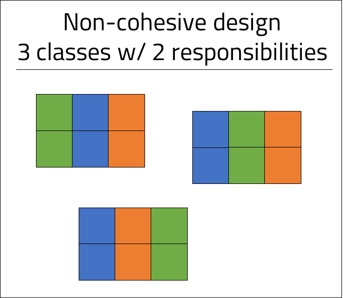
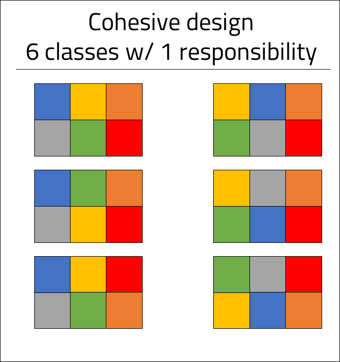
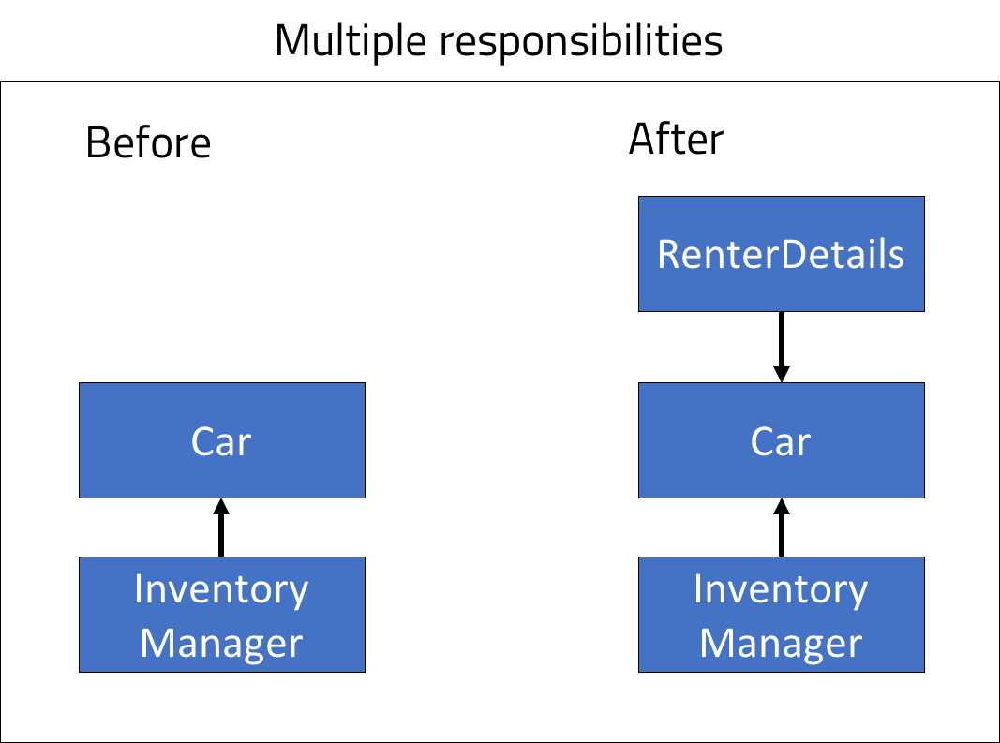
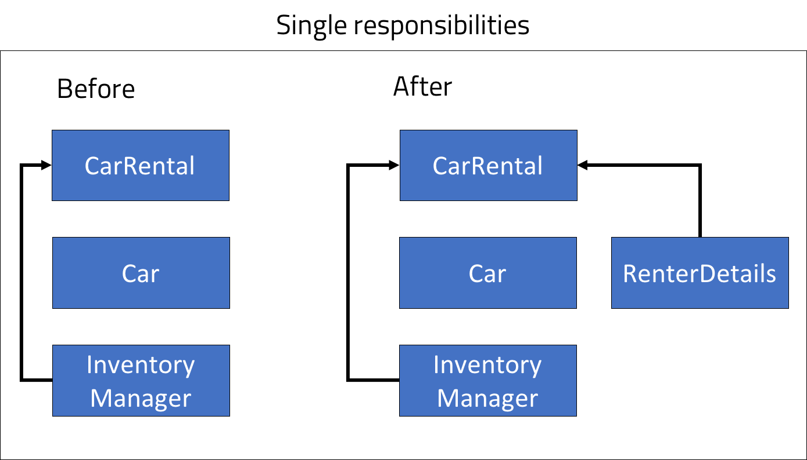

<br>
<strong>Key Takeaways</strong><br>
&#8226; Introduction to the SOLID principles of design.<br>
&#8226; Understand how the principle of Single Responsibility can be applied to individual classes.<br>
&#8226; Review the benefits of the SRP.<br>

<br>
<h4>The SOLID principles of design</h4>
<p>
This blog post will be the first in a series of 5 posts that cover the SOLID principles of design. The SOLID principles were introduced by Robert C. Martin in his paper Design Principles and Design Patterns.
The SOLID acronym was later defined by Michael Feathers.</p>
<p>
The SOLID principles encourage the creation of maintainable software that prevents code rot from accumulating within object orientated programming. As software applications scale in size, the design principles from SOLID become more and more valuable to prevent complex issues from arising and to enable a more efficient process for application enhancement and bug fixes.
<p>
<p>
The SOLID acronym is defined accordingly:<br>
S - Single responsibility principle<br>
O - Open-closed principle<br>
L - Liskov substitution principle<br>
I - Interface segregation principle<br>
D - Dependency inversion principle<br>
</p>
<p>
This blog post will focus upon the single responsibility principle (SRP).
</p>

<br>
<h4>Single responsibility principle</h4>
<p>
The single responsibility principle asserts that any one class must have just one responsibility, and therefore just <strong>one reason to change</strong>.<br>
Classes that use the SRP will be able to track each of their behaviours back to the single responsibility. Alternatively, classes with multiple responsibilities may contain many reasons to change. As we will later discuss, an update to a class with multiple responsibilities may cause unrelated side effects to the function of the class that can cause further problems within a complex application.
</p>
<p>
The SRP creates classes that are described as being <i>cohesive</i> and <i>robust</i>. A sign that a class has a well defined purpose and singular responsibility can arise when you are naming the class against the responsibility. If you find it difficult to define a name of a class based upon its responsibility, it is likely the class has many responsibilities or is not clear to a single purpose.</p>
<br>
<h4>Class cohesion</h4>
<p>
The word <i>cohesion</i> describes the action of forming a united whole. In object orientated programming, classes are cohesive when they can be used together without conflict.
Class cohesion is achieved through the design and implementation of a class to a single purpose. Class cohesion facilitates greater potential for class reusability and implementations of the application. 
</p>
<p>
The implementation of class cohesion can be visually demonstrated through the blocks below:






</p>
<p>
While the blocks are only rotated on the x axis, it is visible that when classes consume just a single responsibility, they become more modular and can be combined with different classes to form different implementations.
</p>
<br>
<h4>Implementing SRP by design</h4>
<p>
The benefits of SRP will be demonstrated by realising side effects from changing a class with multiple responsibilities. 
</p>
<p>
In our example, the application will be used for renting a car. The class <code>Car</code> exists as an entity to be stored within a database of all cars to be rented. The class will also return properties of the car such as brand, colour and engine size. <br>
The Car class will also include a method called "rent" which sends a request to the database to rent the car.
</p>
<p>
The Car class has more than one responsibility. It is responsible for holding information about each car instance, but it is also responsible for managing the rental of the car with the database.

```java{numberLines:true}
public class Car {

    private String brand;
    private BigInteger price;
    private String colour;
    private String key;
    private InventoryService inventoryService;
    
    public void rent(){

        if(inventoryService.getInventory(key) > 0){
            
            ...

        }

    }

}
```
</p>
<p>
The <code>rent()</code> method will verify with the Inventory class (not demonstrated in this post) that a car is available before it connects with the database using object to relational mapping to record the update in rental.
</p>
<p>
The following changes are made to the application:<br>
1. The number of cars has increased in the inventory.<br>
2. The renter must verify their credentials before renting a car.
</p>
<strong>Increasing the car inventory</strong>
<p>
The Car class uses the InventoryService to check how many cars are available for rent. When the number of inventory is increased, the Car class, which is responsible for holding information about a car instance, should not be effected. After all, the number of instances of a car does not relate to the properties of a car. As a result, the InventoryService, which is responsible for managing the inventory of the car instances, will be updated. This example demonstrates how SRP creates a single change in a single class (InventoryService) that is responsible for a property (Inventory).
</p>
<strong>Verify renter credentials before renting</strong>
<p>
The verification of user credentials is a pre-requisite before enabling a car to be rented. As a result, the Car class must use another service to access the credentials during the <code>rent()</code> method. The Car class, which is meant to be responsible for the car properties information, will now use the RenterDetails class to access information about the renter. 
</p>
<p>
The result of verifying credentials of a renter has created unexpected growth and unrelated dependency of the Car class upon the RenterDetails class. The additional responsibility of the <code>rent()</code> method in the Car class has created two further dependencies on the RenterDetails and InventoryManager classes that otherwise would be completely unrelated to the Car properties.
</p>
<h4>Reviewing SRP in the Car class</h4>
<p>
Before the SRP is applied to the Car class, it has a dependency upon the InventoryManager to accommodate for the rent() method. This dependency expands the single responsibility of providing properties of a single car into a further responsibility in renting an instance of the car with the database.
</p>
<p>
When the application introduces two further requirements, the InventoryManager is not changed, however the Car class must now depend upon the RenterDetails class to verify the person renting the car. The additional dependency breaks the responsibility of the Car class even further:




</p>
<p>
If the Car class had a single responsibility, it would not contain a <code>rent()</code> method and therefore the InventoryManager would not be injected. The <code>rent()</code> method could belong within a different class, "CarRental", that is responsible for leasing cars. CarRental will use the InventoryManager to obtain inventory levels for each car.
</p>
<p>
The further requirements of the application can be introduced by updating the inventory in the InventoryManager and by injecting the UserDetails class into the CarRental class. Each class maintains its single responsibility, however the updates made to the classes have not increased their responsibility and kept the functions of the application separate from each other.



</p>
<br>
<h4>The benefits of SRP</h4>
<p>
In the example above, SRP has been used to separate the responsibilities of the classes. The update and enhancement to the application has been made in expected classes and have not expanded their original responsibility. The SRP version of the application promotes the <i>single reason for change</i> as the enhancements only prompt a single change in the class with the responsibility for handling the inventory and for the user verification.
</p>
<p>
<strong>Debugging</strong><br>
If the application were to experience a bug with inventory handling or user validation, the debugging process would initially begin with the expected classes with the responsibility that handles the functions. Without the SRP, the debugging process would have been slightly more complex as the Car class had the excess dependencies upon the InventoryManager and RenterDetails classes. SRP improved debugging an application as responsibilities are specific and adhered to within each class.
</p>
<p>
<strong>Loose coupling</strong><br>
The Car class that uses the SRP has decoupled the responsibility of rental from the responsibility of obtaining Car details. The individual classes can be reused whenever car details are required or leasing services are needed. They are services for a specific purpose and can be reused more efficiently than a single class with many responsibilities.
</p>
<p>
<strong>Testing</strong><br>
Automated testing (unit testing) is typically designed to test the functionality of a class. Each class will have several tests to ensure it is able to complete it's responsibilities. SRP will naturally decrease the collective number of tests required for the application as there are fewer behaviours that can be combined within a single class.
</p>
<br>
<h4>Conclusion</h4>
<p>
The single responsibility principle asserts that each class will have a single defined responsibility and therefore just a single reason to change.<br>
An application that complies with the SRP will enable the developer to understand the class dependencies and relationships in a more natural sense. The SRP will facilitate the debugging and enhancement of the code as new responsibilities and functionality is introduced.
</p>

<strong>Series link: Go to the next SOLID principle: <a href="https://aneesh.co.uk/open-closed-principle">Open-Closed Principle</a></strong>

<br>
<small style="float: right;" >Picture: St. Joseph, IL by <a target="_blank" href="https://unsplash.com/@drice22">Danielle Rice</small></a><br>