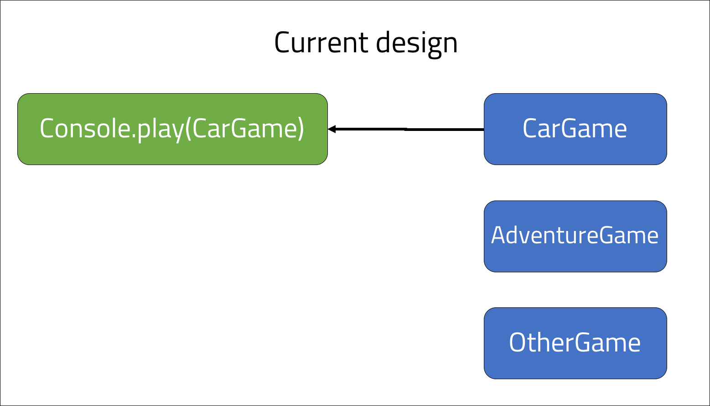
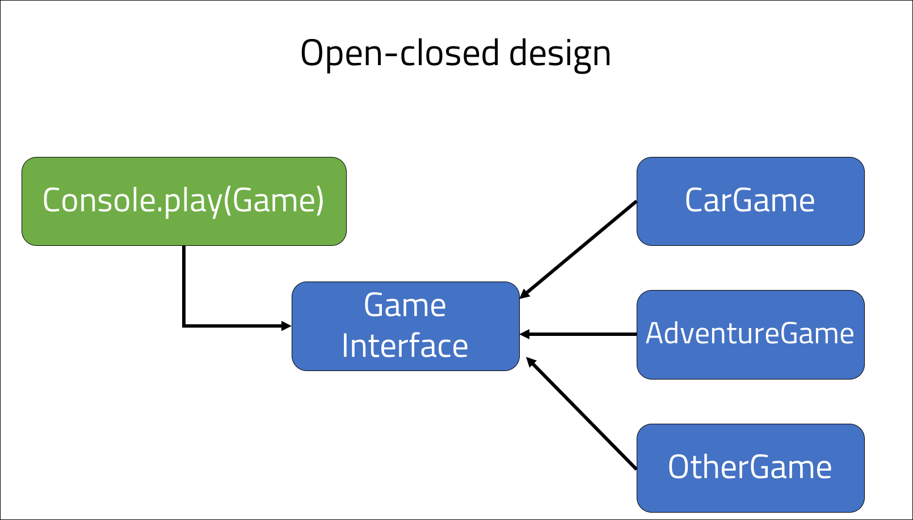

<br>
<strong>Key Takeaways</strong><br>
&#8226; Understand the importance behind the open-closed principle to code maintainability and growth.<br>
&#8226; Identify when the open-closed principle should be used within an application.<br>
&#8226; Use the Strategy design pattern to avoid breaking the open-closed principle.<br>

<br>
<h4>What is the open-closed principle?</h4>
<p>
The open-closed principle aims to design behaviours that are open to extension, but also closed for modification. The two behaviours can sound like an oxy-moron, however they create two distinct characteristics that can be applied together.
</p>
<p>
<u>Open for extension</u> describes a method where the runtime execution can be modified when new components are required and added to the application.
</p>
<p>
<u>Closed for modification</u> design asserts that as new components are added to the application, the dependent components upon the new component do not require modification. The pre-existing behaviours will also work as designed despite new components being added. The new components therefore work themselves around the behaviours of the application.
</p>
<br>
<h4>Why the open-closed principle is important</h4>
<p>
The open-closed principle is important with respects to supporting the growth and enhancement of an application. As applications grow in size, dependencies and complexities arise which can make it difficult to provide additional functionality without breaking the existing co-dependencies. When we design applications, it is important to consider if certain features are likely to grow or exist in different states. The open-closed principle can be applied to ensure the growth of application behaviours are supported by the design.
</p>
<p>
The below code sample is an example of a Console class that is able to play different games:

```java{numberLines:true}
public class Console{

    public void play(CarGame game){
        game.load();
    }
}

public class CarGame{
    public void load(){
        System.out.println("loading car game");
    }
}
```



</p>
<p>
The <code>CarGame</code> class is injected into the <code>Console</code> class and the <code>play()</code> method is used to load the game.<br>
The <code>play()</code> method takes the CarGame as an argument, therefore it is <i>tightly coupled</i> to the CarGame class. If a new class, <i>AdventureGame</i> was introduced, the <code>play()</code> method will not be able to use the AdventureGame, and a new method would need to be created. The <code>play()</code> method is <u>not</u> open to extension as an extension of the AdventureGame is not supported, and it is <u>not</u> closed to modification as the argument of CarGame will need to be changed to accommodate for the new AdventureGame.
</p>
<br>
<h4>Introducing the Strategy design pattern</h4>
<p>
The Strategy design pattern is used to allow the application to change its behaviour at runtime. Strategy enables different behaviours to be interchangeable in the original context by supporting the extension of the application without updating the original method.
</p>
<p>
The Strategy design pattern introduces "programming by interface", away from the default "programming by implementation". The context of the application becomes dependent upon the behaviours of an interface and not the behaviour of an implementation of the interface.
</p>
<p>
If we look back at the <code>CarGame</code> class, we could think of it as an implementation of an interface with just the single method <code>load()</code>. The Strategy design pattern encourages the use of an interface which is then referenced by the context so that it accepts any implementation of the interface.
</p>
<br>
<h4>Implementing the Strategy design pattern</h4>
<p>
Before we make the updates to the Console and CarGame classes, I will review some key terms used within the Strategy design pattern:
</p>
<p>
&#8226;The <strong>context</strong> class stores the method that is open for extension and closed to modification. The method in the context class must not change as new components are added to the application.<br>
&#8226;The <strong>strategy</strong> is the interface that is passed in as an argument to the method within the context class method.<br>
&#8226;The <strong>extension</strong> of the application is created through different implementations of the strategy.
</p>
<p>
To begin, I will create the <i>strategy</i> interface which will be used by the context class.

```java{numberLines:true}
public interface Game{

    void load();

}
```
</p>
<p>
The <code>Game</code> interface will be used as the argument in the <i>context</i> class: Console:

```java{numberLines:true}
public class Console{

    public void play(Game game){
        game.load();
    }
}
```
</p>

<p>
The <i>extension</i> of the strategy class will now be implemented in the CarGame class. It will implement the Game interface:

```java{numberLines:true}
public class CarGame implements Game{

    @Override
    public void load(){
        System.out.println("loading car game");
    }
}

```
The CarGame class will override the <code>load()</code> method from the Game interface.
</p>
<p>
When the application requires further functionality, such as an AdventureGame, the <i>extension</i> of the strategy class can be taken further by creating a new implementation:

```java{numberLines:true}
public class AdventureGame implements Game{

    @Override
    public void load(){
        System.out.println("loading adventure game");
    }
}

```
</p>
<p>
The <code>play()</code> method of the Console class is now open to extension as it is designed by implementation of the Game class, and is closed to modification as further components of the application will be accommodated for by the <code>play()</code> method provided they implement the Game interface.




</p>
<br>
<h4>Conclusion</h4>
<p>
The open-closed principle supports the growth of application behaviours with maintainable and robust code. The strategy pattern enables the open-closed principle to be realised through the creation of interfaces and their placement as a dependency.
</p>
<p>
When we are designing our applications, it is important to always consider if a behaviour is likely to exist in another manner. The strategy pattern becomes a more and more valuable design to use as the application behaviours and complexity grows with the addition of new behaviours. The three components of the strategy pattern: context, strategy and extension are valuable components to understand and practice as they will appear more and more frequently during application design processes. 
</p>

<strong>Series link: Go to the next SOLID principle: <a href="https://aneesh.co.uk/liskov-substitution-principle">Liskov Substitution Principle</a></strong>

<br>
<small style="float: right;" >Picture by <a target="_blank" href="https://unsplash.com/@slangston">Langston</small></a><br>