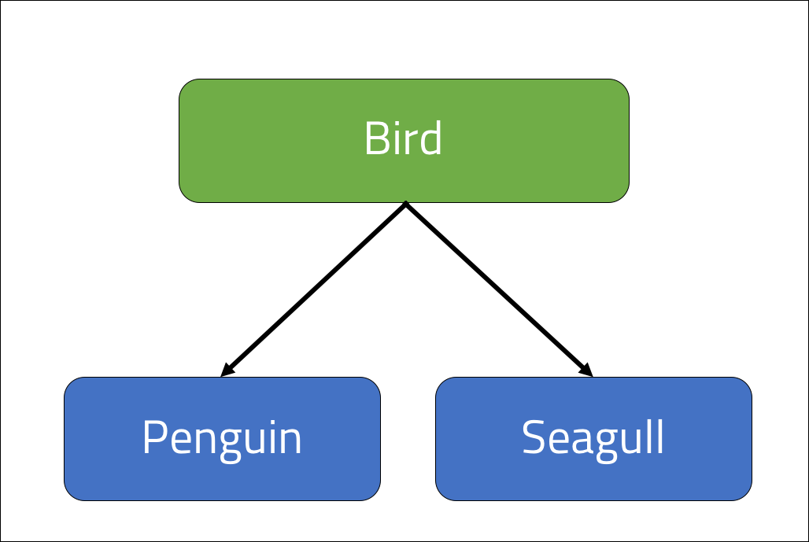

<br>
<strong>Key Takeaways</strong><br>
&#8226; Understand the importance of the Liskov substitution principle to inheritance and shared class behaviour.<br>
&#8226; Review the rules that ensure the inherited behaviours of subclasses from their parents are as expected.<br>
&#8226; Design tests to ensure the behaviour of a parent class is not modified by its subclasses.<br>

<br>
<h4>What is the Liskov Substitution Principle?</h4>
<p>
Introduced by Barbara Liskov, the Liskov substitution principle (LSP) is used to decide when it is appropriate to extend a class as opposed to other strategies of abstraction to achieve the goal of shared properties between classes. As we have seen in the previous <a href="https://www.aneesh.co.uk/open-closed-principle" target="_blank">blog</a>, the open-closed principle can be used to abstract the behaviours of a method; the Liskov substitution principle is used to extend upon the <i>design by contract</i> approach where the behaviour of the class is the primary concern.
</p>

<p>
The Liskov substitution principle is used to make assertions upon the substitution of behaviours that are implied by a subclass from its parent.
When a class is extended, we are in effect implying that the subclass "IS A" extension of the parent class. While the open-closed principle is a focussed upon the structure of a class, LSP promotes strong <strong>behaviour</strong> sub-typing of classes to the parent class to ensure the expected behaviour of the methods are applicable to the extension.
</p>
<p>
The below quote is often used to describe the importance of behaviours between inherited classes:<br>
<i>"If it looks like a duck, quacks like a duck, but needs batteries - you probably have the wrong abstraction"</i>
</p>
<br>
<h4>Liskov Substitution by design</h4>
<p>
When we use inheritance to share class methods and properties, we are implying that the subclass can be used to replace instances of the parent class.<br>
The LSP asserts three rules when applying inheritance with subclasses:<br>
&#8226; The subclass cannot enforce stricter rules than the parent class.<br>
&#8226; The return value of a subclass method can only differ as a subclass of the return type from the parent.<br>
&#8226; The subclass of a parent must be <u>completely</u> capable of substitution for its parent across each behaviour.
</p>

<br>
<h4>Implementing LSP by design</h4>
<p>
If we reflect upon the rules above, the first two can be validated through the Java compiler and are therefore inherent with Java.
A problem can arise with ensuring the behaviour of each method is appropriate for the subclass of the parent.
</p>
<br>
<h4>Demonstration: Is a Penguin a bird?</h4>
<p>
The below code example demonstrates how easily behaviour can be modified from the intuition that a subclass IS AN extension of a parent class. When we design an application of Birds, Penguins, and Seagull Objects, we may reflect upon the use of class inheritance by saying, out loud, "a Penguin is a Bird, and a Seagull is also a Bird". In our source code, we may therefore create the Seagull and Penguin as subclasses of Bird. 



```java{numberLines:true}
class Bird{
    private boolean hasWings = true;

    public void fly(){

    }
    public boolean getWings(){
        return this.hasWings;
    }    
}

class Penguin extends Bird{

}
class Seagull extends Bird{

}
```
</p>
<p>
In our example above, we have confused the <u>properties</u> of the Bird class with the <u>behaviours</u> of the Bird class when creating the Penguin class. The Penguin is a bird because it has the properties of a bird: it has wings, lays hard-shelled eggs etc. However the Penguin does not <u>behave</u> like a bird in the sense that it cannot fly.
</p>
<p>
The LSP has been breached as the Penguin class is now capable of calling the <code>.fly()</code> method; a behaviour that should not be possible.
</p>
<br>
<h4>Complying with LSP</h4>
<p>
To resolve the problem, the behaviour of the Bird class can be further split into two: BirdCanFly and BirdCannotFly:

```java{numberLines:true}
class BirdCanFly{
   private boolean hasWings = true;

    public void fly(){

    }
    public boolean getWings(){
        return this.hasWings;
    } 
}

```
```java{numberLines:true}
class BirdCannotFly{

   private boolean hasWings = true;

    public boolean getWings(){
        return this.hasWings;
    } 
}
```

The Penguin and Seagull can now extend the appropriate class to obtain the Bird properties with and without the flying behaviours:

```java{numberLines:true}

class Penguin extends BirdCannotFly{

}

class Seagull extends BirdCanFly{

}

```
</p>
<p>
The example above illustrates the potential conflict that can arise with the implied substitution from inheritance. The behaviours of flying can be further imposed by the parent class with methods such as "getTopFlightSpeed" and "land" that would imply further irrelevance for the Penguin class without the redefined <code>BirdCannotFly</code> class. The 
</p>
<br>
<h4>Conclusion</h4>
<p>
The LSP is applied to application design when we consider the <u>behaviours</u> of classes that are inherited from other parent classes. <i>Inheritance</i> is one of the most valuable OOP concepts and therefore LSP is an important consideration to make upon child classes whenever a class is extended.
</p>
<p>
While it may seem natural to extend classes that fit into the "IS A" Object construct, we must consider how the <u>behaviours</u> of a class are inherited, and not just the <u>properties</u>. LSP can be implemented by reviewing the behaviours each class will inherit before adding behaviours to a parent class or extending them, or they can be implemented through unit testing of a parent class with each of their child classes.
</p>

<strong>Series link: Go to the next SOLID principle: <a href="https://aneesh.co.uk/interface-segregation-principle">Interface segregation Principle</a></strong>


<br>
<small style="float: right;" >Picture by <a target="_blank" href="https://unsplash.com/@zhenhu2424">Zhen Hu</small></a><br>