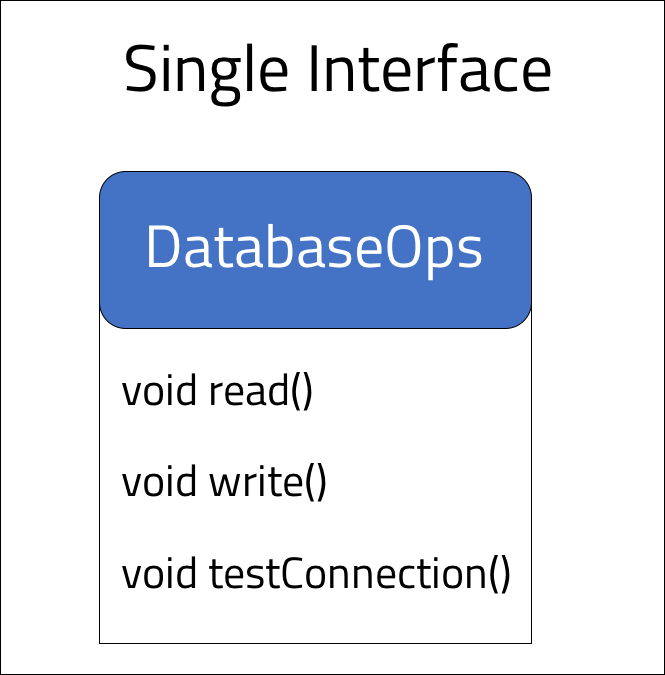
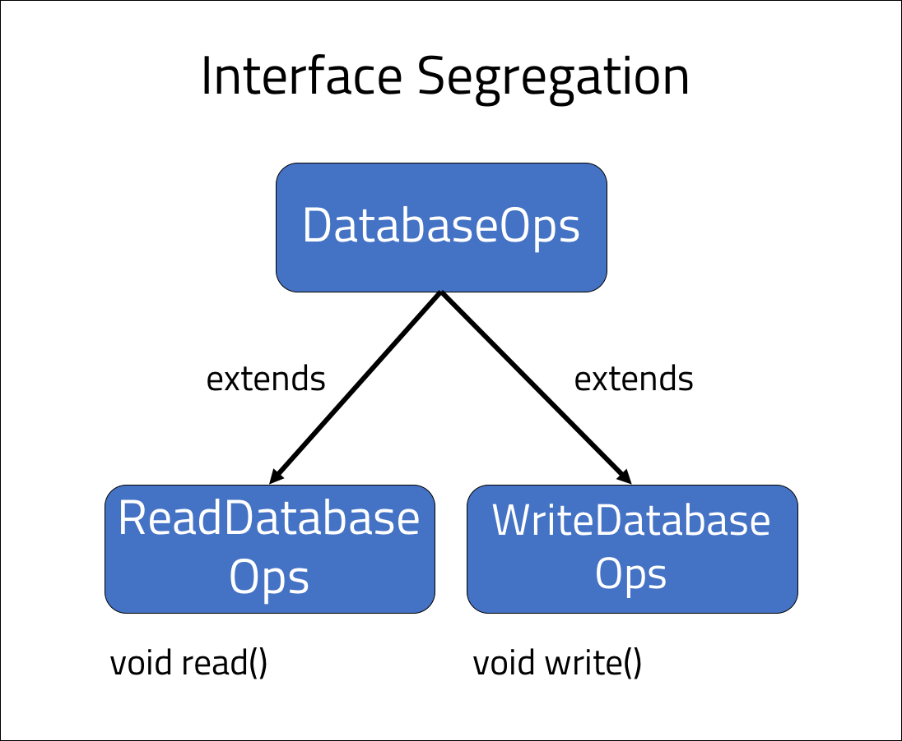

<br>
<strong>Key Takeaways</strong><br>
&#8226; Understand the benefit of abstraction that interfaces bring to design.<br>
&#8226; Review the problem of grouping multiple behaviours into a single abstraction.<br>
&#8226; Leverage interface segregation to control the behaviours a class must implement from a combination of interfaces.<br>

<br>
<h4>Interface segregation</h4>
<p>
Interfaces allow us to achieve an abstraction of behaviours to be implemented by other classes. The abstraction of interfaces enables us to define the behaviours a class must have when they implement an interface 'contract'.
</p>
<p>
Interfaces have been prevalent throughout the SOLID principles, most notably used with the open-closed principle <a target="_blank" href="https://aneesh.co.uk/open-closed-principle">here</a>.
</p>
<p>
One of the differences between abstraction and inheritance is that a class can implement multiple interfaces, thus implementing behaviours from multiple classes, however a class can only ever extend a single class.<br>
The interface segregation principle (ISP) encourages well-defined and meaningful interfaces where the behaviours implemented by the class do not pollute its well-defined responsibility.</p>
<p>
Much like the Liskov substitution principle, where we aim to inherit classes with the appropriate behaviours, the ISP aims to achieve a similar separation of behaviours for each implementation of an interface.
</p>
<br>
<h4>The contract of interface implementation</h4>
<p>
The abstract contract of an interface requires the implementing class to take on <u>each</u> behaviour within the interface, and not just selected behaviours. When we design an interface, we must therefore be considerate to the methods we are assigning <u>together</u> as they form the responsibility for the implementing class.
</p>
<p>
The case for interface segregation arises when classes implement an interface with methods that are not required by the class. As a result, the class obtains excessive behaviours that do not conform to the responsibility of the class. You may think "why not just assign the behaviours without the interface?". This approach will not leverage the benefits of abstraction and can create further issues down the line as the application grows. The Strategy pattern can be valuable to use within our design, therefore we will aim to maintain the use of interfaces while paying consideration to the obstacle of implementing unwanted behaviours.
</p>
<br>
<h4>Interface segregation in action</h4>
<p>
The below code example demonstrates an interface used for using the DAO design pattern for interacting with a database. The <code>DatabaseOps</code> interface is used for reading and writing to the database and enables the implementations to make both types of requests.

```java{numberLines:true}
public interface DatabaseOps{

    void testConnection();
    void read();
    void write();
}
```
</p>
<p>
There may be many implementations of the <code>DatabaseOps</code> interface, however the implementation of a class to only complete <u>one</u> of the behaviours is not possible. An issue may arise where we would only like to designate the <strong>read</strong> behaviour to a class, and not the write behaviour as well. The below method illustrates the use of the Strategy pattern where the DatabaseOps interface is a required interface implementation to make calls to the database:

```java{numberLines:true}

public void makeDatabaseTransaction(DatabaseOps operation){
    operation.read();
}
```
</p>
<br>
<h4>Segregating the interfaces</h4>
<p>
We are able to achieve interface segregation by dividing the responsibility of the DatabaseOps interface into two further interfaces that <u>extend</u> from the DatabaseOps interface. The <code>DatabaseOps</code> interface is now split into two further interfaces, <code>ReadDatabaseOps</code> and <code>WriteDatabaseOps</code>:

```java {numberLines:true}
public interface DatabaseOps{
    void testConnection();
}
```
```java {numberLines:true}
public interface ReadDatabaseOps extends DatabaseOps{
    void read();
}
```
```java {numberLines:true}
public interface WriteDatabaseOps extends DatabaseOps{
    void write();
}
```
</p>
<p>
The image below illustrates the change of the interface design.




</p>
<p>
The change in interface design means the behaviours of reading and writing are separated, however they can both be contracted to a class that implements both the ReadDatabaseOps and WriteDatabaseOps interfaces.
</p>
<br>
<h4>When to use interface segregation</h4>
<p>
The interface segregation principle should be considered whenever we create an interface. Questions we may want to ask ourselves when designing an interface include: "do we these behaviours to be grouped together?" or "will these behaviours be required within a class on their own?".
</p>
<p>
We can use the extension of interfaces to design single-purpose, but related abstract contracts that prevent classes from defining behaviours they do not require. 
</p>
<br>
<h4>Conclusion</h4>
<p>
The interface segregation principle extends upon previous SOLID principles including the single responsibility principle and the liskov substitution principle. When we define interfaces, the implementations of the class are asserted into implementing the behaviours of the interface together. The interface segregation principle aims to break-down the abstract behaviours of interfaces into smaller pieces that can prevent unwanted behaviours being implemented for a class. 
</p>
<p>
The interface segregation principle leverages the inheritance of interfaces to break-down and separate behaviours, while class design enables a class to implement multiple interfaces to loosely regroup the behaviours that are required.
</p>

<strong>Series link: Go to the next SOLID principle: <a href="https://aneesh.co.uk/dependency-inversion-principle">Dependency Inversion Principle</a></strong>

<br>
<small style="float: right;" >Picture by <a target="_blank" href="https://unsplash.com/@pkripperprivate">Parker Johnson</small></a><br>