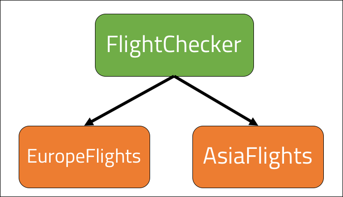

<br>
<strong>Key Takeaways</strong><br>
&#8226; Understand the use of dependency inversion between high and low level classes.<br>
&#8226; Implement dependency inversion with abstraction to decouple class dependencies.<br>
&#8226; Compare the open-closed principle and the dependency-inversion principle to each other.<br>

<br>
<h4>Dependency inversion principle</h4>
<p>
The dependency inversion principle (DIP) aims to decouple the high level classes from the low level classes that they use. In this post, I will walk through how high and low level classes can appear within and application, how their tightly-coupled relationship can cause problems, and how dependency inversion can be used to loosely couple the classes. We aim to loosely couple high and low level classes to remove the side-effects that can arise within the high level class when a change in the low-level class is made. The dependency inversion principle is closely linked to the Liskov substitution and open-closed principle of the SOLID design principles. 
<p>
<p>
The term 'dependency inversion' must not be confused with the term 'dependency injection'. Dependency injection involves a class demanding the use of another class. Whereas dependency inversion involves one class requesting that the dependency is handled by another class. We will cover this small detail a little bit more in the blog.
</p>
<br>
<h4>High level and low level classes</h4>
<p>
So what are high level and low level classes? In short, high level classes <i>depend upon</i> or <i>use</i> low level classes to carry out their behaviours. We can see this in action with the following example of a class that is used to check if flights to certain continents exist:

```java{numberLines:true}

class FlightChecker{

    EuropeFlights europeFlights = new EuropeFlights();
    AsiaFlights asiaFlights = new AsiaFlights();

    public void checkFlights(int flightNumber){

        if(europeFlights.getFlights().contains(flightNumber)){
            System.out.println("Flight to Europe exists");
        }
        else if(asiaFlights.getFlights().contains(flightNumber)){
            System.out.println("Flight to Asia exists");
        }

    }
}

```
</p>
<p>
The <code>FlightChecker</code> is tightly coupled to the lower level classes of <code>EuropeFlights</code> and <code>AsiaFlights</code>. As a result of the tight-coupling, if the low level classes were to change (such as changing the signature of the getFlights() method, the FlightChecker would break where the <code>getFlights()</code> method is called. The <code>FlightChecker</code> uses <i>dependency injection</i> as it demands the application to provide an instance.


</p>
<p>
For this example, we are to assume the EuropeFlights and AsiaFlights classes will pull in all the details of available flights from their respective databases to the FlightChecker class.
</p>

<br>
<h4>Introducing dependency inversion</h4>
<p>
The use of dependency inversion is often associated to the following two rules:<br>
<br>
<i>"High level classes do not depend upon low level classes. They depend upon abstractions."</i><br>
<br>
<i>"Abstractions do not depend upon details; details depend upon abstractions."</i>
</p>
<p>
The two rules imply the high level classes must use abstractions to obtain behaviours, not through direct links with the low level classes. The second rule asserts that the details upon the low level classes are to be defined by the abstractions. Therefore the low level classes use the abstractions to define their own implementation.
</p>
<p>
To achieve dependency inversion, the high level classes must be abstracted away from the low level. What we are aiming to achieve is a design where a change in the low level class does not break the high level class.
</p>
<br>
<h4>Abstracting the dependency</h4>
<p>
To create the abstraction for the high level class, we must ask ourselves what 'contract' we want to enforce upon the low level classes. As we can see from the current state of the example, both the EuropeFlights and AsiaFlights class use the <code>getFlights()</code> method. Therefore I will create a new interface that has a single method <code>getFlights()</code> and I will have the EuropeFlights and AsiaFlights classes implement the interface.

```java{numberLines:true}

public interface WorldFlights{
    public List<Flights> getFlights();
}

public class EuropeFlights implements WorldFlights{

    List<Flights> flights;

    public List<Flights> getFlights(){
        return this.flights;
    }

     public String toString(){
        return "Europe";
    }

}

public class AsiaFlights implements WorldFlights{

    List<Flights> flights;

    public List<Flights> getFlights(){
        return this.flights;
    }

    public String toString(){
        return "Asia";
    }
}

```

</p>
<p>
The abstraction of the <code>WorldFlights</code> interface is now passed into the <code>FlightChecker</code>:

```java{numberLines:true}
class FlightChecker{

    WorldFlights worldFlights;

    public void checkFlights(int flightNumber){

        if(worldFlights.getClass.equals(EuropeFlights.class) ||
            worldFlights.getClass.equals(AsiaFlights.class)){

            if(worldFlights.getFlights() != null){       
                System.out.println("Flight to " + worldFlights.toString() + " exist.");
            }
        }
        
    }
}
```
</p>
<p>
The above example has utilised the <code>worldFlights</code> abstraction for the <code>EuropeFlights</code> and <code>AsiaFlights</code> class to create an abstraction between the low level class and the high level class. The class will check the instance type of the abstraction and return a print of the class. The <code>FlightChecker</code> is now <i>inverting</i> the responsibility of using the EuropeFlight or AsiaFlight class to the abstraction that will provide the implementation. 


</p>

<br>
<h4>But isn't this similar to the open-closed principle?</h4>
<p>
Our use of abstractions with the DIP can sound familiar to the open-closed principle where we use abstractions to close a contract to modifications while leaving it open to extension of new implementations. Similar to the DIP, the OCP places an abstraction between two classes.
</p>
<p>
If we take our example of the FlightChecker, the abstraction of the WorldFlights class has removed the direct dependency of the high level class (FlightChecker) from the lower-level classes (EuropeFlights and AsiaFlights). But the question remains: has dependency inversion inadvertently fulfilled the OCP, and if so, why are they separate principles?
</p>
<p>
If we were to introduce a new class: <code>AmericasFlights</code>, which will return the flights to America, the current design will support the <u>extension</u> of behaviours as the AmericaFlights class can implement WorldFlights:

```java{numberLines: true}
class AmericasFlights implements WorldFlights{

    List<Flights> flights;

    public List<Flights> getFlights(){
        return this.flights;
    }

    public String toString(){
        return "Americas";
    }

}

```
</p>
<p>
The dependency inversion principle does not however satisfy the <i>closed for modification</i> principle. The extension of the WorldFlights interface does not naturally fit in with the FlightChecker class. The FlightChecker class requires an update on lines 7 & 8 to check if the instance is of the <code>AmericasFlight</code> class. As a result, the AmericasFlight class will not evaluate to true in the if-statement.  
</p>
<p>
The example I have used deliberately evaluates against each implementation of the extension for WorldClass to illustrate how dependency inversion can be applied without satisfying the open-closed principle.
</p>
<p>
When we think about dependency inversion, we are distributing the responsibility for detail to the lower level classes and generalising the higher level class. The higher level classes can generalise the requirements they have upon a dependency by delegating the responsibility of detail towards the lower level classes through an interface. 
</p>
<p>
When we think about open-closed principle, we are again using abstractions to enforce certain properties and behaviours to be injected into the higher level class, however we are designing the application to be enhanced with new behaviours that accommodate to the schema for the abstraction. You may find the open-closed principle is supported through dependency inversion, however this would be dependent on the use of the lower level classes within the higher level classes and the requirement for extensibility in the application. For example, what if our lower-level classes used dependencies as well? Then we would need to further abstract behaviours to satisfy the OCP.
<br>
The subtle differences between the principles are important to individually evaluate our design upon. 
</p>

<br>
<h4>Conclusion</h4>
<p>
The dependency inversion principle applies to the relationship between a high level class and the low level classes it uses (or depends upon) to perform certain behaviours. The direct relationship between a high and low level class can create a tight coupling where details of the implementation of behaviour can become lost and complicated between classes. 
</p>
<p>
The introduction of an abstraction between the high and low level class creates two effects: <br>
&#8226; The higher level class is able to generalise the dependency and behaviours it requires to eliminate any direct relationship with the lower level classes.<br>
&#8226; The lower level class details depend upon the contract from the abstraction. They are no longer capable of breaking the higher level class from change.</p>
<p>
If you would like to dive deeper into the ways dependency inversion can be applied with Spring, visit my blog <a href="https://aneesh.co.uk/using-dependency-injection" target="blank">here</a> for more information. 

</p>


<br>
<small style="float: right;" >Picture by <a target="_blank" href="https://unsplash.com/@debidiemski">Deborah Diem</small></a><br>