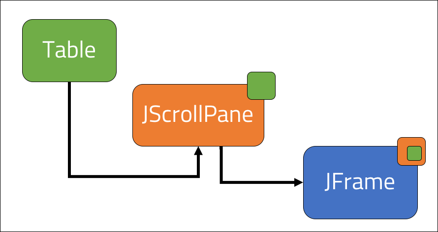

<br>
<strong>Key Takeaways</strong><br>
&#8226; Explore the Java Swing package to create a GUI with Java.<br>
&#8226; Understand how the Renderer interface can be used to create custom formatting.<br>
&#8226; Use JTable to summarise array data into a table.<br>

<br>
<h4>The Java Swing package</h4>
<p>
This blog post will use the Java Swing package to create a GUI from array data. The data will be formatted into a table and will render custom styling according to the values.
</p>
<p>
The following three classes from the Swing package are used to create the GUI:<br>
&#8226; JFrame: a top-level container.<br>
&#8226; JTable: a 2-dimensional table.<br>
&#8226; TableCellRenderer: custom formatting to the cells of the table.<br>
</p>
<p>
The final GUI will show the English Championship Football table for the 2019-20 season:


</p>

<br>
<h4>Creating the GUI container</h4>
<p>
The <code>JFrame</code> class is extended by the class <code>Frame</code> to create the GUI container. The <code>Frame</code> class has optionally used the Singleton design pattern to ensure we always reference the same container within the application.
</p>
<p>
The Frame class is created with the Singleton design pattern to ensure the application consistently refers to the same GUI instance.

```java{numberLines:true}
public class Frame extends JFrame {

    private static Frame frame;

    private Frame(){

    }

    public static Frame getFrameInstance(){
        if(frame == null){
            frame = new Frame();
        }
        return frame;
    }
}
```
<p>
The main method is used to create an instance of the Frame class. The JFrame class provides further methods that are called by the main method to define key properties for the container:<br>
&#8226; <code>setVisible(boolean)</code> to make the container visible.<br>
&#8226; <code>setSize(x, y)</code> to set the size of the frame.<br>
&#8226; <code>setDefaultCloseOperation(JFrame.EXIT_ON_CLOSE)</code> to shutdown the application when the frame is closed.<br>
&#8226; <code>setTitle()</code> to add a title to the window.<br>
&#8226; <code>setResizable(true)</code> to allow the container to be resized by the mouse.<br>

</p>

```java{numberLines:true}
Frame frame = Frame.getFrameInstance();
        frame.setVisible(true);
        frame.setSize(400,400);
        frame.setDefaultCloseOperation(JFrame.EXIT_ON_CLOSE);
        frame.setTitle("My frame");
        frame.setResizable(true);
```
</p>
<p>
An alternative to the <code>setSize(x,y)</code> method is <code>pack()</code> which will automatically adjust the size of the frame so that all table content is at the preferred size. 
</p>
<br>
<h4>Adding a Table to the GUI</h4>
<p>
The <code>JTable</code> class from the Swing package will be used to create the table. The JTable works similarly to a spreadsheet where each cell will have an x and y coordinate which is populated with data. 
</p>
<p>
The class <code>TableBuilder</code> will be used to create a JTable. It will contain a static instance of the table which will populate data through the JTable constructor that accepts (Object[][], Object[]) to define the data and columns respectively:

```java{numberLines:true}
public class TableBuilder{
    
    private static JTable table;

    public void buildTable(){

        table = new JTable(new String[][]{{"David"},{"Joe"}}, new String[]{"Column 1"});

    }
}
```

Alternatively, the data and columns can be obtained at runtime and passed into the JTable.
</p>
<p>
The JTable class offers further methods that can be used to modify the table including:<br>
&#8226; <code>addColumn(Object[])</code> to add in further columns to the table.<br>
&#8226; <code>setValueAt(Object value, int row, int column)</code> to update the value of a cell.<br>
&#8226; <code>JTable(int row, int column)</code> constructor to create a table with a set number of columns and rows.<br>
</p>
<br>
<h4>Adding the table to the GUI</h4>
<p>
The JFrame container is used to display 'Components' that render information from the application. 
After creating the instance of the JTable in the main method through the TableBuilder class, the table can be added into the JFrame container through as a component.<br> 
The <code>JScrollPane</code> class provides a scrollable view component for the GUI. From our main method, we will pass our table into a JScrollPane instance which is then added into the JFrame.
</p>


<p>

```java{numberLines:true}
    //main method

    JTable table = new TableBuilder().buildTable();
    JScrollPane viewComponent = new JScrollPane(table);
    frame.add(viewComponent);

```
When we run the application, we will see the following GUI with the rows and columns:


</p>
<p>
We can further enhance the table to include more descriptive column names and values that are passed into the table.
For this example, I will use the final league table of the English Football Championship from 2019-20.
</p>
<p>
The previous constructor of the JTable took two arguments of Object[][] data and Object[] columns. An alternative constructor can take a DefaultTableModel to build the table. The <code>DefaultTableModel</code> uses a Vector of Vectors to store the cell values that can then be passed into the JTable as content. 

```java{numberLines:true}

    //TableBuilder class, buildTable() method

    String[][] data = {{/*data for table */}}
    String[] columns = {"Pos", "Team", "Won", "Drawn", "Lost", "Points"};

    DefaultTableModel model = new DefaultTableModel(data, columns);
    table = new JTable(model);

    return table;

```
</p>
<p>
The current table appears below:


However if we remove the <code>frame.setSize(400, 400)</code> call from the main method and replace it with <code>frame.pack()</code>, the JFrame will automatically adapt to the size of the table:


</p>
<br>
<h4>Custom styling of the GUI</h4>
<p>
The table can be enhanced by providing styling to the cells with the <code>TableCellRenderer</code> interface from the Java Swing package. The interface is implemented by the <code>TableCellRendererImpl</code> class and will override a single method <code>getTableCellRendererComponent</code>. The getTableCellRendererComponent method is called for upon each cell of the table and can process logic according to the table, cell value, isSelected, hasFocus, row and column arguments. The arguments provide a rich interface for fine-grained control of rendering. 

```java{numberLines:true}
public class TableCellRendererImpl implements TableCellRenderer {

    @Override
    public Component getTableCellRendererComponent(JTable table, Object value, boolean isSelected, boolean hasFocus, int row, int column) {

        return null;
    }
}
```
</p>


<p>
The TableCellRendererImpl class will define an instance of the defaultTableCellRenderer which is used to return a styled component back to the table. 


```java{numberLines:true}

    private TableCellRenderer RENDERER = new DefaultTableCellRenderer();

    @Override
    public Component getTableCellRendererComponent(JTable table, Object value, boolean isSelected, boolean hasFocus, int row, int column) {

        Component editor = RENDERER.getTableCellRendererComponent(table, value, isSelected, hasFocus, row, column);
        editor.setBackground(Color.white);
        editor.setForeground(Color.black);

        if(row % 2  == 0){
            editor.setBackground(Color.lightGray);
        }
        boolean topOfLeague = table.getModel().getValueAt(row, 0).equals("1");
        String relegationZone = (String)table.getModel().getValueAt(row, 0);
        boolean relegated = Integer.parseInt(relegationZone) > 21 ? true : false;
        if(topOfLeague){
            editor.setForeground(Color.green.darker());
        }
        if(relegated){
            editor.setForeground(Color.red);
        }

        return editor;
    }
```
</p>
<p>
The following business logic is applied to enable the table to reflect the 1st position and final 3 positions in the table:
Line 6: The <code>editor</code> is instantiated to define the table contents.<br>
Lines 7 & 8: The default background and foreground colours are set.<br>
Lines 10 to 12: A soft background is applied to all even rows for visual effects.<br>
Lines 13 to 21: The foreground colours (red or green) are defined based upon the value of the "Pos" column of the row.
</p>

<p>
Lastly, the implementation of TableCellRenderer is passed into the table through the <code>setDefaultRenderer</code> call from the main method. The first argument of 'Object.class' is used to set the default cell renderer for the column class. If the table consisted of an entity class, this could be used as the first argument to provide direct access to the class in the renderer.

```java{numberLines:true}
    //main method
    table.setDefaultRenderer(Object.class, new TableCellRendererImpl());

```
</p>
<p>
The finished GUI will show the table data with custom styling for the first and final 3 rows to highlight the champions and relegated clubs. As a built-in feature, JTable enables the columns to be switched around with a drag and drop to order the fields as desired.


</p>
<br>
<h4>Conclusion</h4>
<p>
The Java Swing package supports the creation of components into a GUI for a Java application. In this blog, JTable has been used to summarise data into a table with further styling from the custom renderer.
The capacity for creating a GUI with Java extends much further than the JFrame and JTable; the Renderer interface supports dynamic styling and the capability for further components such as buttons and mouse-listeners.
</p>
<p>
Creating a GUI can prove valuable for resolving data analysis and algorithmic solutions; I would encourage you to explore how the capacity for Java as a front-end component can be used to improve user interaction as a stand-alone application.
The source code from this blog can be found on GitHub <a href="https://github.com/4neesh/DeveloperBlogDemos/tree/master/JavaGui">here</a>. 
</p>

<br>
<small style="float: right;" >Picture: Roma, Italy by <a target="_blank" href="https://unsplash.com/@cristina_gottardi">Cristina Gottardi</small></a><br>